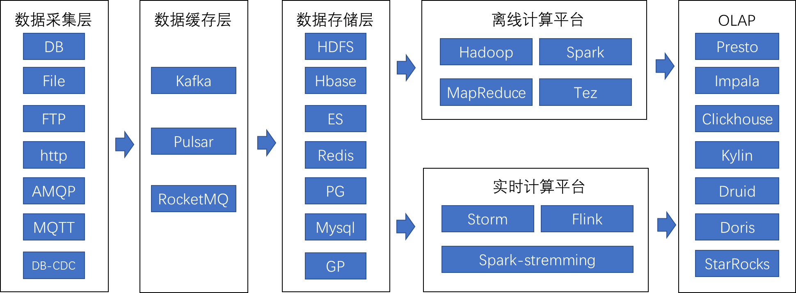

Lambda 架构（Lambda Architecture）是由 Twitter 工程师南森·马茨（Nathan Marz）提出的大数据处理架构。这一架构的提出基于马茨在 BackType 和 Twitter 上的分布式数据处理系统的经验。Lambda 架构使开发人员能够构建大规模分布式数据处理系统。它具有很好的灵活性和可扩展性，也对硬件故障和人为失误有很好的容错性。

Lambda 架构包含三层，分别是Batch Processing Layer（批处理层）、Speed (Real-Time) Processing Layer（速度处理层）、Serving Layer（服务层）。

Lambda 架构结合了批处理和流处理的架构思想，将进入系统的大规模数据同时送入这两套架构层中，分别是批处理层（Batch Layer）和速度层（Speed Layer），同时产生两套数据结果并存入服务层。批处理层有着很好的容错性，同时也因为保存着所有的历史记录，使产生的数据集具有很好的准确性。速度层可以及时地处理流入的数据，因此具有低延迟性。最终服务层将这两套数据结合，并生成一个完整的数据视图提供给用户。Lambda 架构也具有很好的灵活性，你可以将现有开源生态圈中不同的平台套入这个架构。

Lambda 架构也存在着一些不足：
- 主要表现在它的维护很复杂，要同时维护两套系统架构：批处理层和速度层。
- 资源占用增多，同样的逻辑需要计算两次。
- 离线链路和实时链路数据差异会让业务方困惑，批量和实时的数据结果有时不对应。