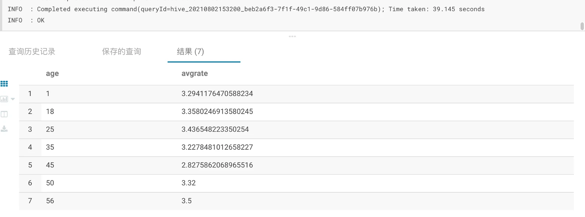
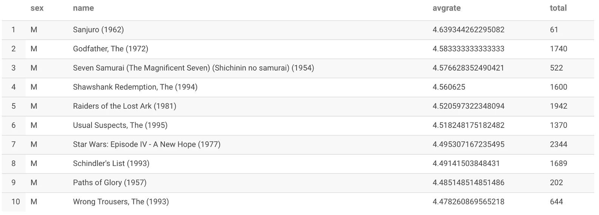
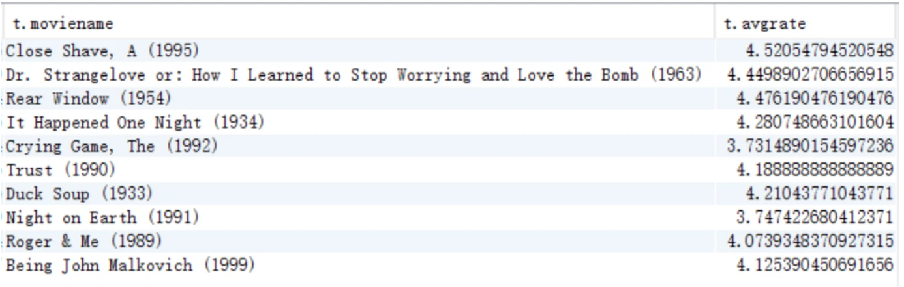

# 题目一（简单）
展示电影 ID 为 2116 这部电影各年龄段的平均影评分。

# 题目二（中等）
找出男性评分最高且评分次数超过 50 次的 10 部电影，展示电影名，平均影评分和评分次数。

# 题目三（选做）
找出影评次数最多的女士所给出最高分的 10 部电影的平均影评分，展示电影名和平均影评分（可使用多行 SQL）。

# 数据资料地址
服务器的 /data/hive 目录。

# 辅助资料
基本 SQL 教程：
https://www.w3school.com.cn/sql/index.asp
https://www.liaoxuefeng.com/wiki/1177760294764384
Hive DDL：
https://cwiki.apache.org/confluence/display/Hive/LanguageManual+DDL
# 数据解释
## t_user 观众表（6000+ 条数据）
字段为：UserID, Sex, Age, Occupation, Zipcode

字段中文解释：用户 id，性别，年龄，职业，邮编

[t_movie](t_movie.png)
## t_movie 电影表（共 3000+ 条数据）
字段为：MovieID, MovieName, MovieType

字段中文解释：电影 ID，电影名，电影类型
[t_rating](t_rating.png)
## t_rating 影评表（100 万 + 条数据）
字段为：UserID, MovieID, Rate, Times

字段中文解释：用户 ID，电影 ID，评分，评分时间
[t_user](t_user.png)

# 解题过程

[解题过程](解题过程.md)
