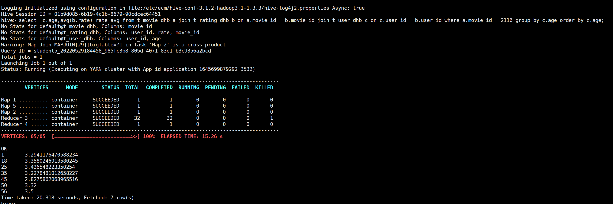
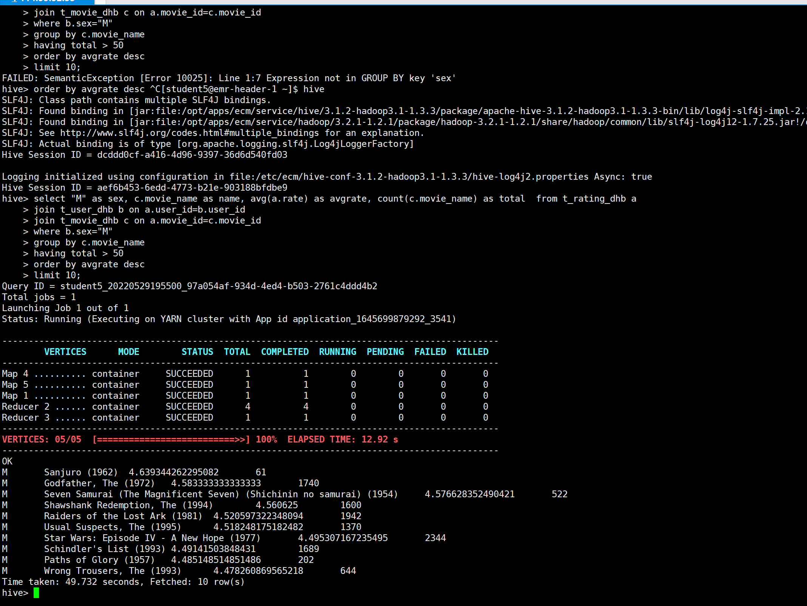

# 1. 数据准备
新建目录：
```
hadoop fs -mkdir /haibo.duan/week4
```
从/data/hive copy一份数据到自己的hdfs文件夹下：
```
hadoop fs -cp /data/hive/users /haibo.duan/week4
hadoop fs -cp /data/hive/movies  /haibo.duan/week4
hadoop fs -cp /data/hive/ratings /haibo.duan/week4
```
建表：
为了避免与其他人冲突，表名加后缀dhb
t_movie_dhb:
```sql
-- 建t_movie_dhb表
CREATE TABLE `t_movie_dhb`(
    `movie_id` bigint COMMENT '电影id',
    `movie_name` string COMMENT '电影名字',
    `movie_type` string COMMENT '电影类型')
ROW FORMAT SERDE 
    'org.apache.hadoop.hive.contrib.serde2.MultiDelimitSerDe'
WITH SERDEPROPERTIES ( 
    'field.delim'='::') -- 按::进行分隔，如果数据本身是别的分隔符，按具体情况选择，例如：\t
STORED AS INPUTFORMAT 
    'org.apache.hadoop.mapred.TextInputFormat'
OUTPUTFORMAT 
    'org.apache.hadoop.hive.ql.io.HiveIgnoreKeyTextOutputFormat'
LOCATION
    '/haibo.duan/week4/movies' -- hdfs文件路径
TBLPROPERTIES (
    'bucketing_version'='2',
    'transient_lastDdlTime'='1648533877');
```
t_rating_dhb
```sql
-- 建t_rating_dhb表
CREATE TABLE `t_rating_dhb`(
    `user_id` int COMMENT '用户id',
    `movie_id` bigint COMMENT '电影id',
    `rate` int COMMENT '评分',
    `times` string COMMENT '评分时间')
ROW FORMAT SERDE
    'org.apache.hadoop.hive.contrib.serde2.MultiDelimitSerDe'
WITH SERDEPROPERTIES ( 
    'field.delim'='::') 
STORED AS INPUTFORMAT 
    'org.apache.hadoop.mapred.TextInputFormat' 
OUTPUTFORMAT 
    'org.apache.hadoop.hive.ql.io.HiveIgnoreKeyTextOutputFormat'
LOCATION
    '/haibo.duan/week4/ratings' -- hdfs文件路径
TBLPROPERTIES (
    'bucketing_version'='2',
    'transient_lastDdlTime'='1648534400');
```
t_user_dhb:
```sql
-- 建t_user_dhb表
CREATE TABLE `t_user_dhb`(
    `user_id` int COMMENT '用户id',
    `sex` string COMMENT '性别', 
    `age` int COMMENT '年龄',
    `occupation` string COMMENT '职业',
    `zip_code` bigint COMMENT '邮编')
ROW FORMAT SERDE 
    'org.apache.hadoop.hive.contrib.serde2.MultiDelimitSerDe'
WITH SERDEPROPERTIES (
    'field.delim'='::') 
STORED AS INPUTFORMAT
    'org.apache.hadoop.mapred.TextInputFormat' 
OUTPUTFORMAT
    'org.apache.hadoop.hive.ql.io.HiveIgnoreKeyTextOutputFormat'
LOCATION
    '/haibo.duan/week4/users'  -- hdfs文件路径
TBLPROPERTIES (
    'bucketing_version'='2',
    'transient_lastDdlTime'='1648534260');
```

上述sql存到sql文件，hive执行建表语句：
```
hive -f ./t_movie.sql;
hive -f ./t_rating.sql;
hive -f ./t_user.sql;
```

# 2.第一题
第一题答案：
```sql
select  c.age,avg(b.rate) rate_avg 
from t_movie_dhb a 
    join t_rating_dhb b on a.movie_id = b.movie_id 
    join t_user_dhb c on c.user_id = b.user_id 
where a.movie_id = 2116 
group by c.age 
order by c.age;
```
第一题执行效果：


# 3.第二题
第二题答案：
```sql

select "M" as sex, c.movie_name as name, avg(a.rate) as avgrate, count(c.movie_name) as total  from t_rating_dhb a 
join t_user_dhb b on a.user_id=b.user_id 
join t_movie_dhb c on a.movie_id=c.movie_id 
where b.sex="M" 
group by c.movie_name 
having total > 50
order by avgrate desc 
limit 10;
```
第二题执行结果：


# 4.第三题
第三题答案：
```sql
select a.user_id 
from t_user_dhb a join t_rating_dhb b on a.user_id=b.user_id 
where a.sex = "F" 
group by a.user_id 
ORDER BY COUNT(1)
 DESC limit 1; 
 ```
执行结果：
```
hive> select a.user_id 
    > from t_user_dhb a join t_rating_dhb b on a.user_id=b.user_id 
    > where a.sex = "F" 
    > group by a.user_id 
    > ORDER BY COUNT(1)
    >  DESC limit 1; 
Query ID = student5_20220529200025_7ec8c11e-b206-44df-8e90-016d72e8fd5b
Total jobs = 1
Launching Job 1 out of 1
Status: Running (Executing on YARN cluster with App id application_1645699879292_3541)

----------------------------------------------------------------------------------------------
        VERTICES      MODE        STATUS  TOTAL  COMPLETED  RUNNING  PENDING  FAILED  KILLED  
----------------------------------------------------------------------------------------------
Map 1 .......... container     SUCCEEDED      1          1        0        0       0       0  
Map 2 .......... container     SUCCEEDED      1          1        0        0       0       0  
Reducer 3 ...... container     SUCCEEDED      4          4        0        0       0       0  
Reducer 4 ...... container     SUCCEEDED      1          1        0        0       0       0  
----------------------------------------------------------------------------------------------
VERTICES: 04/04  [==========================>>] 100%  ELAPSED TIME: 8.69 s     
----------------------------------------------------------------------------------------------
OK
1150
Time taken: 10.591 seconds, Fetched: 1 row(s)
```
女性影评次数最多,结果为 use_id=1150

评分最高的电影:
```sql
create table topmovie10_dhb as 
select movie_id,rate from t_rating_dhb where user_id = 1150 order by rate desc limit 10; 
```
执行结果放入临时表topmovie10_dhb
```sql
select b.movie_id as movieid, c.movie_name as moviename, avg(b.rate) as avgrate 
from topmovie10_dhb a 
join t_rating_dhb b on a.movie_id=b.movie_id 
join t_movie_dhb c on b.movie_id=c.movie_id 
group by b.movie_id,c.movie_name;
```
执行结果：
```
hive> select b.movie_id as movieid, c.movie_name as moviename, avg(b.rate) as avgrate 
    > from topmovie10_dhb a 
    > join t_rating_dhb b on a.movie_id=b.movie_id 
    > join t_movie_dhb c on b.movie_id=c.movie_id 
    > group by b.movie_id,c.movie_name;
No Stats for default@topmovie10_dhb, Columns: movie_id
No Stats for default@t_rating_dhb, Columns: rate, movie_id
No Stats for default@t_movie_dhb, Columns: movie_name, movie_id
Query ID = student5_20220529200347_80bcacb1-82f0-4968-a466-a8540c22741e
Total jobs = 1
Launching Job 1 out of 1
Status: Running (Executing on YARN cluster with App id application_1645699879292_3541)

----------------------------------------------------------------------------------------------
        VERTICES      MODE        STATUS  TOTAL  COMPLETED  RUNNING  PENDING  FAILED  KILLED  
----------------------------------------------------------------------------------------------
Map 3 .......... container     SUCCEEDED      1          1        0        0       0       0  
Map 4 .......... container     SUCCEEDED      1          1        0        0       0       0  
Map 1 .......... container     SUCCEEDED      1          1        0        0       0       0  
Reducer 2 ...... container     SUCCEEDED      6          6        0        0       0       0  
----------------------------------------------------------------------------------------------
VERTICES: 04/04  [==========================>>] 100%  ELAPSED TIME: 11.00 s    
----------------------------------------------------------------------------------------------
OK
2997	Being John Malkovich (1999)	4.125390450691656
750	Dr. Strangelove or: How I Learned to Stop Worrying and Love the Bomb (1963)	4.4498902706656915
905	It Happened One Night (1934)	4.280748663101604
2064	Roger & Me (1989)	4.0739348370927315
1236	Trust (1990)	4.188888888888889
1256	Duck Soup (1933)	4.21043771043771
1279	Night on Earth (1991)	3.747422680412371
745	Close Shave, A (1995)	4.52054794520548
904	Rear Window (1954)	4.476190476190476
1094	Crying Game, The (1992)	3.7314890154597236
Time taken: 12.421 seconds, Fetched: 10 row(s)
hive> 
```