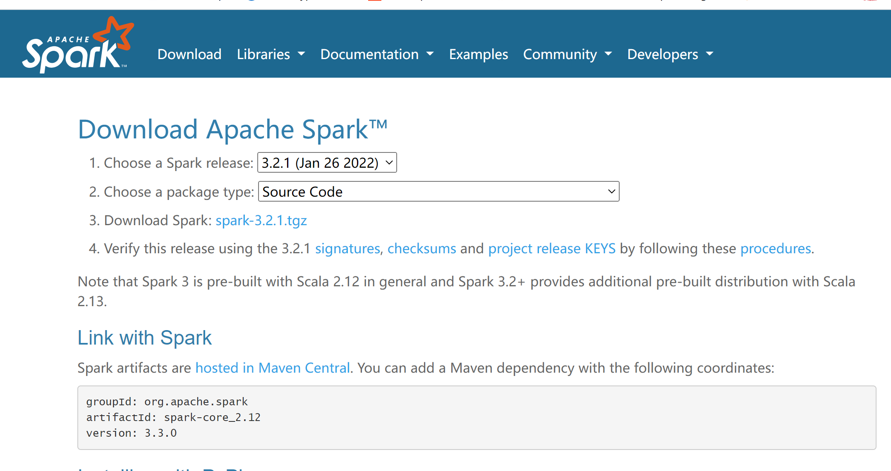
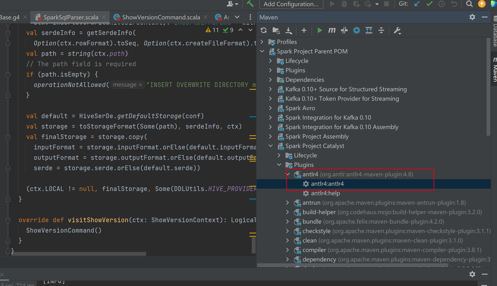

# 1.代码下载
下载spark代码可以通过两种方式，用git clone之后切换到对应的版本，或者直接下载所需版本的源码包。
## 1.1 git下载代码
```shell
haibo.duan@LAPTOP-M5HE61J0 MINGW64 /d/workspace/github-work
git clone https://github.com/apache/spark.git
//进入spark目录
cd spark
haibo.duan@LAPTOP-M5HE61J0 MINGW64 /d/workspace/github-work/spark (master)
$ git branch -a
* branch-3.2
  master
  remotes/origin/HEAD -> origin/master
  remotes/origin/branch-0.5
  remotes/origin/branch-0.6
  remotes/origin/branch-0.7
  remotes/origin/branch-0.8
  remotes/origin/branch-0.9
  remotes/origin/branch-1.0
  remotes/origin/branch-1.0-jdbc
  remotes/origin/branch-1.1
  remotes/origin/branch-1.2
  remotes/origin/branch-1.3
  remotes/origin/branch-1.4
  remotes/origin/branch-1.5
  remotes/origin/branch-1.6
  remotes/origin/branch-2.0
  remotes/origin/branch-2.1
  remotes/origin/branch-2.2
  remotes/origin/branch-2.3
  remotes/origin/branch-2.4
  remotes/origin/branch-3.0
  remotes/origin/branch-3.1
  remotes/origin/branch-3.2
  remotes/origin/branch-3.3
  remotes/origin/master

//切换到所需要的分支，如branch-3.3
haibo.duan@LAPTOP-M5HE61J0 MINGW64 /d/workspace/github-work/spark (master)
$ git checkout branch-3.3
```
## 1.2 页面下载源码
下载页面：https://spark.apache.org/downloads.html


下载内容: [spark-3.2.1.tgz](https://dlcdn.apache.org/spark/spark-3.2.1/spark-3.2.1.tgz)

之后解压到对应的文件夹即可。

# 2.编译过程
下载代码之后，首先尝试编译了一下，这个过程遇到的坑不少。下面以下载的代码为例说明。
## 2.1 编译依赖
编译spark安装的软件为：
jdk 版本1.8.321，scala 版本2.12.16， maven版本 3.6.3
```shell
haibo.duan@LAPTOP-M5HE61J0 MINGW64 /d/workspace/bigdata/spark-3.2.1
$ java -version
java version "1.8.0_321"
Java(TM) SE Runtime Environment (build 1.8.0_321-b07)
Java HotSpot(TM) 64-Bit Server VM (build 25.321-b07, mixed mode)

haibo.duan@LAPTOP-M5HE61J0 MINGW64 /d/workspace/bigdata/spark-3.2.1
$ scala -version
Scala code runner version 2.12.16 -- Copyright 2002-2022, LAMP/EPFL and Lightbend, Inc.

haibo.duan@LAPTOP-M5HE61J0 MINGW64 /d/workspace/bigdata/spark-3.2.1
$ mvn -v
Apache Maven 3.6.3 (cecedd343002696d0abb50b32b541b8a6ba2883f)
Maven home: D:\Program Files\Java\apache-maven-3.6.3
Java version: 1.8.0_321, vendor: Oracle Corporation, runtime: D:\Program Files\Java\jdk1.8.0_321\jre
Default locale: zh_CN, platform encoding: GBK
OS name: "windows 10", version: "10.0", arch: "amd64", family: "windows"
```
## 2.2 踩坑之一 maven版本过高
关于maven版本的选择，也是再踩坑之后才用3.6.3版本的。之前我用最新的3.8.6版本编译，出现如下错误：
```shell
[INFO] ------------------------------------------------------------------------
[INFO] Reactor Summary for Spark Project Parent POM 3.2.1:
[INFO]
[INFO] Spark Project Parent POM ........................... SUCCESS [  7.935 s]
[INFO] Spark Project Tags ................................. FAILURE [  5.942 s]
[INFO] Spark Project Sketch ............................... SKIPPED
[INFO] Spark Project Local DB ............................. SKIPPED
[INFO] Spark Project Networking ........................... SKIPPED
[INFO] Spark Project Shuffle Streaming Service ............ SKIPPED
[INFO] Spark Project Unsafe ............................... SKIPPED
[INFO] Spark Project Launcher ............................. SKIPPED
[INFO] Spark Project Core ................................. SKIPPED
[INFO] Spark Project ML Local Library ..................... SKIPPED
[INFO] Spark Project GraphX ............................... SKIPPED
[INFO] Spark Project Streaming ............................ SKIPPED
[INFO] Spark Project Catalyst ............................. SKIPPED
[INFO] Spark Project SQL .................................. SKIPPED
[INFO] Spark Project ML Library ........................... SKIPPED
[INFO] Spark Project Tools ................................ SKIPPED
[INFO] Spark Project Hive ................................. SKIPPED
[INFO] Spark Project REPL ................................. SKIPPED
[INFO] Spark Project Assembly ............................. SKIPPED
[INFO] Kafka 0.10+ Token Provider for Streaming ........... SKIPPED
[INFO] Spark Integration for Kafka 0.10 ................... SKIPPED
[INFO] Kafka 0.10+ Source for Structured Streaming ........ SKIPPED
[INFO] Spark Project Examples ............................. SKIPPED
[INFO] Spark Integration for Kafka 0.10 Assembly .......... SKIPPED
[INFO] Spark Avro ......................................... SKIPPED
[INFO] ------------------------------------------------------------------------
[INFO] BUILD FAILURE
[INFO] ------------------------------------------------------------------------
[INFO] Total time:  15.293 s
[INFO] Finished at: 2022-06-23T15:27:21+08:00
[INFO] ------------------------------------------------------------------------
[WARNING] The requested profile "100credit" could not be activated because it does not exist.
[ERROR] Failed to execute goal net.alchim31.maven:scala-maven-plugin:4.3.0:compile (scala-compile-first) on project spark-tags_2.12: Execution scala-compile-first of goal net.alchim31.maven:scala-maven-plugin:4.
3.0:compile failed: An API incompatibility was encountered while executing net.alchim31.maven:scala-maven-plugin:4.3.0:compile: java.lang.NoSuchMethodError: org.fusesource.jansi.AnsiConsole.wrapOutputStream(Ljav
a/io/OutputStream;)Ljava/io/OutputStream;
[ERROR] -----------------------------------------------------
[ERROR] realm =    plugin>net.alchim31.maven:scala-maven-plugin:4.3.0
[ERROR] strategy = org.codehaus.plexus.classworlds.strategy.SelfFirstStrategy
[ERROR] urls[0] = file:/D:/ProgramData/m2/net/alchim31/maven/scala-maven-plugin/4.3.0/scala-maven-plugin-4.3.0.jar
[ERROR] urls[1] = file:/D:/ProgramData/m2/org/apache/maven/maven-builder-support/3.3.9/maven-builder-support-3.3.9.jar
[ERROR] urls[2] = file:/D:/ProgramData/m2/com/google/guava/guava/18.0/guava-18.0.jar
[ERROR] urls[3] = file:/D:/ProgramData/m2/org/codehaus/plexus/plexus-interpolation/1.21/plexus-interpolation-1.21.jar
[ERROR] urls[4] = file:/D:/ProgramData/m2/javax/enterprise/cdi-api/1.0/cdi-api-1.0.jar
[ERROR] urls[5] = file:/D:/ProgramData/m2/javax/annotation/jsr250-api/1.0/jsr250-api-1.0.jar
[ERROR] urls[6] = file:/D:/ProgramData/m2/org/eclipse/sisu/org.eclipse.sisu.inject/0.3.2/org.eclipse.sisu.inject-0.3.2.jar
[ERROR] urls[7] = file:/D:/ProgramData/m2/org/codehaus/plexus/plexus-component-annotations/1.6/plexus-component-annotations-1.6.jar
[ERROR] urls[8] = file:/D:/ProgramData/m2/org/apache/maven/reporting/maven-reporting-api/3.0/maven-reporting-api-3.0.jar
[ERROR] urls[9] = file:/D:/ProgramData/m2/org/eclipse/aether/aether-util/1.0.2.v20150114/aether-util-1.0.2.v20150114.jar
[ERROR] urls[10] = file:/D:/ProgramData/m2/com/google/inject/guice/4.0/guice-4.0-no_aop.jar
[ERROR] urls[11] = file:/D:/ProgramData/m2/aopalliance/aopalliance/1.0/aopalliance-1.0.jar
[ERROR] urls[12] = file:/D:/ProgramData/m2/org/sonatype/plexus/plexus-sec-dispatcher/1.3/plexus-sec-dispatcher-1.3.jar
[ERROR] urls[13] = file:/D:/ProgramData/m2/org/sonatype/plexus/plexus-cipher/1.4/plexus-cipher-1.4.jar
[ERROR] urls[14] = file:/D:/ProgramData/m2/org/apache/commons/commons-lang3/3.4/commons-lang3-3.4.jar
[ERROR] urls[15] = file:/D:/ProgramData/m2/org/apache/maven/shared/maven-dependency-tree/3.0.1/maven-dependency-tree-3.0.1.jar
[ERROR] urls[16] = file:/D:/ProgramData/m2/org/apache/commons/commons-exec/1.3/commons-exec-1.3.jar
[ERROR] urls[17] = file:/D:/ProgramData/m2/org/codehaus/plexus/plexus-utils/3.3.0/plexus-utils-3.3.0.jar
[ERROR] urls[18] = file:/D:/ProgramData/m2/org/codehaus/plexus/plexus-archiver/4.1.0/plexus-archiver-4.1.0.jar
[ERROR] urls[19] = file:/D:/ProgramData/m2/org/codehaus/plexus/plexus-io/3.1.1/plexus-io-3.1.1.jar
[ERROR] urls[20] = file:/D:/ProgramData/m2/org/apache/commons/commons-compress/1.18/commons-compress-1.18.jar

... ...
```
scala-maven-plugin 插件出现了异常。新版本的maven3.8不支持wrap的方式。
将maven降级到3.6.3之后，能解决该问题。


## 2.3 编译
maven降级到3.6.3之后编译，就能成功了。
```shell
... ...
[INFO]
[INFO] ----------< org.apache.spark:spark-streaming-kafka-0-10_2.12 >----------
[INFO] Building Spark Integration for Kafka 0.10 3.2.1                  [21/25]
[INFO] --------------------------------[ jar ]---------------------------------
[INFO]
[INFO] --- maven-clean-plugin:3.1.0:clean (default-clean) @ spark-streaming-kafka-0-10_2.12 ---
[INFO]
[INFO] -------------< org.apache.spark:spark-sql-kafka-0-10_2.12 >-------------
[INFO] Building Kafka 0.10+ Source for Structured Streaming 3.2.1       [22/25]
[INFO] --------------------------------[ jar ]---------------------------------
[INFO]
[INFO] --- maven-clean-plugin:3.1.0:clean (default-clean) @ spark-sql-kafka-0-10_2.12 ---
[INFO]
[INFO] ----------------< org.apache.spark:spark-examples_2.12 >----------------
[INFO] Building Spark Project Examples 3.2.1                            [23/25]
[INFO] --------------------------------[ jar ]---------------------------------
[INFO]
[INFO] --- maven-clean-plugin:3.1.0:clean (default-clean) @ spark-examples_2.12 ---
[INFO]
[INFO] -----< org.apache.spark:spark-streaming-kafka-0-10-assembly_2.12 >------
[INFO] Building Spark Integration for Kafka 0.10 Assembly 3.2.1         [24/25]
[INFO] --------------------------------[ jar ]---------------------------------
[INFO]
[INFO] --- maven-clean-plugin:3.1.0:clean (default-clean) @ spark-streaming-kafka-0-10-assembly_2.12 ---
[INFO]
[INFO] ------------------< org.apache.spark:spark-avro_2.12 >------------------
[INFO] Building Spark Avro 3.2.1                                        [25/25]
[INFO] --------------------------------[ jar ]---------------------------------
[INFO]
[INFO] --- maven-clean-plugin:3.1.0:clean (default-clean) @ spark-avro_2.12 ---
[INFO] ------------------------------------------------------------------------
[INFO] Reactor Summary for Spark Project Parent POM 3.2.1:
[INFO]
[INFO] Spark Project Parent POM ........................... SUCCESS [  4.137 s]
[INFO] Spark Project Tags ................................. SUCCESS [  0.034 s]
[INFO] Spark Project Sketch ............................... SUCCESS [  0.022 s]
[INFO] Spark Project Local DB ............................. SUCCESS [  0.015 s]
[INFO] Spark Project Networking ........................... SUCCESS [  0.012 s]
[INFO] Spark Project Shuffle Streaming Service ............ SUCCESS [  0.011 s]
[INFO] Spark Project Unsafe ............................... SUCCESS [  0.011 s]
[INFO] Spark Project Launcher ............................. SUCCESS [  0.010 s]
[INFO] Spark Project Core ................................. SUCCESS [  0.011 s]
[INFO] Spark Project ML Local Library ..................... SUCCESS [  0.011 s]
[INFO] Spark Project GraphX ............................... SUCCESS [  0.010 s]
[INFO] Spark Project Streaming ............................ SUCCESS [  0.012 s]
[INFO] Spark Project Catalyst ............................. SUCCESS [  0.956 s]
[INFO] Spark Project SQL .................................. SUCCESS [  0.012 s]
[INFO] Spark Project ML Library ........................... SUCCESS [  0.012 s]
[INFO] Spark Project Tools ................................ SUCCESS [  0.012 s]
[INFO] Spark Project Hive ................................. SUCCESS [  0.011 s]
[INFO] Spark Project REPL ................................. SUCCESS [  0.011 s]
[INFO] Spark Project Assembly ............................. SUCCESS [  0.009 s]
[INFO] Kafka 0.10+ Token Provider for Streaming ........... SUCCESS [  0.010 s]
[INFO] Spark Integration for Kafka 0.10 ................... SUCCESS [  0.012 s]
[INFO] Kafka 0.10+ Source for Structured Streaming ........ SUCCESS [  0.014 s]
[INFO] Spark Project Examples ............................. SUCCESS [  0.012 s]
[INFO] Spark Integration for Kafka 0.10 Assembly .......... SUCCESS [  0.012 s]
[INFO] Spark Avro ......................................... SUCCESS [  0.011 s]
[INFO] ------------------------------------------------------------------------
[INFO] BUILD SUCCESS
[INFO] ------------------------------------------------------------------------
[INFO] Total time:  6.774 s
[INFO] Finished at: 2022-06-23T15:44:18+08:00
[INFO] ------------------------------------------------------------------------

```

# 3.源码修改
## 3.1 SqlBase.g4
SqlBase.g4文件需要修改如下位置。
- statement 增加SHOW VERSION
```shell
statement
    : query                                                            #statementDefault
    | SHOW VERSION                                                     #showVersion
```
- ansiNonReserved 增加version
```shell
ansiNonReserved
//--ANSI-NON-RESERVED-START
    : ADD
    | VERSION
```
- keywords list 增加key
```shell
//============================
// Start of the keywords list
//============================
//--SPARK-KEYWORD-LIST-START
ADD: 'ADD';
VERSION: 'VERSION' | 'V';
```

## 3.2 编译antlr
增加完成之后，在idea上编译antlr：

双击antlr4即可：
```shell
"D:\Program Files\Java\jdk-17.0.1\bin\java.exe" -Dmaven.multiModuleProjectDirectory=D:\workspace\bigdata\spark-3.2.1\sql\catalyst -Dmaven.home=D:\idea\ideaIU-2021.3.3.win\plugins\maven\lib\maven3 -Dclassworlds.conf=D:\idea\ideaIU-2021.3.3.win\plugins\maven\lib\maven3\bin\m2.conf -Dmaven.ext.class.path=D:\idea\ideaIU-2021.3.3.win\plugins\maven\lib\maven-event-listener.jar -javaagent:D:\idea\ideaIU-2021.3.3.win\lib\idea_rt.jar=61998:D:\idea\ideaIU-2021.3.3.win\bin -Dfile.encoding=UTF-8 -classpath D:\idea\ideaIU-2021.3.3.win\plugins\maven\lib\maven3\boot\plexus-classworlds-2.6.0.jar;D:\idea\ideaIU-2021.3.3.win\plugins\maven\lib\maven3\boot\plexus-classworlds.license org.codehaus.classworlds.Launcher -Didea.version=2021.3.3 org.antlr:antlr4-maven-plugin:4.8:antlr4
[INFO] Scanning for projects...
[INFO] 
[INFO] ----------------< org.apache.spark:spark-catalyst_2.12 >----------------
[INFO] Building Spark Project Catalyst 3.2.1
[INFO] --------------------------------[ jar ]---------------------------------
[INFO] 
[INFO] --- antlr4-maven-plugin:4.8:antlr4 (default-cli) @ spark-catalyst_2.12 ---
[INFO] No grammars to process
[INFO] ANTLR 4: Processing source directory D:\workspace\bigdata\spark-3.2.1\sql\catalyst\src\main\antlr4
[INFO] ------------------------------------------------------------------------
[INFO] BUILD SUCCESS
[INFO] ------------------------------------------------------------------------
[INFO] Total time:  5.802 s
[INFO] Finished at: 2022-06-23T17:51:52+08:00
[INFO] ------------------------------------------------------------------------

Process finished with exit code 0
```

## 3.3 SparkSqlParser.scala
在SparkSqlParser.scala类的末尾增加如下方法：
```
  override def visitShowVersion(ctx: ShowVersionContext): LogicalPlan = withOrigin(ctx) {
    ShowVersionCommand()
  }
```

## 3.4 新增ShowVersionCommand.scala
新增类位于org.apache.spark.sql.execution.command目录：
```
/*
 * Licensed to the Apache Software Foundation (ASF) under one or more
 * contributor license agreements.  See the NOTICE file distributed with
 * this work for additional information regarding copyright ownership.
 * The ASF licenses this file to You under the Apache License, Version 2.0
 * (the "License"); you may not use this file except in compliance with
 * the License.  You may obtain a copy of the License at
 *
 *    http://www.apache.org/licenses/LICENSE-2.0
 *
 * Unless required by applicable law or agreed to in writing, software
 * distributed under the License is distributed on an "AS IS" BASIS,
 * WITHOUT WARRANTIES OR CONDITIONS OF ANY KIND, either express or implied.
 * See the License for the specific language governing permissions and
 * limitations under the License.
 */


package org.apache.spark.sql.execution.command

import org.apache.spark.sql.{Row, SparkSession}
import org.apache.spark.sql.catalyst.expressions.{Attribute, AttributeReference}
import org.apache.spark.sql.types.StringType


case class ShowVersionCommand() extends LeafRunnableCommand {

  override val output: Seq[Attribute] =
    Seq(AttributeReference("version", StringType)())

  override def run(sparkSession: SparkSession): Seq[Row] = {
    val sparkVersion = sparkSession.version
    val javaVersion = System.getProperty("java.version")
    val scalaVersion = scala.util.Properties.releaseVersion
    val output = "Spark Version: %s, Java Version: %s, Scala Version: %s"
      .format(sparkVersion, javaVersion, scalaVersion.getOrElse(""))
    Seq(Row(output))
  }
}

```
注意，需要加Licensed，且末尾需要空一行。否则编译的过程中checkstyle会报错。

## 3.5 编译打包
代码修改完成之后，进行编译打包：
```shell
build/sbt package -Phive -Phive-thriftserver
```
或者：
```shell
mvn clean package -DskipTests -Phive -Phive-thriftserver
```
上述两种方式都能编译成功。

# 4.运行测试
在spark目录下，运行spark-sql:
```shell
haibo.duan@LAPTOP-M5HE61J0 MINGW64 /d/workspace/bigdata/spark-3.2.1
$ bin/spark-sql
"D:\Program Files\Java\jdk1.8.0_321\bin\java" -cp "D:\Program Files\spark-3.2.1-bin-hadoop2.7/conf\;D:\Program Files\spark-3.2.1-bin-hadoop2.7\jars\*" -Xmx1g org.apache.spark.deploy.SparkSubmit --class org.apache.spark.sql.hive.thriftserver.SparkSQLCLIDriver spark-internal
spark-sql> show version;
Spark Version: 3.2.1, Java Version: 1.8.0_321, Scala Version: 2.12.16
spark-sql>
```