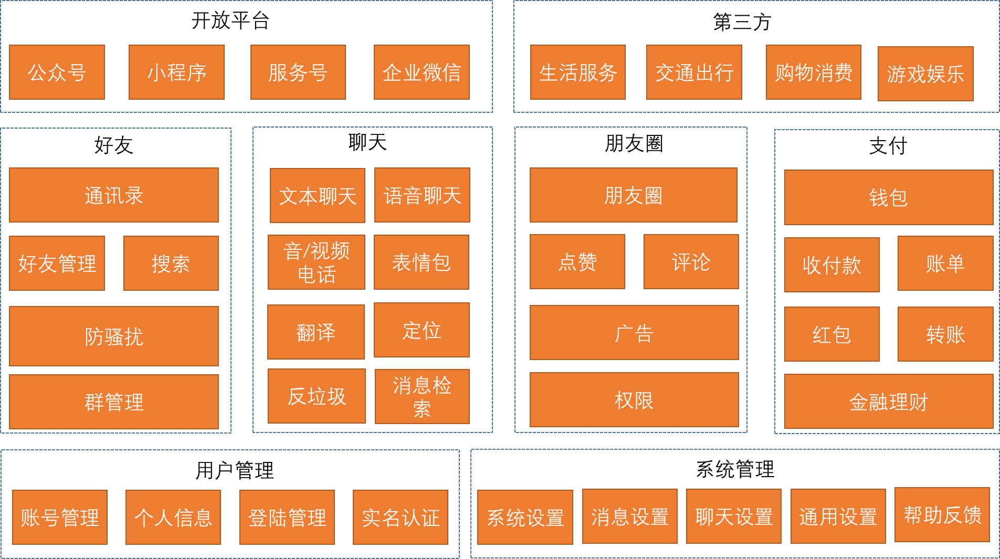
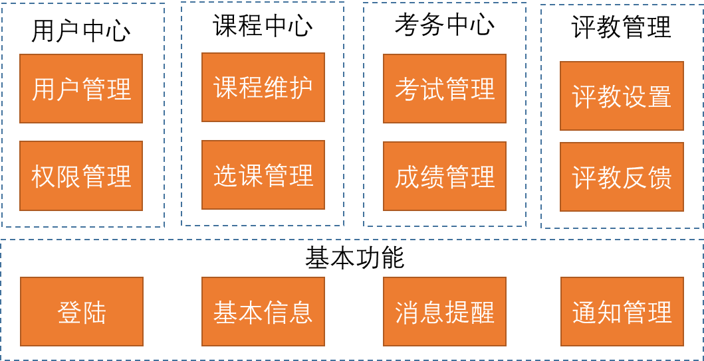
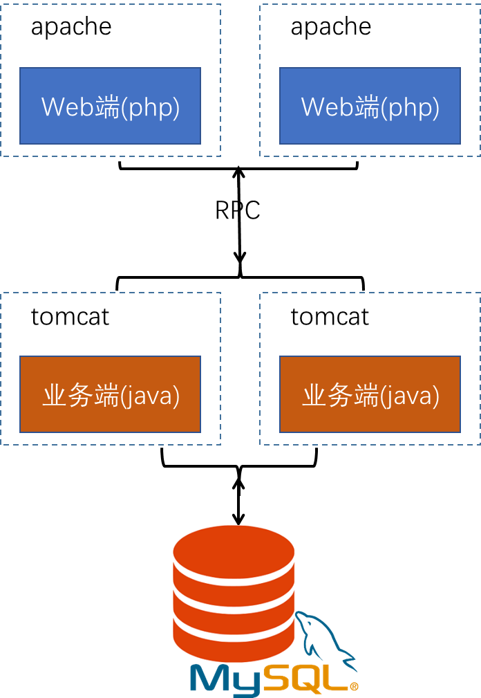
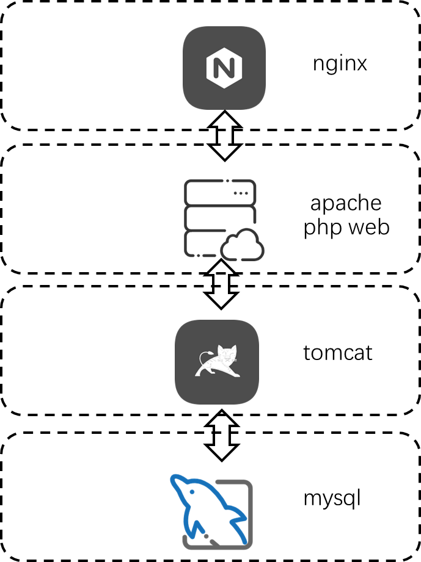
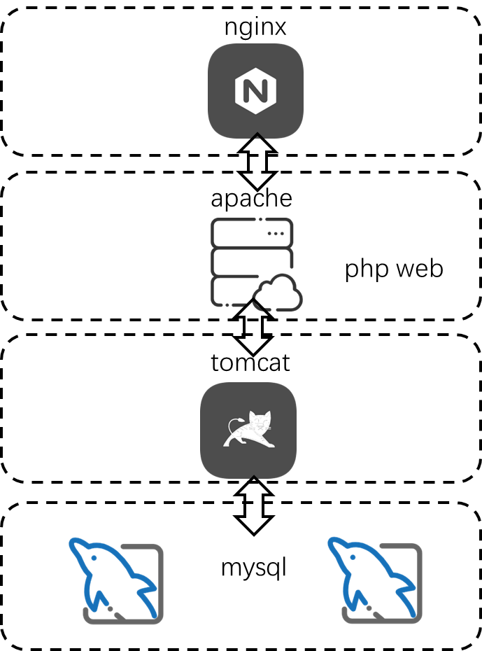
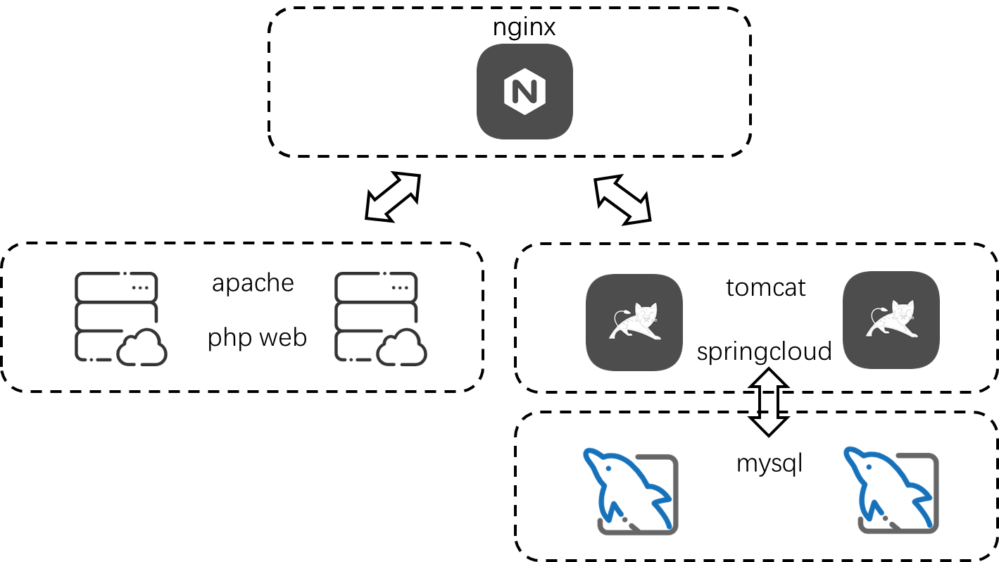
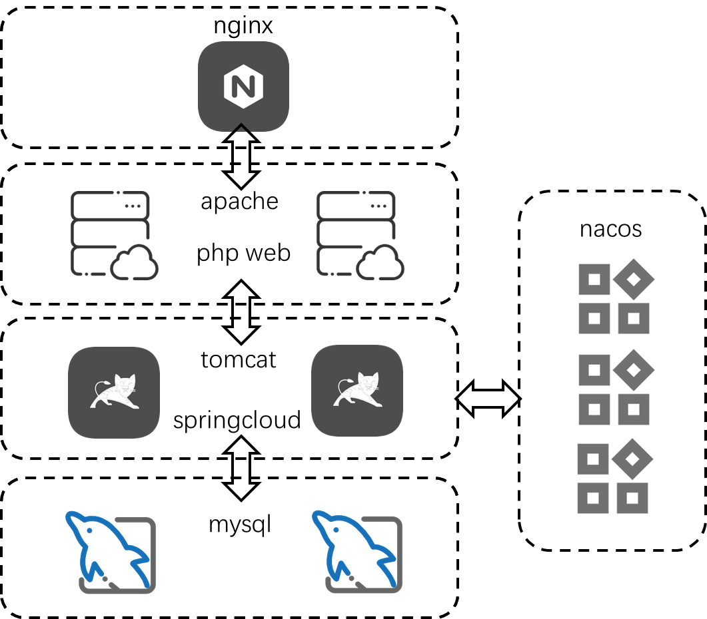
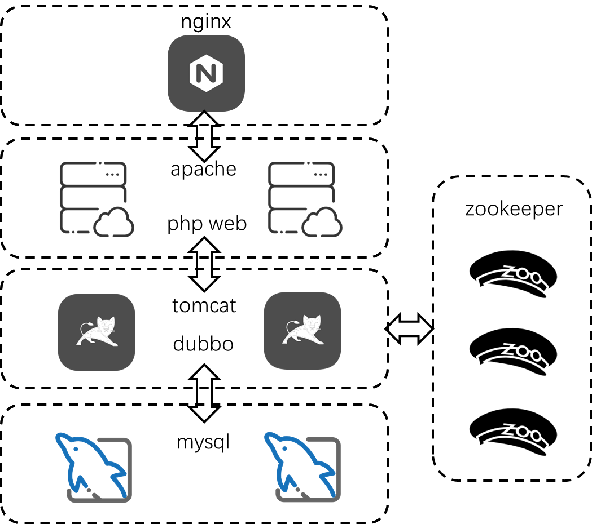

1. 画出微信的业务架构图。

2. “学生管理系统”毕设架构设计
   假设今年学校毕业设计要求提升，要求做真正可运行的学生管理系统，学院对毕设的具体要求如下：
   ① 要求可以通过公网域名访问；
   ② 要求至少3 人合作完成；
   ③ 能够支撑管理1000 个学生；
   ④ 答辩的时候会根据架构方案来进行打分，不推荐太简单和太复杂的方案。
   你找了2 个好朋友一起来做这个项目，你们的基本情况如下：
   ① 大家都会Java，但是有一个是PHP 高手；
   ② 大家经济条件一般。
   作业要求：
   ① 对照面向复杂度架构设计方法论，构思2 个以上的备选架构方案。
   ② 使用PPT 来画出你的备选架构方案，并说明方案的优缺点。
   ③ 给出你选择的最终方案以及选择理由。

学生管理系统业务架构图：

架构方案：

考虑到有一个人是php高手，结合php的特点，以及目前的人员配备情况，最简单的办法就是将项目分离，用php来实现静态的页面和无状态的数据展示。
将php实现的部分放置在最前端。之后将业务逻辑，以及对数据的处理，采用java开放，通过接口的形式，提供给php的web端调用。应用架构图如下：

在部署过程中，可以有多种方案来部署。

方案一：
这是最简单的一种部署方案，考虑到现有资源的情况，以及当前的经济条件，可以采用云主机的方案来进行，模块之间都采用单点。

方案二:
采用云主机，需要考虑到学生数据的安全性，因此需要通过mysql主从，主库进行写入和修改操作，从库也能分担读的压力。

方案三：
在考虑到数据安全性的基础之上，由于有1000学生，并发的峰值可能达到1000.因此，需要使得系统具备可扩展性。
可以充分利用nginx的loadbalace功能，在最开始，请求到前端的请求通过nginx负载到多个前端的节点。之后再访问后端的时候，再次通过nginx来负载。
负载到后端之后，java后端具备多个服务，这样初步实现看可扩展。

方案四：
可以考虑将java的后端进一步升级为springcloud微服务。这样除了loadbalance之外，还能更好的支持failover,也支持系统的水平扩容，增加系统的高可用。

方案五：
同样，在方案四的基础上也可采用dubbo，通过rpc的方式，来提升java后端的高可用能力。

方案选择：

- 方案一，过于简单，不支持负载均衡，也没有failover的能力，性能太差。还有可能造成数据丢失，因此放弃。
- 方案二，考虑到的数据的安全性问题，但是在应用上依然不具备高可用能力。
- 方案三，具备的初步的负载均衡和初步的failover能力，但是并不完美。
- 方案四、方案五在高可用上考虑得比较完美了，但是需要额外的注册中心节点。成本较高。而且当前的用户量还没有到需要支持水平扩展的要求。
因此综合选择方案三。