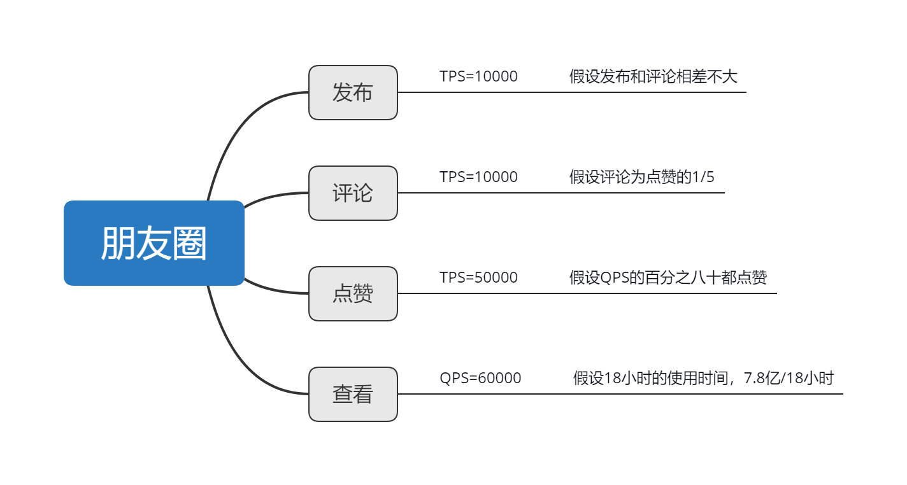
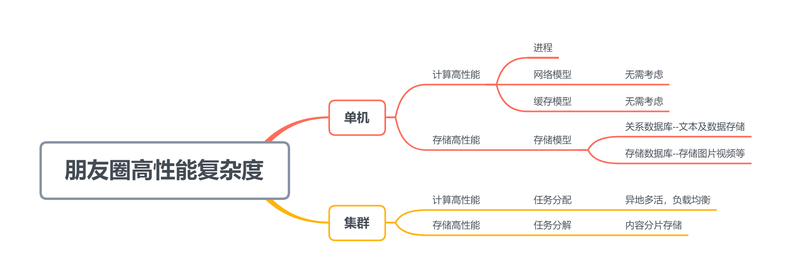
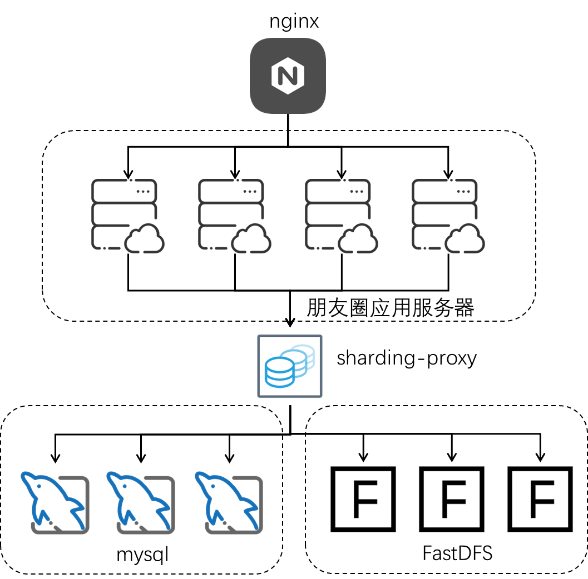
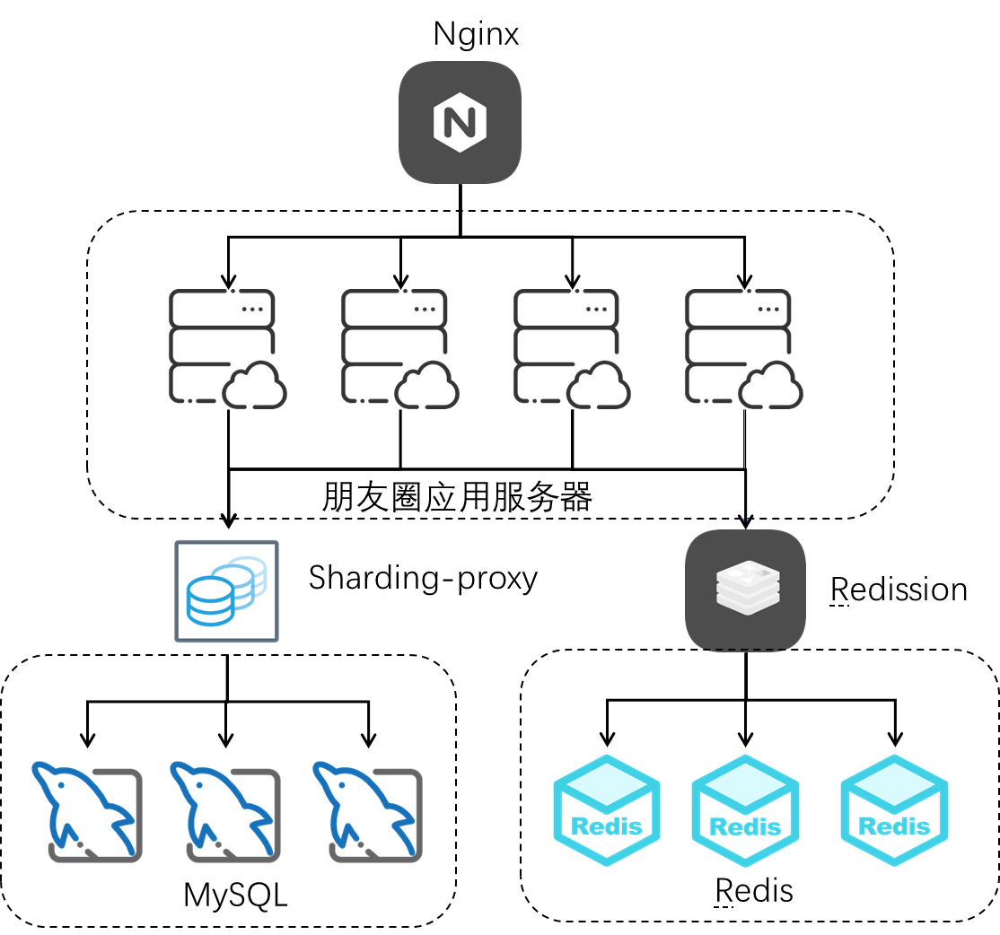
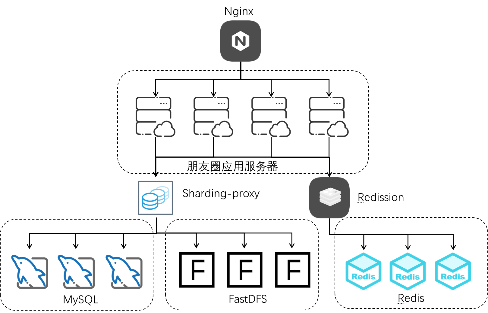

分析一下微信朋友圈的高性能复杂度
【作业要求】
1. 对照模块2讲述的复杂度分析方法，分析微信朋友圈的复杂度。
2. 针对各个复杂度，画出你的架构设计方案（无需做备选方案，只需要最终的方案即可）。
3. 给出你的架构方案中关键的设计理由。
4. 3~5页PPT 即可，涵盖复杂度分析、架构设计、设计理由。
   【提示】
5. 分析过程可以参考模块2第5课的实战案例，但是不需要将分析过程一一列举出来。
6. 如果某个地方被卡主了，请及时联系助教或者老师讨论。

朋友圈复杂度分析：
业务复杂度：朋友圈的业务复杂度比较低，只有内容发布、查看和评论和点赞等内容。
质量复杂度：朋友圈的用户非常多，微信的用户数量都会有朋友圈功能，根据张小龙在“2021微信公开课PRO”中的演讲，每天有10.9亿用户打开微信，3.3亿用户进行了视频通话；有7.8亿用户进入朋友圈，1.2亿用户发表朋友圈，其中照片6.7亿张，短视频1亿条；有3.6亿用户读公众号文章，4亿用户使用小程序。
可知，微信朋友圈的PV每天约为7.8亿，绝大部分人都会在白天查看朋友圈，在0点-6点相对是朋友圈活跃度最低的时间段，这部分的PV忽略不计，按18小时计算。
可以得到平均的QPS为12000，考虑到在某些时间段如中午吃饭、上下班路上使用朋友圈的情况会相对集中，因此，可以考虑峰值是平均值的5倍，那么高峰期的QPS大约为60000/s。
再查看朋友圈的时候，基本上查看朋友的人都会点赞，那么点赞功能的TPS可能是查看QPS的百分之八十左右，约为50000/s
对评论朋友圈的情况，评论的概率会低于点赞，按缩减五倍计算，评论的TPS大概为10000/s
对于发布朋友圈的情况，会存在很多用户都是查看朋友圈，而不会发布朋友圈，因此与评论持平即可，TPS为10000/s

此外，还需要考虑朋友圈的业务特点，朋友圈的单条数据，查看量的上限是朋友的人数上限，微信朋友的人数，上限为5000。考虑到重复的查看次数，一条朋友圈的数据，发布之后，总的查看次数，大部分不会超过500次。大量用户的朋友圈数据会低于100。
因此对于朋友圈的架构涉及，最关键的部分是将用户分片，将用户的数据通过hash的方式分片到多个服务器，让同一个用户的数据被集中到某一个服务器来访问。

发布功能：
发布功能考虑到图片，gif以及短视频等内容，因此需要将这些文件放置到文件服务器上。采用分布式的文件服务器FastDFS是一个不错的解决方案。

点赞和评论朋友圈：

点赞和评论数据，数据量不大，但是操作的时效性要求比较高，可以考虑加一层redis缓存。数据的读写先操作缓存，之后再同步到数据库。

查看朋友圈：

查看朋友圈的时候，除了需要根据mysql中的数据进行渲染之外，还需要从文件服务器读取文件数据，从redis中读取点赞和动态。
此外还有广告数据，广告数据一般是链接的方式，直接加载，之后广告的内容通常都放在cdn。

