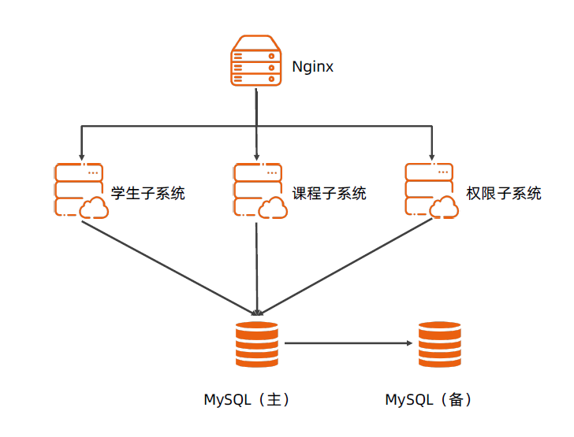

# 前言

# 词汇表

# 1.业务背景
某某邮电大学现有学生管理系统存在大量的线下流程，已不能满足日常工作需要，现需要新建一个学生管理系统，以便让学校能更方便的对学生情况进行管理。实现原有线下的学生信息登记、选课、考试等功能的线上化。降低学校的人力成本。
该系统需要实现的功能有：
- 用户中心：能实现学生、教师、管理员等多个角色的用户管理功能和权限管理功能。
- 课程中心：教师能够通过课程管理对课程进行维护，学生可以进行选课。
- 考务中心：可以支持部分课程的在线考试，以及全部考试的成绩线上管理。
- 评教管理：管理员可以对评教问题进行设置，全体学生可以对相关教师进行评教反馈。
- 基本功能：此系统还需提供一些基本的功能，如登陆、基本信息维护、消息提醒、通知管理等。

# 2.约束和限制
- 在3月1日前务必实现系统可用。
- 采用云主机方案节约成本。
- 并发数 1000 。
- 需要保证数据高可用。

# 3.总体架构
## 3.1 架构分析
- 高性能：系统最高1000并发，性能要求并不高。但是在选课的阶段，需要满足1000人同时在线选课，确保系统不崩溃。
- 高可用：数据需要避免丢失。
- 可扩展：业务需求比较复杂，需要充分考虑可扩展性。

## 3.2 总体架构设计

整个学生管理系统包括三个子系统：学生子系统、课程子系统、权限子系统。
- 权限子系统：负责身份认证、账号管理，角色管理和权限管理功能。
- 学生子系统：维护学生的基本信息，学生可以自主填写，然后需要通过教师的确认。
- 课程自系统：教师负责完成课程维护及课程规划，学生操作可以进行选课，之后能生成在线课表。由于疫情的影响，部分选课支持在线考试，教师可以上传全部课程的成绩。

整个系统分为Nginx网关，学生子系统、课程子系统、权限子系统、Mysql数据库主库和mysql数据库从库。
其中，Nginx部署在网关服务器，学生子系统、课程子系统、权限子系统分别部署在各自的服务器。Mysql采用主从结构部署。全部业务连接Mysql主库。

# 4.详细设计
## 4.1 核心功能

## 4.2 关键设计
- 所有请求经过Nginx才能访问，采用前后端分离技术，前端采用Vue框架，后端采用Springboot + tomcat。所有请求均经过Nginx反向代理。
- 接口协议遵循RestFul协议规范。
- 后端技术框架采用 spring + mybatis 。
- 用户鉴权：采用GWT 实现token。
- 数据库主从：搭建Mysql主从集群，数据的读写操作在主库进行。从库从主库同步。在主库出现故障的时候，可以切换到从库。

## 4.3 设计规范

# 5.质量设计

可测试性：要求采用junit进行单元测试，测试用例覆盖度达到80%。

可维护性：详细的设计完档、部署文档。

可观测性：日制需要收集到ELK。

# 6.演进规划
第一阶段：实现学生系统的业务功能开发工作，并完成上线。
第二阶段：实现在线阅卷、成绩分析等功能。

