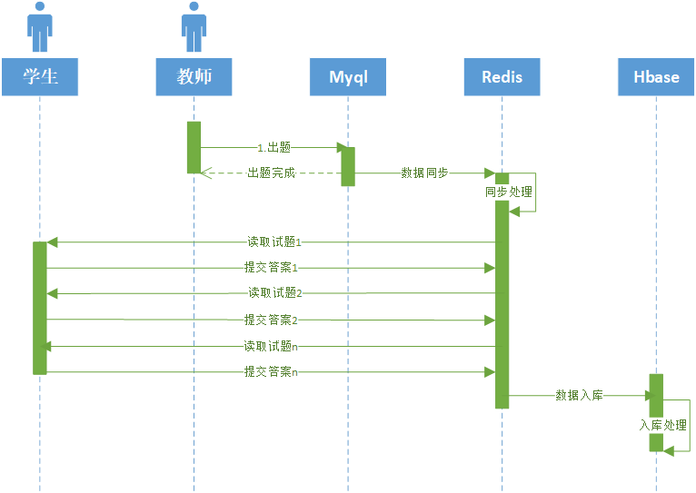

# 1.业务要求
学生管理系统用户数量约1000万，需要在线支持学生的并发考试的业务需要。
考试试卷存储要求：
- 不同学校、不同年级、不同班级的学生试卷需要分开存储。支持按班级举行考试。
- 支持每学期每人20门课程的考试，学生仅能看到自己的考试结果。

# 2.性能估算
- 在校学生的试卷约2.4T (热数据)
- 离校学生的试卷，逐年递增，每年250万。
- 查询试卷QPS : 5万/秒
- 考试时提交试卷：1700/秒

# 3.redis数据结构设计
考试数据可以分为试卷、答案两部分进行存储。
String和Hash结构都能满足要求，考虑到String结构占用的空间较大，采用Hash结构进行存储。
试卷：Redis Hash
key: exam + 学校ID + 班级ID + 科目ID + 考试ID
field: 题目序号
value: 题目内容

答案：
key: answer + 学校ID + 班级ID + 科目ID + 考试ID
field: 题目序号
value: 答案内容

考虑到并发场景下，对网络带宽的影响，采用Hash结构存储，学生在考试的时候，可以根据做题的进度逐题加载，这样讲系统的瞬时带宽峰值江到最低。
在提交试题的时候，需要考虑做题人随时更新答案。因此在同一张试卷种,可以实时根据题号提交答案。

# 4.数据处理流程
数据交互流程如下图：

# 5. Redis sentinel 性能估算
考试时，试题的最大读取为5万QPS,单节点的Redis最大支持为5万。采用sentinel,一般为3节点架构。

