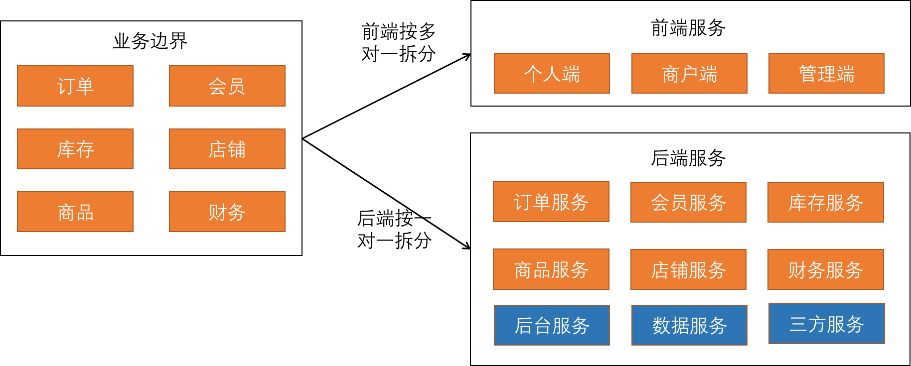
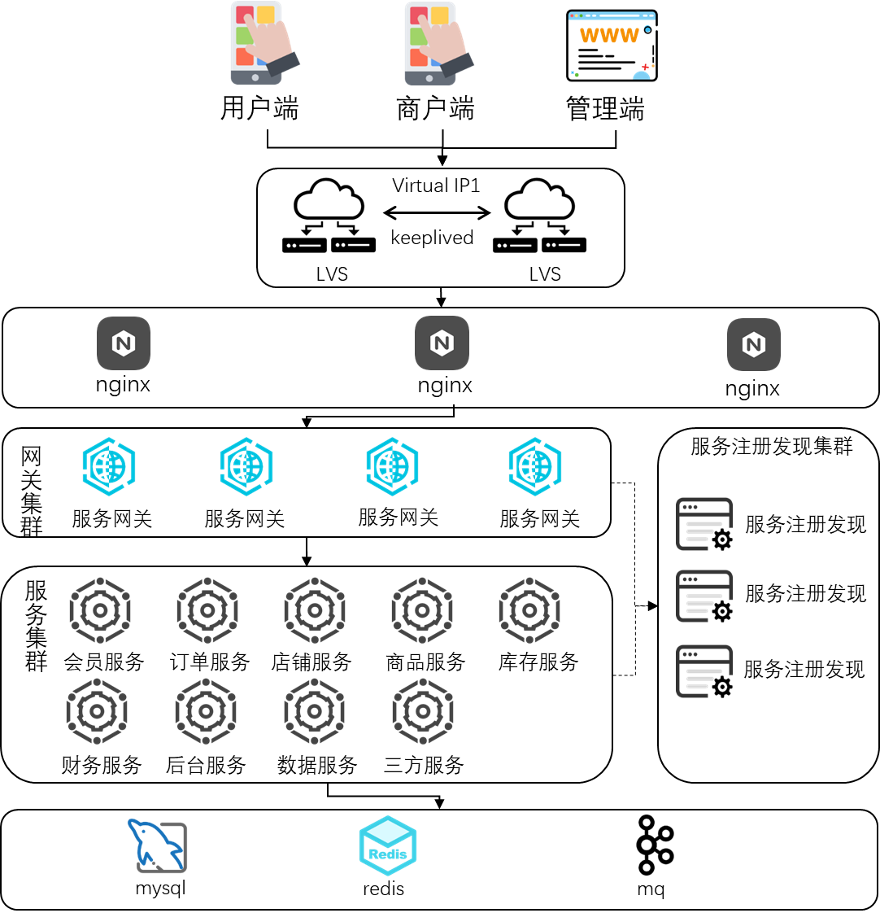

# 1.服务拆分思路

系统主要是采用小程序来实现的电商业务。系统应该划分为，前端后后端两部分进行考虑。
结系统的资源情况为，前端5人，后端25人，考虑三个火枪手原则，对前后端服务的拆分进行推导。

前端显然只能考虑多对一的方式进行拆分，结合小程序电商业务的特点，前端会拆分为：
- 个人端（C端）：个人用户选择商品进行消费的前端小程序。
- 商户端（B端）: 商户进行商品和库存管理的前端小程序。
- 管理端（M端）：一个平台进行管理的后台系统，网页即可，不必用小程序。能满足平台日常的管理需求，如对商户结算、发票等等。

后端可以采用一对一的方式进行拆分：
- 订单服务： C端用户的订单全流程。
- 会员服务： C端用户的管理。
- 店铺服务：管理B端商户。
- 商品服务：B端用户提供的商品供C端用户选择。
- 库操服务：商品的库存、物流管理。
- 财务服务：支付、结算服务。
- 后台服务：管理端的后台，主要是管理和报表功能。
- 三方服务：封装所有对三方的接口，包括物流、支付、结算等。
- 数据服务：将系统的全部数据交互抽象为一个数据层服务，提供给其他服务使用。

后端有25个人，服务拆分为9个，部分简单的服务不需要3个人来负责，人员配置可以根据项目的实时情况灵活机动。后台服务、三方服务、数据服务都是在课程的基础上新增的。

系统架构图如下：

# 2.微服务框架选择
考虑到后端人员全部为java人员，因此微服务框架只能在java技术栈众做选择。
目前java技术栈中比较流行的微服务框架为 基于http的springclloud和基于rpc的dubbo框架。
考虑到基于小程序的电商平台通常以http请求为主，很少会用到rpc调用。因此采用springcloud作为该项目主要的微服务框架。
