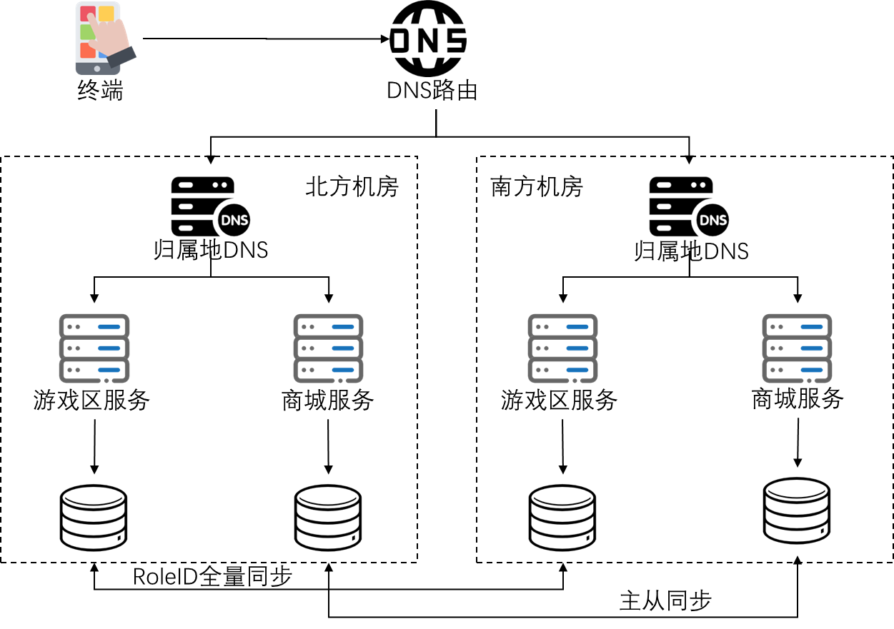

王者荣耀业务背景

【业务数据】
2020.11月公布数据，全年日均活跃1亿，注册玩家数6亿，最高同时在线100万。

【业务功能】
1. 使用微信或者QQ 账号登录游戏；
2. 使用微信钱包或者QQ钱包充值点券。
3. 使用点券在商城消费：购买英雄、皮肤、道具等；
4. 可以看到点券余额。

【关键业务约束】
1. 登录用户才能购买物品；
2. 用户属于不同的区服，例如Android 平台微信22区“刺客信条”，同一微信ID 可以加入多个区服，俗称“大号”、“小号”；
3. 用户要先调用微信钱包或者QQ钱包充值点券，然后在商城里面用点券支付；
4. 用户买英雄和皮肤的时候同样的英雄和皮肤只能买1个，不能重复购买； 
5. 用户买鲜花、改名卡之类的道具可以买多个；

【业务分级】
需要提供的业务有： 登陆、充值、消费、查询。
属于核心TOP3的业务：
登陆、充值、消费。

【数据分析】
1. 登陆： 
- 依赖 QQ 和微信账号授权登录，本身无需登录信息 
- 微信和 QQ 授权登录会返回给王者荣耀全局唯一 RoleID
- 王者荣耀只需要记录 RoleID 对应的区服信息，区服数据只会新增不会修改

2. 充值：
- RoleID：第一次登陆之后就不会改变，全局唯一，以后每次相统的微信或者QQ登陆都是这个值；
- 点券余额：和 RoleID 绑定，一个RoleID对应一个余额。
- 充值订单ID：每次新建，单调递增，全局唯一，不会修改。
- 充值数据：与充值订单ID对应，新增数据，记录充值时间、金额和点券数量，不会修改。
- 点券流水：每个RoleID对应一个流水日志表，记录点券的增减情况。充值的时候会插入一条数据，类型为充值。数值为正。

3.消费：
- RoleID：第一次登陆之后就不会改变，全局唯一，以后每次相统的微信或者QQ登陆都是这个值；
- 消费订单ID：每次新建，单调递增，全局唯一，不会修改。
- 消费订单数据：与消费订单ID对应，购买的虚拟物品、单价、数量等信息。
- 点券流水：每个RoleID对应一个流水日志表，记录点券的增减情况。消费的时候会插入一条数据，类型为消费。数值为负。

【数据同步】
1. 登陆：
   RoleID 和区服对应关系，只会新建不会修改，数据库同步。此外会涉及新增账号已经禁用账号的处理，还需要消息队列同步。

2. 充值：
- RoleID 与登陆相同。
- 充值订单ID：和 RoleID 绑定，全局一致性，数据库同步即可；
- 充值数据：数据库同步。
- 点券流水数据：最终一致性即可，数据库同步。

3.消费：
- RoleID 与登陆相同。
- 消费订单ID：和 RoleID 绑定，全局一致性，数据库同步即可；
- 消费订单数据：数据库同步。
- 点券流水数据：最终一致性即可，数据库同步。

【异常处理】
1. 登陆：
- 微信和QQ 挂了怎么办？

直接挂公告：系统停服维护。

- 玩家在某个区服开了小号，没同步到异地机房，玩不了怎么办？

等系统恢复就可以玩了。

2. 充值：
- 充值渠道挂了怎么办？

微信钱包和QQ钱包，可以互相切换。如果都不可用，则公告通知。

-充值过程中系统故障怎么办？

未付款作废，如果已付款成功，事后补偿。完成充值。

3. 消费：
- 本地机房挂掉，点券余额没有完全同步到异地机房，玩家登陆无法消费：

 公告，+ 系统恢复之后再消费。

- 由于系统故障导致玩家消费重复扣除，或者重复购买？

事后补偿，将错误订单退款，退还点券，并给用户相应的补偿措施。

【异地多活架构图】

