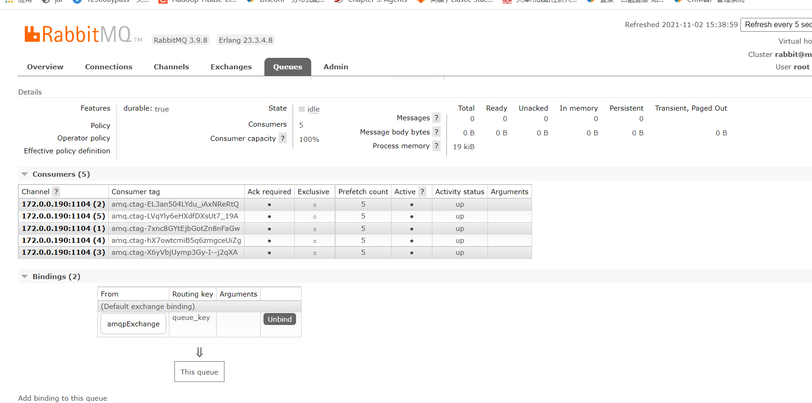

在springboot下操作rabbitMQ。
# 1.pom文件配置
pom文件配置如下：
```xml
  <!-- Spring Boot -->
        <dependency>
            <groupId>org.springframework.boot</groupId>
            <artifactId>spring-boot-starter</artifactId>
        </dependency>

        <dependency>
            <groupId>org.springframework.boot</groupId>
            <artifactId>spring-boot-starter-web</artifactId>
        </dependency>

        <!-- amqp协议 用来连接rabbitmq -->
        <dependency>
            <groupId>org.springframework.boot</groupId>
            <artifactId>spring-boot-starter-amqp</artifactId>
        </dependency>

        <dependency>
            <groupId>org.springframework.boot</groupId>
            <artifactId>spring-boot-configuration-processor</artifactId>
            <optional>true</optional>
        </dependency>

        <!-- lombok -->
        <dependency>
            <groupId>org.projectlombok</groupId>
            <artifactId>lombok</artifactId>
        </dependency>
        <!-- fastjson -->
        <dependency>
            <groupId>com.alibaba</groupId>
            <artifactId>fastjson</artifactId>
            <version>1.2.78</version>
        </dependency>
```
# 2.yml配置
```yaml
server:
  port: 8080

spring:
  rabbitmq:
    host: 192.168.161.114
    port: 5672
    username: root
    password: 123456
    virtual-host: /
    listener:
      simple:
        acknowledge-mode: manual # 手动ack
        concurrency: 5 #消费端最小并发数
        max-concurrency: 10 #消费端最大并发数
        prefetch: 5 # 一次请求中预处理的消息数量
    cache:
      channel:
        size: 50 #缓存的channel数量

#自定义配置
rabbitmq-demo:
  defaultExchange: amqpExchange
  queue: queue
  routeKey: queue_key
```

# 3.java代码
自定义MQ配置：MQProperties：
```java
import lombok.Data;
import org.springframework.boot.context.properties.ConfigurationProperties;
import org.springframework.stereotype.Component;

@Component
@ConfigurationProperties(prefix = "rabbitmq-demo")
@Data
public class MQProperties {

	private String defaultExchange;
	private String routeKey;
	private String queue;
}
```

RabbitMQ中队列及exchange的配置：
```java
import org.springframework.amqp.core.Binding;
import org.springframework.amqp.core.BindingBuilder;
import org.springframework.amqp.core.DirectExchange;
import org.springframework.amqp.core.Queue;
import org.springframework.amqp.rabbit.annotation.EnableRabbit;
import org.springframework.beans.factory.annotation.Autowired;
import org.springframework.context.annotation.Bean;
import org.springframework.context.annotation.Configuration;

@Configuration
@EnableRabbit
public class RabbitMQConfig {
	
	@Autowired
	private MQProperties mqProperties;
	
	@Bean
	public Queue queue() {
		boolean durable = true;
		boolean exclusive = false;
		boolean autoDelete = false;
		return new Queue(mqProperties.getQueue(),durable,exclusive,autoDelete);
	}


	@Bean
	public DirectExchange defaultExchange() {
		boolean durable = true;
		boolean autoDelete = false;
		return new DirectExchange(mqProperties.getDefaultExchange(), durable, autoDelete);
	}

	@Bean
	public Binding binding() {
		return BindingBuilder.bind(queue())
				.to(defaultExchange())
				.with(mqProperties.getRouteKey());
	}
}
```

生产者Producer：
```java
import lombok.extern.slf4j.Slf4j;
import org.springframework.amqp.rabbit.core.RabbitTemplate;
import org.springframework.beans.factory.annotation.Autowired;
import org.springframework.stereotype.Service;

@Slf4j
@Service
public class Producer {

	@Autowired
	private RabbitTemplate rabbitTemplate;

	@Autowired
	private MQProperties mqProperties;

	public void sendMessage(String msg) {
		rabbitTemplate.convertAndSend(mqProperties.getDefaultExchange(),
				mqProperties.getRouteKey(), msg);
	}
}
```
消费者 Consumer：
```java
import com.rabbitmq.client.Channel;
import lombok.extern.slf4j.Slf4j;
import org.springframework.amqp.rabbit.annotation.RabbitListener;
import org.springframework.amqp.support.AmqpHeaders;
import org.springframework.messaging.handler.annotation.Header;
import org.springframework.stereotype.Service;

@Slf4j
@Service
public class Consumer {
	
	@RabbitListener(queues = "${rabbitmq-demo.queue}")
	public void  receive(String payload, Channel channel,
	                     @Header(AmqpHeaders.DELIVERY_TAG) long tag){
		log.info("消费者获取消息内容：{}",payload);
		RabbitMQUtils.askMessage(channel, tag);
	}
}
```
定义一个发送数据的接口 Controller：
```java
import lombok.extern.slf4j.Slf4j;
import org.springframework.beans.factory.annotation.Autowired;
import org.springframework.web.bind.annotation.RequestMapping;
import org.springframework.web.bind.annotation.ResponseBody;
import org.springframework.web.bind.annotation.RestController;

@RestController
@Slf4j
public class Controller {
	@Autowired
	Producer  producer;

	@RequestMapping("/sendQueue")
	@ResponseBody
	public String sendQueue(String msg) {
		producer.sendMessage(msg);
		return "success";
	}
}

```

定义一个工具类RabbitMQUtils:
```java
import com.rabbitmq.client.Channel;
import lombok.extern.slf4j.Slf4j;

import java.io.IOException;

@Slf4j
public class RabbitMQUtils {

	public static void askMessage(Channel channel, long tag) {
		askMessage(channel, tag, false);
	}

	public static void askMessage(Channel channel, long tag, boolean multiple) {
		try {
			channel.basicAck(tag, multiple);
		} catch (IOException e) {
			log.error("RabbitMQ，IO异常，异常原因为：{}", e.getMessage());
		}
	}

	public static void rejectMessage(Channel channel, long tag) {
		rejectMessage(channel, tag, false, false);
	}

	public static void rejectAndBackMQ(Channel channel, long tag) {
		rejectMessage(channel, tag, false, true);
	}

	public static void rejectMessage(Channel channel, long tag, boolean multiple, boolean request) {
		try {
			channel.basicNack(tag, multiple, request);
		} catch (IOException e) {
			log.error("RabbitMQ，IO异常，异常原因为：{}", e.getMessage());
		}
	}
}
```

# 4.测试
上述代码在springboot中启动以后，进行测试：
```
wget http://127.0.0.1:8080/sendQueue?msg=testmsg
```
测试结果：
```
2021-11-02 15:36:45.515  INFO 14692 --- [ntContainer#0-4] com.dhb.rabbitmq.demo.Consumer           : 消费者获取消息内容：testmsg
```
