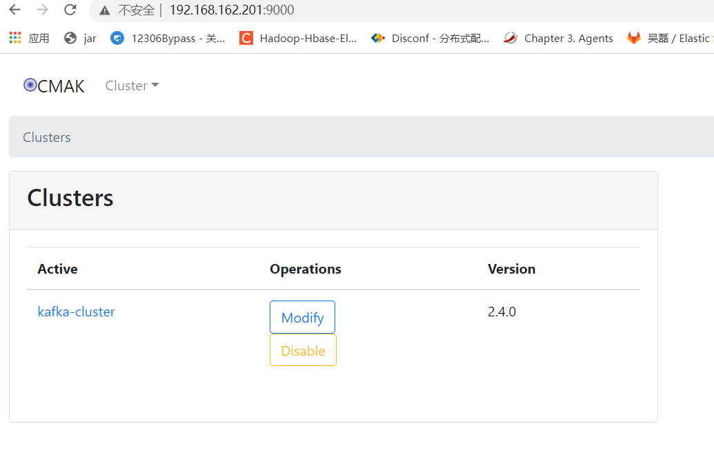

# 1.软件下载
kafka-manager 工具目前改名为cmak,下载地址为：https://github.com/yahoo/CMAK/releases/tag/3.0.0.5
现在下载最新版本的cmak文件：
[cmak-3.0.0.5.zip](https://github.com/yahoo/CMAK/releases/download/3.0.0.5/cmak-3.0.0.5.zip)
将该文件下载并放置到/opt/software目录。

此外，根据官网描述，要求jdk版本为jdk11。
jdk-11.0.13_linux-x64_bin.tar.gz
下载路径https://www.oracle.com/java/technologies/downloads/
由于之前安装kafka采用的是jdk1.8 的rpm版本，在此处由于jdk版本不一样，因此下载压缩包版本，通过环境变量指定。

# 2.软件安装
首先讲jdk解压。
```shell
sudo su - kafka
tar -zxvf /opt/software/jdk-11.0.13_linux-x64_bin.tar.gz
unzip /opt/software/cmak-3.0.0.5.zip
```
现在在kafka用户中的文件有：
```shell
[kafka@m162p201 ~]$ ll -a
total 28
drwx------   8 kafka kafka  278 Nov  4 18:38 .
drwxr-xr-x. 12 root  root   156 Nov  4 17:09 ..
lrwxrwxrwx   1 kafka kafka   27 Nov  3 14:44 apache-kafka -> /opt/kafka/kafka_2.12-3.0.0
-rw-------   1 kafka kafka 2209 Nov  4 19:11 .bash_history
-rw-r--r--   1 kafka kafka   18 Aug  8  2019 .bash_logout
-rw-r--r--   1 kafka kafka  470 Nov  4 18:26 .bash_profile
-rw-r--r--   1 kafka kafka  231 Aug  8  2019 .bashrc
drwxrwxr-x   8 kafka kafka  138 Nov  4 18:39 cmak-3.0.0.5
drwxr-xr-x   8 kafka kafka  117 Nov  3 14:58 kafka_2.12-3.0.0
lrwxrwxrwx   1 kafka kafka   32 Jun 11  2020 kafka-eagle -> /opt/kafka/kafka-eagle-web-1.4.8
drwxrwxr-x   8 kafka kafka   74 Jun 11  2020 kafka-eagle-web-1.4.8
drwxrwxr-x  27 kafka kafka 4096 Nov  4 19:43 kafka-logs
[kafka@m162p201 ~]$ 
```

现在配置jdk的环境变量：
vim .bash_profile,增加如下内容：
```shell
JAVA_HOME=/opt/jdk-11.0.13
export JAVA_HOME
```
此处cmak只需要使用java_home这个环境变量，因此无需要配置path。否则会影响kafka的java版本。
```shell
[kafka@m162p201 ~]$ source .bash_profile 
[kafka@m162p201 ~]$ echo $JAVA_HOME
/opt/jdk-11.0.13
[kafka@m162p201 ~]$ 
```
将环境变量重新加载。

现在就可以启动cmak。

# 3.启动cmak
启动cmak需要在cmak的根目录启动：
```shell
[kafka@m162p201 ~]$ cd cmak-3.0.0.5/
[kafka@m162p201 cmak-3.0.0.5]$ bin/cmak
```
这样就启动完毕。
日志输出如下：
```shell
[kafka@m162p201 cmak-3.0.0.5]$ bin/cmak
2021-11-04 19:49:14,913 - [WARN] application - application.conf @ file:/opt/kafka/cmak-3.0.0.5/conf/application.conf: 12: play.crypto.secret is deprecated, use play.http.secret.key instead
2021-11-04 19:49:15,526 - [INFO] k.m.a.KafkaManagerActor - Starting curator...
2021-11-04 19:49:15,587 - [INFO] o.a.z.ZooKeeper - Client environment:zookeeper.version=3.5.6-c11b7e26bc554b8523dc929761dd28808913f091, built on 10/08/2019 20:18 GMT
2021-11-04 19:49:15,587 - [INFO] o.a.z.ZooKeeper - Client environment:host.name=m162p201
2021-11-04 19:49:15,587 - [INFO] o.a.z.ZooKeeper - Client environment:java.version=11.0.13
2021-11-04 19:49:15,587 - [INFO] o.a.z.ZooKeeper - Client environment:java.vendor=Oracle Corporation
2021-11-04 19:49:15,587 - [INFO] o.a.z.ZooKeeper - Client environment:java.home=/opt/jdk-11.0.13
2021-11-04 19:49:15,587 - [INFO] o.a.z.ZooKeeper - Client environment:java.class.path=/opt/kafka/cmak-3.0.0.5/lib/../conf/:/opt/kafka/cmak-3.0.0.5/lib/cmak.cmak-3.0.0.5-sans-externalized.jar:/opt/kafka/cmak-3.0.0.5/lib/org.apache.commons.commons-lang3-3.6.jar:/opt/kafka/cmak-3.0.0.5/lib/javax.inject.javax.inject-1.jar:/opt/kafka/cmak-3.0.0.5/lib/io.netty.netty-common-4.1.42.Final.jar:/opt/kafka/cmak-3.0.0.5/lib/com.fasterxml.jackson.core.jackson-core-2.10.0.jar:/opt/kafka/cmak-3.0.0.5/lib/com.fasterxml.jackson.datatype.jackson-datatype-jsr310-2.8.11.jar:/opt/kafka/cmak-3.0.0.5/lib/org.scalaz.scalaz-core_2.12-7.2.27.jar:/opt/kafka/cmak-3.0.0.5/lib/com.typesafe.play.play_2.12-2.6.21.jar:/opt/kafka/cmak-3.0.0.5/lib/io.netty.netty-buffer-4.1.42.Final.jar:/opt/kafka/cmak-3.0.0.5/lib/com.yammer.metrics.metrics-core-2.2.0.jar:/opt/kafka/cmak-3.0.0.5/lib/com.fasterxml.jackson.datatype.jackson-datatype-jdk8-2.10.0.jar:/opt/kafka/cmak-3.0.0.5/lib/org.webjars.requirejs-2.3.5.jar:/opt/kafka/cmak-3.0.0.5/lib/org.apache.curator.curator-client-2.12.0.jar:/opt/kafka/cmak-3.0.0.5/lib/io.netty.netty-handler-4.1.42.Final.jar:/opt/kafka/cmak-3.0.0.5/lib/com.typesafe.play.play-functional_2.12-2.6.12.jar:/opt/kafka/cmak-3.0.0.5/lib/commons-codec.commons-codec-1.11.jar:/opt/kafka/cmak-3.0.0.5/lib/com.beachape.enumeratum-macros_2.12-1.5.9.jar:/opt/kafka/cmak-3.0.0.5/lib/javax.transaction.jta-1.1.jar:/opt/kafka/cmak-3.0.0.5/lib/org.webjars.popper.js-1.14.3.jar:/opt/kafka/cmak-3.0.0.5/lib/org.json4s.json4s-scalap_2.12-3.6.5.jar:/opt/kafka/cmak-3.0.0.5/lib/io.netty.netty-resolver-4.1.42.Final.jar:/opt/kafka/cmak-3.0.0.5/lib/com.typesafe.play.play-server_2.12-2.6.21.jar:/opt/kafka/cmak-3.0.0.5/lib/org.apache.kafka.connect-json-2.2.0.jar:/opt/kafka/cmak-3.0.0.5/lib/org.slf4j.jul-to-slf4j-1.7.25.jar:/opt/kafka/cmak-3.0.0.5/lib/org.typelevel.macro-compat_2.12-1.1.1.jar:/opt/kafka/cmak-3.0.0.5/lib/org.reactivestreams.reactive-streams-1.0.2.jar:/opt/kafka/cmak-3.0.0.5/lib/com.typesafe.play.filters-helpers_2.12-2.6.21.jar:/opt/kafka/cmak-3.0.0.5/lib/com.fasterxml.jackson.core.jackson-annotations-2.10.0.jar:/opt/kafka/cmak-3.0.0.5/lib/ch.qos.logback.logback-classic-1.2.3.jar:/opt/kafka/cmak-3.0.0.5/lib/com.typesafe.play.play-streams_2.12-2.6.21.jar:/opt/kafka/cmak-3.0.0.5/lib/org.rocksdb.rocksdbjni-5.15.10.jar:/opt/kafka/cmak-3.0.0.5/lib/org.apache.zookeeper.zookeeper-jute-3.5.6.jar:/opt/kafka/cmak-3.0.0.5/lib/org.webjars.webjars-play_2.12-2.6.3.jar:/opt/kafka/cmak-3.0.0.5/lib/javax.activation.javax.activation-api-1.2.0.jar:/opt/kafka/cmak-3.0.0.5/lib/com.google.code.findbugs.jsr305-3.0.2.jar:/opt/kafka/cmak-3.0.0.5/lib/org.slf4j.jcl-over-slf4j-1.7.25.jar:/opt/kafka/cmak-3.0.0.5/lib/joda-time.joda-time-2.9.9.jar:/opt/kafka/cmak-3.0.0.5/lib/io.netty.netty-transport-4.1.42.Final.jar:/opt/kafka/cmak-3.0.0.5/lib/com.typesafe.play.build-link-2.6.21.jar:/opt/kafka/cmak-3.0.0.5/lib/org.apache.zookeeper.zookeeper-3.5.6.jar:/opt/kafka/cmak-3.0.0.5/lib/org.apache.curator.curator-recipes-2.12.0.jar:/opt/kafka/cmak-3.0.0.5/lib/org.scala-lang.modules.scala-parser-combinators_2.12-1.1.1.jar:/opt/kafka/cmak-3.0.0.5/lib/io.netty.netty-codec-4.1.42.Final.jar:/opt/kafka/cmak-3.0.0.5/lib/org.lz4.lz4-java-1.6.0.jar:/opt/kafka/cmak-3.0.0.5/lib/org.json4s.json4s-scalaz_2.12-3.6.5.jar:/opt/kafka/cmak-3.0.0.5/lib/com.typesafe.play.play-logback_2.12-2.6.21.jar:/opt/kafka/cmak-3.0.0.5/lib/org.apache.kafka.kafka-streams-2.2.0.jar:/opt/kafka/cmak-3.0.0.5/lib/com.google.guava.guava-23.6.1-jre.jar:/opt/kafka/cmak-3.0.0.5/lib/org.scala-lang.scala-reflect-2.12.10.jar:/opt/kafka/cmak-3.0.0.5/lib/org.webjars.bootstrap-4.3.1.jar:/opt/kafka/cmak-3.0.0.5/lib/com.typesafe.akka.akka-slf4j_2.12-2.5.19.jar:/opt/kafka/cmak-3.0.0.5/lib/com.typesafe.play.play-json_2.12-2.6.12.jar:/opt/kafka/cmak-3.0.0.5/lib/com.typesafe.play.play-netty-utils-2.6.21.jar:/opt/kafka/cmak-3.0.0.5/lib/com.google.j2objc.j2objc-annotations-1.1.jar:/opt/kafka/cmak-3.0.0.5/lib/com.typesafe.akka.akka-http-core_2.12-10.0.15.jar:/opt/kafka/cmak-3.0.0.5/lib/org.webjars.json-20121008-1.jar:/opt/kafka/cmak-3.0.0.5/lib/org.json4s.json4s-ast_2.12-3.6.5.jar:/opt/kafka/cmak-3.0.0.5/lib/com.beachape.enumeratum_2.12-1.5.13.jar:/opt/kafka/cmak-3.0.0.5/lib/org.clapper.grizzled-slf4j_2.12-1.3.3.jar:/opt/kafka/cmak-3.0.0.5/lib/io.netty.netty-transport-native-unix-common-4.1.42.Final.jar:/opt/kafka/cmak-3.0.0.5/lib/org.scala-lang.modules.scala-collection-compat_2.12-2.1.2.jar:/opt/kafka/cmak-3.0.0.5/lib/com.google.errorprone.error_prone_annotations-2.1.3.jar:/opt/kafka/cmak-3.0.0.5/lib/org.webjars.dustjs-linkedin-2.7.2.jar:/opt/kafka/cmak-3.0.0.5/lib/com.fasterxml.jackson.module.jackson-module-scala_2.12-2.10.0.jar:/opt/kafka/cmak-3.0.0.5/lib/commons-cli.commons-cli-1.4.jar:/opt/kafka/cmak-3.0.0.5/lib/com.typesafe.play.play-exceptions-2.6.21.jar:/opt/kafka/cmak-3.0.0.5/lib/com.github.ben-manes.caffeine.caffeine-2.6.2.jar:/opt/kafka/cmak-3.0.0.5/lib/org.webjars.octicons-4.3.0.jar:/opt/kafka/cmak-3.0.0.5/lib/com.fasterxml.jackson.dataformat.jackson-dataformat-csv-2.10.0.jar:/opt/kafka/cmak-3.0.0.5/lib/org.webjars.underscorejs-1.9.0.jar:/opt/kafka/cmak-3.0.0.5/lib/com.adrianhurt.play-bootstrap-core_2.12-1.4-P26.jar:/opt/kafka/cmak-3.0.0.5/lib/org.codehaus.mojo.animal-sniffer-annotations-1.14.jar:/opt/kafka/cmak-3.0.0.5/lib/org.xerial.snappy.snappy-java-1.1.7.3.jar:/opt/kafka/cmak-3.0.0.5/lib/com.fasterxml.jackson.module.jackson-module-paranamer-2.10.0.jar:/opt/kafka/cmak-3.0.0.5/lib/org.checkerframework.checker-compat-qual-2.0.0.jar:/opt/kafka/cmak-3.0.0.5/lib/org.apache.kafka.connect-api-2.2.0.jar:/opt/kafka/cmak-3.0.0.5/lib/com.typesafe.akka.akka-protobuf_2.12-2.5.19.jar:/opt/kafka/cmak-3.0.0.5/lib/com.typesafe.play.twirl-api_2.12-1.3.15.jar:/opt/kafka/cmak-3.0.0.5/lib/org.apache.yetus.audience-annotations-0.5.0.jar:/opt/kafka/cmak-3.0.0.5/lib/org.slf4j.slf4j-api-1.7.28.jar:/opt/kafka/cmak-3.0.0.5/lib/com.typesafe.config-1.3.3.jar:/opt/kafka/cmak-3.0.0.5/lib/org.slf4j.log4j-over-slf4j-1.7.25.jar:/opt/kafka/cmak-3.0.0.5/lib/org.scala-lang.modules.scala-xml_2.12-1.0.6.jar:/opt/kafka/cmak-3.0.0.5/lib/org.json4s.json4s-core_2.12-3.6.5.jar:/opt/kafka/cmak-3.0.0.5/lib/org.apache.commons.commons-compress-1.9.jar:/opt/kafka/cmak-3.0.0.5/lib/com.typesafe.ssl-config-core_2.12-0.3.6.jar:/opt/kafka/cmak-3.0.0.5/lib/com.github.luben.zstd-jni-1.4.3-1.jar:/opt/kafka/cmak-3.0.0.5/lib/org.apache.curator.curator-framework-2.12.0.jar:/opt/kafka/cmak-3.0.0.5/lib/org.webjars.webjars-locator-0.32-1.jar:/opt/kafka/cmak-3.0.0.5/lib/com.typesafe.akka.akka-stream_2.12-2.5.19.jar:/opt/kafka/cmak-3.0.0.5/lib/org.scala-lang.modules.scala-java8-compat_2.12-0.9.0.jar:/opt/kafka/cmak-3.0.0.5/lib/org.apache.kafka.kafka-clients-2.4.0.jar:/opt/kafka/cmak-3.0.0.5/lib/com.thoughtworks.paranamer.paranamer-2.8.jar:/opt/kafka/cmak-3.0.0.5/lib/org.json4s.json4s-jackson_2.12-3.6.5.jar:/opt/kafka/cmak-3.0.0.5/lib/com.typesafe.akka.akka-parsing_2.12-10.0.15.jar:/opt/kafka/cmak-3.0.0.5/lib/org.apache.kafka.kafka_2.12-2.4.0.jar:/opt/kafka/cmak-3.0.0.5/lib/org.webjars.jquery-3.3.1-2.jar:/opt/kafka/cmak-3.0.0.5/lib/javax.xml.bind.jaxb-api-2.3.1.jar:/opt/kafka/cmak-3.0.0.5/lib/org.webjars.backbonejs-1.3.3.jar:/opt/kafka/cmak-3.0.0.5/lib/io.netty.netty-transport-native-epoll-4.1.42.Final.jar:/opt/kafka/cmak-3.0.0.5/lib/net.sf.jopt-simple.jopt-simple-5.0.4.jar:/opt/kafka/cmak-3.0.0.5/lib/com.typesafe.scala-logging.scala-logging_2.12-3.9.2.jar:/opt/kafka/cmak-3.0.0.5/lib/com.adrianhurt.play-bootstrap_2.12-1.4-P26-B4.jar:/opt/kafka/cmak-3.0.0.5/lib/com.typesafe.play.play-akka-http-server_2.12-2.6.21.jar:/opt/kafka/cmak-3.0.0.5/lib/com.unboundid.unboundid-ldapsdk-4.0.9.jar:/opt/kafka/cmak-3.0.0.5/lib/ch.qos.logback.logback-core-1.2.3.jar:/opt/kafka/cmak-3.0.0.5/lib/org.webjars.webjars-locator-core-0.35.jar:/opt/kafka/cmak-3.0.0.5/lib/io.jsonwebtoken.jjwt-0.7.0.jar:/opt/kafka/cmak-3.0.0.5/lib/org.scala-lang.scala-library-2.12.10.jar:/opt/kafka/cmak-3.0.0.5/lib/com.typesafe.akka.akka-actor_2.12-2.5.19.jar:/opt/kafka/cmak-3.0.0.5/lib/com.fasterxml.jackson.core.jackson-databind-2.10.0.jar:/opt/kafka/cmak-3.0.0.5/lib/cmak.cmak-3.0.0.5-assets.jar
2021-11-04 19:49:15,587 - [INFO] o.a.z.ZooKeeper - Client environment:java.library.path=/usr/java/packages/lib:/usr/lib64:/lib64:/lib:/usr/lib
2021-11-04 19:49:15,587 - [INFO] o.a.z.ZooKeeper - Client environment:java.io.tmpdir=/tmp
2021-11-04 19:49:15,587 - [INFO] o.a.z.ZooKeeper - Client environment:java.compiler=<NA>
2021-11-04 19:49:15,587 - [INFO] o.a.z.ZooKeeper - Client environment:os.name=Linux
2021-11-04 19:49:15,587 - [INFO] o.a.z.ZooKeeper - Client environment:os.arch=amd64
2021-11-04 19:49:15,587 - [INFO] o.a.z.ZooKeeper - Client environment:os.version=3.10.0-1062.4.1.el7.x86_64
2021-11-04 19:49:15,587 - [INFO] o.a.z.ZooKeeper - Client environment:user.name=kafka
2021-11-04 19:49:15,587 - [INFO] o.a.z.ZooKeeper - Client environment:user.home=/opt/kafka
2021-11-04 19:49:15,587 - [INFO] o.a.z.ZooKeeper - Client environment:user.dir=/opt/kafka/cmak-3.0.0.5
2021-11-04 19:49:15,587 - [INFO] o.a.z.ZooKeeper - Client environment:os.memory.free=140MB
2021-11-04 19:49:15,588 - [INFO] o.a.z.ZooKeeper - Client environment:os.memory.max=1996MB
2021-11-04 19:49:15,588 - [INFO] o.a.z.ZooKeeper - Client environment:os.memory.total=161MB
2021-11-04 19:49:15,591 - [INFO] o.a.z.ZooKeeper - Initiating client connection, connectString=192.168.162.201:2181,192.168.162.202:2181,192.168.162.203:2181 sessionTimeout=60000 watcher=org.apache.curator.ConnectionState@121de23a
2021-11-04 19:49:15,596 - [INFO] o.a.z.c.X509Util - Setting -D jdk.tls.rejectClientInitiatedRenegotiation=true to disable client-initiated TLS renegotiation
2021-11-04 19:49:15,629 - [INFO] o.a.z.ClientCnxnSocket - jute.maxbuffer value is 4194304 Bytes
2021-11-04 19:49:15,660 - [INFO] o.a.z.ClientCnxn - zookeeper.request.timeout value is 0. feature enabled=
2021-11-04 19:49:15,689 - [INFO] k.m.a.KafkaManagerActor - zk=192.168.162.201:2181,192.168.162.202:2181,192.168.162.203:2181
2021-11-04 19:49:15,689 - [INFO] k.m.a.KafkaManagerActor - baseZkPath=/kafka-manager
2021-11-04 19:49:15,708 - [INFO] o.a.z.ClientCnxn - Opening socket connection to server m162p202/192.168.162.202:2181. Will not attempt to authenticate using SASL (unknown error)
2021-11-04 19:49:15,737 - [INFO] o.a.z.ClientCnxn - Socket connection established, initiating session, client: /192.168.162.201:4691, server: m162p202/192.168.162.202:2181
2021-11-04 19:49:15,761 - [INFO] o.a.z.ClientCnxn - Session establishment complete on server m162p202/192.168.162.202:2181, sessionid = 0x20034327c700012, negotiated timeout = 40000
2021-11-04 19:49:15,975 - [INFO] k.m.a.KafkaManagerActor - Started actor akka://kafka-manager-system/user/kafka-manager
2021-11-04 19:49:15,975 - [INFO] k.m.a.KafkaManagerActor - Starting delete clusters path cache...
2021-11-04 19:49:15,983 - [INFO] k.m.a.DeleteClusterActor - Started actor akka://kafka-manager-system/user/kafka-manager/delete-cluster
2021-11-04 19:49:15,983 - [INFO] k.m.a.DeleteClusterActor - Starting delete clusters path cache...
2021-11-04 19:49:16,012 - [INFO] k.m.a.KafkaManagerActor - Starting kafka manager path cache...
2021-11-04 19:49:16,018 - [INFO] k.m.a.DeleteClusterActor - Adding kafka manager path cache listener...
2021-11-04 19:49:16,018 - [INFO] k.m.a.DeleteClusterActor - Scheduling updater for 10 seconds
2021-11-04 19:49:16,044 - [INFO] k.m.a.KafkaManagerActor - Adding kafka manager path cache listener...
2021-11-04 19:49:16,061 - [INFO] play.api.Play - Application started (Prod)
2021-11-04 19:49:17,085 - [INFO] k.m.a.KafkaManagerActor - Updating internal state...
2021-11-04 19:49:17,464 - [INFO] p.c.s.AkkaHttpServer - Listening for HTTP on /0.0.0.0:9000
2021-11-04 19:49:17,535 - [INFO] k.m.a.KafkaManagerActor - Adding new cluster manager for cluster : kafka-cluster
2021-11-04 19:49:17,545 - [INFO] k.m.a.c.ClusterManagerActor - Starting curator...
2021-11-04 19:49:17,545 - [INFO] o.a.z.ZooKeeper - Initiating client connection, connectString=192.168.162.201:2181,192.168.162.202:2181,192.168.162.203:2181 sessionTimeout=60000 watcher=org.apache.curator.ConnectionState@197e2733
2021-11-04 19:49:17,546 - [INFO] o.a.z.ClientCnxnSocket - jute.maxbuffer value is 4194304 Bytes
2021-11-04 19:49:17,546 - [INFO] o.a.z.ClientCnxn - zookeeper.request.timeout value is 0. feature enabled=
2021-11-04 19:49:17,551 - [INFO] k.m.a.c.ClusterManagerActor - Starting shared curator...
2021-11-04 19:49:17,552 - [INFO] o.a.z.ZooKeeper - Initiating client connection, connectString=192.168.162.201:2181,192.168.162.202:2181,192.168.162.203:2181 sessionTimeout=60000 watcher=org.apache.curator.ConnectionState@84394dc
2021-11-04 19:49:17,552 - [INFO] o.a.z.ClientCnxnSocket - jute.maxbuffer value is 4194304 Bytes
2021-11-04 19:49:17,552 - [INFO] o.a.z.ClientCnxn - zookeeper.request.timeout value is 0. feature enabled=
2021-11-04 19:49:17,556 - [INFO] o.a.z.ClientCnxn - Opening socket connection to server m162p201/192.168.162.201:2181. Will not attempt to authenticate using SASL (unknown error)
2021-11-04 19:49:17,556 - [INFO] o.a.z.ClientCnxn - Socket connection established, initiating session, client: /192.168.162.201:53463, server: m162p201/192.168.162.201:2181
2021-11-04 19:49:17,558 - [INFO] o.a.z.ClientCnxn - Opening socket connection to server m162p203/192.168.162.203:2181. Will not attempt to authenticate using SASL (unknown error)
2021-11-04 19:49:17,560 - [INFO] o.a.z.ClientCnxn - Socket connection established, initiating session, client: /192.168.162.201:46013, server: m162p203/192.168.162.203:2181
2021-11-04 19:49:17,579 - [INFO] o.a.z.ClientCnxn - Session establishment complete on server m162p201/192.168.162.201:2181, sessionid = 0x10034333f05001a, negotiated timeout = 40000
2021-11-04 19:49:17,603 - [INFO] o.a.z.ClientCnxn - Session establishment complete on server m162p203/192.168.162.203:2181, sessionid = 0x3003435624b0012, negotiated timeout = 40000
2021-11-04 19:49:17,711 - [INFO] k.m.a.c.BrokerViewCacheActor - Started actor akka://kafka-manager-system/user/kafka-manager/kafka-cluster/broker-view
2021-11-04 19:49:17,711 - [INFO] k.m.a.c.BrokerViewCacheActor - Scheduling updater for 30 seconds
2021-11-04 19:49:17,712 - [INFO] k.m.a.c.KafkaCommandActor - Started actor akka://kafka-manager-system/user/kafka-manager/kafka-cluster/kafka-command
2021-11-04 19:49:17,712 - [INFO] k.m.a.c.BrokerViewCacheActor - Updating broker view...
2021-11-04 19:49:17,712 - [INFO] k.m.a.c.ClusterManagerActor - Started actor akka://kafka-manager-system/user/kafka-manager/kafka-cluster
2021-11-04 19:49:17,713 - [INFO] k.m.a.c.ClusterManagerActor - Starting cluster manager topics path cache...
2021-11-04 19:49:17,727 - [INFO] k.m.a.c.KafkaAdminClientActor - KafkaAdminClientActorConfig(ClusterContext(ClusterFeatures(Set(KMDeleteTopicFeature)),ClusterConfig(kafka-cluster,CuratorConfig(192.168.162.201:2181,192.168.162.202:2181,192.168.162.203:2181,10,100,1000),true,2.4.0,false,None,None,false,false,false,false,false,false,Some(ClusterTuning(Some(30),Some(2),Some(100),Some(2),Some(100),Some(2),Some(100),Some(30),Some(5),Some(2),Some(1000),Some(2),Some(1000),Some(2),Some(1000),Some(30000),Some(1000000),Some(7))),PLAINTEXT,None,None)),LongRunningPoolConfig(2,1000),akka://kafka-manager-system/user/kafka-manager/kafka-cluster/kafka-state,None)
2021-11-04 19:49:17,727 - [INFO] k.m.a.c.KafkaStateActor - KafkaStateActorConfig(org.apache.curator.framework.imps.CuratorFrameworkImpl@33aec9bf,pinned-dispatcher,ClusterContext(ClusterFeatures(Set(KMDeleteTopicFeature)),ClusterConfig(kafka-cluster,CuratorConfig(192.168.162.201:2181,192.168.162.202:2181,192.168.162.203:2181,10,100,1000),true,2.4.0,false,None,None,false,false,false,false,false,false,Some(ClusterTuning(Some(30),Some(2),Some(100),Some(2),Some(100),Some(2),Some(100),Some(30),Some(5),Some(2),Some(1000),Some(2),Some(1000),Some(2),Some(1000),Some(30000),Some(1000000),Some(7))),PLAINTEXT,None,None)),LongRunningPoolConfig(2,1000),LongRunningPoolConfig(2,1000),5,10000,None,KafkaManagedOffsetCacheConfig(30000,1000000,7))
2021-11-04 19:49:17,728 - [INFO] k.m.a.c.KafkaStateActor - Started actor akka://kafka-manager-system/user/kafka-manager/kafka-cluster/kafka-state
2021-11-04 19:49:17,728 - [INFO] k.m.a.c.KafkaStateActor - Starting topics tree cache...
2021-11-04 19:49:17,730 - [INFO] k.m.a.c.KafkaStateActor - Starting topics config path cache...
2021-11-04 19:49:17,831 - [INFO] k.m.a.c.KafkaStateActor - Starting brokers path cache...
2021-11-04 19:49:17,847 - [INFO] k.m.a.c.KafkaStateActor - Starting admin path cache...
2021-11-04 19:49:17,855 - [INFO] k.m.a.c.KafkaStateActor - Starting delete topics path cache...
2021-11-04 19:49:17,860 - [INFO] k.m.a.c.KafkaStateActor - Adding topics tree cache listener...
2021-11-04 19:49:17,861 - [INFO] k.m.a.c.KafkaStateActor - Adding admin path cache listener...
2021-11-04 19:49:17,861 - [INFO] k.m.a.c.KafkaStateActor - Starting offset cache...
2021-11-04 19:49:17,870 - [INFO] k.m.a.c.OffsetCachePassive - Starting kafka managed offset cache ...
2021-11-04 19:49:18,211 - [INFO] k.m.a.c.OffsetCachePassive - Starting consumers path children cache...
```
这样就启动成功了。
如果需要在后台运行，可以使用nohup。
```shell
nohup bin/cmak &
```
默认端口为9000，如果需要修改，或者修改配置文件的位置，可以通过如下明命令：
```shell
bin/cmak -Dconfig.file=/path/to/application.conf -Dhttp.port=8080
```

# 4.使用cmak
通过http://192.168.162.201:9000/ 可以访问cmak。
登陆后如下：

通过addcluster可以来增加一个cluster.

cmak summary如下：

cmak topic如下：

