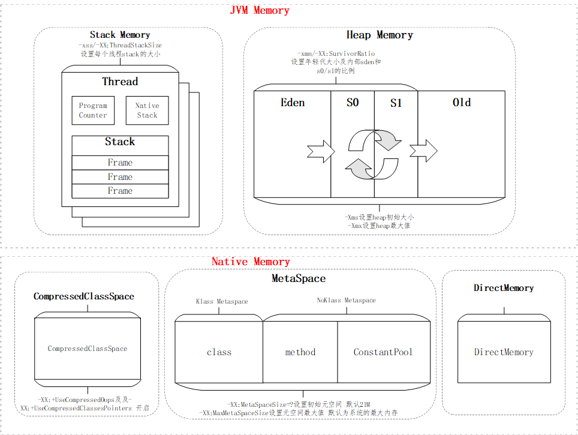
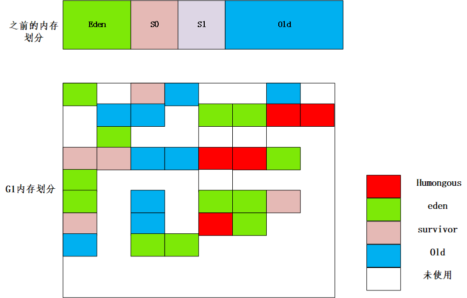

JVM是基于栈的虚拟机。
# 1. 字节码
由单字节构成的字节码，最多支持256个，实际上只使用了200左右。主要有：
- 栈操作指令 
- 程序流程控制指令
- 对象操作指令
- 算术运算及类型转换指令

每个线程都有自己的线程stack,用于存储栈帧（Frame）。

# 2.类加载器
类的生命周期：加载->验证->准备->解析->初始化->使用->卸载。
加载器：启动加载器、扩展加载器、应用加载器。特点是双亲委派、负责依赖、缓存加载。

# 3.内存结构
每一个进程的内存，都分为堆、栈、非堆以及jvm自身的内存。jdk1.8的内存结构以及jvm的启动参数如下图：

# 4.jvm工具
命令行：jps/jinfo  jstat  jmap  jstack  jcmd  jrunscript/jjs 
图形化：jconsole  jvisualvm visualGC jmc 

# 5.GC 
GC原理： 
- 引用计数法：简单粗暴，容易产生循环依赖，形成环
- 标记清除法：采用可达性分析法，遍历所有可达对象，进行分类和清除。分为标记和清除两个阶段。
- 标记复制
- 标记-清除-复制

串行GC/并行GC
CMS : 初始标记、并发标记、并发预清除、最终标记、 并发清除、并发重置

/ G1 GC
年轻代模式转移暂停 -> 并发标记 （Initial Mark ->Root Region Scan->Concurrent Mark -> Remark->Cleanup）->转移暂停: 混合模式 
G1GC堆内存的划分如下图：

JVM各种GC的搭配关系：

GC的总结：

[java8  各种GC的总结](../week2/java8%20%20各种GC的总结.md)