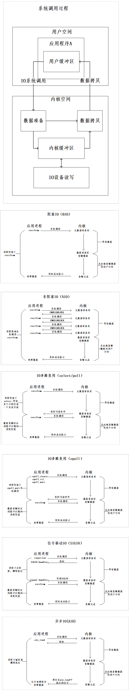

# 1.五种IO模型:

1. BIO ：应用程序发起IO调用之后，至内核执行IO操作返回结果之前，发起系统调用的线程一直处于等待状态，则称为阻塞IO,即BIO。
2. NIO : 用户进程在发起系统调用时，指定为非阻塞，内核收到请求之后，就会立即返回，然后用户进行通过轮询来拉取结果。这成为非阻塞IO,即NIO。NIO的本质是频繁轮询导致无效的系统调用。
3. IO多路复用：
- select/poll : 内核提供系统调用，支持一次查询多个系统调用的可用状态，当任意一个结果可用时就会返回。然后用户线程再收到可用返回之后再次进行系统调用读取数据。这样可以将NIO中的多次轮询调用借助Select的一次调用即可。select存在连接数限制。poll很好的解决了连接限制问题。
select虽然减少了用户进程的系统调用，但是内核的工作量并没有减少，内核需要进行大量的数据拷贝，另外内核必须循环遍历IO的状态。selet/poll的问题的本质在于，内核存在无效的循环遍历。
- epoll: epoll对比select/poll,多了两次系统调用，epoll_create建立与内核的连接，epoll_ctl注册事件，epoll_wait阻塞用户进程等待IO。epoll是利用事件机制来进行。epoll再数据的准备阶段还是会被阻塞。

|对比|select|poll|epoll|
|:----|:----|:----|:----|
|操作方式|遍历|遍历|回掉|
|底层实现|数组|链表|哈希表|
|IO效率|每次都进行线型遍历，时间复杂度O(n)|每次都进行线型遍历，时间复杂度O(n)|事件通知，当fd就绪，注册的回掉函数就会被调用，将就绪的fd放入到rdlist，时间复杂度O(1)|
|最大连接数|1024(x86)/2048(x64)|无上限|无上限|
|fd拷贝|每次select都需要把fd集合从用户态拷贝到内核态|每次poll都需要把fd集合从用户态拷贝到内核态|调用epoll_ct的时候拷贝到内核保存，之后epoll_wait不拷贝|

4.信号驱动IO(SIGIO):当用户进程需要等待数据的时候，会向内核发送一个信号，告诉内核我要什么数据，然后用户进程就继续做别的事情，当内核中的数据准备好之后，内核立马发给用户进程一个信号，用户进程收到信号之后，立马调用recvfrom，去查收数据。
在IO执行的第二阶段，也就是将数据从内核空间复制到用户空间这个阶段，用户进程还是会被阻塞。

5.异步IO(AIO):异步IO真正实现了IO全流程的非阻塞。用户进程发出系统调用后立即返回，内核等待数据准备完成，然后将数据拷贝到用户进程缓冲区，然后发送信号告诉用户进程IO操作执行完毕（与SIGIO相比，一个是发送信号告诉用户进程数据准备完毕，一个是IO执行完毕）。

系统调用与5种IO模型：

# 2.netty NIO
## 2.1 概述
netty：
- 是一个高性能、异步事件驱动的NIO框架，它提供了对TCP、UDP和文件传输的支持。
- 采用多种decoder/encoder 支持，对TCP粘包/分包进行自动化处理。
- 对epoll空轮询引起的cpu占用飙升在内部进行了处理，避免了直接使用NIO的陷阱，简化了NIO的处理方式。
- 可配置IO线程数、TCP参数， TCP接收和发送缓冲区使用直接内存代替堆内存，通过内存池的方式循环利用ByteBuf
- 通过引用计数器及时申请释放不再引用的对象，降低了GC频率
- 使用单线程串行化的方式，高效的Reactor线程模型
- 大量使用了volitale、使用了CAS和原子类、线程安全类的使用、读写锁的使用

## 2.2 netty线程模型
Netty通过Reactor模型基于多路复用器接收并处理用户请求，内部实现了两个线程池，boss线程池和work线程池，其中boss线程池的线程负责处理请求的accept事件，当接收到accept事件的请求时，把对应的socket封装到一个NioSocketChannel中，并交给work线程池，其中work线程池负责请求的read和write事件，由对应的Handler处理。

|模型|代码|
|:----|:----|
|Reactor 单线程模型|EventLoopGroup eventGroup = new EventLoopGroup(1);  ServerBootStrap serverBootStrap = new ServerBootStrap(); serverBootStrap.group(eventGroup);|
|Reactor 多线程模型|EventLoopGroup eventGroup = new EventLoopGroup();  ServerBootStrap serverBootStrap = new ServerBootStrap(); serverBootStrap.group(eventGroup);|
|Reactor 主从模型|EventLoopGroup workerGroup = new EventLoopGroup();  EventLoopGroup bossGroup = new EventLoopGroup();  ServerBootStrap bossGroup = new ServerBootStrap(); serverBootStrap.group(bossGroup,workerGroup);|

## 2.3 TCP 粘包/拆包
TCP是以流的方式来处理数据，一个完整的包可能会被TCP拆分成多个包进行发送，也可能把小的封装成一个大的数据包发送.
### 2.3.1 产生的原因：
- 应用程序写入的字节大小大于套接字发送缓冲区的大小，会发生拆包现象，而应用程序写入数据小于套接字缓冲区大小，网卡将应用多次写入的数据发送到网络上，这将会发生粘包现象；
- 行MSS大小的TCP分段，当TCP报文长度-TCP头部长度>最大报文段长度MSS的时候将发生拆包
- 以太网帧的payload（净荷）大于最大传输单元MTU（1500字节）进行ip分片

### 2.3.2 解决方案：
- 消息定长；例如：每个报文的大小固定为200个字节，如果不够，空位补空格；对应Netty中的定长类 ：FixedLengthFrameDecoder
- 在包尾都增加特殊字符进行分割；例如：加回车、加换行、FTP协议等；对应Netty中的类：1）自定义分隔符类 ：DelimiterBasedFrameDecoder   2）行分隔符类：LineBasedFrameDecoder
- 将消息分为消息头和消息体；例：在消息头中包含表示消息总长度的字段，然后进行业务逻辑的处理。对应Netty中的基于消息头指定消息长度类：LengthFieldBasedFrameDecoder
- 采用更复杂的应用层协议；

## 2.4 zero-copy
- Netty的接收和发送ByteBuffer采用Direct Buffer，使用堆外直接内存进行Socket读写，不需要进行字节缓冲区的二次拷贝。JVM会将堆内存Buffer拷贝一份到直接内存中，然后才写入Socket中。ByteBuffer由ChannelConfig分配，而ChannelConfig创建ByteBufAllocator默认使用Direct Buffer。
- CompositeByteBuf 类可以将多个 ByteBuf 合并为一个逻辑上的 ByteBuf, 避免了传统通过内存拷贝的方式将几个小Buffer合并成一个大的Buffer。
- 通过 FileRegion 包装的FileChannel.tranferTo方法 实现文件传输, 可以直接将文件缓冲区的数据发送到目标 Channel，避免了传统通过循环write方式导致的内存拷贝问题。
- 通过 wrap方法, 我们可以将 byte[] 数组、ByteBuf、ByteBuffer等包装成一个 Netty ByteBuf 对象, 进而避免了拷贝操作。
- 要注意Selecter的空轮询操作。Netty的解决办法：对Selector的select操作周期进行统计，每完成一次空的select操作进行一次计数，若在某个周期内连续发生N次空轮询，则触发了epoll死循环bug。重建Selector，判断是否是其他线程发起的重建请求，若不是则将原SocketChannel从旧的Selector上去除注册，重新注册到新的Selector上，并将原来的Selector关闭

