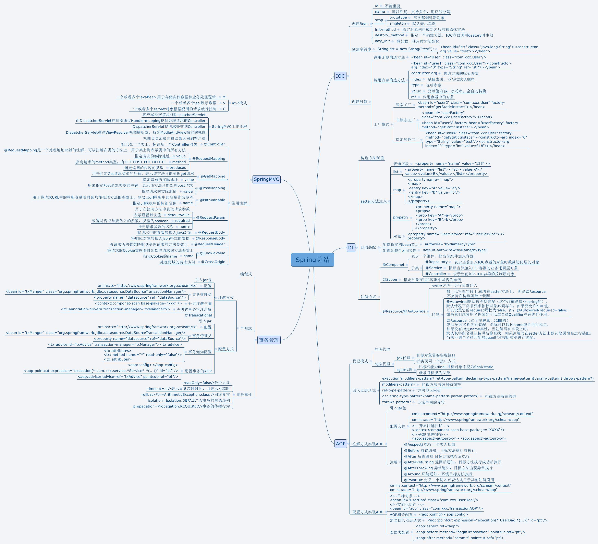

对Spring的总结：

Spring是一个轻量级的框架，两大核心思想IOC和AOP。
- IOC（控制反转）:就是将对象的创建权交给容器。在项目中，我们一开始是自己通过实体类new一个对象，有了Spring以后，Spring容器会自动帮我们创建对象，不需要我们自己去new一个对象，我们在使用的时候只需要注入对象就行了。
好处是可以很好的降低类于类之间的耦合性。
- AOP（面向切面编程）:在开发过程中，将非核心代码从部分整合的业务中抽取出来独立开发的模式，就是面向切面编程。AOP的底层实现原理：JDK的动态代理+Cglib的动态代理。

xmaind原件：

Mybatis：
MyBatis 本是apache的一个开源项目iBatis, 2010年这个项目由apache software foundation 迁移到了google code，并且改名为MyBatis 。2013年11月迁移到Github。
- MyBatis 是一款优秀的持久层框架，它支持定制化 SQL、存储过程以及高级映射。
- MyBatis 避免了几乎所有的 JDBC 代码和手动设置参数以及获取结果集。
- MyBatis 可以使用简单的 XML 或注解来配置和映射原生信息，将接口和 Java的POJOs(Plain Ordinary Java Object,普通的 Java对象)映射成数据库中的记录
- MyBatis 是支持普通 SQL查询，存储过程和高级映射的优秀持久层框架。
- MyBatis 消除了几乎所有的JDBC代码和参数的手工设置以及结果集的检索。
- MyBatis 使用简单的 XML或注解用于配置和原始映射，将接口和 Java 的POJOs（Plain Ordinary Java Objects，普通的 Java对象）映射成数据库中的记录

mybatis优点：
- 便于维护管理，不用在java代码中写语句
- 用标签代替编写逻辑代码
- 保证名称相同，配置好映射关系即可自动映射或者不配置映射关系，通过配置列名=字段名也可以完成自动映射
- 接近JDBC,比较灵活
- 简单易学
- 提供XML标签，支持编写动态SQL

缺点：
- mybatis 为半自动化，需要自己书写sql语句，需要自己定义映射
- 移值性不好
- JDBC方式可以用打断点的方式调试，但是Mybatis不能，需要通过Log4j日志信息帮助调试，然后在配置文件中修改
- 拼接复杂SQL语句时，没有代码灵活，拼写比较复杂
- 对开发人员所写的SQL依赖很强
- 对SQL语句依赖程度很高

https://www.cnblogs.com/wlsblog/p/7354825.html
