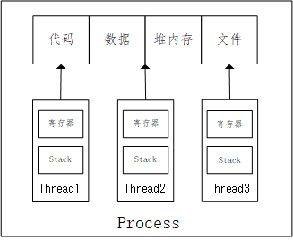
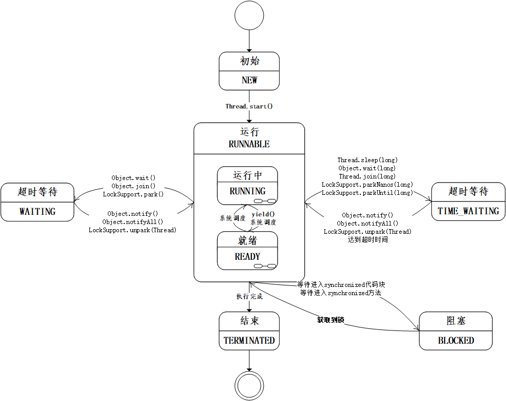
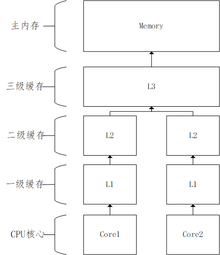
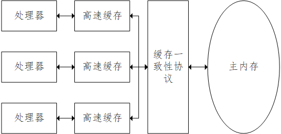
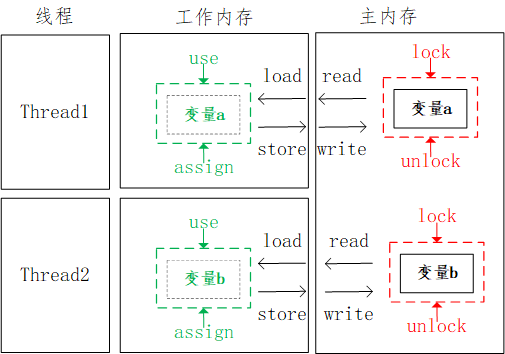
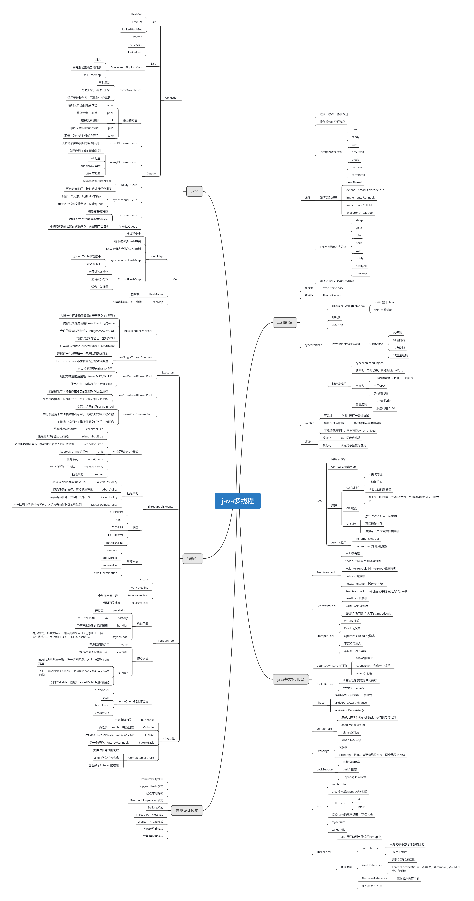

# 1. 关键概念
## 1.1 进程与线程
进程（Process）是计算机中的程序关于某数据集合上的一次运行活动，是系统进行资源分配和调度的基本单位，是操作系统结构的基础。
线程：最开始的操作系统，只有进程的概念，并没有线程。但是随着计算机的发展，对CPU的要求越来越高，多进程模式进行同步的开销非常大，进程间切换是很消耗资源的。因此，就发明了线程，在进程内部，在抽象得更加细化的线程概念，一个进程可以有多个线程。这样一来，同一个进程的线程之间，除了栈是私有的之外，堆区的内存就能共享。

## 1.2 java线程模型

## 1.3 可见性、原子性、有序性
可见性：一个线程对共享变量的修改，另外一个线程能够立刻看到
原子性：一个或者多个操作在 CPU 执行的过程中不被中断的特性
有序性：程序按照代码的先后顺序执行

# 2. java内存模型
## 2.1 CPU与主内存之间存在多级缓存架构
CPU与主内存之间存在多级缓存架构：

## 2.2  java内存模型

## 2.3 缓存一致性协议

# 3.java多线程及并发工具和涉及模式总结

xmaind原件：
