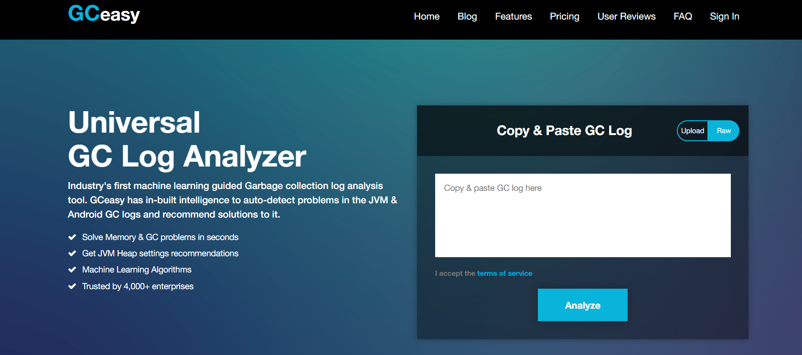

# 1.GC测试类

一段测试GC的代码：
```
package com.dhb.geektimestudy.kimmking.week2;

import java.util.Random;
import java.util.concurrent.TimeUnit;
import java.util.concurrent.atomic.LongAdder;

public class GcLogAnalysis {
	
	private static Random random = new Random();

	public static void main(String[] args) {
		//开始时间戳
		long startMillis = System.currentTimeMillis();
		//持续运行毫秒数
		long timeoutMillis = TimeUnit.SECONDS.toMillis(1);
		//结束时间戳
		long endMillis = startMillis + timeoutMillis;
		LongAdder counter = new LongAdder();
		System.out.println("正在执行... ...");
		//缓存一部分对象进入old区
		int cacheSize = 2000;
		Object[] cachedGarbags = new Object[cacheSize];
		//再指定时间范围内，持续循环
		while (System.currentTimeMillis() < endMillis) {
			//生成垃圾对象
			Object garbage = generateGarbage(100*1024);
			counter.increment();
			int randomIndex = random.nextInt(2*cacheSize);
			if(randomIndex < cacheSize) {
				cachedGarbags[randomIndex] = garbage;
			}
			
		}
		System.out.println("执行结束，共生成对象次数："+counter.intValue());
	}
	
	//生成对象的方法
	private static Object generateGarbage(int max) {
		int randomSize = random.nextInt(max);
		int type = randomSize % 4;
		Object result = null;
		switch (type) {
			case 0: 
				result = new int[randomSize];
				break;
			case 1:
				result  = new byte[randomSize];
				break;
			case 2:
				result = new double[randomSize];
				break;
			default:
				StringBuilder builder = new StringBuilder();
				String randomString = "randomString-Anything";
				while (builder.length() < randomSize) {
					builder.append(randomString);
					builder.append(max);
					builder.append(randomSize);
				}
				result = builder.toString();
				break;
		}
		return result;
	}
}
```

# 2.GC日志解析(默认并行GC Parallel)
## 2.1 1G heap内存的GC日志分析
在idea中修改jvmoptions执行，参数如下：
```
-XX:+PrintGCDetails -Xmx1g -Xms1g -XX:+PrintGCDateStamps -Xloggc:E:/GcLogAnalysis-%t.log
```
-XX:+PrintGCDetails  开启GC日志。
XX:+PrintGCDateStamps 增加GC日志的时间戳。
-Xloggc:E:/GcLogAnalysis-%t.log 将GC日志写入到文件系统。

## 2.1.1 GC日志
执行上述代码:
产生的日志文件：GcLogAnalysis-2021-08-09_14-59-02.log，其内容如下：
```
Java HotSpot(TM) 64-Bit Server VM (25.231-b11) for windows-amd64 JRE (1.8.0_231-b11), built on Oct  5 2019 03:11:30 by "java_re" with MS VC++ 10.0 (VS2010)
Memory: 4k page, physical 16618764k(8472788k free), swap 29201676k(17565296k free)
CommandLine flags: -XX:InitialHeapSize=1073741824 -XX:MaxHeapSize=1073741824 -XX:+PrintGC -XX:+PrintGCDateStamps -XX:+PrintGCDetails -XX:+PrintGCTimeStamps -XX:+UseCompressedClassPointers -XX:+UseCompressedOops -XX:-UseLargePagesIndividualAllocation -XX:+UseParallelGC 
2021-08-09T14:59:04.491+0800: 1.694: [GC (Allocation Failure) [PSYoungGen: 262144K->43514K(305664K)] 262144K->79120K(1005056K), 0.0157301 secs] [Times: user=0.00 sys=0.13, real=0.02 secs] 
2021-08-09T14:59:04.533+0800: 1.737: [GC (Allocation Failure) [PSYoungGen: 305658K->43509K(305664K)] 341264K->159975K(1005056K), 0.0242496 secs] [Times: user=0.05 sys=0.09, real=0.03 secs] 
2021-08-09T14:59:04.581+0800: 1.784: [GC (Allocation Failure) [PSYoungGen: 305653K->43515K(305664K)] 422119K->232140K(1005056K), 0.0187204 secs] [Times: user=0.02 sys=0.11, real=0.02 secs] 
2021-08-09T14:59:04.623+0800: 1.827: [GC (Allocation Failure) [PSYoungGen: 305659K->43514K(305664K)] 494284K->300955K(1005056K), 0.0184752 secs] [Times: user=0.01 sys=0.11, real=0.02 secs] 
2021-08-09T14:59:04.667+0800: 1.871: [GC (Allocation Failure) [PSYoungGen: 305658K->43516K(305664K)] 563099K->368215K(1005056K), 0.0182989 secs] [Times: user=0.03 sys=0.09, real=0.02 secs] 
2021-08-09T14:59:04.710+0800: 1.914: [GC (Allocation Failure) [PSYoungGen: 305660K->43515K(160256K)] 630359K->438620K(859648K), 0.0186628 secs] [Times: user=0.11 sys=0.00, real=0.02 secs] 
2021-08-09T14:59:04.741+0800: 1.945: [GC (Allocation Failure) [PSYoungGen: 159919K->65835K(232960K)] 555025K->469133K(932352K), 0.0083550 secs] [Times: user=0.13 sys=0.00, real=0.01 secs] 
2021-08-09T14:59:04.761+0800: 1.965: [GC (Allocation Failure) [PSYoungGen: 182284K->86604K(232960K)] 585582K->500388K(932352K), 0.0106214 secs] [Times: user=0.00 sys=0.00, real=0.01 secs] 
2021-08-09T14:59:04.783+0800: 1.987: [GC (Allocation Failure) [PSYoungGen: 203340K->95796K(232960K)] 617124K->527711K(932352K), 0.0124062 secs] [Times: user=0.13 sys=0.00, real=0.01 secs] 
2021-08-09T14:59:04.806+0800: 2.010: [GC (Allocation Failure) [PSYoungGen: 212532K->72008K(232960K)] 644447K->557449K(932352K), 0.0140152 secs] [Times: user=0.13 sys=0.00, real=0.01 secs] 
2021-08-09T14:59:04.831+0800: 2.035: [GC (Allocation Failure) [PSYoungGen: 188744K->42230K(232960K)] 674185K->593911K(932352K), 0.0142255 secs] [Times: user=0.08 sys=0.05, real=0.01 secs] 
2021-08-09T14:59:04.857+0800: 2.061: [GC (Allocation Failure) [PSYoungGen: 158966K->44293K(232960K)] 710647K->634694K(932352K), 0.0094679 secs] [Times: user=0.00 sys=0.00, real=0.01 secs] 
2021-08-09T14:59:04.878+0800: 2.082: [GC (Allocation Failure) [PSYoungGen: 161029K->42865K(232960K)] 751430K->673703K(932352K), 0.0100560 secs] [Times: user=0.00 sys=0.13, real=0.01 secs] 
2021-08-09T14:59:04.888+0800: 2.092: [Full GC (Ergonomics) [PSYoungGen: 42865K->0K(232960K)] [ParOldGen: 630838K->342906K(699392K)] 673703K->342906K(932352K), [Metaspace: 2711K->2711K(1056768K)], 0.0420431 secs] [Times: user=0.25 sys=0.00, real=0.04 secs] 
2021-08-09T14:59:04.942+0800: 2.146: [GC (Allocation Failure) [PSYoungGen: 116736K->39296K(232960K)] 459642K->382202K(932352K), 0.0044831 secs] [Times: user=0.00 sys=0.00, real=0.00 secs] 
2021-08-09T14:59:04.958+0800: 2.162: [GC (Allocation Failure) [PSYoungGen: 155811K->38884K(232960K)] 498717K->416626K(932352K), 0.0079067 secs] [Times: user=0.13 sys=0.00, real=0.01 secs] 
2021-08-09T14:59:04.978+0800: 2.181: [GC (Allocation Failure) [PSYoungGen: 155620K->43921K(232960K)] 533362K->454816K(932352K), 0.0081473 secs] [Times: user=0.13 sys=0.00, real=0.01 secs] 
2021-08-09T14:59:04.999+0800: 2.202: [GC (Allocation Failure) [PSYoungGen: 160657K->40933K(232960K)] 571552K->489911K(932352K), 0.0099732 secs] [Times: user=0.00 sys=0.00, real=0.01 secs] 
2021-08-09T14:59:05.021+0800: 2.224: [GC (Allocation Failure) [PSYoungGen: 157597K->42758K(232960K)] 606574K->528345K(932352K), 0.0089261 secs] [Times: user=0.13 sys=0.00, real=0.01 secs] 
2021-08-09T14:59:05.041+0800: 2.244: [GC (Allocation Failure) [PSYoungGen: 159494K->33112K(232960K)] 645081K->558475K(932352K), 0.0080378 secs] [Times: user=0.11 sys=0.00, real=0.01 secs] 
2021-08-09T14:59:05.063+0800: 2.266: [GC (Allocation Failure) [PSYoungGen: 149848K->36446K(232960K)] 675211K->592485K(932352K), 0.0073541 secs] [Times: user=0.00 sys=0.00, real=0.01 secs] 
2021-08-09T14:59:05.082+0800: 2.286: [GC (Allocation Failure) [PSYoungGen: 152862K->39210K(232960K)] 708901K->628967K(932352K), 0.0079612 secs] [Times: user=0.13 sys=0.00, real=0.01 secs] 
2021-08-09T14:59:05.102+0800: 2.305: [GC (Allocation Failure) [PSYoungGen: 155946K->37063K(232960K)] 745703K->661371K(932352K), 0.0078044 secs] [Times: user=0.13 sys=0.00, real=0.01 secs] 
2021-08-09T14:59:05.121+0800: 2.324: [GC (Allocation Failure) [PSYoungGen: 153282K->34101K(232960K)] 777590K->693188K(932352K), 0.0081889 secs] [Times: user=0.00 sys=0.00, real=0.01 secs] 
2021-08-09T14:59:05.129+0800: 2.332: [Full GC (Ergonomics) [PSYoungGen: 34101K->0K(232960K)] [ParOldGen: 659086K->366332K(699392K)] 693188K->366332K(932352K), [Metaspace: 2711K->2711K(1056768K)], 0.0401385 secs] [Times: user=0.38 sys=0.00, real=0.04 secs] 
2021-08-09T14:59:05.182+0800: 2.386: [GC (Allocation Failure) [PSYoungGen: 116367K->37687K(232960K)] 482700K->404020K(932352K), 0.0044929 secs] [Times: user=0.13 sys=0.00, real=0.00 secs] 
2021-08-09T14:59:05.197+0800: 2.401: [GC (Allocation Failure) [PSYoungGen: 154397K->45122K(232960K)] 520730K->446757K(932352K), 0.0083889 secs] [Times: user=0.13 sys=0.00, real=0.01 secs] 
2021-08-09T14:59:05.217+0800: 2.421: [GC (Allocation Failure) [PSYoungGen: 161786K->36855K(238592K)] 563421K->479452K(937984K), 0.0081303 secs] [Times: user=0.00 sys=0.00, real=0.01 secs] 
2021-08-09T14:59:05.236+0800: 2.440: [GC (Allocation Failure) [PSYoungGen: 161271K->45812K(235008K)] 603868K->521886K(934400K), 0.0083750 secs] [Times: user=0.13 sys=0.00, real=0.01 secs] 
2021-08-09T14:59:05.256+0800: 2.460: [GC (Allocation Failure) [PSYoungGen: 169681K->41479K(248320K)] 645756K->557243K(947712K), 0.0084891 secs] [Times: user=0.13 sys=0.00, real=0.01 secs] 
2021-08-09T14:59:05.279+0800: 2.482: [GC (Allocation Failure) [PSYoungGen: 184805K->51015K(244224K)] 700568K->604282K(943616K), 0.0091764 secs] [Times: user=0.00 sys=0.00, real=0.01 secs] 
2021-08-09T14:59:05.303+0800: 2.506: [GC (Allocation Failure) [PSYoungGen: 194338K->42159K(256000K)] 747605K->638740K(955392K), 0.0090443 secs] [Times: user=0.13 sys=0.00, real=0.01 secs] 
2021-08-09T14:59:05.330+0800: 2.534: [GC (Allocation Failure) [PSYoungGen: 201391K->52598K(252416K)] 797972K->684429K(951808K), 0.0107304 secs] [Times: user=0.11 sys=0.00, real=0.01 secs] 
2021-08-09T14:59:05.357+0800: 2.561: [GC (Allocation Failure) [PSYoungGen: 211830K->52455K(261632K)] 843661K->729012K(961024K), 0.0113308 secs] [Times: user=0.00 sys=0.00, real=0.01 secs] 
2021-08-09T14:59:05.368+0800: 2.572: [Full GC (Ergonomics) [PSYoungGen: 52455K->0K(261632K)] [ParOldGen: 676557K->382026K(699392K)] 729012K->382026K(961024K), [Metaspace: 2711K->2711K(1056768K)], 0.0430214 secs] [Times: user=0.25 sys=0.00, real=0.04 secs] 
Heap
 PSYoungGen      total 261632K, used 6964K [0x00000000eab00000, 0x0000000100000000, 0x0000000100000000)
  eden space 171520K, 4% used [0x00000000eab00000,0x00000000eb1cd208,0x00000000f5280000)
  from space 90112K, 0% used [0x00000000fa800000,0x00000000fa800000,0x0000000100000000)
  to   space 87552K, 0% used [0x00000000f5280000,0x00000000f5280000,0x00000000fa800000)
 ParOldGen       total 699392K, used 382026K [0x00000000c0000000, 0x00000000eab00000, 0x00000000eab00000)
  object space 699392K, 54% used [0x00000000c0000000,0x00000000d7512ae0,0x00000000eab00000)
 Metaspace       used 2718K, capacity 4486K, committed 4864K, reserved 1056768K
  class space    used 291K, capacity 386K, committed 512K, reserved 1048576K
```

## 2.1.2 YGC日志解析
现在对YGC日志的详细内容进行分析：
```
2021-08-09T14:59:04.491+0800: 1.694: [GC (Allocation Failure) [PSYoungGen: 262144K->43514K(305664K)] 262144K->79120K(1005056K), 0.0157301 secs] [Times: user=0.00 sys=0.13, real=0.02 secs] 
```
日志解析见下表。
| 日志                                      | 说明                                                                              |
|:------------------------------------------|:---------------------------------------------------------------------------------|
| 2021-08-09T14:59:04.491+0800:             | 系统时间戳                                                                         |
| 1.694:                                    | JVM时间戳，指jvm启动以来的时间                                                      |
| [GC (Allocation Failure)                  | （GC出现原因                                                                       |
| PSYoungGen:                               | GC类型，这说明是采用并行GC,此处为并行GC的年轻代GC                                     |
| 262144K->43514K(305664K)                  | YGC前新生代内存262144K(256M),YGC后43514k(约42.5M),该区域总大小305664k(298.5M)        |
| 262144K->79120K(1005056K)                 | YGC前heap内存262144k(256M),YGC后heap内存79120k(77.25M),heap总大小1005056k(约981.5M) |
| 0.0157301 secs                          d  | YGC耗时                                                                           |
| Times: user=0.00 sys=0.13, real=0.02 secs | CPU中花费的时间，用户态0，内核态0.13，实际耗时0.02s(经过墙种的时间，不包括等待时间。)     |
可以发现，当执行了13次YGC之后，系统开始执行FullGC。
```
2021-08-09T14:59:04.888+0800: 2.092: [Full GC (Ergonomics) [PSYoungGen: 42865K->0K(232960K)] [ParOldGen: 630838K->342906K(699392K)] 673703K->342906K(932352K), [Metaspace: 2711K->2711K(1056768K)], 0.0420431 secs] [Times: user=0.25 sys=0.00, real=0.04 secs] 
```

## 2.1.3 FullGC日志解析
FullGC日志解析如下表：

| 日志                                      | 说明                                                                                  |
|:------------------------------------------|:-------------------------------------------------------------------------------------|
| 2021-08-09T14:59:04.888+0800:             | 系统时间戳                                                                            |
| 2.092:                                    | JVM时间戳，指jvm启动以来的时间                                                          |
| [Full GC (Ergonomics)                     | GC类型，此时产生了FullGC                                                               |
| PSYoungGen: 42865K->0K(232960K)           | YGC从42865k(41.8M)回收后变成了0，年轻代区域大小为232960k(227.5k)                         |
| ParOldGen: 630838K->342906K(699392K)      | 老年代大小GC前630838k(616M),342906k(334,86M),老年代大小699392k(683M)                    |
| 673703K->342906K(932352K)                 | 堆内存大小673703k(657.9M)，GC之后，还剩342906k(334.9M),堆总内存大小932352k(910.5M)       |
| Metaspace: 2711K->2711K(1056768K)         | Metaspace大小，回收之前2711k(2M),回收后没有变化还是2711k(2M),该区域总大小为1056768k(1032M) |
| 0.0420431 secs                            | GC耗时约42ms                                                                          |
| Times: user=0.25 sys=0.00, real=0.04 secs | cpu耗时用户态约250ms,内核态0，实际耗时约40ms.                                            |

本次运行，共计产生YGC32次，FullGC3次。其排列为 13次YGC-> FullGC -> 10次YGC -> FullGC -> 9次YGC -> FullGC。

## 2.2 512M heap内存的GC日志分析
之后将堆内存改为512M :
```
-XX:+PrintGCDetails -Xmx512M -Xms512M -XX:+PrintGCDateStamps -Xloggc:E:/GcLogAnalysis-%t.log
```
GC日志：
```
Java HotSpot(TM) 64-Bit Server VM (25.231-b11) for windows-amd64 JRE (1.8.0_231-b11), built on Oct  5 2019 03:11:30 by "java_re" with MS VC++ 10.0 (VS2010)
Memory: 4k page, physical 16618764k(8491828k free), swap 29201676k(17185816k free)
CommandLine flags: -XX:InitialHeapSize=536870912 -XX:MaxHeapSize=536870912 -XX:+PrintGC -XX:+PrintGCDateStamps -XX:+PrintGCDetails -XX:+PrintGCTimeStamps -XX:+UseCompressedClassPointers -XX:+UseCompressedOops -XX:-UseLargePagesIndividualAllocation -XX:+UseParallelGC 
2021-08-09T16:20:32.409+0800: 0.162: [GC (Allocation Failure) [PSYoungGen: 131584K->21499K(153088K)] 131584K->40514K(502784K), 0.0079699 secs] [Times: user=0.02 sys=0.06, real=0.01 secs] 
2021-08-09T16:20:32.440+0800: 0.192: [GC (Allocation Failure) [PSYoungGen: 153083K->21489K(153088K)] 172098K->81344K(502784K), 0.0117883 secs] [Times: user=0.00 sys=0.06, real=0.01 secs] 
2021-08-09T16:20:32.470+0800: 0.222: [GC (Allocation Failure) [PSYoungGen: 153018K->21500K(153088K)] 212873K->126584K(502784K), 0.0109772 secs] [Times: user=0.05 sys=0.03, real=0.01 secs] 
2021-08-09T16:20:32.497+0800: 0.250: [GC (Allocation Failure) [PSYoungGen: 153084K->21492K(153088K)] 258168K->166813K(502784K), 0.0096776 secs] [Times: user=0.00 sys=0.00, real=0.01 secs] 
2021-08-09T16:20:32.524+0800: 0.277: [GC (Allocation Failure) [PSYoungGen: 153076K->21492K(153088K)] 298397K->204995K(502784K), 0.0096915 secs] [Times: user=0.08 sys=0.00, real=0.01 secs] 
2021-08-09T16:20:32.553+0800: 0.306: [GC (Allocation Failure) [PSYoungGen: 153076K->21500K(80384K)] 336579K->242469K(430080K), 0.0104101 secs] [Times: user=0.02 sys=0.06, real=0.01 secs] 
2021-08-09T16:20:32.574+0800: 0.326: [GC (Allocation Failure) [PSYoungGen: 80380K->34839K(116736K)] 301349K->262262K(466432K), 0.0051005 secs] [Times: user=0.00 sys=0.00, real=0.01 secs] 
2021-08-09T16:20:32.589+0800: 0.342: [GC (Allocation Failure) [PSYoungGen: 93295K->47081K(116736K)] 320719K->279441K(466432K), 0.0064298 secs] [Times: user=0.00 sys=0.00, real=0.01 secs] 
2021-08-09T16:20:32.604+0800: 0.356: [GC (Allocation Failure) [PSYoungGen: 105961K->56964K(116736K)] 338321K->297666K(466432K), 0.0079689 secs] [Times: user=0.08 sys=0.00, real=0.01 secs] 
2021-08-09T16:20:32.619+0800: 0.371: [GC (Allocation Failure) [PSYoungGen: 115844K->36017K(116736K)] 356546K->310929K(466432K), 0.0092772 secs] [Times: user=0.06 sys=0.02, real=0.01 secs] 
2021-08-09T16:20:32.636+0800: 0.389: [GC (Allocation Failure) [PSYoungGen: 94897K->21124K(116736K)] 369809K->329490K(466432K), 0.0081236 secs] [Times: user=0.00 sys=0.00, real=0.01 secs] 
2021-08-09T16:20:32.645+0800: 0.397: [Full GC (Ergonomics) [PSYoungGen: 21124K->0K(116736K)] [ParOldGen: 308365K->237354K(349696K)] 329490K->237354K(466432K), [Metaspace: 2711K->2711K(1056768K)], 0.0307858 secs] [Times: user=0.16 sys=0.00, real=0.03 secs] 
2021-08-09T16:20:32.683+0800: 0.435: [GC (Allocation Failure) [PSYoungGen: 58875K->24331K(116736K)] 296230K->261686K(466432K), 0.0028803 secs] [Times: user=0.00 sys=0.00, real=0.00 secs] 
2021-08-09T16:20:32.692+0800: 0.445: [GC (Allocation Failure) [PSYoungGen: 83069K->18799K(116736K)] 320424K->278725K(466432K), 0.0045484 secs] [Times: user=0.00 sys=0.00, real=0.00 secs] 
2021-08-09T16:20:32.703+0800: 0.456: [GC (Allocation Failure) [PSYoungGen: 77397K->17057K(116736K)] 337322K->294849K(466432K), 0.0040071 secs] [Times: user=0.00 sys=0.00, real=0.00 secs] 
2021-08-09T16:20:32.713+0800: 0.466: [GC (Allocation Failure) [PSYoungGen: 75937K->21830K(116736K)] 353729K->315587K(466432K), 0.0042584 secs] [Times: user=0.11 sys=0.00, real=0.00 secs] 
2021-08-09T16:20:32.724+0800: 0.477: [GC (Allocation Failure) [PSYoungGen: 80710K->21980K(116736K)] 374467K->336297K(466432K), 0.0049067 secs] [Times: user=0.06 sys=0.05, real=0.01 secs] 
2021-08-09T16:20:32.729+0800: 0.482: [Full GC (Ergonomics) [PSYoungGen: 21980K->0K(116736K)] [ParOldGen: 314317K->271712K(349696K)] 336297K->271712K(466432K), [Metaspace: 2711K->2711K(1056768K)], 0.0286334 secs] [Times: user=0.13 sys=0.00, real=0.03 secs] 
2021-08-09T16:20:32.764+0800: 0.517: [GC (Allocation Failure) [PSYoungGen: 58880K->21314K(116736K)] 330592K->293026K(466432K), 0.0025852 secs] [Times: user=0.00 sys=0.00, real=0.00 secs] 
2021-08-09T16:20:32.773+0800: 0.526: [GC (Allocation Failure) [PSYoungGen: 80194K->17429K(116736K)] 351906K->309301K(466432K), 0.0041957 secs] [Times: user=0.13 sys=0.00, real=0.00 secs] 
2021-08-09T16:20:32.783+0800: 0.536: [GC (Allocation Failure) [PSYoungGen: 76269K->22054K(116736K)] 368142K->330652K(466432K), 0.0042261 secs] [Times: user=0.00 sys=0.00, real=0.01 secs] 
2021-08-09T16:20:32.788+0800: 0.540: [Full GC (Ergonomics) [PSYoungGen: 22054K->0K(116736K)] [ParOldGen: 308598K->293672K(349696K)] 330652K->293672K(466432K), [Metaspace: 2711K->2711K(1056768K)], 0.0305869 secs] [Times: user=0.25 sys=0.00, real=0.03 secs] 
2021-08-09T16:20:32.825+0800: 0.577: [GC (Allocation Failure) [PSYoungGen: 58820K->18926K(116736K)] 352492K->312598K(466432K), 0.0023924 secs] [Times: user=0.00 sys=0.00, real=0.00 secs] 
2021-08-09T16:20:32.834+0800: 0.586: [GC (Allocation Failure) [PSYoungGen: 77806K->20014K(116736K)] 371478K->331987K(466432K), 0.0043361 secs] [Times: user=0.00 sys=0.00, real=0.00 secs] 
2021-08-09T16:20:32.844+0800: 0.596: [GC (Allocation Failure) [PSYoungGen: 78723K->19209K(116736K)] 390696K->350321K(466432K), 0.0044769 secs] [Times: user=0.00 sys=0.00, real=0.00 secs] 
2021-08-09T16:20:32.849+0800: 0.601: [Full GC (Ergonomics) [PSYoungGen: 19209K->0K(116736K)] [ParOldGen: 331111K->306020K(349696K)] 350321K->306020K(466432K), [Metaspace: 2711K->2711K(1056768K)], 0.0316890 secs] [Times: user=0.25 sys=0.00, real=0.03 secs] 
2021-08-09T16:20:32.886+0800: 0.638: [GC (Allocation Failure) [PSYoungGen: 58880K->23734K(116736K)] 364900K->329755K(466432K), 0.0027481 secs] [Times: user=0.00 sys=0.00, real=0.00 secs] 
2021-08-09T16:20:32.895+0800: 0.647: [GC (Allocation Failure) [PSYoungGen: 82614K->20268K(116736K)] 388635K->347531K(466432K), 0.0045139 secs] [Times: user=0.00 sys=0.00, real=0.00 secs] 
2021-08-09T16:20:32.899+0800: 0.651: [Full GC (Ergonomics) [PSYoungGen: 20268K->0K(116736K)] [ParOldGen: 327263K->316303K(349696K)] 347531K->316303K(466432K), [Metaspace: 2711K->2711K(1056768K)], 0.0331217 secs] [Times: user=0.25 sys=0.00, real=0.03 secs] 
2021-08-09T16:20:32.938+0800: 0.690: [Full GC (Ergonomics) [PSYoungGen: 58738K->0K(116736K)] [ParOldGen: 316303K->317664K(349696K)] 375042K->317664K(466432K), [Metaspace: 2711K->2711K(1056768K)], 0.0321532 secs] [Times: user=0.25 sys=0.00, real=0.03 secs] 
2021-08-09T16:20:32.976+0800: 0.729: [Full GC (Ergonomics) [PSYoungGen: 58880K->0K(116736K)] [ParOldGen: 317664K->325416K(349696K)] 376544K->325416K(466432K), [Metaspace: 2711K->2711K(1056768K)], 0.0332923 secs] [Times: user=0.25 sys=0.00, real=0.03 secs] 
2021-08-09T16:20:33.017+0800: 0.769: [Full GC (Ergonomics) [PSYoungGen: 58805K->0K(116736K)] [ParOldGen: 325416K->321970K(349696K)] 384221K->321970K(466432K), [Metaspace: 2711K->2711K(1056768K)], 0.0336866 secs] [Times: user=0.25 sys=0.00, real=0.03 secs] 
2021-08-09T16:20:33.056+0800: 0.809: [Full GC (Ergonomics) [PSYoungGen: 58850K->0K(116736K)] [ParOldGen: 321970K->322852K(349696K)] 380821K->322852K(466432K), [Metaspace: 2711K->2711K(1056768K)], 0.0317203 secs] [Times: user=0.14 sys=0.00, real=0.03 secs] 
2021-08-09T16:20:33.095+0800: 0.847: [Full GC (Ergonomics) [PSYoungGen: 58880K->0K(116736K)] [ParOldGen: 322852K->321026K(349696K)] 381732K->321026K(466432K), [Metaspace: 2711K->2711K(1056768K)], 0.0327212 secs] [Times: user=0.25 sys=0.00, real=0.03 secs] 
2021-08-09T16:20:33.134+0800: 0.887: [Full GC (Ergonomics) [PSYoungGen: 58592K->0K(116736K)] [ParOldGen: 321026K->323994K(349696K)] 379618K->323994K(466432K), [Metaspace: 2711K->2711K(1056768K)], 0.0347805 secs] [Times: user=0.36 sys=0.00, real=0.03 secs] 
2021-08-09T16:20:33.175+0800: 0.927: [Full GC (Ergonomics) [PSYoungGen: 58880K->0K(116736K)] [ParOldGen: 323994K->326154K(349696K)] 382874K->326154K(466432K), [Metaspace: 2711K->2711K(1056768K)], 0.0330312 secs] [Times: user=0.23 sys=0.00, real=0.03 secs] 
2021-08-09T16:20:33.215+0800: 0.967: [Full GC (Ergonomics) [PSYoungGen: 58880K->0K(116736K)] [ParOldGen: 326154K->327751K(349696K)] 385034K->327751K(466432K), [Metaspace: 2711K->2711K(1056768K)], 0.0338244 secs] [Times: user=0.25 sys=0.00, real=0.03 secs] 
2021-08-09T16:20:33.256+0800: 1.008: [Full GC (Ergonomics) [PSYoungGen: 58629K->0K(116736K)] [ParOldGen: 327751K->331968K(349696K)] 386380K->331968K(466432K), [Metaspace: 2711K->2711K(1056768K)], 0.0363042 secs] [Times: user=0.23 sys=0.00, real=0.04 secs] 
2021-08-09T16:20:33.298+0800: 1.051: [Full GC (Ergonomics) [PSYoungGen: 58493K->0K(116736K)] [ParOldGen: 331968K->336485K(349696K)] 390461K->336485K(466432K), [Metaspace: 2711K->2711K(1056768K)], 0.0358148 secs] [Times: user=0.23 sys=0.00, real=0.04 secs] 
2021-08-09T16:20:33.340+0800: 1.093: [Full GC (Ergonomics) [PSYoungGen: 58880K->0K(116736K)] [ParOldGen: 336485K->337709K(349696K)] 395365K->337709K(466432K), [Metaspace: 2711K->2711K(1056768K)], 0.0366558 secs] [Times: user=0.25 sys=0.00, real=0.04 secs] 
Heap
 PSYoungGen      total 116736K, used 2637K [0x00000000f5580000, 0x0000000100000000, 0x0000000100000000)
  eden space 58880K, 4% used [0x00000000f5580000,0x00000000f5813690,0x00000000f8f00000)
  from space 57856K, 0% used [0x00000000fc780000,0x00000000fc780000,0x0000000100000000)
  to   space 57856K, 0% used [0x00000000f8f00000,0x00000000f8f00000,0x00000000fc780000)
 ParOldGen       total 349696K, used 337709K [0x00000000e0000000, 0x00000000f5580000, 0x00000000f5580000)
  object space 349696K, 96% used [0x00000000e0000000,0x00000000f49cb6a8,0x00000000f5580000)
 Metaspace       used 2717K, capacity 4486K, committed 4864K, reserved 1056768K
  class space    used 291K, capacity 386K, committed 512K, reserved 1048576K
```
可以发现，共计出现YGC 24次，FullGC16次，其排列为：YGC11次-> FullGC -> YGC5次->FullGC ->YGC3次 ->FullGC ->YGC3次 ->FullGC ->YGC2次 ->FullGC12次.
这说明随着程序的执行，堆内存已经严重不足，导致FullGC频繁产生。


## 2.3 256M heap内存的GC日志分析
将堆内存调整为256M :
```
-XX:+PrintGCDetails -Xmx256M -Xms256M -XX:+PrintGCDateStamps -Xloggc:E:/GcLogAnalysis-%t.log
```
得到如下日志：
```
Java HotSpot(TM) 64-Bit Server VM (25.231-b11) for windows-amd64 JRE (1.8.0_231-b11), built on Oct  5 2019 03:11:30 by "java_re" with MS VC++ 10.0 (VS2010)
Memory: 4k page, physical 16618764k(8443140k free), swap 29201676k(17142280k free)
CommandLine flags: -XX:InitialHeapSize=268435456 -XX:MaxHeapSize=268435456 -XX:+PrintGC -XX:+PrintGCDateStamps -XX:+PrintGCDetails -XX:+PrintGCTimeStamps -XX:+UseCompressedClassPointers -XX:+UseCompressedOops -XX:-UseLargePagesIndividualAllocation -XX:+UseParallelGC 
2021-08-09T16:26:48.985+0800: 1.758: [GC (Allocation Failure) [PSYoungGen: 65258K->10748K(76288K)] 65258K->19651K(251392K), 0.0043453 secs] [Times: user=0.00 sys=0.00, real=0.00 secs] 
2021-08-09T16:26:48.998+0800: 1.772: [GC (Allocation Failure) [PSYoungGen: 75799K->10749K(76288K)] 84702K->41406K(251392K), 0.0068909 secs] [Times: user=0.00 sys=0.00, real=0.01 secs] 
2021-08-09T16:26:49.012+0800: 1.786: [GC (Allocation Failure) [PSYoungGen: 76285K->10748K(76288K)] 106942K->66479K(251392K), 0.0063244 secs] [Times: user=0.00 sys=0.00, real=0.01 secs] 
2021-08-09T16:26:49.025+0800: 1.798: [GC (Allocation Failure) [PSYoungGen: 76226K->10736K(76288K)] 131957K->90787K(251392K), 0.0061245 secs] [Times: user=0.01 sys=0.11, real=0.01 secs] 
2021-08-09T16:26:49.038+0800: 1.811: [GC (Allocation Failure) [PSYoungGen: 76272K->10748K(76288K)] 156323K->110059K(251392K), 0.0053570 secs] [Times: user=0.02 sys=0.11, real=0.00 secs] 
2021-08-09T16:26:49.050+0800: 1.824: [GC (Allocation Failure) [PSYoungGen: 76284K->10744K(40448K)] 175595K->135666K(215552K), 0.0066658 secs] [Times: user=0.00 sys=0.00, real=0.01 secs] 
2021-08-09T16:26:49.061+0800: 1.835: [GC (Allocation Failure) [PSYoungGen: 40440K->17600K(58368K)] 165362K->144933K(233472K), 0.0027435 secs] [Times: user=0.00 sys=0.00, real=0.00 secs] 
2021-08-09T16:26:49.067+0800: 1.841: [GC (Allocation Failure) [PSYoungGen: 47271K->23685K(58368K)] 174604K->154969K(233472K), 0.0034360 secs] [Times: user=0.00 sys=0.00, real=0.00 secs] 
2021-08-09T16:26:49.073+0800: 1.847: [GC (Allocation Failure) [PSYoungGen: 53381K->26772K(58368K)] 184665K->162476K(233472K), 0.0037901 secs] [Times: user=0.00 sys=0.00, real=0.00 secs] 
2021-08-09T16:26:49.080+0800: 1.854: [GC (Allocation Failure) [PSYoungGen: 56468K->20199K(58368K)] 192172K->174435K(233472K), 0.0046188 secs] [Times: user=0.00 sys=0.00, real=0.00 secs] 
2021-08-09T16:26:49.084+0800: 1.858: [Full GC (Ergonomics) [PSYoungGen: 20199K->0K(58368K)] [ParOldGen: 154236K->146546K(175104K)] 174435K->146546K(233472K), [Metaspace: 2711K->2711K(1056768K)], 0.0179195 secs] [Times: user=0.13 sys=0.00, real=0.02 secs] 
2021-08-09T16:26:49.105+0800: 1.879: [Full GC (Ergonomics) [PSYoungGen: 29689K->0K(58368K)] [ParOldGen: 146546K->152132K(175104K)] 176235K->152132K(233472K), [Metaspace: 2711K->2711K(1056768K)], 0.0156659 secs] [Times: user=0.13 sys=0.00, real=0.02 secs] 
2021-08-09T16:26:49.124+0800: 1.898: [Full GC (Ergonomics) [PSYoungGen: 29439K->0K(58368K)] [ParOldGen: 152132K->156276K(175104K)] 181571K->156276K(233472K), [Metaspace: 2711K->2711K(1056768K)], 0.0168225 secs] [Times: user=0.13 sys=0.00, real=0.02 secs] 
2021-08-09T16:26:49.144+0800: 1.918: [Full GC (Ergonomics) [PSYoungGen: 29427K->0K(58368K)] [ParOldGen: 156276K->161360K(175104K)] 185704K->161360K(233472K), [Metaspace: 2711K->2711K(1056768K)], 0.0177077 secs] [Times: user=0.13 sys=0.00, real=0.02 secs] 
2021-08-09T16:26:49.165+0800: 1.940: [Full GC (Ergonomics) [PSYoungGen: 29696K->0K(58368K)] [ParOldGen: 161360K->164543K(175104K)] 191056K->164543K(233472K), [Metaspace: 2711K->2711K(1056768K)], 0.0170111 secs] [Times: user=0.02 sys=0.00, real=0.02 secs] 
2021-08-09T16:26:49.186+0800: 1.960: [Full GC (Ergonomics) [PSYoungGen: 29590K->0K(58368K)] [ParOldGen: 164543K->171720K(175104K)] 194133K->171720K(233472K), [Metaspace: 2711K->2711K(1056768K)], 0.0194108 secs] [Times: user=0.11 sys=0.00, real=0.02 secs] 
2021-08-09T16:26:49.208+0800: 1.983: [Full GC (Ergonomics) [PSYoungGen: 29696K->3391K(58368K)] [ParOldGen: 171720K->174588K(175104K)] 201416K->177980K(233472K), [Metaspace: 2711K->2711K(1056768K)], 0.0193799 secs] [Times: user=0.11 sys=0.00, real=0.02 secs] 
2021-08-09T16:26:49.230+0800: 2.005: [Full GC (Ergonomics) [PSYoungGen: 29513K->7008K(58368K)] [ParOldGen: 174588K->175058K(175104K)] 204101K->182067K(233472K), [Metaspace: 2711K->2711K(1056768K)], 0.0179879 secs] [Times: user=0.09 sys=0.00, real=0.02 secs] 
2021-08-09T16:26:49.251+0800: 2.025: [Full GC (Ergonomics) [PSYoungGen: 29387K->8967K(58368K)] [ParOldGen: 175058K->174868K(175104K)] 204445K->183836K(233472K), [Metaspace: 2711K->2711K(1056768K)], 0.0210686 secs] [Times: user=0.11 sys=0.00, real=0.02 secs] 
2021-08-09T16:26:49.274+0800: 2.049: [Full GC (Ergonomics) [PSYoungGen: 29392K->11921K(58368K)] [ParOldGen: 174868K->174928K(175104K)] 204261K->186849K(233472K), [Metaspace: 2711K->2711K(1056768K)], 0.0196436 secs] [Times: user=0.22 sys=0.00, real=0.02 secs] 
2021-08-09T16:26:49.295+0800: 2.070: [Full GC (Ergonomics) [PSYoungGen: 29451K->17335K(58368K)] [ParOldGen: 174928K->174680K(175104K)] 204380K->192016K(233472K), [Metaspace: 2711K->2711K(1056768K)], 0.0200019 secs] [Times: user=0.13 sys=0.00, real=0.02 secs] 
2021-08-09T16:26:49.318+0800: 2.092: [Full GC (Ergonomics) [PSYoungGen: 29319K->19531K(58368K)] [ParOldGen: 174680K->174275K(175104K)] 203999K->193806K(233472K), [Metaspace: 2711K->2711K(1056768K)], 0.0227244 secs] [Times: user=0.25 sys=0.00, real=0.02 secs] 
2021-08-09T16:26:49.342+0800: 2.116: [Full GC (Ergonomics) [PSYoungGen: 29606K->21807K(58368K)] [ParOldGen: 174275K->174536K(175104K)] 203882K->196344K(233472K), [Metaspace: 2711K->2711K(1056768K)], 0.0211878 secs] [Times: user=0.13 sys=0.00, real=0.02 secs] 
2021-08-09T16:26:49.364+0800: 2.138: [Full GC (Ergonomics) [PSYoungGen: 29696K->22697K(58368K)] [ParOldGen: 174536K->174790K(175104K)] 204232K->197487K(233472K), [Metaspace: 2711K->2711K(1056768K)], 0.0215996 secs] [Times: user=0.14 sys=0.00, real=0.02 secs] 
2021-08-09T16:26:49.387+0800: 2.160: [Full GC (Ergonomics) [PSYoungGen: 29696K->22117K(58368K)] [ParOldGen: 174790K->174991K(175104K)] 204486K->197109K(233472K), [Metaspace: 2711K->2711K(1056768K)], 0.0212536 secs] [Times: user=0.13 sys=0.00, real=0.02 secs] 
2021-08-09T16:26:49.409+0800: 2.183: [Full GC (Ergonomics) [PSYoungGen: 29631K->23143K(58368K)] [ParOldGen: 174991K->174811K(175104K)] 204623K->197954K(233472K), [Metaspace: 2711K->2711K(1056768K)], 0.0213436 secs] [Times: user=0.13 sys=0.00, real=0.02 secs] 
2021-08-09T16:26:49.431+0800: 2.205: [Full GC (Ergonomics) [PSYoungGen: 29696K->24377K(58368K)] [ParOldGen: 174811K->174579K(175104K)] 204507K->198956K(233472K), [Metaspace: 2711K->2711K(1056768K)], 0.0190365 secs] [Times: user=0.25 sys=0.00, real=0.02 secs] 
2021-08-09T16:26:49.451+0800: 2.225: [Full GC (Ergonomics) [PSYoungGen: 29528K->24870K(58368K)] [ParOldGen: 174579K->174691K(175104K)] 204108K->199562K(233472K), [Metaspace: 2711K->2711K(1056768K)], 0.0260755 secs] [Times: user=0.13 sys=0.00, real=0.03 secs] 
2021-08-09T16:26:49.477+0800: 2.251: [Full GC (Ergonomics) [PSYoungGen: 29155K->25448K(58368K)] [ParOldGen: 174691K->174990K(175104K)] 203846K->200439K(233472K), [Metaspace: 2711K->2711K(1056768K)], 0.0235767 secs] [Times: user=0.25 sys=0.00, real=0.02 secs] 
2021-08-09T16:26:49.501+0800: 2.275: [Full GC (Ergonomics) [PSYoungGen: 29537K->27425K(58368K)] [ParOldGen: 174990K->174896K(175104K)] 204527K->202322K(233472K), [Metaspace: 2711K->2711K(1056768K)], 0.0230061 secs] [Times: user=0.13 sys=0.00, real=0.02 secs] 
2021-08-09T16:26:49.525+0800: 2.299: [Full GC (Ergonomics) [PSYoungGen: 29496K->27623K(58368K)] [ParOldGen: 174896K->175089K(175104K)] 204393K->202713K(233472K), [Metaspace: 2711K->2711K(1056768K)], 0.0247132 secs] [Times: user=0.13 sys=0.00, real=0.02 secs] 
2021-08-09T16:26:49.550+0800: 2.324: [Full GC (Ergonomics) [PSYoungGen: 29696K->27911K(58368K)] [ParOldGen: 175089K->175089K(175104K)] 204785K->203001K(233472K), [Metaspace: 2711K->2711K(1056768K)], 0.0017128 secs] [Times: user=0.00 sys=0.00, real=0.00 secs] 
2021-08-09T16:26:49.552+0800: 2.326: [Full GC (Ergonomics) [PSYoungGen: 29645K->28700K(58368K)] [ParOldGen: 175089K->174976K(175104K)] 204735K->203676K(233472K), [Metaspace: 2711K->2711K(1056768K)], 0.0223280 secs] [Times: user=0.23 sys=0.00, real=0.02 secs] 
2021-08-09T16:26:49.574+0800: 2.348: [Full GC (Ergonomics) [PSYoungGen: 29695K->28746K(58368K)] [ParOldGen: 174976K->174976K(175104K)] 204672K->203723K(233472K), [Metaspace: 2711K->2711K(1056768K)], 0.0016517 secs] [Times: user=0.00 sys=0.00, real=0.00 secs] 
2021-08-09T16:26:49.576+0800: 2.350: [Full GC (Ergonomics) [PSYoungGen: 29682K->29215K(58368K)] [ParOldGen: 174976K->174103K(175104K)] 204659K->203318K(233472K), [Metaspace: 2711K->2711K(1056768K)], 0.0114691 secs] [Times: user=0.00 sys=0.00, real=0.01 secs] 
2021-08-09T16:26:49.588+0800: 2.362: [Full GC (Ergonomics) [PSYoungGen: 29284K->29215K(58368K)] [ParOldGen: 174605K->174605K(175104K)] 203890K->203821K(233472K), [Metaspace: 2711K->2711K(1056768K)], 0.0016969 secs] [Times: user=0.02 sys=0.00, real=0.00 secs] 
2021-08-09T16:26:49.589+0800: 2.364: [Full GC (Allocation Failure) [PSYoungGen: 29215K->29215K(58368K)] [ParOldGen: 174605K->174586K(175104K)] 203821K->203802K(233472K), [Metaspace: 2711K->2711K(1056768K)], 0.0214932 secs] [Times: user=0.03 sys=0.00, real=0.02 secs] 
Heap
 PSYoungGen      total 58368K, used 29696K [0x00000000fab00000, 0x0000000100000000, 0x0000000100000000)
  eden space 29696K, 100% used [0x00000000fab00000,0x00000000fc800000,0x00000000fc800000)
  from space 28672K, 0% used [0x00000000fe400000,0x00000000fe400000,0x0000000100000000)
  to   space 28672K, 0% used [0x00000000fc800000,0x00000000fc800000,0x00000000fe400000)
 ParOldGen       total 175104K, used 174586K [0x00000000f0000000, 0x00000000fab00000, 0x00000000fab00000)
  object space 175104K, 99% used [0x00000000f0000000,0x00000000faa7eb70,0x00000000fab00000)
 Metaspace       used 2742K, capacity 4486K, committed 4864K, reserved 1056768K
  class space    used 294K, capacity 386K, committed 512K, reserved 1048576K
```
这次可以发现YGC出现了10次，而FullGC出现了27次。排列为 10次YGC -> 27次FullGC。
也就是说，系统的GC已经存在严重的不足，当首次出现FullGC之后，系统每次都是FullGC。如果生产环境出现该情况应该立即上调jvm的堆内存。否则将会导致OOM。

## 2.4 128M heap内存的GC日志
如果调整为128M内存：
```
-XX:+PrintGCDetails -Xmx128M -Xms128M -XX:+PrintGCDateStamps -Xloggc:E:/GcLogAnalysis-%t.log
```
直接导致了系统 OOM：
```
Exception in thread "main" java.lang.OutOfMemoryError: Java heap space
	at com.dhb.geektimestudy.kimmking.week2.GcLogAnalysis.generateGarbage(GcLogAnalysis.java:50)
	at com.dhb.geektimestudy.kimmking.week2.GcLogAnalysis.main(GcLogAnalysis.java:26)

Execution failed for task ':GcLogAnalysis.main()'.
> Process 'command 'D:/Program Files/Java/jdk1.8.0_231/bin/java.exe'' finished with non-zero exit value 1
```
如果系统的FullGC频繁，那么需要关注Heap空间，否则容易演变成OOM异常。
另外我们上述测试可知道，java8如果不指定任何GC回收策略，将采用并行Parallel Collector。

## 2.5 4G heap内存的GC日志
如果设置的堆内存过大，假定设置为4G:
```
-XX:+PrintGCDetails -Xmx4g -Xms4g -XX:+PrintGCDateStamps -Xloggc:E:/GcLogAnalysis-%t.log
```
GC日志：
```
Java HotSpot(TM) 64-Bit Server VM (25.231-b11) for windows-amd64 JRE (1.8.0_231-b11), built on Oct  5 2019 03:11:30 by "java_re" with MS VC++ 10.0 (VS2010)
Memory: 4k page, physical 16618764k(8153216k free), swap 29201676k(16621340k free)
CommandLine flags: -XX:InitialHeapSize=4294967296 -XX:MaxHeapSize=4294967296 -XX:+PrintGC -XX:+PrintGCDateStamps -XX:+PrintGCDetails -XX:+PrintGCTimeStamps -XX:+UseCompressedClassPointers -XX:+UseCompressedOops -XX:-UseLargePagesIndividualAllocation -XX:+UseParallelGC 
2021-08-09T17:22:08.931+0800: 0.418: [GC (Allocation Failure) [PSYoungGen: 1048576K->174590K(1223168K)] 1048576K->234481K(4019712K), 0.0452745 secs] [Times: user=0.02 sys=0.36, real=0.05 secs] 
2021-08-09T17:22:09.079+0800: 0.566: [GC (Allocation Failure) [PSYoungGen: 1223166K->174591K(1223168K)] 1283057K->373553K(4019712K), 0.0604299 secs] [Times: user=0.03 sys=0.47, real=0.06 secs] 
2021-08-09T17:22:09.235+0800: 0.722: [GC (Allocation Failure) [PSYoungGen: 1223167K->174583K(1223168K)] 1422129K->515737K(4019712K), 0.0448226 secs] [Times: user=0.17 sys=0.19, real=0.05 secs] 
2021-08-09T17:22:09.377+0800: 0.863: [GC (Allocation Failure) [PSYoungGen: 1223159K->174589K(1223168K)] 1564313K->644117K(4019712K), 0.0426476 secs] [Times: user=0.13 sys=0.24, real=0.04 secs] 
2021-08-09T17:22:09.516+0800: 1.002: [GC (Allocation Failure) [PSYoungGen: 1223165K->174585K(1223168K)] 1692693K->767201K(4019712K), 0.0421572 secs] [Times: user=0.24 sys=0.06, real=0.04 secs] 
Heap
 PSYoungGen      total 1223168K, used 833534K [0x000000076ab00000, 0x00000007c0000000, 0x00000007c0000000)
  eden space 1048576K, 62% used [0x000000076ab00000,0x0000000792e81368,0x00000007aab00000)
  from space 174592K, 99% used [0x00000007aab00000,0x00000007b557e598,0x00000007b5580000)
  to   space 174592K, 0% used [0x00000007b5580000,0x00000007b5580000,0x00000007c0000000)
 ParOldGen       total 2796544K, used 592616K [0x00000006c0000000, 0x000000076ab00000, 0x000000076ab00000)
  object space 2796544K, 21% used [0x00000006c0000000,0x00000006e42ba178,0x000000076ab00000)
 Metaspace       used 2718K, capacity 4486K, committed 4864K, reserved 1056768K
  class space    used 291K, capacity 386K, committed 512K, reserved 1048576K
```
可以发现，一共只进行了5次YGC,但是每次GC的耗时比较搞，最高达60ms。而前面的场景中，YGC都在ms级别。
这也从侧面说明了，heap设置得过大也不好，尤其是并行GC中，将会导致stop the word，jvm可能在相当一段时间内无法响应。

# 3.串行GC（UseSerialGC）日志分析
我们在第二部分中知道java8默认的GC方式是并行GC。现在来测试一下串行GC。
```
-XX:+PrintGCDetails -Xmx1g -Xms1g -XX:+PrintGCDateStamps -XX:+UseSerialGC -Xloggc:E:/GcLogAnalysis-%t.log
```
产生的GC日志如下：
```
Java HotSpot(TM) 64-Bit Server VM (25.231-b11) for windows-amd64 JRE (1.8.0_231-b11), built on Oct  5 2019 03:11:30 by "java_re" with MS VC++ 10.0 (VS2010)
Memory: 4k page, physical 16618764k(8502468k free), swap 29201676k(16718832k free)
CommandLine flags: -XX:InitialHeapSize=1073741824 -XX:MaxHeapSize=1073741824 -XX:+PrintGC -XX:+PrintGCDateStamps -XX:+PrintGCDetails -XX:+PrintGCTimeStamps -XX:+UseCompressedClassPointers -XX:+UseCompressedOops -XX:-UseLargePagesIndividualAllocation -XX:+UseSerialGC 
2021-08-09T17:02:05.725+0800: 1.765: [GC (Allocation Failure) 2021-08-09T17:02:05.725+0800: 1.765: [DefNew: 279616K->34943K(314560K), 0.0237360 secs] 279616K->91692K(1013632K), 0.0238604 secs] [Times: user=0.03 sys=0.00, real=0.03 secs] 
2021-08-09T17:02:05.787+0800: 1.827: [GC (Allocation Failure) 2021-08-09T17:02:05.787+0800: 1.827: [DefNew: 314559K->34943K(314560K), 0.0293140 secs] 371308K->172648K(1013632K), 0.0293577 secs] [Times: user=0.02 sys=0.02, real=0.03 secs] 
2021-08-09T17:02:05.842+0800: 1.882: [GC (Allocation Failure) 2021-08-09T17:02:05.842+0800: 1.882: [DefNew: 314559K->34943K(314560K), 0.0226616 secs] 452264K->248023K(1013632K), 0.0227125 secs] [Times: user=0.01 sys=0.00, real=0.02 secs] 
2021-08-09T17:02:05.891+0800: 1.930: [GC (Allocation Failure) 2021-08-09T17:02:05.891+0800: 1.930: [DefNew: 314559K->34943K(314560K), 0.0241493 secs] 527639K->329405K(1013632K), 0.0241971 secs] [Times: user=0.02 sys=0.00, real=0.02 secs] 
2021-08-09T17:02:05.941+0800: 1.981: [GC (Allocation Failure) 2021-08-09T17:02:05.941+0800: 1.981: [DefNew: 314559K->34943K(314560K), 0.0250931 secs] 609021K->412282K(1013632K), 0.0251399 secs] [Times: user=0.01 sys=0.02, real=0.03 secs] 
2021-08-09T17:02:05.994+0800: 2.034: [GC (Allocation Failure) 2021-08-09T17:02:05.994+0800: 2.034: [DefNew: 314559K->34943K(314560K), 0.0254499 secs] 691898K->496712K(1013632K), 0.0254977 secs] [Times: user=0.01 sys=0.02, real=0.03 secs] 
2021-08-09T17:02:06.044+0800: 2.084: [GC (Allocation Failure) 2021-08-09T17:02:06.044+0800: 2.084: [DefNew: 314559K->34942K(314560K), 0.0239314 secs] 776328K->574558K(1013632K), 0.0239807 secs] [Times: user=0.02 sys=0.00, real=0.02 secs] 
2021-08-09T17:02:06.096+0800: 2.136: [GC (Allocation Failure) 2021-08-09T17:02:06.096+0800: 2.136: [DefNew: 314558K->34943K(314560K), 0.0245760 secs] 854174K->649477K(1013632K), 0.0246248 secs] [Times: user=0.03 sys=0.00, real=0.03 secs] 
2021-08-09T17:02:06.153+0800: 2.193: [GC (Allocation Failure) 2021-08-09T17:02:06.153+0800: 2.193: [DefNew: 314559K->314559K(314560K), 0.0000103 secs]2021-08-09T17:02:06.153+0800: 2.193: [Tenured: 614533K->372655K(699072K), 0.0418889 secs] 929093K->372655K(1013632K), [Metaspace: 2711K->2711K(1056768K)], 0.0419624 secs] [Times: user=0.03 sys=0.00, real=0.04 secs] 
2021-08-09T17:02:06.225+0800: 2.265: [GC (Allocation Failure) 2021-08-09T17:02:06.225+0800: 2.265: [DefNew: 279616K->34943K(314560K), 0.0104353 secs] 652271K->458856K(1013632K), 0.0104831 secs] [Times: user=0.01 sys=0.00, real=0.01 secs] 
2021-08-09T17:02:06.264+0800: 2.303: [GC (Allocation Failure) 2021-08-09T17:02:06.264+0800: 2.304: [DefNew: 314559K->34943K(314560K), 0.0142301 secs] 738472K->533542K(1013632K), 0.0142784 secs] [Times: user=0.02 sys=0.00, real=0.01 secs] 
2021-08-09T17:02:06.306+0800: 2.346: [GC (Allocation Failure) 2021-08-09T17:02:06.306+0800: 2.346: [DefNew: 314559K->34943K(314560K), 0.0136060 secs] 813158K->611377K(1013632K), 0.0136544 secs] [Times: user=0.02 sys=0.00, real=0.01 secs] 
2021-08-09T17:02:06.346+0800: 2.385: [GC (Allocation Failure) 2021-08-09T17:02:06.346+0800: 2.385: [DefNew: 314559K->34943K(314560K), 0.0180670 secs] 890993K->687908K(1013632K), 0.0181174 secs] [Times: user=0.01 sys=0.00, real=0.02 secs] 
2021-08-09T17:02:06.391+0800: 2.430: [GC (Allocation Failure) 2021-08-09T17:02:06.391+0800: 2.430: [DefNew: 314559K->314559K(314560K), 0.0000108 secs]2021-08-09T17:02:06.391+0800: 2.430: [Tenured: 652964K->409937K(699072K), 0.0432249 secs] 967524K->409937K(1013632K), [Metaspace: 2711K->2711K(1056768K)], 0.0432943 secs] [Times: user=0.05 sys=0.00, real=0.04 secs] 
2021-08-09T17:02:06.461+0800: 2.501: [GC (Allocation Failure) 2021-08-09T17:02:06.461+0800: 2.501: [DefNew: 279616K->34943K(314560K), 0.0101552 secs] 689553K->494295K(1013632K), 0.0102056 secs] [Times: user=0.02 sys=0.00, real=0.01 secs] 
2021-08-09T17:02:06.497+0800: 2.537: [GC (Allocation Failure) 2021-08-09T17:02:06.497+0800: 2.537: [DefNew: 314559K->34943K(314560K), 0.0128077 secs] 773911K->570605K(1013632K), 0.0128643 secs] [Times: user=0.00 sys=0.00, real=0.01 secs] 
2021-08-09T17:02:06.538+0800: 2.578: [GC (Allocation Failure) 2021-08-09T17:02:06.538+0800: 2.578: [DefNew: 314559K->34943K(314560K), 0.0136564 secs] 850221K->652077K(1013632K), 0.0137094 secs] [Times: user=0.02 sys=0.00, real=0.01 secs] 
2021-08-09T17:02:06.580+0800: 2.621: [GC (Allocation Failure) 2021-08-09T17:02:06.580+0800: 2.621: [DefNew: 314559K->314559K(314560K), 0.0000123 secs]2021-08-09T17:02:06.580+0800: 2.621: [Tenured: 617133K->418609K(699072K), 0.0460497 secs] 931693K->418609K(1013632K), [Metaspace: 2711K->2711K(1056768K)], 0.0461890 secs] [Times: user=0.05 sys=0.00, real=0.05 secs] 
Heap
 def new generation   total 314560K, used 68639K [0x00000000c0000000, 0x00000000d5550000, 0x00000000d5550000)
  eden space 279616K,  24% used [0x00000000c0000000, 0x00000000c4307c00, 0x00000000d1110000)
  from space 34944K,   0% used [0x00000000d3330000, 0x00000000d3330000, 0x00000000d5550000)
  to   space 34944K,   0% used [0x00000000d1110000, 0x00000000d1110000, 0x00000000d3330000)
 tenured generation   total 699072K, used 418609K [0x00000000d5550000, 0x0000000100000000, 0x0000000100000000)
   the space 699072K,  59% used [0x00000000d5550000, 0x00000000eee1c780, 0x00000000eee1c800, 0x0000000100000000)
 Metaspace       used 2718K, capacity 4486K, committed 4864K, reserved 1056768K
  class space    used 291K, capacity 386K, committed 512K, reserved 1048576K
```

分析上述日志，可以发现,总计出现GC21次，其中YGC15次，FullGC 3次。
GC日志的标识于并行GC不同，YGC的标识为DefNew，而FullGC标识为Tenured。
而对于YGC和FullGC而言，两种GC的耗时都相差不大，这是因为串行GC都是采用单线程。

# 4. CMSGC（UseConcMarkSweepGC）日志分析
```
-XX:+PrintGCDetails -Xmx1g -Xms1g -XX:+UseConcMarkSweepGC  -XX:+PrintGCDateStamps -Xloggc:E:/GcLogAnalysis-%t.log
```

执行日志：
```
Java HotSpot(TM) 64-Bit Server VM (25.231-b11) for windows-amd64 JRE (1.8.0_231-b11), built on Oct  5 2019 03:11:30 by "java_re" with MS VC++ 10.0 (VS2010)
Memory: 4k page, physical 16618764k(8478464k free), swap 29201676k(16477092k free)
CommandLine flags: -XX:InitialHeapSize=1073741824 -XX:MaxHeapSize=1073741824 -XX:MaxNewSize=357916672 -XX:MaxTenuringThreshold=6 -XX:NewSize=357916672 -XX:OldPLABSize=16 -XX:OldSize=715825152 -XX:+PrintGC -XX:+PrintGCDateStamps -XX:+PrintGCDetails -XX:+PrintGCTimeStamps -XX:+UseCompressedClassPointers -XX:+UseCompressedOops -XX:+UseConcMarkSweepGC -XX:-UseLargePagesIndividualAllocation -XX:+UseParNewGC 
2021-08-09T17:54:19.489+0800: 0.233: [GC (Allocation Failure) 2021-08-09T17:54:19.489+0800: 0.233: [ParNew: 279596K->34944K(314560K), 0.0161378 secs] 279596K->83362K(1013632K), 0.0163501 secs] [Times: user=0.02 sys=0.08, real=0.02 secs] 
2021-08-09T17:54:19.545+0800: 0.288: [GC (Allocation Failure) 2021-08-09T17:54:19.545+0800: 0.288: [ParNew: 314560K->34943K(314560K), 0.0213724 secs] 362978K->154243K(1013632K), 0.0214438 secs] [Times: user=0.03 sys=0.09, real=0.02 secs] 
2021-08-09T17:54:19.614+0800: 0.357: [GC (Allocation Failure) 2021-08-09T17:54:19.614+0800: 0.357: [ParNew: 314559K->34944K(314560K), 0.0377199 secs] 433859K->231197K(1013632K), 0.0378037 secs] [Times: user=0.16 sys=0.00, real=0.04 secs] 
2021-08-09T17:54:19.691+0800: 0.434: [GC (Allocation Failure) 2021-08-09T17:54:19.691+0800: 0.434: [ParNew: 314345K->34944K(314560K), 0.0350180 secs] 510599K->309255K(1013632K), 0.0350890 secs] [Times: user=0.13 sys=0.03, real=0.04 secs] 
2021-08-09T17:54:19.763+0800: 0.506: [GC (Allocation Failure) 2021-08-09T17:54:19.763+0800: 0.506: [ParNew: 314326K->34943K(314560K), 0.0354935 secs] 588638K->390362K(1013632K), 0.0355670 secs] [Times: user=0.14 sys=0.02, real=0.04 secs] 
2021-08-09T17:54:19.799+0800: 0.542: [GC (CMS Initial Mark) [1 CMS-initial-mark: 355419K(699072K)] 390963K(1013632K), 0.0001331 secs] [Times: user=0.00 sys=0.00, real=0.00 secs] 
2021-08-09T17:54:19.799+0800: 0.542: [CMS-concurrent-mark-start]
2021-08-09T17:54:19.801+0800: 0.544: [CMS-concurrent-mark: 0.002/0.002 secs] [Times: user=0.00 sys=0.00, real=0.00 secs] 
2021-08-09T17:54:19.801+0800: 0.544: [CMS-concurrent-preclean-start]
2021-08-09T17:54:19.802+0800: 0.545: [CMS-concurrent-preclean: 0.001/0.001 secs] [Times: user=0.00 sys=0.00, real=0.00 secs] 
2021-08-09T17:54:19.802+0800: 0.545: [CMS-concurrent-abortable-preclean-start]
2021-08-09T17:54:19.826+0800: 0.570: [GC (Allocation Failure) 2021-08-09T17:54:19.826+0800: 0.570: [ParNew: 314559K->34944K(314560K), 0.0307087 secs] 669978K->468840K(1013632K), 0.0307693 secs] [Times: user=0.19 sys=0.02, real=0.03 secs] 
2021-08-09T17:54:19.886+0800: 0.630: [GC (Allocation Failure) 2021-08-09T17:54:19.887+0800: 0.630: [ParNew: 314560K->34943K(314560K), 0.0307426 secs] 748456K->547743K(1013632K), 0.0308115 secs] [Times: user=0.22 sys=0.02, real=0.03 secs] 
2021-08-09T17:54:19.944+0800: 0.687: [GC (Allocation Failure) 2021-08-09T17:54:19.944+0800: 0.687: [ParNew: 314559K->34942K(314560K), 0.0312685 secs] 827359K->633384K(1013632K), 0.0313250 secs] [Times: user=0.25 sys=0.00, real=0.03 secs] 
2021-08-09T17:54:20.000+0800: 0.744: [GC (Allocation Failure) 2021-08-09T17:54:20.000+0800: 0.744: [ParNew: 314558K->34943K(314560K), 0.0307138 secs] 913000K->715558K(1013632K), 0.0307729 secs] [Times: user=0.20 sys=0.05, real=0.03 secs] 
2021-08-09T17:54:20.031+0800: 0.774: [CMS-concurrent-abortable-preclean: 0.006/0.229 secs] [Times: user=0.97 sys=0.08, real=0.23 secs] 
2021-08-09T17:54:20.031+0800: 0.775: [GC (CMS Final Remark) [YG occupancy: 41576 K (314560 K)]2021-08-09T17:54:20.031+0800: 0.775: [Rescan (parallel) , 0.0004066 secs]2021-08-09T17:54:20.031+0800: 0.775: [weak refs processing, 0.0000087 secs]2021-08-09T17:54:20.031+0800: 0.775: [class unloading, 0.0002174 secs]2021-08-09T17:54:20.032+0800: 0.775: [scrub symbol table, 0.0003197 secs]2021-08-09T17:54:20.032+0800: 0.776: [scrub string table, 0.0001059 secs][1 CMS-remark: 680615K(699072K)] 722191K(1013632K), 0.0011073 secs] [Times: user=0.00 sys=0.00, real=0.00 secs] 
2021-08-09T17:54:20.032+0800: 0.776: [CMS-concurrent-sweep-start]
2021-08-09T17:54:20.033+0800: 0.777: [CMS-concurrent-sweep: 0.001/0.001 secs] [Times: user=0.00 sys=0.00, real=0.00 secs] 
2021-08-09T17:54:20.033+0800: 0.777: [CMS-concurrent-reset-start]
2021-08-09T17:54:20.034+0800: 0.778: [CMS-concurrent-reset: 0.001/0.001 secs] [Times: user=0.00 sys=0.00, real=0.00 secs] 
2021-08-09T17:54:20.059+0800: 0.803: [GC (Allocation Failure) 2021-08-09T17:54:20.059+0800: 0.803: [ParNew: 314559K->34943K(314560K), 0.0160946 secs] 866016K->663688K(1013632K), 0.0161532 secs] [Times: user=0.11 sys=0.00, real=0.02 secs] 
2021-08-09T17:54:20.076+0800: 0.819: [GC (CMS Initial Mark) [1 CMS-initial-mark: 628744K(699072K)] 663706K(1013632K), 0.0000797 secs] [Times: user=0.00 sys=0.00, real=0.00 secs] 
2021-08-09T17:54:20.076+0800: 0.819: [CMS-concurrent-mark-start]
2021-08-09T17:54:20.078+0800: 0.821: [CMS-concurrent-mark: 0.002/0.002 secs] [Times: user=0.00 sys=0.00, real=0.00 secs] 
2021-08-09T17:54:20.078+0800: 0.821: [CMS-concurrent-preclean-start]
2021-08-09T17:54:20.079+0800: 0.822: [CMS-concurrent-preclean: 0.001/0.001 secs] [Times: user=0.00 sys=0.00, real=0.00 secs] 
2021-08-09T17:54:20.079+0800: 0.822: [CMS-concurrent-abortable-preclean-start]
2021-08-09T17:54:20.106+0800: 0.849: [GC (Allocation Failure) 2021-08-09T17:54:20.106+0800: 0.849: [ParNew: 314559K->314559K(314560K), 0.0000129 secs]2021-08-09T17:54:20.106+0800: 0.849: [CMS2021-08-09T17:54:20.106+0800: 0.849: [CMS-concurrent-abortable-preclean: 0.001/0.027 secs] [Times: user=0.03 sys=0.00, real=0.03 secs] 
 (concurrent mode failure): 628744K->353843K(699072K), 0.0426754 secs] 943304K->353843K(1013632K), [Metaspace: 2710K->2710K(1056768K)], 0.0427885 secs] [Times: user=0.03 sys=0.00, real=0.04 secs] 
2021-08-09T17:54:20.173+0800: 0.917: [GC (Allocation Failure) 2021-08-09T17:54:20.173+0800: 0.917: [ParNew: 279616K->34942K(314560K), 0.0122787 secs] 633459K->440989K(1013632K), 0.0123337 secs] [Times: user=0.11 sys=0.00, real=0.01 secs] 
2021-08-09T17:54:20.186+0800: 0.929: [GC (CMS Initial Mark) [1 CMS-initial-mark: 406046K(699072K)] 447307K(1013632K), 0.0001835 secs] [Times: user=0.00 sys=0.00, real=0.00 secs] 
2021-08-09T17:54:20.186+0800: 0.929: [CMS-concurrent-mark-start]
2021-08-09T17:54:20.187+0800: 0.931: [CMS-concurrent-mark: 0.001/0.001 secs] [Times: user=0.00 sys=0.00, real=0.00 secs] 
2021-08-09T17:54:20.187+0800: 0.931: [CMS-concurrent-preclean-start]
2021-08-09T17:54:20.188+0800: 0.931: [CMS-concurrent-preclean: 0.001/0.001 secs] [Times: user=0.00 sys=0.00, real=0.00 secs] 
2021-08-09T17:54:20.188+0800: 0.931: [CMS-concurrent-abortable-preclean-start]
2021-08-09T17:54:20.213+0800: 0.956: [GC (Allocation Failure) 2021-08-09T17:54:20.213+0800: 0.957: [ParNew: 314558K->34943K(314560K), 0.0158638 secs] 720605K->518950K(1013632K), 0.0159239 secs] [Times: user=0.13 sys=0.00, real=0.01 secs] 
2021-08-09T17:54:20.257+0800: 1.000: [GC (Allocation Failure) 2021-08-09T17:54:20.257+0800: 1.000: [ParNew: 314559K->34943K(314560K), 0.0160529 secs] 798566K->599538K(1013632K), 0.0161121 secs] [Times: user=0.11 sys=0.00, real=0.02 secs] 
2021-08-09T17:54:20.301+0800: 1.044: [GC (Allocation Failure) 2021-08-09T17:54:20.301+0800: 1.044: [ParNew: 314559K->34942K(314560K), 0.0166081 secs] 879154K->684171K(1013632K), 0.0166714 secs] [Times: user=0.13 sys=0.00, real=0.02 secs] 
2021-08-09T17:54:20.319+0800: 1.062: [CMS-concurrent-abortable-preclean: 0.005/0.131 secs] [Times: user=0.45 sys=0.00, real=0.13 secs] 
2021-08-09T17:54:20.319+0800: 1.062: [GC (CMS Final Remark) [YG occupancy: 52442 K (314560 K)]2021-08-09T17:54:20.319+0800: 1.062: [Rescan (parallel) , 0.0004817 secs]2021-08-09T17:54:20.319+0800: 1.063: [weak refs processing, 0.0000216 secs]2021-08-09T17:54:20.319+0800: 1.063: [class unloading, 0.0001830 secs]2021-08-09T17:54:20.319+0800: 1.063: [scrub symbol table, 0.0003254 secs]2021-08-09T17:54:20.320+0800: 1.063: [scrub string table, 0.0000797 secs][1 CMS-remark: 649229K(699072K)] 701671K(1013632K), 0.0011278 secs] [Times: user=0.00 sys=0.00, real=0.00 secs] 
2021-08-09T17:54:20.320+0800: 1.063: [CMS-concurrent-sweep-start]
2021-08-09T17:54:20.321+0800: 1.064: [CMS-concurrent-sweep: 0.001/0.001 secs] [Times: user=0.00 sys=0.00, real=0.00 secs] 
2021-08-09T17:54:20.321+0800: 1.064: [CMS-concurrent-reset-start]
2021-08-09T17:54:20.321+0800: 1.064: [CMS-concurrent-reset: 0.000/0.000 secs] [Times: user=0.00 sys=0.00, real=0.00 secs] 
2021-08-09T17:54:20.345+0800: 1.088: [GC (Allocation Failure) 2021-08-09T17:54:20.345+0800: 1.088: [ParNew: 314558K->34942K(314560K), 0.0161809 secs] 877744K->679395K(1013632K), 0.0162390 secs] [Times: user=0.13 sys=0.00, real=0.02 secs] 
2021-08-09T17:54:20.361+0800: 1.104: [GC (CMS Initial Mark) [1 CMS-initial-mark: 644453K(699072K)] 685588K(1013632K), 0.0003223 secs] [Times: user=0.00 sys=0.00, real=0.00 secs] 
2021-08-09T17:54:20.361+0800: 1.105: [CMS-concurrent-mark-start]
2021-08-09T17:54:20.363+0800: 1.106: [CMS-concurrent-mark: 0.002/0.002 secs] [Times: user=0.00 sys=0.00, real=0.00 secs] 
2021-08-09T17:54:20.363+0800: 1.106: [CMS-concurrent-preclean-start]
2021-08-09T17:54:20.364+0800: 1.107: [CMS-concurrent-preclean: 0.001/0.001 secs] [Times: user=0.00 sys=0.00, real=0.00 secs] 
2021-08-09T17:54:20.364+0800: 1.107: [CMS-concurrent-abortable-preclean-start]
2021-08-09T17:54:20.364+0800: 1.107: [CMS-concurrent-abortable-preclean: 0.000/0.000 secs] [Times: user=0.00 sys=0.00, real=0.00 secs] 
2021-08-09T17:54:20.364+0800: 1.107: [GC (CMS Final Remark) [YG occupancy: 57878 K (314560 K)]2021-08-09T17:54:20.364+0800: 1.107: [Rescan (parallel) , 0.0004637 secs]2021-08-09T17:54:20.364+0800: 1.108: [weak refs processing, 0.0000072 secs]2021-08-09T17:54:20.364+0800: 1.108: [class unloading, 0.0001650 secs]2021-08-09T17:54:20.364+0800: 1.108: [scrub symbol table, 0.0002853 secs]2021-08-09T17:54:20.365+0800: 1.108: [scrub string table, 0.0000776 secs][1 CMS-remark: 644453K(699072K)] 702331K(1013632K), 0.0010533 secs] [Times: user=0.00 sys=0.00, real=0.00 secs] 
2021-08-09T17:54:20.365+0800: 1.108: [CMS-concurrent-sweep-start]
Heap
 par new generation   total 314560K, used 63470K [0x00000000c0000000, 0x00000000d5550000, 0x00000000d5550000)
  eden space 279616K,  10% used [0x00000000c0000000, 0x00000000c1bdc0f8, 0x00000000d1110000)
  from space 34944K,  99% used [0x00000000d3330000, 0x00000000d554f9f8, 0x00000000d5550000)
  to   space 34944K,   0% used [0x00000000d1110000, 0x00000000d1110000, 0x00000000d3330000)
 concurrent mark-sweep generation total 699072K, used 638845K [0x00000000d5550000, 0x0000000100000000, 0x0000000100000000)
 Metaspace       used 2717K, capacity 4486K, committed 4864K, reserved 1056768K
  class space    used 291K, capacity 386K, committed 512K, reserved 1048576K
```
上述日志中，YGC16次，FullGC共计4次。
由于采用CMS GC,CMSGC有其特殊的GC过程，主要分为如下六个步骤：
- 1.CMS Initial Mark 初始标记
```
2021-08-09T17:54:20.186+0800: 0.929: [GC (CMS Initial Mark) [1 CMS-initial-mark: 406046K(699072K)] 447307K(1013632K), 0.0001835 secs] [Times: user=0.00 sys=0.00, real=0.00 secs] 
```
- 2.CMS-concurrent-mark 并发标记
```
2021-08-09T17:54:20.186+0800: 0.929: [CMS-concurrent-mark-start]
2021-08-09T17:54:20.187+0800: 0.931: [CMS-concurrent-mark: 0.001/0.001 secs] [Times: user=0.00 sys=0.00, real=0.00 secs] 
```
- 3.CMS-concurrent-preclean 并发预清理
```
2021-08-09T17:54:20.187+0800: 0.931: [CMS-concurrent-preclean-start]
2021-08-09T17:54:20.188+0800: 0.931: [CMS-concurrent-preclean: 0.001/0.001 secs] [Times: user=0.00 sys=0.00, real=0.00 secs] 
2021-08-09T17:54:20.188+0800: 0.931: [CMS-concurrent-abortable-preclean-start]
2021-08-09T17:54:20.319+0800: 1.062: [CMS-concurrent-abortable-preclean: 0.005/0.131 secs] [Times: user=0.45 sys=0.00, real=0.13 secs] 
```
- 4.CMS Final Remark 最终标记
```
2021-08-09T17:54:20.319+0800: 1.062: [GC (CMS Final Remark) [YG occupancy: 52442 K (314560 K)]2021-08-09T17:54:20.319+0800: 1.062: [Rescan (parallel) , 0.0004817 secs]2021-08-09T17:54:20.319+0800: 1.063: [weak refs processing, 0.0000216 secs]2021-08-09T17:54:20.319+0800: 1.063: [class unloading, 0.0001830 secs]2021-08-09T17:54:20.319+0800: 1.063: [scrub symbol table, 0.0003254 secs]2021-08-09T17:54:20.320+0800: 1.063: [scrub string table, 0.0000797 secs][1 CMS-remark: 649229K(699072K)] 701671K(1013632K), 0.0011278 secs] [Times: user=0.00 sys=0.00, real=0.00 secs] 
```
- 5.CMS-concurrent-sweep 并发清除
```
2021-08-09T17:54:20.320+0800: 1.063: [CMS-concurrent-sweep-start]
2021-08-09T17:54:20.321+0800: 1.064: [CMS-concurrent-sweep: 0.001/0.001 secs] [Times: user=0.00 sys=0.00, real=0.00 secs] 
```
- 6.CMS-concurrent-reset 并发重置
```
2021-08-09T17:54:20.321+0800: 1.064: [CMS-concurrent-reset-start]
2021-08-09T17:54:20.321+0800: 1.064: [CMS-concurrent-reset: 0.000/0.000 secs] [Times: user=0.00 sys=0.00, real=0.00 secs] 
```

# 5. G1GC（UseG1GC）日志分析
使用G1GC
```
-XX:+PrintGCDetails -Xmx1g -Xms1g -XX:+UseG1GC  -XX:+PrintGCDateStamps -Xloggc:E:/GcLogAnalysis-%t.log
```
G1GC日志：
```
Java HotSpot(TM) 64-Bit Server VM (25.231-b11) for windows-amd64 JRE (1.8.0_231-b11), built on Oct  5 2019 03:11:30 by "java_re" with MS VC++ 10.0 (VS2010)
Memory: 4k page, physical 16618764k(7949268k free), swap 29201676k(15646588k free)
CommandLine flags: -XX:InitialHeapSize=1073741824 -XX:MaxHeapSize=1073741824 -XX:+PrintGC -XX:+PrintGCDateStamps -XX:+PrintGCDetails -XX:+PrintGCTimeStamps -XX:+UseCompressedClassPointers -XX:+UseCompressedOops -XX:+UseG1GC -XX:-UseLargePagesIndividualAllocation 
2021-08-09T18:34:18.278+0800: 0.141: [GC pause (G1 Evacuation Pause) (young), 0.0039207 secs]
   [Parallel Time: 3.5 ms, GC Workers: 8]
      [GC Worker Start (ms): Min: 141.1, Avg: 141.1, Max: 141.1, Diff: 0.0]
      [Ext Root Scanning (ms): Min: 0.0, Avg: 0.1, Max: 0.2, Diff: 0.2, Sum: 1.0]
      [Update RS (ms): Min: 0.0, Avg: 0.0, Max: 0.0, Diff: 0.0, Sum: 0.0]
         [Processed Buffers: Min: 0, Avg: 0.0, Max: 0, Diff: 0, Sum: 0]
      [Scan RS (ms): Min: 0.0, Avg: 0.0, Max: 0.0, Diff: 0.0, Sum: 0.0]
      [Code Root Scanning (ms): Min: 0.0, Avg: 0.0, Max: 0.0, Diff: 0.0, Sum: 0.0]
      [Object Copy (ms): Min: 0.0, Avg: 2.4, Max: 3.3, Diff: 3.3, Sum: 19.0]
      [Termination (ms): Min: 0.0, Avg: 0.3, Max: 0.4, Diff: 0.4, Sum: 2.0]
         [Termination Attempts: Min: 1, Avg: 1.0, Max: 1, Diff: 0, Sum: 8]
      [GC Worker Other (ms): Min: 0.0, Avg: 0.7, Max: 3.3, Diff: 3.3, Sum: 5.7]
      [GC Worker Total (ms): Min: 3.5, Avg: 3.5, Max: 3.5, Diff: 0.0, Sum: 27.8]
      [GC Worker End (ms): Min: 144.6, Avg: 144.6, Max: 144.6, Diff: 0.0]
   [Code Root Fixup: 0.0 ms]
   [Code Root Purge: 0.0 ms]
   [Clear CT: 0.1 ms]
   [Other: 0.3 ms]
      [Choose CSet: 0.0 ms]
      [Ref Proc: 0.1 ms]
      [Ref Enq: 0.0 ms]
      [Redirty Cards: 0.1 ms]
      [Humongous Register: 0.0 ms]
      [Humongous Reclaim: 0.0 ms]
      [Free CSet: 0.0 ms]
   [Eden: 51.0M(51.0M)->0.0B(44.0M) Survivors: 0.0B->7168.0K Heap: 58.2M(1024.0M)->21.1M(1024.0M)]
 [Times: user=0.00 sys=0.00, real=0.00 secs] 
2021-08-09T18:34:18.298+0800: 0.160: [GC pause (G1 Evacuation Pause) (young), 0.0042322 secs]
   [Parallel Time: 3.8 ms, GC Workers: 8]
      [GC Worker Start (ms): Min: 160.6, Avg: 161.2, Max: 162.7, Diff: 2.1]
      [Ext Root Scanning (ms): Min: 0.0, Avg: 0.1, Max: 0.2, Diff: 0.2, Sum: 0.8]
      [Update RS (ms): Min: 0.0, Avg: 0.4, Max: 0.7, Diff: 0.7, Sum: 2.9]
         [Processed Buffers: Min: 0, Avg: 6.1, Max: 14, Diff: 14, Sum: 49]
      [Scan RS (ms): Min: 0.0, Avg: 0.0, Max: 0.0, Diff: 0.0, Sum: 0.0]
      [Code Root Scanning (ms): Min: 0.0, Avg: 0.0, Max: 0.0, Diff: 0.0, Sum: 0.0]
      [Object Copy (ms): Min: 1.5, Avg: 2.5, Max: 2.9, Diff: 1.4, Sum: 20.0]
      [Termination (ms): Min: 0.0, Avg: 0.1, Max: 0.2, Diff: 0.2, Sum: 1.0]
         [Termination Attempts: Min: 1, Avg: 1.0, Max: 1, Diff: 0, Sum: 8]
      [GC Worker Other (ms): Min: 0.0, Avg: 0.0, Max: 0.0, Diff: 0.0, Sum: 0.1]
      [GC Worker Total (ms): Min: 1.6, Avg: 3.1, Max: 3.8, Diff: 2.1, Sum: 24.9]
      [GC Worker End (ms): Min: 164.3, Avg: 164.3, Max: 164.3, Diff: 0.0]
   [Code Root Fixup: 0.0 ms]
   [Code Root Purge: 0.0 ms]
   [Clear CT: 0.0 ms]
   [Other: 0.4 ms]
      [Choose CSet: 0.0 ms]
      [Ref Proc: 0.1 ms]
      [Ref Enq: 0.0 ms]
      [Redirty Cards: 0.1 ms]
      [Humongous Register: 0.1 ms]
      [Humongous Reclaim: 0.0 ms]
      [Free CSet: 0.0 ms]
   [Eden: 44.0M(44.0M)->0.0B(44.0M) Survivors: 7168.0K->7168.0K Heap: 82.7M(1024.0M)->45.0M(1024.0M)]
 [Times: user=0.00 sys=0.00, real=0.00 secs] 
2021-08-09T18:34:18.310+0800: 0.172: [GC pause (G1 Evacuation Pause) (young), 0.0039017 secs]
   [Parallel Time: 3.5 ms, GC Workers: 8]
      [GC Worker Start (ms): Min: 172.6, Avg: 173.1, Max: 174.7, Diff: 2.1]
      [Ext Root Scanning (ms): Min: 0.0, Avg: 0.1, Max: 0.1, Diff: 0.1, Sum: 0.7]
      [Update RS (ms): Min: 0.0, Avg: 0.4, Max: 0.6, Diff: 0.6, Sum: 3.4]
         [Processed Buffers: Min: 0, Avg: 7.0, Max: 12, Diff: 12, Sum: 56]
      [Scan RS (ms): Min: 0.0, Avg: 0.0, Max: 0.0, Diff: 0.0, Sum: 0.0]
      [Code Root Scanning (ms): Min: 0.0, Avg: 0.0, Max: 0.0, Diff: 0.0, Sum: 0.0]
      [Object Copy (ms): Min: 1.1, Avg: 2.3, Max: 2.7, Diff: 1.6, Sum: 18.1]
      [Termination (ms): Min: 0.0, Avg: 0.1, Max: 0.2, Diff: 0.2, Sum: 0.9]
         [Termination Attempts: Min: 1, Avg: 1.0, Max: 1, Diff: 0, Sum: 8]
      [GC Worker Other (ms): Min: 0.0, Avg: 0.0, Max: 0.0, Diff: 0.0, Sum: 0.0]
      [GC Worker Total (ms): Min: 1.3, Avg: 2.9, Max: 3.4, Diff: 2.1, Sum: 23.2]
      [GC Worker End (ms): Min: 176.0, Avg: 176.0, Max: 176.0, Diff: 0.0]
   [Code Root Fixup: 0.0 ms]
   [Code Root Purge: 0.0 ms]
   [Clear CT: 0.1 ms]
   [Other: 0.4 ms]
      [Choose CSet: 0.0 ms]
      [Ref Proc: 0.1 ms]
      [Ref Enq: 0.0 ms]
      [Redirty Cards: 0.1 ms]
      [Humongous Register: 0.0 ms]
      [Humongous Reclaim: 0.0 ms]
      [Free CSet: 0.0 ms]
   [Eden: 44.0M(44.0M)->0.0B(62.0M) Survivors: 7168.0K->7168.0K Heap: 97.1M(1024.0M)->63.1M(1024.0M)]
 [Times: user=0.00 sys=0.00, real=0.00 secs] 
2021-08-09T18:34:18.334+0800: 0.197: [GC pause (G1 Evacuation Pause) (young), 0.0064936 secs]
   [Parallel Time: 6.1 ms, GC Workers: 8]
      [GC Worker Start (ms): Min: 197.5, Avg: 197.5, Max: 197.5, Diff: 0.0]
      [Ext Root Scanning (ms): Min: 0.1, Avg: 0.1, Max: 0.1, Diff: 0.0, Sum: 0.9]
      [Update RS (ms): Min: 0.5, Avg: 0.5, Max: 0.5, Diff: 0.0, Sum: 4.0]
         [Processed Buffers: Min: 7, Avg: 7.8, Max: 8, Diff: 1, Sum: 62]
      [Scan RS (ms): Min: 0.0, Avg: 0.0, Max: 0.0, Diff: 0.0, Sum: 0.0]
      [Code Root Scanning (ms): Min: 0.0, Avg: 0.0, Max: 0.0, Diff: 0.0, Sum: 0.0]
      [Object Copy (ms): Min: 5.3, Avg: 5.3, Max: 5.4, Diff: 0.2, Sum: 42.4]
      [Termination (ms): Min: 0.0, Avg: 0.1, Max: 0.2, Diff: 0.2, Sum: 0.9]
         [Termination Attempts: Min: 1, Avg: 1.0, Max: 1, Diff: 0, Sum: 8]
      [GC Worker Other (ms): Min: 0.0, Avg: 0.0, Max: 0.0, Diff: 0.0, Sum: 0.1]
      [GC Worker Total (ms): Min: 6.0, Avg: 6.0, Max: 6.1, Diff: 0.0, Sum: 48.2]
      [GC Worker End (ms): Min: 203.5, Avg: 203.5, Max: 203.6, Diff: 0.0]
   [Code Root Fixup: 0.0 ms]
   [Code Root Purge: 0.0 ms]
   [Clear CT: 0.0 ms]
   [Other: 0.4 ms]
      [Choose CSet: 0.0 ms]
      [Ref Proc: 0.1 ms]
      [Ref Enq: 0.0 ms]
      [Redirty Cards: 0.1 ms]
      [Humongous Register: 0.1 ms]
      [Humongous Reclaim: 0.0 ms]
      [Free CSet: 0.0 ms]
   [Eden: 62.0M(62.0M)->0.0B(84.0M) Survivors: 7168.0K->9216.0K Heap: 142.3M(1024.0M)->90.4M(1024.0M)]
 [Times: user=0.03 sys=0.09, real=0.01 secs] 
2021-08-09T18:34:18.361+0800: 0.225: [GC pause (G1 Evacuation Pause) (young), 0.0067675 secs]
   [Parallel Time: 6.3 ms, GC Workers: 8]
      [GC Worker Start (ms): Min: 224.6, Avg: 224.6, Max: 224.7, Diff: 0.1]
      [Ext Root Scanning (ms): Min: 0.0, Avg: 0.1, Max: 0.1, Diff: 0.1, Sum: 0.8]
      [Update RS (ms): Min: 0.1, Avg: 0.1, Max: 0.1, Diff: 0.1, Sum: 0.9]
         [Processed Buffers: Min: 0, Avg: 1.8, Max: 3, Diff: 3, Sum: 14]
      [Scan RS (ms): Min: 0.0, Avg: 0.0, Max: 0.0, Diff: 0.0, Sum: 0.1]
      [Code Root Scanning (ms): Min: 0.0, Avg: 0.0, Max: 0.0, Diff: 0.0, Sum: 0.0]
      [Object Copy (ms): Min: 5.9, Avg: 5.9, Max: 6.0, Diff: 0.1, Sum: 47.4]
      [Termination (ms): Min: 0.0, Avg: 0.1, Max: 0.2, Diff: 0.2, Sum: 0.6]
         [Termination Attempts: Min: 1, Avg: 1.0, Max: 1, Diff: 0, Sum: 8]
      [GC Worker Other (ms): Min: 0.0, Avg: 0.0, Max: 0.0, Diff: 0.0, Sum: 0.1]
      [GC Worker Total (ms): Min: 6.1, Avg: 6.2, Max: 6.3, Diff: 0.2, Sum: 50.0]
      [GC Worker End (ms): Min: 230.9, Avg: 230.9, Max: 230.9, Diff: 0.0]
   [Code Root Fixup: 0.0 ms]
   [Code Root Purge: 0.0 ms]
   [Clear CT: 0.1 ms]
   [Other: 0.4 ms]
      [Choose CSet: 0.0 ms]
      [Ref Proc: 0.1 ms]
      [Ref Enq: 0.0 ms]
      [Redirty Cards: 0.0 ms]
      [Humongous Register: 0.0 ms]
      [Humongous Reclaim: 0.0 ms]
      [Free CSet: 0.0 ms]
   [Eden: 82.0M(82.0M)->0.0B(116.0M) Survivors: 9216.0K->12.0M Heap: 197.0M(1024.0M)->125.9M(1024.0M)]
 [Times: user=0.00 sys=0.00, real=0.01 secs] 
2021-08-09T18:34:18.399+0800: 0.262: [GC pause (G1 Evacuation Pause) (young), 0.0085503 secs]
   [Parallel Time: 8.1 ms, GC Workers: 8]
      [GC Worker Start (ms): Min: 262.6, Avg: 262.9, Max: 263.7, Diff: 1.1]
      [Ext Root Scanning (ms): Min: 0.0, Avg: 0.1, Max: 0.2, Diff: 0.2, Sum: 0.9]
      [Update RS (ms): Min: 0.0, Avg: 0.1, Max: 0.2, Diff: 0.2, Sum: 1.0]
         [Processed Buffers: Min: 0, Avg: 1.8, Max: 3, Diff: 3, Sum: 14]
      [Scan RS (ms): Min: 0.0, Avg: 0.0, Max: 0.0, Diff: 0.0, Sum: 0.1]
      [Code Root Scanning (ms): Min: 0.0, Avg: 0.0, Max: 0.0, Diff: 0.0, Sum: 0.0]
      [Object Copy (ms): Min: 6.8, Avg: 7.3, Max: 7.6, Diff: 0.8, Sum: 58.7]
      [Termination (ms): Min: 0.0, Avg: 0.1, Max: 0.2, Diff: 0.2, Sum: 1.0]
         [Termination Attempts: Min: 1, Avg: 1.0, Max: 1, Diff: 0, Sum: 8]
      [GC Worker Other (ms): Min: 0.0, Avg: 0.0, Max: 0.0, Diff: 0.0, Sum: 0.1]
      [GC Worker Total (ms): Min: 6.9, Avg: 7.7, Max: 8.0, Diff: 1.1, Sum: 61.7]
      [GC Worker End (ms): Min: 270.6, Avg: 270.6, Max: 270.6, Diff: 0.0]
   [Code Root Fixup: 0.0 ms]
   [Code Root Purge: 0.0 ms]
   [Clear CT: 0.0 ms]
   [Other: 0.4 ms]
      [Choose CSet: 0.0 ms]
      [Ref Proc: 0.1 ms]
      [Ref Enq: 0.0 ms]
      [Redirty Cards: 0.1 ms]
      [Humongous Register: 0.1 ms]
      [Humongous Reclaim: 0.1 ms]
      [Free CSet: 0.1 ms]
   [Eden: 116.0M(116.0M)->0.0B(131.0M) Survivors: 12.0M->16.0M Heap: 270.5M(1024.0M)->165.0M(1024.0M)]
 [Times: user=0.00 sys=0.13, real=0.01 secs] 
2021-08-09T18:34:18.434+0800: 0.297: [GC pause (G1 Evacuation Pause) (young), 0.0104348 secs]
   [Parallel Time: 9.9 ms, GC Workers: 8]
      [GC Worker Start (ms): Min: 297.2, Avg: 297.3, Max: 297.6, Diff: 0.4]
      [Ext Root Scanning (ms): Min: 0.0, Avg: 0.1, Max: 0.1, Diff: 0.1, Sum: 0.9]
      [Update RS (ms): Min: 0.0, Avg: 0.2, Max: 0.3, Diff: 0.3, Sum: 1.6]
         [Processed Buffers: Min: 0, Avg: 2.5, Max: 4, Diff: 4, Sum: 20]
      [Scan RS (ms): Min: 0.0, Avg: 0.0, Max: 0.0, Diff: 0.0, Sum: 0.1]
      [Code Root Scanning (ms): Min: 0.0, Avg: 0.0, Max: 0.0, Diff: 0.0, Sum: 0.0]
      [Object Copy (ms): Min: 9.4, Avg: 9.4, Max: 9.5, Diff: 0.1, Sum: 75.4]
      [Termination (ms): Min: 0.0, Avg: 0.1, Max: 0.2, Diff: 0.2, Sum: 0.5]
         [Termination Attempts: Min: 1, Avg: 1.3, Max: 3, Diff: 2, Sum: 10]
      [GC Worker Other (ms): Min: 0.0, Avg: 0.0, Max: 0.0, Diff: 0.0, Sum: 0.1]
      [GC Worker Total (ms): Min: 9.5, Avg: 9.8, Max: 9.9, Diff: 0.4, Sum: 78.6]
      [GC Worker End (ms): Min: 307.1, Avg: 307.1, Max: 307.1, Diff: 0.0]
   [Code Root Fixup: 0.0 ms]
   [Code Root Purge: 0.0 ms]
   [Clear CT: 0.1 ms]
   [Other: 0.4 ms]
      [Choose CSet: 0.0 ms]
      [Ref Proc: 0.1 ms]
      [Ref Enq: 0.0 ms]
      [Redirty Cards: 0.0 ms]
      [Humongous Register: 0.1 ms]
      [Humongous Reclaim: 0.1 ms]
      [Free CSet: 0.1 ms]
   [Eden: 131.0M(131.0M)->0.0B(201.0M) Survivors: 16.0M->19.0M Heap: 330.0M(1024.0M)->212.5M(1024.0M)]
 [Times: user=0.00 sys=0.00, real=0.01 secs] 
2021-08-09T18:34:18.506+0800: 0.369: [GC pause (G1 Evacuation Pause) (young), 0.0149066 secs]
   [Parallel Time: 14.2 ms, GC Workers: 8]
      [GC Worker Start (ms): Min: 369.1, Avg: 370.3, Max: 378.3, Diff: 9.2]
      [Ext Root Scanning (ms): Min: 0.0, Avg: 0.1, Max: 0.1, Diff: 0.1, Sum: 0.8]
      [Update RS (ms): Min: 0.0, Avg: 0.2, Max: 0.2, Diff: 0.2, Sum: 1.3]
         [Processed Buffers: Min: 0, Avg: 2.3, Max: 4, Diff: 4, Sum: 18]
      [Scan RS (ms): Min: 0.0, Avg: 0.0, Max: 0.0, Diff: 0.0, Sum: 0.1]
      [Code Root Scanning (ms): Min: 0.0, Avg: 0.0, Max: 0.0, Diff: 0.0, Sum: 0.0]
      [Object Copy (ms): Min: 4.8, Avg: 12.5, Max: 13.8, Diff: 8.9, Sum: 100.0]
      [Termination (ms): Min: 0.0, Avg: 0.1, Max: 0.3, Diff: 0.2, Sum: 1.2]
         [Termination Attempts: Min: 1, Avg: 1.3, Max: 3, Diff: 2, Sum: 10]
      [GC Worker Other (ms): Min: 0.0, Avg: 0.0, Max: 0.0, Diff: 0.0, Sum: 0.1]
      [GC Worker Total (ms): Min: 5.0, Avg: 12.9, Max: 14.1, Diff: 9.2, Sum: 103.5]
      [GC Worker End (ms): Min: 383.3, Avg: 383.3, Max: 383.3, Diff: 0.0]
   [Code Root Fixup: 0.0 ms]
   [Code Root Purge: 0.0 ms]
   [Clear CT: 0.1 ms]
   [Other: 0.6 ms]
      [Choose CSet: 0.0 ms]
      [Ref Proc: 0.1 ms]
      [Ref Enq: 0.0 ms]
      [Redirty Cards: 0.1 ms]
      [Humongous Register: 0.1 ms]
      [Humongous Reclaim: 0.1 ms]
      [Free CSet: 0.1 ms]
   [Eden: 201.0M(201.0M)->0.0B(511.0M) Survivors: 19.0M->28.0M Heap: 476.9M(1024.0M)->290.0M(1024.0M)]
 [Times: user=0.02 sys=0.09, real=0.01 secs] 
2021-08-09T18:34:18.617+0800: 0.481: [GC pause (G1 Humongous Allocation) (young) (initial-mark), 0.0211411 secs]
   [Parallel Time: 20.4 ms, GC Workers: 8]
      [GC Worker Start (ms): Min: 480.7, Avg: 480.8, Max: 480.8, Diff: 0.0]
      [Ext Root Scanning (ms): Min: 0.1, Avg: 0.1, Max: 0.1, Diff: 0.0, Sum: 0.8]
      [Update RS (ms): Min: 0.2, Avg: 0.2, Max: 0.3, Diff: 0.2, Sum: 1.5]
         [Processed Buffers: Min: 0, Avg: 2.8, Max: 4, Diff: 4, Sum: 22]
      [Scan RS (ms): Min: 0.0, Avg: 0.1, Max: 0.7, Diff: 0.7, Sum: 0.9]
      [Code Root Scanning (ms): Min: 0.0, Avg: 0.0, Max: 0.0, Diff: 0.0, Sum: 0.0]
      [Object Copy (ms): Min: 19.3, Avg: 19.8, Max: 20.0, Diff: 0.7, Sum: 158.4]
      [Termination (ms): Min: 0.0, Avg: 0.1, Max: 0.2, Diff: 0.2, Sum: 0.8]
         [Termination Attempts: Min: 1, Avg: 1.3, Max: 3, Diff: 2, Sum: 10]
      [GC Worker Other (ms): Min: 0.0, Avg: 0.0, Max: 0.0, Diff: 0.0, Sum: 0.1]
      [GC Worker Total (ms): Min: 20.3, Avg: 20.3, Max: 20.3, Diff: 0.0, Sum: 162.6]
      [GC Worker End (ms): Min: 501.1, Avg: 501.1, Max: 501.1, Diff: 0.0]
   [Code Root Fixup: 0.0 ms]
   [Code Root Purge: 0.0 ms]
   [Clear CT: 0.1 ms]
   [Other: 0.6 ms]
      [Choose CSet: 0.0 ms]
      [Ref Proc: 0.1 ms]
      [Ref Enq: 0.0 ms]
      [Redirty Cards: 0.1 ms]
      [Humongous Register: 0.1 ms]
      [Humongous Reclaim: 0.1 ms]
      [Free CSet: 0.1 ms]
   [Eden: 361.0M(511.0M)->0.0B(166.0M) Survivors: 28.0M->68.0M Heap: 752.0M(1024.0M)->390.8M(1024.0M)]
 [Times: user=0.05 sys=0.20, real=0.02 secs] 
2021-08-09T18:34:18.639+0800: 0.502: [GC concurrent-root-region-scan-start]
2021-08-09T18:34:18.639+0800: 0.502: [GC concurrent-root-region-scan-end, 0.0001630 secs]
2021-08-09T18:34:18.639+0800: 0.502: [GC concurrent-mark-start]
2021-08-09T18:34:18.641+0800: 0.504: [GC concurrent-mark-end, 0.0016491 secs]
2021-08-09T18:34:18.641+0800: 0.504: [GC remark 2021-08-09T18:34:18.641+0800: 0.504: [Finalize Marking, 0.0001789 secs] 2021-08-09T18:34:18.641+0800: 0.504: [GC ref-proc, 0.0000601 secs] 2021-08-09T18:34:18.641+0800: 0.504: [Unloading, 0.0004806 secs], 0.0013011 secs]
 [Times: user=0.00 sys=0.00, real=0.00 secs] 
2021-08-09T18:34:18.642+0800: 0.505: [GC cleanup 405M->398M(1024M), 0.0005727 secs]
 [Times: user=0.00 sys=0.00, real=0.00 secs] 
2021-08-09T18:34:18.643+0800: 0.506: [GC concurrent-cleanup-start]
2021-08-09T18:34:18.643+0800: 0.506: [GC concurrent-cleanup-end, 0.0000098 secs]
2021-08-09T18:34:18.667+0800: 0.529: [GC pause (G1 Evacuation Pause) (young), 0.0120875 secs]
   [Parallel Time: 11.6 ms, GC Workers: 8]
      [GC Worker Start (ms): Min: 529.6, Avg: 529.7, Max: 529.7, Diff: 0.0]
      [Ext Root Scanning (ms): Min: 0.1, Avg: 0.1, Max: 0.1, Diff: 0.0, Sum: 0.8]
      [Update RS (ms): Min: 0.2, Avg: 0.2, Max: 0.4, Diff: 0.3, Sum: 1.7]
         [Processed Buffers: Min: 0, Avg: 2.9, Max: 4, Diff: 4, Sum: 23]
      [Scan RS (ms): Min: 0.0, Avg: 0.0, Max: 0.0, Diff: 0.0, Sum: 0.1]
      [Code Root Scanning (ms): Min: 0.0, Avg: 0.0, Max: 0.0, Diff: 0.0, Sum: 0.0]
      [Object Copy (ms): Min: 11.0, Avg: 11.1, Max: 11.2, Diff: 0.2, Sum: 89.1]
      [Termination (ms): Min: 0.0, Avg: 0.1, Max: 0.1, Diff: 0.1, Sum: 0.4]
         [Termination Attempts: Min: 1, Avg: 1.0, Max: 1, Diff: 0, Sum: 8]
      [GC Worker Other (ms): Min: 0.0, Avg: 0.0, Max: 0.0, Diff: 0.0, Sum: 0.1]
      [GC Worker Total (ms): Min: 11.5, Avg: 11.5, Max: 11.6, Diff: 0.0, Sum: 92.3]
      [GC Worker End (ms): Min: 541.2, Avg: 541.2, Max: 541.2, Diff: 0.0]
   [Code Root Fixup: 0.0 ms]
   [Code Root Purge: 0.0 ms]
   [Clear CT: 0.1 ms]
   [Other: 0.4 ms]
      [Choose CSet: 0.0 ms]
      [Ref Proc: 0.1 ms]
      [Ref Enq: 0.0 ms]
      [Redirty Cards: 0.0 ms]
      [Humongous Register: 0.1 ms]
      [Humongous Reclaim: 0.1 ms]
      [Free CSet: 0.1 ms]
   [Eden: 166.0M(166.0M)->0.0B(21.0M) Survivors: 68.0M->30.0M Heap: 597.2M(1024.0M)->428.5M(1024.0M)]
 [Times: user=0.00 sys=0.00, real=0.01 secs] 
2021-08-09T18:34:18.682+0800: 0.545: [GC pause (G1 Evacuation Pause) (mixed), 0.0055734 secs]
   [Parallel Time: 5.0 ms, GC Workers: 8]
      [GC Worker Start (ms): Min: 545.1, Avg: 545.1, Max: 545.1, Diff: 0.0]
      [Ext Root Scanning (ms): Min: 0.1, Avg: 0.1, Max: 0.1, Diff: 0.0, Sum: 0.8]
      [Update RS (ms): Min: 0.2, Avg: 0.2, Max: 0.3, Diff: 0.1, Sum: 1.7]
         [Processed Buffers: Min: 0, Avg: 3.1, Max: 4, Diff: 4, Sum: 25]
      [Scan RS (ms): Min: 0.0, Avg: 0.0, Max: 0.1, Diff: 0.1, Sum: 0.2]
      [Code Root Scanning (ms): Min: 0.0, Avg: 0.0, Max: 0.0, Diff: 0.0, Sum: 0.0]
      [Object Copy (ms): Min: 4.6, Avg: 4.6, Max: 4.7, Diff: 0.1, Sum: 37.0]
      [Termination (ms): Min: 0.0, Avg: 0.0, Max: 0.0, Diff: 0.0, Sum: 0.2]
         [Termination Attempts: Min: 1, Avg: 1.8, Max: 5, Diff: 4, Sum: 14]
      [GC Worker Other (ms): Min: 0.0, Avg: 0.0, Max: 0.0, Diff: 0.0, Sum: 0.0]
      [GC Worker Total (ms): Min: 5.0, Avg: 5.0, Max: 5.0, Diff: 0.0, Sum: 40.0]
      [GC Worker End (ms): Min: 550.1, Avg: 550.1, Max: 550.1, Diff: 0.0]
   [Code Root Fixup: 0.0 ms]
   [Code Root Purge: 0.0 ms]
   [Clear CT: 0.1 ms]
   [Other: 0.4 ms]
      [Choose CSet: 0.0 ms]
      [Ref Proc: 0.1 ms]
      [Ref Enq: 0.0 ms]
      [Redirty Cards: 0.1 ms]
      [Humongous Register: 0.1 ms]
      [Humongous Reclaim: 0.0 ms]
      [Free CSet: 0.1 ms]
   [Eden: 21.0M(21.0M)->0.0B(350.0M) Survivors: 30.0M->7168.0K Heap: 457.3M(1024.0M)->384.9M(1024.0M)]
 [Times: user=0.13 sys=0.00, real=0.01 secs] 
2021-08-09T18:34:18.698+0800: 0.560: [GC pause (G1 Humongous Allocation) (young) (initial-mark), 0.0032550 secs]
   [Parallel Time: 2.9 ms, GC Workers: 8]
      [GC Worker Start (ms): Min: 560.6, Avg: 560.7, Max: 560.8, Diff: 0.1]
      [Ext Root Scanning (ms): Min: 0.0, Avg: 0.1, Max: 0.2, Diff: 0.1, Sum: 0.9]
      [Update RS (ms): Min: 0.2, Avg: 0.2, Max: 0.2, Diff: 0.1, Sum: 1.5]
         [Processed Buffers: Min: 0, Avg: 3.0, Max: 4, Diff: 4, Sum: 24]
      [Scan RS (ms): Min: 0.0, Avg: 0.0, Max: 0.0, Diff: 0.0, Sum: 0.0]
      [Code Root Scanning (ms): Min: 0.0, Avg: 0.0, Max: 0.0, Diff: 0.0, Sum: 0.0]
      [Object Copy (ms): Min: 2.3, Avg: 2.4, Max: 2.5, Diff: 0.2, Sum: 19.3]
      [Termination (ms): Min: 0.0, Avg: 0.1, Max: 0.1, Diff: 0.1, Sum: 0.5]
         [Termination Attempts: Min: 1, Avg: 1.6, Max: 2, Diff: 1, Sum: 13]
      [GC Worker Other (ms): Min: 0.0, Avg: 0.0, Max: 0.0, Diff: 0.0, Sum: 0.1]
      [GC Worker Total (ms): Min: 2.7, Avg: 2.8, Max: 2.8, Diff: 0.1, Sum: 22.3]
      [GC Worker End (ms): Min: 563.4, Avg: 563.4, Max: 563.5, Diff: 0.0]
   [Code Root Fixup: 0.0 ms]
   [Code Root Purge: 0.0 ms]
   [Clear CT: 0.0 ms]
   [Other: 0.3 ms]
      [Choose CSet: 0.0 ms]
      [Ref Proc: 0.0 ms]
      [Ref Enq: 0.0 ms]
      [Redirty Cards: 0.0 ms]
      [Humongous Register: 0.1 ms]
      [Humongous Reclaim: 0.0 ms]
      [Free CSet: 0.0 ms]
   [Eden: 65.0M(350.0M)->0.0B(327.0M) Survivors: 7168.0K->27.0M Heap: 466.5M(1024.0M)->403.6M(1024.0M)]
 [Times: user=0.13 sys=0.00, real=0.00 secs] 
2021-08-09T18:34:18.701+0800: 0.564: [GC concurrent-root-region-scan-start]
2021-08-09T18:34:18.701+0800: 0.564: [GC concurrent-root-region-scan-end, 0.0000874 secs]
2021-08-09T18:34:18.701+0800: 0.564: [GC concurrent-mark-start]
2021-08-09T18:34:18.702+0800: 0.565: [GC concurrent-mark-end, 0.0011417 secs]
2021-08-09T18:34:18.702+0800: 0.565: [GC remark 2021-08-09T18:34:18.702+0800: 0.565: [Finalize Marking, 0.0000586 secs] 2021-08-09T18:34:18.702+0800: 0.565: [GC ref-proc, 0.0000473 secs] 2021-08-09T18:34:18.702+0800: 0.565: [Unloading, 0.0003285 secs], 0.0010204 secs]
 [Times: user=0.00 sys=0.00, real=0.00 secs] 
2021-08-09T18:34:18.703+0800: 0.566: [GC cleanup 413M->408M(1024M), 0.0003984 secs]
 [Times: user=0.00 sys=0.00, real=0.00 secs] 
2021-08-09T18:34:18.704+0800: 0.567: [GC concurrent-cleanup-start]
2021-08-09T18:34:18.704+0800: 0.567: [GC concurrent-cleanup-end, 0.0000077 secs]
2021-08-09T18:34:18.756+0800: 0.619: [GC pause (G1 Evacuation Pause) (young), 0.0122921 secs]
   [Parallel Time: 11.4 ms, GC Workers: 8]
      [GC Worker Start (ms): Min: 619.4, Avg: 619.4, Max: 619.5, Diff: 0.1]
      [Ext Root Scanning (ms): Min: 0.1, Avg: 0.1, Max: 0.1, Diff: 0.1, Sum: 0.7]
      [Update RS (ms): Min: 0.1, Avg: 0.2, Max: 0.8, Diff: 0.7, Sum: 1.9]
         [Processed Buffers: Min: 0, Avg: 2.6, Max: 3, Diff: 3, Sum: 21]
      [Scan RS (ms): Min: 0.0, Avg: 0.0, Max: 0.1, Diff: 0.0, Sum: 0.2]
      [Code Root Scanning (ms): Min: 0.0, Avg: 0.0, Max: 0.0, Diff: 0.0, Sum: 0.0]
      [Object Copy (ms): Min: 10.4, Avg: 10.9, Max: 11.0, Diff: 0.6, Sum: 87.4]
      [Termination (ms): Min: 0.0, Avg: 0.0, Max: 0.1, Diff: 0.1, Sum: 0.2]
         [Termination Attempts: Min: 1, Avg: 1.1, Max: 2, Diff: 1, Sum: 9]
      [GC Worker Other (ms): Min: 0.0, Avg: 0.0, Max: 0.0, Diff: 0.0, Sum: 0.1]
      [GC Worker Total (ms): Min: 11.3, Avg: 11.3, Max: 11.3, Diff: 0.1, Sum: 90.5]
      [GC Worker End (ms): Min: 630.7, Avg: 630.7, Max: 630.8, Diff: 0.0]
   [Code Root Fixup: 0.0 ms]
   [Code Root Purge: 0.0 ms]
   [Clear CT: 0.2 ms]
   [Other: 0.6 ms]
      [Choose CSet: 0.0 ms]
      [Ref Proc: 0.1 ms]
      [Ref Enq: 0.0 ms]
      [Redirty Cards: 0.2 ms]
      [Humongous Register: 0.1 ms]
      [Humongous Reclaim: 0.1 ms]
      [Free CSet: 0.1 ms]
   [Eden: 327.0M(327.0M)->0.0B(7168.0K) Survivors: 27.0M->45.0M Heap: 802.4M(1024.0M)->473.1M(1024.0M)]
 [Times: user=0.11 sys=0.02, real=0.01 secs] 
2021-08-09T18:34:18.769+0800: 0.633: [GC pause (G1 Evacuation Pause) (mixed), 0.0067244 secs]
   [Parallel Time: 6.1 ms, GC Workers: 8]
      [GC Worker Start (ms): Min: 632.6, Avg: 632.7, Max: 632.7, Diff: 0.1]
      [Ext Root Scanning (ms): Min: 0.1, Avg: 0.1, Max: 0.1, Diff: 0.1, Sum: 0.8]
      [Update RS (ms): Min: 0.0, Avg: 0.1, Max: 0.1, Diff: 0.1, Sum: 0.6]
         [Processed Buffers: Min: 1, Avg: 1.8, Max: 3, Diff: 2, Sum: 14]
      [Scan RS (ms): Min: 0.0, Avg: 0.0, Max: 0.1, Diff: 0.0, Sum: 0.2]
      [Code Root Scanning (ms): Min: 0.0, Avg: 0.0, Max: 0.0, Diff: 0.0, Sum: 0.0]
      [Object Copy (ms): Min: 5.7, Avg: 5.8, Max: 5.8, Diff: 0.0, Sum: 46.1]
      [Termination (ms): Min: 0.0, Avg: 0.0, Max: 0.1, Diff: 0.1, Sum: 0.2]
         [Termination Attempts: Min: 1, Avg: 1.1, Max: 2, Diff: 1, Sum: 9]
      [GC Worker Other (ms): Min: 0.0, Avg: 0.0, Max: 0.0, Diff: 0.0, Sum: 0.0]
      [GC Worker Total (ms): Min: 6.0, Avg: 6.0, Max: 6.0, Diff: 0.1, Sum: 48.0]
      [GC Worker End (ms): Min: 638.6, Avg: 638.6, Max: 638.6, Diff: 0.0]
   [Code Root Fixup: 0.0 ms]
   [Code Root Purge: 0.0 ms]
   [Clear CT: 0.1 ms]
   [Other: 0.5 ms]
      [Choose CSet: 0.0 ms]
      [Ref Proc: 0.1 ms]
      [Ref Enq: 0.0 ms]
      [Redirty Cards: 0.2 ms]
      [Humongous Register: 0.1 ms]
      [Humongous Reclaim: 0.0 ms]
      [Free CSet: 0.1 ms]
   [Eden: 7168.0K(7168.0K)->0.0B(325.0M) Survivors: 45.0M->2048.0K Heap: 480.6M(1024.0M)->424.3M(1024.0M)]
 [Times: user=0.00 sys=0.00, real=0.01 secs] 
2021-08-09T18:34:18.776+0800: 0.639: [GC pause (G1 Humongous Allocation) (young) (initial-mark), 0.0007598 secs]
   [Parallel Time: 0.3 ms, GC Workers: 8]
      [GC Worker Start (ms): Min: 639.5, Avg: 639.5, Max: 639.5, Diff: 0.1]
      [Ext Root Scanning (ms): Min: 0.1, Avg: 0.1, Max: 0.1, Diff: 0.1, Sum: 0.7]
      [Update RS (ms): Min: 0.0, Avg: 0.1, Max: 0.2, Diff: 0.1, Sum: 0.7]
         [Processed Buffers: Min: 1, Avg: 1.1, Max: 2, Diff: 1, Sum: 9]
      [Scan RS (ms): Min: 0.0, Avg: 0.0, Max: 0.0, Diff: 0.0, Sum: 0.0]
      [Code Root Scanning (ms): Min: 0.0, Avg: 0.0, Max: 0.0, Diff: 0.0, Sum: 0.0]
      [Object Copy (ms): Min: 0.0, Avg: 0.1, Max: 0.1, Diff: 0.1, Sum: 0.6]
      [Termination (ms): Min: 0.0, Avg: 0.0, Max: 0.1, Diff: 0.1, Sum: 0.2]
         [Termination Attempts: Min: 1, Avg: 1.0, Max: 1, Diff: 0, Sum: 8]
      [GC Worker Other (ms): Min: 0.0, Avg: 0.0, Max: 0.0, Diff: 0.0, Sum: 0.0]
      [GC Worker Total (ms): Min: 0.3, Avg: 0.3, Max: 0.3, Diff: 0.1, Sum: 2.2]
      [GC Worker End (ms): Min: 639.8, Avg: 639.8, Max: 639.8, Diff: 0.0]
   [Code Root Fixup: 0.0 ms]
   [Code Root Purge: 0.0 ms]
   [Clear CT: 0.1 ms]
   [Other: 0.3 ms]
      [Choose CSet: 0.0 ms]
      [Ref Proc: 0.1 ms]
      [Ref Enq: 0.0 ms]
      [Redirty Cards: 0.1 ms]
      [Humongous Register: 0.1 ms]
      [Humongous Reclaim: 0.0 ms]
      [Free CSet: 0.0 ms]
   [Eden: 1024.0K(325.0M)->0.0B(345.0M) Survivors: 2048.0K->2048.0K Heap: 424.5M(1024.0M)->424.2M(1024.0M)]
 [Times: user=0.13 sys=0.00, real=0.00 secs] 
2021-08-09T18:34:18.777+0800: 0.640: [GC concurrent-root-region-scan-start]
2021-08-09T18:34:18.777+0800: 0.640: [GC concurrent-root-region-scan-end, 0.0000776 secs]
2021-08-09T18:34:18.777+0800: 0.640: [GC concurrent-mark-start]
2021-08-09T18:34:18.778+0800: 0.641: [GC concurrent-mark-end, 0.0009906 secs]
2021-08-09T18:34:18.778+0800: 0.641: [GC remark 2021-08-09T18:34:18.778+0800: 0.641: [Finalize Marking, 0.0001110 secs] 2021-08-09T18:34:18.778+0800: 0.642: [GC ref-proc, 0.0000406 secs] 2021-08-09T18:34:18.778+0800: 0.642: [Unloading, 0.0003789 secs], 0.0011314 secs]
 [Times: user=0.00 sys=0.00, real=0.00 secs] 
2021-08-09T18:34:18.779+0800: 0.643: [GC cleanup 434M->432M(1024M), 0.0004436 secs]
 [Times: user=0.00 sys=0.00, real=0.00 secs] 
2021-08-09T18:34:18.780+0800: 0.643: [GC concurrent-cleanup-start]
2021-08-09T18:34:18.780+0800: 0.643: [GC concurrent-cleanup-end, 0.0000077 secs]
2021-08-09T18:34:18.823+0800: 0.687: [GC pause (G1 Evacuation Pause) (young) (to-space exhausted), 0.0083740 secs]
   [Parallel Time: 6.2 ms, GC Workers: 8]
      [GC Worker Start (ms): Min: 686.8, Avg: 686.8, Max: 686.9, Diff: 0.1]
      [Ext Root Scanning (ms): Min: 0.0, Avg: 0.1, Max: 0.1, Diff: 0.1, Sum: 0.8]
      [Update RS (ms): Min: 0.2, Avg: 0.3, Max: 0.8, Diff: 0.7, Sum: 2.0]
         [Processed Buffers: Min: 0, Avg: 2.8, Max: 4, Diff: 4, Sum: 22]
      [Scan RS (ms): Min: 0.0, Avg: 0.0, Max: 0.0, Diff: 0.0, Sum: 0.2]
      [Code Root Scanning (ms): Min: 0.0, Avg: 0.0, Max: 0.0, Diff: 0.0, Sum: 0.0]
      [Object Copy (ms): Min: 5.0, Avg: 5.6, Max: 5.7, Diff: 0.7, Sum: 44.9]
      [Termination (ms): Min: 0.0, Avg: 0.0, Max: 0.0, Diff: 0.0, Sum: 0.1]
         [Termination Attempts: Min: 1, Avg: 2.0, Max: 3, Diff: 2, Sum: 16]
      [GC Worker Other (ms): Min: 0.0, Avg: 0.0, Max: 0.0, Diff: 0.0, Sum: 0.1]
      [GC Worker Total (ms): Min: 5.9, Avg: 6.0, Max: 6.1, Diff: 0.1, Sum: 48.1]
      [GC Worker End (ms): Min: 692.8, Avg: 692.8, Max: 692.8, Diff: 0.0]
   [Code Root Fixup: 0.0 ms]
   [Code Root Purge: 0.0 ms]
   [Clear CT: 0.2 ms]
   [Other: 2.0 ms]
      [Evacuation Failure: 1.3 ms]
      [Choose CSet: 0.0 ms]
      [Ref Proc: 0.1 ms]
      [Ref Enq: 0.0 ms]
      [Redirty Cards: 0.2 ms]
      [Humongous Register: 0.1 ms]
      [Humongous Reclaim: 0.1 ms]
      [Free CSet: 0.1 ms]
   [Eden: 345.0M(345.0M)->0.0B(7168.0K) Survivors: 2048.0K->44.0M Heap: 857.2M(1024.0M)->662.5M(1024.0M)]
 [Times: user=0.00 sys=0.00, real=0.01 secs] 
2021-08-09T18:34:18.833+0800: 0.696: [GC pause (G1 Evacuation Pause) (mixed), 0.0066154 secs]
   [Parallel Time: 6.2 ms, GC Workers: 8]
      [GC Worker Start (ms): Min: 696.1, Avg: 696.1, Max: 696.1, Diff: 0.1]
      [Ext Root Scanning (ms): Min: 0.1, Avg: 0.1, Max: 0.1, Diff: 0.1, Sum: 0.7]
      [Update RS (ms): Min: 0.2, Avg: 0.2, Max: 0.2, Diff: 0.0, Sum: 1.5]
         [Processed Buffers: Min: 0, Avg: 3.1, Max: 5, Diff: 5, Sum: 25]
      [Scan RS (ms): Min: 0.0, Avg: 0.0, Max: 0.0, Diff: 0.0, Sum: 0.2]
      [Code Root Scanning (ms): Min: 0.0, Avg: 0.0, Max: 0.0, Diff: 0.0, Sum: 0.0]
      [Object Copy (ms): Min: 5.7, Avg: 5.8, Max: 5.8, Diff: 0.1, Sum: 46.2]
      [Termination (ms): Min: 0.0, Avg: 0.0, Max: 0.1, Diff: 0.1, Sum: 0.3]
         [Termination Attempts: Min: 1, Avg: 1.3, Max: 2, Diff: 1, Sum: 10]
      [GC Worker Other (ms): Min: 0.0, Avg: 0.0, Max: 0.0, Diff: 0.0, Sum: 0.0]
      [GC Worker Total (ms): Min: 6.1, Avg: 6.1, Max: 6.1, Diff: 0.1, Sum: 48.9]
      [GC Worker End (ms): Min: 702.2, Avg: 702.2, Max: 702.2, Diff: 0.0]
   [Code Root Fixup: 0.0 ms]
   [Code Root Purge: 0.0 ms]
   [Clear CT: 0.1 ms]
   [Other: 0.4 ms]
      [Choose CSet: 0.0 ms]
      [Ref Proc: 0.1 ms]
      [Ref Enq: 0.0 ms]
      [Redirty Cards: 0.0 ms]
      [Humongous Register: 0.1 ms]
      [Humongous Reclaim: 0.0 ms]
      [Free CSet: 0.1 ms]
   [Eden: 7168.0K(7168.0K)->0.0B(205.0M) Survivors: 44.0M->3072.0K Heap: 672.7M(1024.0M)->601.2M(1024.0M)]
 [Times: user=0.09 sys=0.03, real=0.01 secs] 
2021-08-09T18:34:18.840+0800: 0.703: [GC pause (G1 Humongous Allocation) (young) (initial-mark), 0.0014753 secs]
   [Parallel Time: 0.6 ms, GC Workers: 8]
      [GC Worker Start (ms): Min: 703.1, Avg: 703.1, Max: 703.2, Diff: 0.1]
      [Ext Root Scanning (ms): Min: 0.1, Avg: 0.1, Max: 0.1, Diff: 0.1, Sum: 0.8]
      [Update RS (ms): Min: 0.0, Avg: 0.1, Max: 0.3, Diff: 0.3, Sum: 0.8]
         [Processed Buffers: Min: 1, Avg: 1.1, Max: 2, Diff: 1, Sum: 9]
      [Scan RS (ms): Min: 0.0, Avg: 0.0, Max: 0.0, Diff: 0.0, Sum: 0.0]
      [Code Root Scanning (ms): Min: 0.0, Avg: 0.0, Max: 0.0, Diff: 0.0, Sum: 0.0]
      [Object Copy (ms): Min: 0.0, Avg: 0.2, Max: 0.3, Diff: 0.3, Sum: 1.5]
      [Termination (ms): Min: 0.0, Avg: 0.0, Max: 0.1, Diff: 0.1, Sum: 0.4]
         [Termination Attempts: Min: 1, Avg: 1.0, Max: 1, Diff: 0, Sum: 8]
      [GC Worker Other (ms): Min: 0.0, Avg: 0.0, Max: 0.0, Diff: 0.0, Sum: 0.0]
      [GC Worker Total (ms): Min: 0.4, Avg: 0.4, Max: 0.5, Diff: 0.1, Sum: 3.5]
      [GC Worker End (ms): Min: 703.6, Avg: 703.6, Max: 703.6, Diff: 0.0]
   [Code Root Fixup: 0.0 ms]
   [Code Root Purge: 0.0 ms]
   [Clear CT: 0.3 ms]
   [Other: 0.6 ms]
      [Choose CSet: 0.0 ms]
      [Ref Proc: 0.2 ms]
      [Ref Enq: 0.0 ms]
      [Redirty Cards: 0.3 ms]
      [Humongous Register: 0.1 ms]
      [Humongous Reclaim: 0.0 ms]
      [Free CSet: 0.0 ms]
   [Eden: 2048.0K(205.0M)->0.0B(209.0M) Survivors: 3072.0K->4096.0K Heap: 603.2M(1024.0M)->602.0M(1024.0M)]
 [Times: user=0.00 sys=0.00, real=0.00 secs] 
2021-08-09T18:34:18.841+0800: 0.705: [GC concurrent-root-region-scan-start]
2021-08-09T18:34:18.841+0800: 0.705: [GC concurrent-root-region-scan-end, 0.0000766 secs]
2021-08-09T18:34:18.841+0800: 0.705: [GC concurrent-mark-start]
2021-08-09T18:34:18.843+0800: 0.706: [GC concurrent-mark-end, 0.0013216 secs]
2021-08-09T18:34:18.843+0800: 0.706: [GC remark 2021-08-09T18:34:18.843+0800: 0.706: [Finalize Marking, 0.0000776 secs] 2021-08-09T18:34:18.843+0800: 0.706: [GC ref-proc, 0.0000427 secs] 2021-08-09T18:34:18.843+0800: 0.706: [Unloading, 0.0003429 secs], 0.0011664 secs]
 [Times: user=0.00 sys=0.00, real=0.00 secs] 
2021-08-09T18:34:18.844+0800: 0.707: [GC cleanup 618M->609M(1024M), 0.0004920 secs]
 [Times: user=0.00 sys=0.00, real=0.00 secs] 
2021-08-09T18:34:18.844+0800: 0.708: [GC concurrent-cleanup-start]
2021-08-09T18:34:18.844+0800: 0.708: [GC concurrent-cleanup-end, 0.0000118 secs]
2021-08-09T18:34:18.871+0800: 0.735: [GC pause (G1 Evacuation Pause) (young) (to-space exhausted), 0.0073813 secs]
   [Parallel Time: 6.3 ms, GC Workers: 8]
      [GC Worker Start (ms): Min: 734.8, Avg: 734.8, Max: 734.9, Diff: 0.1]
      [Ext Root Scanning (ms): Min: 0.1, Avg: 0.1, Max: 0.2, Diff: 0.1, Sum: 0.7]
      [Update RS (ms): Min: 0.2, Avg: 0.3, Max: 0.8, Diff: 0.5, Sum: 2.3]
         [Processed Buffers: Min: 0, Avg: 3.8, Max: 6, Diff: 6, Sum: 30]
      [Scan RS (ms): Min: 0.0, Avg: 0.0, Max: 0.0, Diff: 0.0, Sum: 0.1]
      [Code Root Scanning (ms): Min: 0.0, Avg: 0.0, Max: 0.0, Diff: 0.0, Sum: 0.0]
      [Object Copy (ms): Min: 5.3, Avg: 5.8, Max: 5.9, Diff: 0.6, Sum: 46.3]
      [Termination (ms): Min: 0.0, Avg: 0.0, Max: 0.1, Diff: 0.1, Sum: 0.3]
         [Termination Attempts: Min: 1, Avg: 1.0, Max: 1, Diff: 0, Sum: 8]
      [GC Worker Other (ms): Min: 0.0, Avg: 0.0, Max: 0.0, Diff: 0.0, Sum: 0.1]
      [GC Worker Total (ms): Min: 6.2, Avg: 6.2, Max: 6.3, Diff: 0.1, Sum: 49.8]
      [GC Worker End (ms): Min: 741.1, Avg: 741.1, Max: 741.1, Diff: 0.0]
   [Code Root Fixup: 0.0 ms]
   [Code Root Purge: 0.0 ms]
   [Clear CT: 0.1 ms]
   [Other: 1.0 ms]
      [Evacuation Failure: 0.4 ms]
      [Choose CSet: 0.0 ms]
      [Ref Proc: 0.1 ms]
      [Ref Enq: 0.0 ms]
      [Redirty Cards: 0.2 ms]
      [Humongous Register: 0.1 ms]
      [Humongous Reclaim: 0.1 ms]
      [Free CSet: 0.1 ms]
   [Eden: 209.0M(209.0M)->0.0B(24.0M) Survivors: 4096.0K->27.0M Heap: 867.2M(1024.0M)->670.8M(1024.0M)]
 [Times: user=0.00 sys=0.00, real=0.01 secs] 
2021-08-09T18:34:18.882+0800: 0.746: [GC pause (G1 Evacuation Pause) (mixed), 0.0057168 secs]
   [Parallel Time: 4.9 ms, GC Workers: 8]
      [GC Worker Start (ms): Min: 746.0, Avg: 746.0, Max: 746.0, Diff: 0.0]
      [Ext Root Scanning (ms): Min: 0.1, Avg: 0.1, Max: 0.1, Diff: 0.0, Sum: 0.8]
      [Update RS (ms): Min: 0.3, Avg: 0.3, Max: 0.3, Diff: 0.1, Sum: 2.4]
         [Processed Buffers: Min: 0, Avg: 4.9, Max: 6, Diff: 6, Sum: 39]
      [Scan RS (ms): Min: 0.0, Avg: 0.0, Max: 0.0, Diff: 0.0, Sum: 0.2]
      [Code Root Scanning (ms): Min: 0.0, Avg: 0.0, Max: 0.0, Diff: 0.0, Sum: 0.0]
      [Object Copy (ms): Min: 4.3, Avg: 4.3, Max: 4.3, Diff: 0.1, Sum: 34.4]
      [Termination (ms): Min: 0.0, Avg: 0.0, Max: 0.1, Diff: 0.1, Sum: 0.3]
         [Termination Attempts: Min: 1, Avg: 1.0, Max: 1, Diff: 0, Sum: 8]
      [GC Worker Other (ms): Min: 0.0, Avg: 0.0, Max: 0.0, Diff: 0.0, Sum: 0.0]
      [GC Worker Total (ms): Min: 4.7, Avg: 4.8, Max: 4.8, Diff: 0.0, Sum: 38.0]
      [GC Worker End (ms): Min: 750.7, Avg: 750.7, Max: 750.7, Diff: 0.0]
   [Code Root Fixup: 0.0 ms]
   [Code Root Purge: 0.0 ms]
   [Clear CT: 0.2 ms]
   [Other: 0.6 ms]
      [Choose CSet: 0.0 ms]
      [Ref Proc: 0.1 ms]
      [Ref Enq: 0.0 ms]
      [Redirty Cards: 0.2 ms]
      [Humongous Register: 0.1 ms]
      [Humongous Reclaim: 0.0 ms]
      [Free CSet: 0.1 ms]
   [Eden: 24.0M(24.0M)->0.0B(44.0M) Survivors: 27.0M->7168.0K Heap: 706.2M(1024.0M)->584.4M(1024.0M)]
 [Times: user=0.09 sys=0.00, real=0.01 secs] 
2021-08-09T18:34:18.894+0800: 0.757: [GC pause (G1 Evacuation Pause) (mixed), 0.0052480 secs]
   [Parallel Time: 4.5 ms, GC Workers: 8]
      [GC Worker Start (ms): Min: 757.4, Avg: 757.5, Max: 757.5, Diff: 0.1]
      [Ext Root Scanning (ms): Min: 0.1, Avg: 0.1, Max: 0.1, Diff: 0.1, Sum: 0.7]
      [Update RS (ms): Min: 0.2, Avg: 0.3, Max: 0.3, Diff: 0.0, Sum: 2.1]
         [Processed Buffers: Min: 0, Avg: 4.3, Max: 5, Diff: 5, Sum: 34]
      [Scan RS (ms): Min: 0.0, Avg: 0.0, Max: 0.1, Diff: 0.1, Sum: 0.2]
      [Code Root Scanning (ms): Min: 0.0, Avg: 0.0, Max: 0.0, Diff: 0.0, Sum: 0.0]
      [Object Copy (ms): Min: 3.9, Avg: 3.9, Max: 4.0, Diff: 0.1, Sum: 31.4]
      [Termination (ms): Min: 0.0, Avg: 0.1, Max: 0.1, Diff: 0.1, Sum: 0.4]
         [Termination Attempts: Min: 1, Avg: 1.0, Max: 1, Diff: 0, Sum: 8]
      [GC Worker Other (ms): Min: 0.0, Avg: 0.0, Max: 0.0, Diff: 0.0, Sum: 0.0]
      [GC Worker Total (ms): Min: 4.3, Avg: 4.4, Max: 4.4, Diff: 0.1, Sum: 34.8]
      [GC Worker End (ms): Min: 761.8, Avg: 761.8, Max: 761.8, Diff: 0.0]
   [Code Root Fixup: 0.0 ms]
   [Code Root Purge: 0.0 ms]
   [Clear CT: 0.2 ms]
   [Other: 0.6 ms]
      [Choose CSet: 0.0 ms]
      [Ref Proc: 0.0 ms]
      [Ref Enq: 0.0 ms]
      [Redirty Cards: 0.3 ms]
      [Humongous Register: 0.1 ms]
      [Humongous Reclaim: 0.0 ms]
      [Free CSet: 0.1 ms]
   [Eden: 44.0M(44.0M)->0.0B(44.0M) Survivors: 7168.0K->7168.0K Heap: 637.3M(1024.0M)->514.9M(1024.0M)]
 [Times: user=0.00 sys=0.00, real=0.00 secs] 
2021-08-09T18:34:18.905+0800: 0.769: [GC pause (G1 Evacuation Pause) (mixed), 0.0058016 secs]
   [Parallel Time: 5.1 ms, GC Workers: 8]
      [GC Worker Start (ms): Min: 768.9, Avg: 769.0, Max: 769.0, Diff: 0.1]
      [Ext Root Scanning (ms): Min: 0.1, Avg: 0.1, Max: 0.1, Diff: 0.1, Sum: 0.8]
      [Update RS (ms): Min: 0.3, Avg: 0.3, Max: 0.3, Diff: 0.0, Sum: 2.6]
         [Processed Buffers: Min: 1, Avg: 5.5, Max: 7, Diff: 6, Sum: 44]
      [Scan RS (ms): Min: 0.0, Avg: 0.0, Max: 0.0, Diff: 0.0, Sum: 0.2]
      [Code Root Scanning (ms): Min: 0.0, Avg: 0.0, Max: 0.0, Diff: 0.0, Sum: 0.0]
      [Object Copy (ms): Min: 4.4, Avg: 4.5, Max: 4.5, Diff: 0.1, Sum: 35.8]
      [Termination (ms): Min: 0.0, Avg: 0.1, Max: 0.1, Diff: 0.1, Sum: 0.5]
         [Termination Attempts: Min: 1, Avg: 1.3, Max: 3, Diff: 2, Sum: 10]
      [GC Worker Other (ms): Min: 0.0, Avg: 0.0, Max: 0.0, Diff: 0.0, Sum: 0.0]
      [GC Worker Total (ms): Min: 5.0, Avg: 5.0, Max: 5.0, Diff: 0.1, Sum: 39.9]
      [GC Worker End (ms): Min: 774.0, Avg: 774.0, Max: 774.0, Diff: 0.0]
   [Code Root Fixup: 0.0 ms]
   [Code Root Purge: 0.0 ms]
   [Clear CT: 0.1 ms]
   [Other: 0.6 ms]
      [Choose CSet: 0.0 ms]
      [Ref Proc: 0.1 ms]
      [Ref Enq: 0.0 ms]
      [Redirty Cards: 0.1 ms]
      [Humongous Register: 0.1 ms]
      [Humongous Reclaim: 0.0 ms]
      [Free CSet: 0.1 ms]
   [Eden: 44.0M(44.0M)->0.0B(289.0M) Survivors: 7168.0K->7168.0K Heap: 571.9M(1024.0M)->491.0M(1024.0M)]
 [Times: user=0.00 sys=0.00, real=0.01 secs] 
2021-08-09T18:34:18.911+0800: 0.775: [GC pause (G1 Humongous Allocation) (young) (initial-mark), 0.0018840 secs]
   [Parallel Time: 1.0 ms, GC Workers: 8]
      [GC Worker Start (ms): Min: 775.1, Avg: 775.2, Max: 775.2, Diff: 0.1]
      [Ext Root Scanning (ms): Min: 0.1, Avg: 0.1, Max: 0.1, Diff: 0.1, Sum: 0.7]
      [Update RS (ms): Min: 0.0, Avg: 0.1, Max: 0.1, Diff: 0.1, Sum: 0.5]
         [Processed Buffers: Min: 1, Avg: 1.1, Max: 2, Diff: 1, Sum: 9]
      [Scan RS (ms): Min: 0.0, Avg: 0.0, Max: 0.0, Diff: 0.0, Sum: 0.0]
      [Code Root Scanning (ms): Min: 0.0, Avg: 0.0, Max: 0.0, Diff: 0.0, Sum: 0.0]
      [Object Copy (ms): Min: 0.6, Avg: 0.7, Max: 0.7, Diff: 0.1, Sum: 5.4]
      [Termination (ms): Min: 0.0, Avg: 0.0, Max: 0.1, Diff: 0.1, Sum: 0.3]
         [Termination Attempts: Min: 1, Avg: 1.0, Max: 1, Diff: 0, Sum: 8]
      [GC Worker Other (ms): Min: 0.0, Avg: 0.0, Max: 0.0, Diff: 0.0, Sum: 0.0]
      [GC Worker Total (ms): Min: 0.9, Avg: 0.9, Max: 0.9, Diff: 0.0, Sum: 7.0]
      [GC Worker End (ms): Min: 776.0, Avg: 776.0, Max: 776.1, Diff: 0.0]
   [Code Root Fixup: 0.0 ms]
   [Code Root Purge: 0.0 ms]
   [Clear CT: 0.2 ms]
   [Other: 0.6 ms]
      [Choose CSet: 0.0 ms]
      [Ref Proc: 0.2 ms]
      [Ref Enq: 0.0 ms]
      [Redirty Cards: 0.2 ms]
      [Humongous Register: 0.1 ms]
      [Humongous Reclaim: 0.0 ms]
      [Free CSet: 0.0 ms]
   [Eden: 3072.0K(289.0M)->0.0B(289.0M) Survivors: 7168.0K->9216.0K Heap: 493.8M(1024.0M)->492.2M(1024.0M)]
 [Times: user=0.00 sys=0.00, real=0.00 secs] 
2021-08-09T18:34:18.913+0800: 0.777: [GC concurrent-root-region-scan-start]
2021-08-09T18:34:18.914+0800: 0.777: [GC concurrent-root-region-scan-end, 0.0001008 secs]
2021-08-09T18:34:18.914+0800: 0.777: [GC concurrent-mark-start]
2021-08-09T18:34:18.915+0800: 0.778: [GC concurrent-mark-end, 0.0011633 secs]
2021-08-09T18:34:18.915+0800: 0.778: [GC remark 2021-08-09T18:34:18.915+0800: 0.778: [Finalize Marking, 0.0000740 secs] 2021-08-09T18:34:18.915+0800: 0.778: [GC ref-proc, 0.0000422 secs] 2021-08-09T18:34:18.915+0800: 0.778: [Unloading, 0.0003742 secs], 0.0011114 secs]
 [Times: user=0.00 sys=0.00, real=0.00 secs] 
2021-08-09T18:34:18.916+0800: 0.780: [GC cleanup 506M->501M(1024M), 0.0003984 secs]
 [Times: user=0.00 sys=0.00, real=0.00 secs] 
2021-08-09T18:34:18.916+0800: 0.780: [GC concurrent-cleanup-start]
2021-08-09T18:34:18.916+0800: 0.780: [GC concurrent-cleanup-end, 0.0000093 secs]
2021-08-09T18:34:18.953+0800: 0.817: [GC pause (G1 Evacuation Pause) (young) (to-space exhausted), 0.0068488 secs]
   [Parallel Time: 5.7 ms, GC Workers: 8]
      [GC Worker Start (ms): Min: 817.1, Avg: 817.1, Max: 817.1, Diff: 0.1]
      [Ext Root Scanning (ms): Min: 0.1, Avg: 0.1, Max: 0.1, Diff: 0.1, Sum: 0.8]
      [Update RS (ms): Min: 0.2, Avg: 0.3, Max: 0.6, Diff: 0.4, Sum: 2.4]
         [Processed Buffers: Min: 0, Avg: 4.4, Max: 5, Diff: 5, Sum: 35]
      [Scan RS (ms): Min: 0.0, Avg: 0.0, Max: 0.1, Diff: 0.0, Sum: 0.2]
      [Code Root Scanning (ms): Min: 0.0, Avg: 0.0, Max: 0.0, Diff: 0.0, Sum: 0.0]
      [Object Copy (ms): Min: 4.9, Avg: 5.2, Max: 5.2, Diff: 0.4, Sum: 41.3]
      [Termination (ms): Min: 0.0, Avg: 0.0, Max: 0.0, Diff: 0.0, Sum: 0.1]
         [Termination Attempts: Min: 1, Avg: 1.8, Max: 3, Diff: 2, Sum: 14]
      [GC Worker Other (ms): Min: 0.0, Avg: 0.0, Max: 0.0, Diff: 0.0, Sum: 0.1]
      [GC Worker Total (ms): Min: 5.6, Avg: 5.6, Max: 5.7, Diff: 0.1, Sum: 44.9]
      [GC Worker End (ms): Min: 822.7, Avg: 822.7, Max: 822.7, Diff: 0.0]
   [Code Root Fixup: 0.0 ms]
   [Code Root Purge: 0.0 ms]
   [Clear CT: 0.1 ms]
   [Other: 1.0 ms]
      [Evacuation Failure: 0.3 ms]
      [Choose CSet: 0.0 ms]
      [Ref Proc: 0.2 ms]
      [Ref Enq: 0.0 ms]
      [Redirty Cards: 0.2 ms]
      [Humongous Register: 0.1 ms]
      [Humongous Reclaim: 0.1 ms]
      [Free CSet: 0.1 ms]
   [Eden: 289.0M(289.0M)->0.0B(13.0M) Survivors: 9216.0K->38.0M Heap: 860.1M(1024.0M)->703.9M(1024.0M)]
 [Times: user=0.00 sys=0.00, real=0.01 secs] 
2021-08-09T18:34:18.962+0800: 0.825: [GC pause (G1 Evacuation Pause) (mixed), 0.0077607 secs]
   [Parallel Time: 6.9 ms, GC Workers: 8]
      [GC Worker Start (ms): Min: 825.5, Avg: 825.6, Max: 825.6, Diff: 0.1]
      [Ext Root Scanning (ms): Min: 0.1, Avg: 0.1, Max: 0.1, Diff: 0.1, Sum: 0.7]
      [Update RS (ms): Min: 0.2, Avg: 0.2, Max: 0.2, Diff: 0.0, Sum: 1.5]
         [Processed Buffers: Min: 3, Avg: 3.8, Max: 4, Diff: 1, Sum: 30]
      [Scan RS (ms): Min: 0.0, Avg: 0.0, Max: 0.1, Diff: 0.1, Sum: 0.3]
      [Code Root Scanning (ms): Min: 0.0, Avg: 0.0, Max: 0.0, Diff: 0.0, Sum: 0.0]
      [Object Copy (ms): Min: 6.4, Avg: 6.5, Max: 6.5, Diff: 0.1, Sum: 51.6]
      [Termination (ms): Min: 0.0, Avg: 0.0, Max: 0.1, Diff: 0.1, Sum: 0.4]
         [Termination Attempts: Min: 1, Avg: 1.0, Max: 1, Diff: 0, Sum: 8]
      [GC Worker Other (ms): Min: 0.0, Avg: 0.0, Max: 0.0, Diff: 0.0, Sum: 0.0]
      [GC Worker Total (ms): Min: 6.8, Avg: 6.8, Max: 6.9, Diff: 0.1, Sum: 54.5]
      [GC Worker End (ms): Min: 832.4, Avg: 832.4, Max: 832.4, Diff: 0.0]
   [Code Root Fixup: 0.0 ms]
   [Code Root Purge: 0.0 ms]
   [Clear CT: 0.3 ms]
   [Other: 0.6 ms]
      [Choose CSet: 0.0 ms]
      [Ref Proc: 0.2 ms]
      [Ref Enq: 0.0 ms]
      [Redirty Cards: 0.2 ms]
      [Humongous Register: 0.1 ms]
      [Humongous Reclaim: 0.0 ms]
      [Free CSet: 0.1 ms]
   [Eden: 13.0M(13.0M)->0.0B(46.0M) Survivors: 38.0M->5120.0K Heap: 719.3M(1024.0M)->632.7M(1024.0M)]
 [Times: user=0.13 sys=0.00, real=0.01 secs] 
2021-08-09T18:34:18.976+0800: 0.839: [GC pause (G1 Evacuation Pause) (mixed), 0.0040446 secs]
   [Parallel Time: 3.4 ms, GC Workers: 8]
      [GC Worker Start (ms): Min: 839.6, Avg: 839.6, Max: 839.6, Diff: 0.1]
      [Ext Root Scanning (ms): Min: 0.0, Avg: 0.1, Max: 0.1, Diff: 0.1, Sum: 0.6]
      [Update RS (ms): Min: 0.4, Avg: 0.4, Max: 0.4, Diff: 0.0, Sum: 3.3]
         [Processed Buffers: Min: 1, Avg: 7.1, Max: 8, Diff: 7, Sum: 57]
      [Scan RS (ms): Min: 0.0, Avg: 0.0, Max: 0.1, Diff: 0.1, Sum: 0.2]
      [Code Root Scanning (ms): Min: 0.0, Avg: 0.0, Max: 0.0, Diff: 0.0, Sum: 0.0]
      [Object Copy (ms): Min: 2.7, Avg: 2.7, Max: 2.8, Diff: 0.1, Sum: 21.8]
      [Termination (ms): Min: 0.0, Avg: 0.1, Max: 0.1, Diff: 0.1, Sum: 0.6]
         [Termination Attempts: Min: 1, Avg: 1.0, Max: 1, Diff: 0, Sum: 8]
      [GC Worker Other (ms): Min: 0.0, Avg: 0.0, Max: 0.0, Diff: 0.0, Sum: 0.0]
      [GC Worker Total (ms): Min: 3.3, Avg: 3.3, Max: 3.4, Diff: 0.1, Sum: 26.5]
      [GC Worker End (ms): Min: 842.9, Avg: 842.9, Max: 842.9, Diff: 0.0]
   [Code Root Fixup: 0.0 ms]
   [Code Root Purge: 0.0 ms]
   [Clear CT: 0.2 ms]
   [Other: 0.5 ms]
      [Choose CSet: 0.0 ms]
      [Ref Proc: 0.1 ms]
      [Ref Enq: 0.0 ms]
      [Redirty Cards: 0.1 ms]
      [Humongous Register: 0.1 ms]
      [Humongous Reclaim: 0.0 ms]
      [Free CSet: 0.0 ms]
   [Eden: 46.0M(46.0M)->0.0B(179.0M) Survivors: 5120.0K->7168.0K Heap: 691.2M(1024.0M)->629.7M(1024.0M)]
 [Times: user=0.13 sys=0.00, real=0.00 secs] 
2021-08-09T18:34:18.980+0800: 0.844: [GC pause (G1 Humongous Allocation) (young) (initial-mark), 0.0018336 secs]
   [Parallel Time: 0.9 ms, GC Workers: 8]
      [GC Worker Start (ms): Min: 843.8, Avg: 843.8, Max: 843.8, Diff: 0.1]
      [Ext Root Scanning (ms): Min: 0.1, Avg: 0.1, Max: 0.1, Diff: 0.1, Sum: 0.7]
      [Update RS (ms): Min: 0.0, Avg: 0.1, Max: 0.2, Diff: 0.2, Sum: 0.6]
         [Processed Buffers: Min: 1, Avg: 1.1, Max: 2, Diff: 1, Sum: 9]
      [Scan RS (ms): Min: 0.0, Avg: 0.0, Max: 0.0, Diff: 0.0, Sum: 0.0]
      [Code Root Scanning (ms): Min: 0.0, Avg: 0.0, Max: 0.0, Diff: 0.0, Sum: 0.0]
      [Object Copy (ms): Min: 0.5, Avg: 0.6, Max: 0.7, Diff: 0.2, Sum: 5.0]
      [Termination (ms): Min: 0.0, Avg: 0.0, Max: 0.1, Diff: 0.1, Sum: 0.4]
         [Termination Attempts: Min: 1, Avg: 1.0, Max: 1, Diff: 0, Sum: 8]
      [GC Worker Other (ms): Min: 0.0, Avg: 0.0, Max: 0.0, Diff: 0.0, Sum: 0.0]
      [GC Worker Total (ms): Min: 0.8, Avg: 0.8, Max: 0.9, Diff: 0.1, Sum: 6.7]
      [GC Worker End (ms): Min: 844.6, Avg: 844.7, Max: 844.7, Diff: 0.0]
   [Code Root Fixup: 0.0 ms]
   [Code Root Purge: 0.0 ms]
   [Clear CT: 0.4 ms]
   [Other: 0.5 ms]
      [Choose CSet: 0.0 ms]
      [Ref Proc: 0.0 ms]
      [Ref Enq: 0.0 ms]
      [Redirty Cards: 0.3 ms]
      [Humongous Register: 0.1 ms]
      [Humongous Reclaim: 0.0 ms]
      [Free CSet: 0.0 ms]
   [Eden: 1024.0K(179.0M)->0.0B(183.0M) Survivors: 7168.0K->8192.0K Heap: 630.3M(1024.0M)->630.1M(1024.0M)]
 [Times: user=0.00 sys=0.00, real=0.00 secs] 
2021-08-09T18:34:18.982+0800: 0.846: [GC concurrent-root-region-scan-start]
2021-08-09T18:34:18.982+0800: 0.846: [GC concurrent-root-region-scan-end, 0.0000771 secs]
2021-08-09T18:34:18.982+0800: 0.846: [GC concurrent-mark-start]
2021-08-09T18:34:18.983+0800: 0.847: [GC concurrent-mark-end, 0.0014029 secs]
2021-08-09T18:34:18.983+0800: 0.847: [GC remark 2021-08-09T18:34:18.983+0800: 0.847: [Finalize Marking, 0.0001352 secs] 2021-08-09T18:34:18.984+0800: 0.847: [GC ref-proc, 0.0000422 secs] 2021-08-09T18:34:18.984+0800: 0.847: [Unloading, 0.0004693 secs], 0.0014789 secs]
 [Times: user=0.00 sys=0.00, real=0.00 secs] 
2021-08-09T18:34:18.985+0800: 0.849: [GC cleanup 642M->626M(1024M), 0.0006045 secs]
 [Times: user=0.00 sys=0.00, real=0.00 secs] 
2021-08-09T18:34:18.986+0800: 0.849: [GC concurrent-cleanup-start]
2021-08-09T18:34:18.986+0800: 0.849: [GC concurrent-cleanup-end, 0.0000170 secs]
2021-08-09T18:34:19.010+0800: 0.873: [GC pause (G1 Evacuation Pause) (young), 0.0068380 secs]
   [Parallel Time: 5.9 ms, GC Workers: 8]
      [GC Worker Start (ms): Min: 873.1, Avg: 873.1, Max: 873.2, Diff: 0.1]
      [Ext Root Scanning (ms): Min: 0.0, Avg: 0.1, Max: 0.1, Diff: 0.1, Sum: 0.6]
      [Update RS (ms): Min: 0.3, Avg: 0.4, Max: 0.4, Diff: 0.1, Sum: 2.9]
         [Processed Buffers: Min: 0, Avg: 5.9, Max: 7, Diff: 7, Sum: 47]
      [Scan RS (ms): Min: 0.0, Avg: 0.0, Max: 0.0, Diff: 0.0, Sum: 0.1]
      [Code Root Scanning (ms): Min: 0.0, Avg: 0.0, Max: 0.0, Diff: 0.0, Sum: 0.0]
      [Object Copy (ms): Min: 5.2, Avg: 5.3, Max: 5.4, Diff: 0.1, Sum: 42.6]
      [Termination (ms): Min: 0.0, Avg: 0.0, Max: 0.1, Diff: 0.1, Sum: 0.3]
         [Termination Attempts: Min: 1, Avg: 1.8, Max: 3, Diff: 2, Sum: 14]
      [GC Worker Other (ms): Min: 0.0, Avg: 0.0, Max: 0.0, Diff: 0.0, Sum: 0.1]
      [GC Worker Total (ms): Min: 5.8, Avg: 5.8, Max: 5.9, Diff: 0.1, Sum: 46.6]
      [GC Worker End (ms): Min: 878.9, Avg: 879.0, Max: 879.0, Diff: 0.0]
   [Code Root Fixup: 0.0 ms]
   [Code Root Purge: 0.0 ms]
   [Clear CT: 0.1 ms]
   [Other: 0.8 ms]
      [Choose CSet: 0.0 ms]
      [Ref Proc: 0.1 ms]
      [Ref Enq: 0.0 ms]
      [Redirty Cards: 0.3 ms]
      [Humongous Register: 0.1 ms]
      [Humongous Reclaim: 0.1 ms]
      [Free CSet: 0.1 ms]
   [Eden: 183.0M(183.0M)->0.0B(27.0M) Survivors: 8192.0K->24.0M Heap: 854.9M(1024.0M)->667.6M(1024.0M)]
 [Times: user=0.13 sys=0.00, real=0.01 secs] 
2021-08-09T18:34:19.021+0800: 0.883: [GC pause (G1 Evacuation Pause) (mixed), 0.0053693 secs]
   [Parallel Time: 4.5 ms, GC Workers: 8]
      [GC Worker Start (ms): Min: 883.7, Avg: 883.7, Max: 883.7, Diff: 0.1]
      [Ext Root Scanning (ms): Min: 0.1, Avg: 0.1, Max: 0.1, Diff: 0.1, Sum: 0.7]
      [Update RS (ms): Min: 0.3, Avg: 0.3, Max: 0.3, Diff: 0.0, Sum: 2.6]
         [Processed Buffers: Min: 5, Avg: 5.9, Max: 6, Diff: 1, Sum: 47]
      [Scan RS (ms): Min: 0.0, Avg: 0.0, Max: 0.0, Diff: 0.0, Sum: 0.2]
      [Code Root Scanning (ms): Min: 0.0, Avg: 0.0, Max: 0.0, Diff: 0.0, Sum: 0.0]
      [Object Copy (ms): Min: 3.9, Avg: 3.9, Max: 4.0, Diff: 0.1, Sum: 31.6]
      [Termination (ms): Min: 0.0, Avg: 0.0, Max: 0.1, Diff: 0.1, Sum: 0.4]
         [Termination Attempts: Min: 1, Avg: 1.1, Max: 2, Diff: 1, Sum: 9]
      [GC Worker Other (ms): Min: 0.0, Avg: 0.0, Max: 0.0, Diff: 0.0, Sum: 0.0]
      [GC Worker Total (ms): Min: 4.4, Avg: 4.4, Max: 4.5, Diff: 0.1, Sum: 35.5]
      [GC Worker End (ms): Min: 888.1, Avg: 888.1, Max: 888.1, Diff: 0.0]
   [Code Root Fixup: 0.0 ms]
   [Code Root Purge: 0.0 ms]
   [Clear CT: 0.2 ms]
   [Other: 0.6 ms]
      [Choose CSet: 0.0 ms]
      [Ref Proc: 0.1 ms]
      [Ref Enq: 0.0 ms]
      [Redirty Cards: 0.3 ms]
      [Humongous Register: 0.1 ms]
      [Humongous Reclaim: 0.0 ms]
      [Free CSet: 0.1 ms]
   [Eden: 27.0M(27.0M)->0.0B(44.0M) Survivors: 24.0M->7168.0K Heap: 699.3M(1024.0M)->581.1M(1024.0M)]
 [Times: user=0.00 sys=0.00, real=0.01 secs] 
2021-08-09T18:34:19.032+0800: 0.895: [GC pause (G1 Evacuation Pause) (mixed), 0.0061712 secs]
   [Parallel Time: 5.2 ms, GC Workers: 8]
      [GC Worker Start (ms): Min: 895.0, Avg: 895.0, Max: 895.1, Diff: 0.1]
      [Ext Root Scanning (ms): Min: 0.1, Avg: 0.1, Max: 0.1, Diff: 0.1, Sum: 0.7]
      [Update RS (ms): Min: 0.4, Avg: 0.4, Max: 0.5, Diff: 0.0, Sum: 3.5]
         [Processed Buffers: Min: 3, Avg: 7.4, Max: 8, Diff: 5, Sum: 59]
      [Scan RS (ms): Min: 0.0, Avg: 0.0, Max: 0.0, Diff: 0.0, Sum: 0.2]
      [Code Root Scanning (ms): Min: 0.0, Avg: 0.0, Max: 0.0, Diff: 0.0, Sum: 0.0]
      [Object Copy (ms): Min: 4.5, Avg: 4.5, Max: 4.6, Diff: 0.1, Sum: 36.1]
      [Termination (ms): Min: 0.0, Avg: 0.1, Max: 0.1, Diff: 0.1, Sum: 0.5]
         [Termination Attempts: Min: 1, Avg: 1.0, Max: 1, Diff: 0, Sum: 8]
      [GC Worker Other (ms): Min: 0.0, Avg: 0.0, Max: 0.0, Diff: 0.0, Sum: 0.0]
      [GC Worker Total (ms): Min: 5.1, Avg: 5.1, Max: 5.2, Diff: 0.1, Sum: 41.2]
      [GC Worker End (ms): Min: 900.2, Avg: 900.2, Max: 900.2, Diff: 0.0]
   [Code Root Fixup: 0.0 ms]
   [Code Root Purge: 0.0 ms]
   [Clear CT: 0.1 ms]
   [Other: 0.8 ms]
      [Choose CSet: 0.0 ms]
      [Ref Proc: 0.1 ms]
      [Ref Enq: 0.0 ms]
      [Redirty Cards: 0.4 ms]
      [Humongous Register: 0.1 ms]
      [Humongous Reclaim: 0.0 ms]
      [Free CSet: 0.1 ms]
   [Eden: 44.0M(44.0M)->0.0B(44.0M) Survivors: 7168.0K->7168.0K Heap: 634.3M(1024.0M)->519.3M(1024.0M)]
 [Times: user=0.00 sys=0.00, real=0.01 secs] 
2021-08-09T18:34:19.044+0800: 0.907: [GC pause (G1 Evacuation Pause) (mixed), 0.0053796 secs]
   [Parallel Time: 4.6 ms, GC Workers: 8]
      [GC Worker Start (ms): Min: 907.2, Avg: 907.3, Max: 907.3, Diff: 0.1]
      [Ext Root Scanning (ms): Min: 0.1, Avg: 0.1, Max: 0.1, Diff: 0.1, Sum: 0.7]
      [Update RS (ms): Min: 0.4, Avg: 0.5, Max: 0.5, Diff: 0.1, Sum: 3.6]
         [Processed Buffers: Min: 3, Avg: 7.8, Max: 9, Diff: 6, Sum: 62]
      [Scan RS (ms): Min: 0.0, Avg: 0.0, Max: 0.0, Diff: 0.0, Sum: 0.2]
      [Code Root Scanning (ms): Min: 0.0, Avg: 0.0, Max: 0.0, Diff: 0.0, Sum: 0.0]
      [Object Copy (ms): Min: 3.8, Avg: 3.8, Max: 3.9, Diff: 0.1, Sum: 30.8]
      [Termination (ms): Min: 0.0, Avg: 0.0, Max: 0.1, Diff: 0.1, Sum: 0.3]
         [Termination Attempts: Min: 1, Avg: 1.0, Max: 1, Diff: 0, Sum: 8]
      [GC Worker Other (ms): Min: 0.0, Avg: 0.0, Max: 0.0, Diff: 0.0, Sum: 0.0]
      [GC Worker Total (ms): Min: 4.4, Avg: 4.5, Max: 4.5, Diff: 0.1, Sum: 35.7]
      [GC Worker End (ms): Min: 911.7, Avg: 911.7, Max: 911.7, Diff: 0.0]
   [Code Root Fixup: 0.0 ms]
   [Code Root Purge: 0.0 ms]
   [Clear CT: 0.3 ms]
   [Other: 0.5 ms]
      [Choose CSet: 0.0 ms]
      [Ref Proc: 0.2 ms]
      [Ref Enq: 0.0 ms]
      [Redirty Cards: 0.1 ms]
      [Humongous Register: 0.1 ms]
      [Humongous Reclaim: 0.0 ms]
      [Free CSet: 0.1 ms]
   [Eden: 44.0M(44.0M)->0.0B(297.0M) Survivors: 7168.0K->7168.0K Heap: 574.0M(1024.0M)->490.8M(1024.0M)]
 [Times: user=0.00 sys=0.00, real=0.01 secs] 
2021-08-09T18:34:19.051+0800: 0.914: [GC pause (G1 Humongous Allocation) (young) (initial-mark), 0.0019750 secs]
   [Parallel Time: 1.4 ms, GC Workers: 8]
      [GC Worker Start (ms): Min: 913.8, Avg: 913.8, Max: 913.9, Diff: 0.1]
      [Ext Root Scanning (ms): Min: 0.1, Avg: 0.1, Max: 0.1, Diff: 0.1, Sum: 0.8]
      [Update RS (ms): Min: 0.0, Avg: 0.1, Max: 0.2, Diff: 0.2, Sum: 0.7]
         [Processed Buffers: Min: 1, Avg: 1.1, Max: 2, Diff: 1, Sum: 9]
      [Scan RS (ms): Min: 0.0, Avg: 0.0, Max: 0.0, Diff: 0.0, Sum: 0.0]
      [Code Root Scanning (ms): Min: 0.0, Avg: 0.0, Max: 0.0, Diff: 0.0, Sum: 0.0]
      [Object Copy (ms): Min: 0.9, Avg: 1.0, Max: 1.0, Diff: 0.2, Sum: 7.7]
      [Termination (ms): Min: 0.0, Avg: 0.0, Max: 0.1, Diff: 0.1, Sum: 0.3]
         [Termination Attempts: Min: 1, Avg: 1.0, Max: 1, Diff: 0, Sum: 8]
      [GC Worker Other (ms): Min: 0.0, Avg: 0.0, Max: 0.0, Diff: 0.0, Sum: 0.1]
      [GC Worker Total (ms): Min: 1.2, Avg: 1.2, Max: 1.2, Diff: 0.0, Sum: 9.5]
      [GC Worker End (ms): Min: 915.0, Avg: 915.0, Max: 915.0, Diff: 0.0]
   [Code Root Fixup: 0.0 ms]
   [Code Root Purge: 0.0 ms]
   [Clear CT: 0.1 ms]
   [Other: 0.5 ms]
      [Choose CSet: 0.0 ms]
      [Ref Proc: 0.1 ms]
      [Ref Enq: 0.0 ms]
      [Redirty Cards: 0.2 ms]
      [Humongous Register: 0.1 ms]
      [Humongous Reclaim: 0.0 ms]
      [Free CSet: 0.0 ms]
   [Eden: 11.0M(297.0M)->0.0B(296.0M) Survivors: 7168.0K->11.0M Heap: 501.5M(1024.0M)->494.0M(1024.0M)]
 [Times: user=0.00 sys=0.00, real=0.00 secs] 
2021-08-09T18:34:19.053+0800: 0.916: [GC concurrent-root-region-scan-start]
2021-08-09T18:34:19.053+0800: 0.916: [GC concurrent-root-region-scan-end, 0.0000941 secs]
2021-08-09T18:34:19.053+0800: 0.916: [GC concurrent-mark-start]
2021-08-09T18:34:19.054+0800: 0.917: [GC concurrent-mark-end, 0.0012245 secs]
2021-08-09T18:34:19.054+0800: 0.917: [GC remark 2021-08-09T18:34:19.054+0800: 0.917: [Finalize Marking, 0.0001033 secs] 2021-08-09T18:34:19.054+0800: 0.917: [GC ref-proc, 0.0000406 secs] 2021-08-09T18:34:19.054+0800: 0.917: [Unloading, 0.0004632 secs], 0.0013874 secs]
 [Times: user=0.00 sys=0.00, real=0.00 secs] 
2021-08-09T18:34:19.056+0800: 0.919: [GC cleanup 510M->509M(1024M), 0.0007783 secs]
 [Times: user=0.00 sys=0.00, real=0.00 secs] 
2021-08-09T18:34:19.057+0800: 0.919: [GC concurrent-cleanup-start]
2021-08-09T18:34:19.057+0800: 0.919: [GC concurrent-cleanup-end, 0.0000082 secs]
2021-08-09T18:34:19.093+0800: 0.956: [GC pause (G1 Evacuation Pause) (young) (to-space exhausted), 0.0047915 secs]
   [Parallel Time: 3.8 ms, GC Workers: 8]
      [GC Worker Start (ms): Min: 956.4, Avg: 956.4, Max: 956.5, Diff: 0.1]
      [Ext Root Scanning (ms): Min: 0.0, Avg: 0.1, Max: 0.1, Diff: 0.1, Sum: 0.6]
      [Update RS (ms): Min: 0.6, Avg: 0.6, Max: 0.6, Diff: 0.0, Sum: 4.5]
         [Processed Buffers: Min: 4, Avg: 9.6, Max: 11, Diff: 7, Sum: 77]
      [Scan RS (ms): Min: 0.0, Avg: 0.0, Max: 0.0, Diff: 0.0, Sum: 0.2]
      [Code Root Scanning (ms): Min: 0.0, Avg: 0.0, Max: 0.0, Diff: 0.0, Sum: 0.0]
      [Object Copy (ms): Min: 2.9, Avg: 2.9, Max: 2.9, Diff: 0.0, Sum: 23.4]
      [Termination (ms): Min: 0.0, Avg: 0.0, Max: 0.0, Diff: 0.0, Sum: 0.2]
         [Termination Attempts: Min: 1, Avg: 1.1, Max: 2, Diff: 1, Sum: 9]
      [GC Worker Other (ms): Min: 0.0, Avg: 0.0, Max: 0.0, Diff: 0.0, Sum: 0.1]
      [GC Worker Total (ms): Min: 3.6, Avg: 3.6, Max: 3.7, Diff: 0.1, Sum: 29.0]
      [GC Worker End (ms): Min: 960.0, Avg: 960.1, Max: 960.1, Diff: 0.0]
   [Code Root Fixup: 0.0 ms]
   [Code Root Purge: 0.0 ms]
   [Clear CT: 0.1 ms]
   [Other: 0.9 ms]
      [Evacuation Failure: 0.4 ms]
      [Choose CSet: 0.0 ms]
      [Ref Proc: 0.1 ms]
      [Ref Enq: 0.0 ms]
      [Redirty Cards: 0.2 ms]
      [Humongous Register: 0.1 ms]
      [Humongous Reclaim: 0.1 ms]
      [Free CSet: 0.1 ms]
   [Eden: 296.0M(296.0M)->0.0B(23.0M) Survivors: 11.0M->28.0M Heap: 880.1M(1024.0M)->750.6M(1024.0M)]
 [Times: user=0.00 sys=0.00, real=0.01 secs] 
2021-08-09T18:34:19.101+0800: 0.964: [GC pause (G1 Evacuation Pause) (mixed), 0.0073772 secs]
   [Parallel Time: 6.6 ms, GC Workers: 8]
      [GC Worker Start (ms): Min: 964.4, Avg: 964.4, Max: 964.5, Diff: 0.1]
      [Ext Root Scanning (ms): Min: 0.0, Avg: 0.1, Max: 0.1, Diff: 0.1, Sum: 0.7]
      [Update RS (ms): Min: 0.5, Avg: 0.5, Max: 0.6, Diff: 0.1, Sum: 4.1]
         [Processed Buffers: Min: 1, Avg: 8.5, Max: 13, Diff: 12, Sum: 68]
      [Scan RS (ms): Min: 0.0, Avg: 0.0, Max: 0.1, Diff: 0.1, Sum: 0.3]
      [Code Root Scanning (ms): Min: 0.0, Avg: 0.0, Max: 0.0, Diff: 0.0, Sum: 0.0]
      [Object Copy (ms): Min: 5.7, Avg: 5.7, Max: 5.7, Diff: 0.1, Sum: 45.7]
      [Termination (ms): Min: 0.0, Avg: 0.0, Max: 0.1, Diff: 0.1, Sum: 0.2]
         [Termination Attempts: Min: 1, Avg: 1.0, Max: 1, Diff: 0, Sum: 8]
      [GC Worker Other (ms): Min: 0.0, Avg: 0.0, Max: 0.0, Diff: 0.0, Sum: 0.0]
      [GC Worker Total (ms): Min: 6.3, Avg: 6.4, Max: 6.4, Diff: 0.1, Sum: 51.1]
      [GC Worker End (ms): Min: 970.8, Avg: 970.8, Max: 970.8, Diff: 0.0]
   [Code Root Fixup: 0.0 ms]
   [Code Root Purge: 0.0 ms]
   [Clear CT: 0.2 ms]
   [Other: 0.6 ms]
      [Choose CSet: 0.0 ms]
      [Ref Proc: 0.1 ms]
      [Ref Enq: 0.0 ms]
      [Redirty Cards: 0.2 ms]
      [Humongous Register: 0.1 ms]
      [Humongous Reclaim: 0.0 ms]
      [Free CSet: 0.1 ms]
   [Eden: 23.0M(23.0M)->0.0B(44.0M) Survivors: 28.0M->7168.0K Heap: 780.1M(1024.0M)->682.4M(1024.0M)]
 [Times: user=0.11 sys=0.02, real=0.01 secs] 
2021-08-09T18:34:19.115+0800: 0.978: [GC pause (G1 Evacuation Pause) (mixed), 0.0040199 secs]
   [Parallel Time: 3.3 ms, GC Workers: 8]
      [GC Worker Start (ms): Min: 977.8, Avg: 977.9, Max: 977.9, Diff: 0.1]
      [Ext Root Scanning (ms): Min: 0.1, Avg: 0.1, Max: 0.1, Diff: 0.1, Sum: 0.7]
      [Update RS (ms): Min: 0.5, Avg: 0.5, Max: 0.6, Diff: 0.0, Sum: 4.3]
         [Processed Buffers: Min: 3, Avg: 9.3, Max: 11, Diff: 8, Sum: 74]
      [Scan RS (ms): Min: 0.0, Avg: 0.0, Max: 0.0, Diff: 0.0, Sum: 0.1]
      [Code Root Scanning (ms): Min: 0.0, Avg: 0.0, Max: 0.0, Diff: 0.0, Sum: 0.0]
      [Object Copy (ms): Min: 2.4, Avg: 2.5, Max: 2.5, Diff: 0.1, Sum: 19.9]
      [Termination (ms): Min: 0.0, Avg: 0.1, Max: 0.1, Diff: 0.1, Sum: 0.5]
         [Termination Attempts: Min: 1, Avg: 1.0, Max: 1, Diff: 0, Sum: 8]
      [GC Worker Other (ms): Min: 0.0, Avg: 0.0, Max: 0.0, Diff: 0.0, Sum: 0.0]
      [GC Worker Total (ms): Min: 3.2, Avg: 3.2, Max: 3.2, Diff: 0.1, Sum: 25.6]
      [GC Worker End (ms): Min: 981.1, Avg: 981.1, Max: 981.1, Diff: 0.0]
   [Code Root Fixup: 0.0 ms]
   [Code Root Purge: 0.0 ms]
   [Clear CT: 0.3 ms]
   [Other: 0.4 ms]
      [Choose CSet: 0.0 ms]
      [Ref Proc: 0.1 ms]
      [Ref Enq: 0.0 ms]
      [Redirty Cards: 0.1 ms]
      [Humongous Register: 0.1 ms]
      [Humongous Reclaim: 0.0 ms]
      [Free CSet: 0.0 ms]
   [Eden: 44.0M(44.0M)->0.0B(136.0M) Survivors: 7168.0K->7168.0K Heap: 738.8M(1024.0M)->683.8M(1024.0M)]
 [Times: user=0.00 sys=0.00, real=0.00 secs] 
2021-08-09T18:34:19.120+0800: 0.983: [GC pause (G1 Humongous Allocation) (young) (initial-mark), 0.0020778 secs]
   [Parallel Time: 1.4 ms, GC Workers: 8]
      [GC Worker Start (ms): Min: 983.5, Avg: 983.5, Max: 983.6, Diff: 0.0]
      [Ext Root Scanning (ms): Min: 0.1, Avg: 0.1, Max: 0.1, Diff: 0.0, Sum: 0.8]
      [Update RS (ms): Min: 0.0, Avg: 0.1, Max: 0.2, Diff: 0.2, Sum: 0.9]
         [Processed Buffers: Min: 1, Avg: 1.1, Max: 2, Diff: 1, Sum: 9]
      [Scan RS (ms): Min: 0.0, Avg: 0.0, Max: 0.0, Diff: 0.0, Sum: 0.0]
      [Code Root Scanning (ms): Min: 0.0, Avg: 0.0, Max: 0.0, Diff: 0.0, Sum: 0.0]
      [Object Copy (ms): Min: 0.9, Avg: 0.9, Max: 1.0, Diff: 0.2, Sum: 7.5]
      [Termination (ms): Min: 0.0, Avg: 0.1, Max: 0.1, Diff: 0.1, Sum: 0.4]
         [Termination Attempts: Min: 1, Avg: 1.1, Max: 2, Diff: 1, Sum: 9]
      [GC Worker Other (ms): Min: 0.0, Avg: 0.0, Max: 0.0, Diff: 0.0, Sum: 0.0]
      [GC Worker Total (ms): Min: 1.2, Avg: 1.2, Max: 1.2, Diff: 0.0, Sum: 9.7]
      [GC Worker End (ms): Min: 984.7, Avg: 984.7, Max: 984.8, Diff: 0.0]
   [Code Root Fixup: 0.0 ms]
   [Code Root Purge: 0.0 ms]
   [Clear CT: 0.2 ms]
   [Other: 0.5 ms]
      [Choose CSet: 0.0 ms]
      [Ref Proc: 0.1 ms]
      [Ref Enq: 0.0 ms]
      [Redirty Cards: 0.2 ms]
      [Humongous Register: 0.1 ms]
      [Humongous Reclaim: 0.0 ms]
      [Free CSet: 0.0 ms]
   [Eden: 14.0M(136.0M)->0.0B(139.0M) Survivors: 7168.0K->11.0M Heap: 697.2M(1024.0M)->686.6M(1024.0M)]
 [Times: user=0.00 sys=0.00, real=0.00 secs] 
2021-08-09T18:34:19.122+0800: 0.986: [GC concurrent-root-region-scan-start]
2021-08-09T18:34:19.123+0800: 0.986: [GC concurrent-root-region-scan-end, 0.0001239 secs]
2021-08-09T18:34:19.123+0800: 0.986: [GC concurrent-mark-start]
2021-08-09T18:34:19.124+0800: 0.987: [GC concurrent-mark-end, 0.0013694 secs]
2021-08-09T18:34:19.124+0800: 0.987: [GC remark 2021-08-09T18:34:19.124+0800: 0.987: [Finalize Marking, 0.0001974 secs] 2021-08-09T18:34:19.124+0800: 0.987: [GC ref-proc, 0.0000411 secs] 2021-08-09T18:34:19.124+0800: 0.987: [Unloading, 0.0005033 secs], 0.0014209 secs]
 [Times: user=0.00 sys=0.00, real=0.00 secs] 
2021-08-09T18:34:19.126+0800: 0.989: [GC cleanup 699M->688M(1024M), 0.0007233 secs]
 [Times: user=0.00 sys=0.00, real=0.00 secs] 
2021-08-09T18:34:19.126+0800: 0.989: [GC concurrent-cleanup-start]
2021-08-09T18:34:19.126+0800: 0.989: [GC concurrent-cleanup-end, 0.0000113 secs]
2021-08-09T18:34:19.144+0800: 1.008: [GC pause (G1 Evacuation Pause) (young), 0.0065897 secs]
   [Parallel Time: 5.8 ms, GC Workers: 8]
      [GC Worker Start (ms): Min: 1007.8, Avg: 1007.9, Max: 1008.8, Diff: 1.0]
      [Ext Root Scanning (ms): Min: 0.0, Avg: 0.1, Max: 0.1, Diff: 0.1, Sum: 0.7]
      [Update RS (ms): Min: 0.0, Avg: 0.8, Max: 0.9, Diff: 0.9, Sum: 6.2]
         [Processed Buffers: Min: 0, Avg: 12.4, Max: 16, Diff: 16, Sum: 99]
      [Scan RS (ms): Min: 0.0, Avg: 0.0, Max: 0.0, Diff: 0.0, Sum: 0.1]
      [Code Root Scanning (ms): Min: 0.0, Avg: 0.0, Max: 0.0, Diff: 0.0, Sum: 0.0]
      [Object Copy (ms): Min: 4.7, Avg: 4.7, Max: 4.8, Diff: 0.1, Sum: 37.7]
      [Termination (ms): Min: 0.0, Avg: 0.1, Max: 0.1, Diff: 0.1, Sum: 0.5]
         [Termination Attempts: Min: 1, Avg: 1.3, Max: 3, Diff: 2, Sum: 10]
      [GC Worker Other (ms): Min: 0.0, Avg: 0.0, Max: 0.0, Diff: 0.0, Sum: 0.1]
      [GC Worker Total (ms): Min: 4.8, Avg: 5.7, Max: 5.8, Diff: 1.0, Sum: 45.3]
      [GC Worker End (ms): Min: 1013.6, Avg: 1013.6, Max: 1013.6, Diff: 0.0]
   [Code Root Fixup: 0.0 ms]
   [Code Root Purge: 0.0 ms]
   [Clear CT: 0.1 ms]
   [Other: 0.7 ms]
      [Choose CSet: 0.0 ms]
      [Ref Proc: 0.1 ms]
      [Ref Enq: 0.0 ms]
      [Redirty Cards: 0.1 ms]
      [Humongous Register: 0.1 ms]
      [Humongous Reclaim: 0.1 ms]
      [Free CSet: 0.1 ms]
   [Eden: 139.0M(139.0M)->0.0B(32.0M) Survivors: 11.0M->19.0M Heap: 849.2M(1024.0M)->708.1M(1024.0M)]
 [Times: user=0.00 sys=0.00, real=0.01 secs] 
2021-08-09T18:34:19.156+0800: 1.019: [GC pause (G1 Evacuation Pause) (mixed), 0.0050994 secs]
   [Parallel Time: 4.6 ms, GC Workers: 8]
      [GC Worker Start (ms): Min: 1018.9, Avg: 1018.9, Max: 1019.0, Diff: 0.1]
      [Ext Root Scanning (ms): Min: 0.0, Avg: 0.1, Max: 0.1, Diff: 0.1, Sum: 0.7]
      [Update RS (ms): Min: 0.6, Avg: 0.6, Max: 0.7, Diff: 0.1, Sum: 5.0]
         [Processed Buffers: Min: 0, Avg: 9.8, Max: 12, Diff: 12, Sum: 78]
      [Scan RS (ms): Min: 0.0, Avg: 0.0, Max: 0.1, Diff: 0.1, Sum: 0.3]
      [Code Root Scanning (ms): Min: 0.0, Avg: 0.0, Max: 0.0, Diff: 0.0, Sum: 0.0]
      [Object Copy (ms): Min: 3.7, Avg: 3.7, Max: 3.8, Diff: 0.1, Sum: 30.0]
      [Termination (ms): Min: 0.0, Avg: 0.0, Max: 0.1, Diff: 0.1, Sum: 0.4]
         [Termination Attempts: Min: 1, Avg: 1.0, Max: 1, Diff: 0, Sum: 8]
      [GC Worker Other (ms): Min: 0.0, Avg: 0.0, Max: 0.0, Diff: 0.0, Sum: 0.1]
      [GC Worker Total (ms): Min: 4.5, Avg: 4.5, Max: 4.6, Diff: 0.1, Sum: 36.3]
      [GC Worker End (ms): Min: 1023.5, Avg: 1023.5, Max: 1023.5, Diff: 0.0]
   [Code Root Fixup: 0.0 ms]
   [Code Root Purge: 0.0 ms]
   [Clear CT: 0.1 ms]
   [Other: 0.4 ms]
      [Choose CSet: 0.0 ms]
      [Ref Proc: 0.1 ms]
      [Ref Enq: 0.0 ms]
      [Redirty Cards: 0.1 ms]
      [Humongous Register: 0.1 ms]
      [Humongous Reclaim: 0.0 ms]
      [Free CSet: 0.1 ms]
   [Eden: 32.0M(32.0M)->0.0B(44.0M) Survivors: 19.0M->7168.0K Heap: 748.6M(1024.0M)->623.1M(1024.0M)]
 [Times: user=0.00 sys=0.00, real=0.01 secs] 
2021-08-09T18:34:19.167+0800: 1.030: [GC pause (G1 Evacuation Pause) (mixed), 0.0057826 secs]
   [Parallel Time: 5.2 ms, GC Workers: 8]
      [GC Worker Start (ms): Min: 1030.1, Avg: 1030.2, Max: 1030.3, Diff: 0.2]
      [Ext Root Scanning (ms): Min: 0.0, Avg: 0.1, Max: 0.2, Diff: 0.1, Sum: 0.6]
      [Update RS (ms): Min: 0.9, Avg: 0.9, Max: 0.9, Diff: 0.0, Sum: 7.4]
         [Processed Buffers: Min: 11, Avg: 13.1, Max: 15, Diff: 4, Sum: 105]
      [Scan RS (ms): Min: 0.0, Avg: 0.0, Max: 0.1, Diff: 0.0, Sum: 0.3]
      [Code Root Scanning (ms): Min: 0.0, Avg: 0.0, Max: 0.0, Diff: 0.0, Sum: 0.0]
      [Object Copy (ms): Min: 4.0, Avg: 4.0, Max: 4.1, Diff: 0.1, Sum: 32.3]
      [Termination (ms): Min: 0.0, Avg: 0.1, Max: 0.1, Diff: 0.1, Sum: 0.4]
         [Termination Attempts: Min: 1, Avg: 1.0, Max: 1, Diff: 0, Sum: 8]
      [GC Worker Other (ms): Min: 0.0, Avg: 0.0, Max: 0.0, Diff: 0.0, Sum: 0.0]
      [GC Worker Total (ms): Min: 5.1, Avg: 5.1, Max: 5.2, Diff: 0.2, Sum: 41.1]
      [GC Worker End (ms): Min: 1035.3, Avg: 1035.3, Max: 1035.3, Diff: 0.0]
   [Code Root Fixup: 0.0 ms]
   [Code Root Purge: 0.0 ms]
   [Clear CT: 0.1 ms]
   [Other: 0.5 ms]
      [Choose CSet: 0.0 ms]
      [Ref Proc: 0.1 ms]
      [Ref Enq: 0.0 ms]
      [Redirty Cards: 0.1 ms]
      [Humongous Register: 0.1 ms]
      [Humongous Reclaim: 0.0 ms]
      [Free CSet: 0.1 ms]
   [Eden: 44.0M(44.0M)->0.0B(44.0M) Survivors: 7168.0K->7168.0K Heap: 679.0M(1024.0M)->553.9M(1024.0M)]
 [Times: user=0.00 sys=0.00, real=0.01 secs] 
2021-08-09T18:34:19.178+0800: 1.042: [GC pause (G1 Evacuation Pause) (mixed), 0.0073628 secs]
   [Parallel Time: 6.8 ms, GC Workers: 8]
      [GC Worker Start (ms): Min: 1041.8, Avg: 1041.9, Max: 1042.0, Diff: 0.2]
      [Ext Root Scanning (ms): Min: 0.0, Avg: 0.1, Max: 0.1, Diff: 0.1, Sum: 0.6]
      [Update RS (ms): Min: 1.1, Avg: 1.1, Max: 1.2, Diff: 0.1, Sum: 9.1]
         [Processed Buffers: Min: 0, Avg: 15.8, Max: 19, Diff: 19, Sum: 126]
      [Scan RS (ms): Min: 0.0, Avg: 0.0, Max: 0.1, Diff: 0.1, Sum: 0.3]
      [Code Root Scanning (ms): Min: 0.0, Avg: 0.0, Max: 0.0, Diff: 0.0, Sum: 0.0]
      [Object Copy (ms): Min: 5.4, Avg: 5.4, Max: 5.4, Diff: 0.0, Sum: 43.2]
      [Termination (ms): Min: 0.0, Avg: 0.0, Max: 0.0, Diff: 0.0, Sum: 0.2]
         [Termination Attempts: Min: 1, Avg: 1.0, Max: 1, Diff: 0, Sum: 8]
      [GC Worker Other (ms): Min: 0.0, Avg: 0.0, Max: 0.0, Diff: 0.0, Sum: 0.1]
      [GC Worker Total (ms): Min: 6.6, Avg: 6.7, Max: 6.7, Diff: 0.2, Sum: 53.4]
      [GC Worker End (ms): Min: 1048.6, Avg: 1048.6, Max: 1048.6, Diff: 0.0]
   [Code Root Fixup: 0.0 ms]
   [Code Root Purge: 0.0 ms]
   [Clear CT: 0.1 ms]
   [Other: 0.5 ms]
      [Choose CSet: 0.1 ms]
      [Ref Proc: 0.0 ms]
      [Ref Enq: 0.0 ms]
      [Redirty Cards: 0.1 ms]
      [Humongous Register: 0.1 ms]
      [Humongous Reclaim: 0.0 ms]
      [Free CSet: 0.1 ms]
   [Eden: 44.0M(44.0M)->0.0B(44.0M) Survivors: 7168.0K->7168.0K Heap: 612.4M(1024.0M)->502.1M(1024.0M)]
 [Times: user=0.11 sys=0.00, real=0.01 secs] 
2021-08-09T18:34:19.192+0800: 1.055: [GC pause (G1 Evacuation Pause) (mixed), 0.0048506 secs]
   [Parallel Time: 4.0 ms, GC Workers: 8]
      [GC Worker Start (ms): Min: 1055.1, Avg: 1055.1, Max: 1055.2, Diff: 0.1]
      [Ext Root Scanning (ms): Min: 0.1, Avg: 0.1, Max: 0.1, Diff: 0.1, Sum: 0.7]
      [Update RS (ms): Min: 0.7, Avg: 0.7, Max: 0.7, Diff: 0.0, Sum: 5.5]
         [Processed Buffers: Min: 10, Avg: 11.8, Max: 13, Diff: 3, Sum: 94]
      [Scan RS (ms): Min: 0.0, Avg: 0.0, Max: 0.0, Diff: 0.0, Sum: 0.1]
      [Code Root Scanning (ms): Min: 0.0, Avg: 0.0, Max: 0.0, Diff: 0.0, Sum: 0.0]
      [Object Copy (ms): Min: 3.0, Avg: 3.1, Max: 3.1, Diff: 0.1, Sum: 24.5]
      [Termination (ms): Min: 0.0, Avg: 0.0, Max: 0.1, Diff: 0.1, Sum: 0.4]
         [Termination Attempts: Min: 1, Avg: 1.0, Max: 1, Diff: 0, Sum: 8]
      [GC Worker Other (ms): Min: 0.0, Avg: 0.0, Max: 0.0, Diff: 0.0, Sum: 0.1]
      [GC Worker Total (ms): Min: 3.9, Avg: 3.9, Max: 4.0, Diff: 0.1, Sum: 31.3]
      [GC Worker End (ms): Min: 1059.1, Avg: 1059.1, Max: 1059.1, Diff: 0.0]
   [Code Root Fixup: 0.0 ms]
   [Code Root Purge: 0.0 ms]
   [Clear CT: 0.3 ms]
   [Other: 0.5 ms]
      [Choose CSet: 0.0 ms]
      [Ref Proc: 0.1 ms]
      [Ref Enq: 0.0 ms]
      [Redirty Cards: 0.2 ms]
      [Humongous Register: 0.1 ms]
      [Humongous Reclaim: 0.0 ms]
      [Free CSet: 0.0 ms]
   [Eden: 44.0M(44.0M)->0.0B(312.0M) Survivors: 7168.0K->7168.0K Heap: 556.6M(1024.0M)->496.8M(1024.0M)]
 [Times: user=0.00 sys=0.00, real=0.01 secs] 
2021-08-09T18:34:19.197+0800: 1.060: [GC pause (G1 Humongous Allocation) (young) (initial-mark), 0.0017262 secs]
   [Parallel Time: 1.0 ms, GC Workers: 8]
      [GC Worker Start (ms): Min: 1060.1, Avg: 1060.2, Max: 1060.2, Diff: 0.1]
      [Ext Root Scanning (ms): Min: 0.1, Avg: 0.1, Max: 0.1, Diff: 0.1, Sum: 0.7]
      [Update RS (ms): Min: 0.0, Avg: 0.1, Max: 0.1, Diff: 0.1, Sum: 0.4]
         [Processed Buffers: Min: 1, Avg: 1.1, Max: 2, Diff: 1, Sum: 9]
      [Scan RS (ms): Min: 0.0, Avg: 0.0, Max: 0.0, Diff: 0.0, Sum: 0.0]
      [Code Root Scanning (ms): Min: 0.0, Avg: 0.0, Max: 0.0, Diff: 0.0, Sum: 0.0]
      [Object Copy (ms): Min: 0.6, Avg: 0.7, Max: 0.7, Diff: 0.1, Sum: 5.5]
      [Termination (ms): Min: 0.0, Avg: 0.0, Max: 0.0, Diff: 0.0, Sum: 0.1]
         [Termination Attempts: Min: 1, Avg: 1.0, Max: 1, Diff: 0, Sum: 8]
      [GC Worker Other (ms): Min: 0.0, Avg: 0.0, Max: 0.0, Diff: 0.0, Sum: 0.0]
      [GC Worker Total (ms): Min: 0.8, Avg: 0.8, Max: 0.9, Diff: 0.1, Sum: 6.7]
      [GC Worker End (ms): Min: 1061.0, Avg: 1061.0, Max: 1061.0, Diff: 0.0]
   [Code Root Fixup: 0.0 ms]
   [Code Root Purge: 0.0 ms]
   [Clear CT: 0.3 ms]
   [Other: 0.5 ms]
      [Choose CSet: 0.0 ms]
      [Ref Proc: 0.1 ms]
      [Ref Enq: 0.0 ms]
      [Redirty Cards: 0.1 ms]
      [Humongous Register: 0.1 ms]
      [Humongous Reclaim: 0.0 ms]
      [Free CSet: 0.0 ms]
   [Eden: 1024.0K(312.0M)->0.0B(309.0M) Survivors: 7168.0K->8192.0K Heap: 497.8M(1024.0M)->496.5M(1024.0M)]
 [Times: user=0.13 sys=0.00, real=0.00 secs] 
2021-08-09T18:34:19.199+0800: 1.062: [GC concurrent-root-region-scan-start]
2021-08-09T18:34:19.199+0800: 1.062: [GC concurrent-root-region-scan-end, 0.0000751 secs]
2021-08-09T18:34:19.199+0800: 1.062: [GC concurrent-mark-start]
2021-08-09T18:34:19.200+0800: 1.063: [GC concurrent-mark-end, 0.0013268 secs]
2021-08-09T18:34:19.200+0800: 1.063: [GC remark 2021-08-09T18:34:19.200+0800: 1.063: [Finalize Marking, 0.0001357 secs] 2021-08-09T18:34:19.200+0800: 1.064: [GC ref-proc, 0.0000406 secs] 2021-08-09T18:34:19.200+0800: 1.064: [Unloading, 0.0004411 secs], 0.0013499 secs]
 [Times: user=0.00 sys=0.00, real=0.00 secs] 
2021-08-09T18:34:19.201+0800: 1.065: [GC cleanup 513M->507M(1024M), 0.0007125 secs]
 [Times: user=0.00 sys=0.00, real=0.00 secs] 
2021-08-09T18:34:19.202+0800: 1.066: [GC concurrent-cleanup-start]
2021-08-09T18:34:19.202+0800: 1.066: [GC concurrent-cleanup-end, 0.0000103 secs]
2021-08-09T18:34:19.241+0800: 1.105: [GC pause (G1 Evacuation Pause) (young) (to-space exhausted), 0.0059399 secs]
   [Parallel Time: 4.6 ms, GC Workers: 8]
      [GC Worker Start (ms): Min: 1104.7, Avg: 1104.8, Max: 1104.8, Diff: 0.1]
      [Ext Root Scanning (ms): Min: 0.1, Avg: 0.1, Max: 0.1, Diff: 0.1, Sum: 0.7]
      [Update RS (ms): Min: 0.9, Avg: 0.9, Max: 0.9, Diff: 0.0, Sum: 7.4]
         [Processed Buffers: Min: 9, Avg: 15.5, Max: 17, Diff: 8, Sum: 124]
      [Scan RS (ms): Min: 0.0, Avg: 0.0, Max: 0.0, Diff: 0.0, Sum: 0.2]
      [Code Root Scanning (ms): Min: 0.0, Avg: 0.0, Max: 0.0, Diff: 0.0, Sum: 0.0]
      [Object Copy (ms): Min: 3.3, Avg: 3.3, Max: 3.4, Diff: 0.0, Sum: 26.7]
      [Termination (ms): Min: 0.0, Avg: 0.0, Max: 0.0, Diff: 0.0, Sum: 0.2]
         [Termination Attempts: Min: 1, Avg: 1.8, Max: 3, Diff: 2, Sum: 14]
      [GC Worker Other (ms): Min: 0.0, Avg: 0.0, Max: 0.0, Diff: 0.0, Sum: 0.1]
      [GC Worker Total (ms): Min: 4.4, Avg: 4.4, Max: 4.4, Diff: 0.1, Sum: 35.2]
      [GC Worker End (ms): Min: 1109.2, Avg: 1109.2, Max: 1109.2, Diff: 0.0]
   [Code Root Fixup: 0.0 ms]
   [Code Root Purge: 0.0 ms]
   [Clear CT: 0.1 ms]
   [Other: 1.2 ms]
      [Evacuation Failure: 0.4 ms]
      [Choose CSet: 0.0 ms]
      [Ref Proc: 0.2 ms]
      [Ref Enq: 0.0 ms]
      [Redirty Cards: 0.3 ms]
      [Humongous Register: 0.1 ms]
      [Humongous Reclaim: 0.1 ms]
      [Free CSet: 0.1 ms]
   [Eden: 309.0M(309.0M)->0.0B(19.0M) Survivors: 8192.0K->32.0M Heap: 884.0M(1024.0M)->740.4M(1024.0M)]
 [Times: user=0.13 sys=0.00, real=0.01 secs] 
Heap
 garbage-first heap   total 1048576K, used 758160K [0x00000000c0000000, 0x00000000c0102000, 0x0000000100000000)
  region size 1024K, 33 young (33792K), 32 survivors (32768K)
 Metaspace       used 2717K, capacity 4486K, committed 4864K, reserved 1056768K
  class space    used 291K, capacity 386K, committed 512K, reserved 1048576K

```
可见G1GC的日志远比前面各种GC的日志要复杂得多。
我们可以查看简略的GC:
```
-XX:+PrintGC -Xmx1g -Xms1g -XX:+UseG1GC  -XX:+PrintGCDateStamps -Xloggc:E:/GcLogAnalysis-%t.log
```
输出结果：
```
Java HotSpot(TM) 64-Bit Server VM (25.231-b11) for windows-amd64 JRE (1.8.0_231-b11), built on Oct  5 2019 03:11:30 by "java_re" with MS VC++ 10.0 (VS2010)
Memory: 4k page, physical 16618764k(7813004k free), swap 29201676k(15570020k free)
CommandLine flags: -XX:InitialHeapSize=1073741824 -XX:MaxHeapSize=1073741824 -XX:+PrintGC -XX:+PrintGCDateStamps -XX:+PrintGCTimeStamps -XX:+UseCompressedClassPointers -XX:+UseCompressedOops -XX:+UseG1GC -XX:-UseLargePagesIndividualAllocation 
2021-08-09T18:38:02.622+0800: 1.749: [GC pause (G1 Evacuation Pause) (young) 68M->22M(1024M), 0.0047889 secs]
2021-08-09T18:38:02.635+0800: 1.762: [GC pause (G1 Evacuation Pause) (young) 82M->44M(1024M), 0.0046203 secs]
2021-08-09T18:38:02.665+0800: 1.792: [GC pause (G1 Evacuation Pause) (young) 104M->63M(1024M), 0.0049899 secs]
2021-08-09T18:38:02.680+0800: 1.808: [GC pause (G1 Evacuation Pause) (young) 134M->84M(1024M), 0.0064036 secs]
2021-08-09T18:38:02.888+0800: 2.015: [GC pause (G1 Evacuation Pause) (young)-- 875M->603M(1024M), 0.0085508 secs]
2021-08-09T18:38:02.897+0800: 2.024: [GC pause (G1 Humongous Allocation) (young) (initial-mark) 604M->602M(1024M), 0.0043726 secs]
2021-08-09T18:38:02.901+0800: 2.028: [GC concurrent-root-region-scan-start]
2021-08-09T18:38:02.901+0800: 2.028: [GC concurrent-root-region-scan-end, 0.0000874 secs]
2021-08-09T18:38:02.901+0800: 2.028: [GC concurrent-mark-start]
2021-08-09T18:38:02.903+0800: 2.030: [GC concurrent-mark-end, 0.0014260 secs]
2021-08-09T18:38:02.903+0800: 2.030: [GC remark, 0.0013093 secs]
2021-08-09T18:38:02.904+0800: 2.031: [GC cleanup 617M->616M(1024M), 0.0008487 secs]
2021-08-09T18:38:02.905+0800: 2.032: [GC concurrent-cleanup-start]
2021-08-09T18:38:02.905+0800: 2.032: [GC concurrent-cleanup-end, 0.0000062 secs]
2021-08-09T18:38:02.930+0800: 2.058: [GC pause (G1 Evacuation Pause) (young) 832M->665M(1024M), 0.0072317 secs]
2021-08-09T18:38:02.942+0800: 2.069: [GC pause (G1 Evacuation Pause) (mixed) 700M->573M(1024M), 0.0046753 secs]
2021-08-09T18:38:02.952+0800: 2.080: [GC pause (G1 Evacuation Pause) (mixed) 627M->500M(1024M), 0.0052387 secs]
2021-08-09T18:38:02.964+0800: 2.091: [GC pause (G1 Evacuation Pause) (mixed) 553M->430M(1024M), 0.0055215 secs]
2021-08-09T18:38:02.976+0800: 2.104: [GC pause (G1 Evacuation Pause) (mixed) 483M->389M(1024M), 0.0056973 secs]
2021-08-09T18:38:02.996+0800: 2.123: [GC pause (G1 Humongous Allocation) (young) (initial-mark) 497M->423M(1024M), 0.0058736 secs]
2021-08-09T18:38:03.002+0800: 2.129: [GC concurrent-root-region-scan-start]
2021-08-09T18:38:03.002+0800: 2.129: [GC concurrent-root-region-scan-end, 0.0001013 secs]
2021-08-09T18:38:03.002+0800: 2.129: [GC concurrent-mark-start]
2021-08-09T18:38:03.003+0800: 2.130: [GC concurrent-mark-end, 0.0009901 secs]
2021-08-09T18:38:03.003+0800: 2.130: [GC remark, 0.0016008 secs]
2021-08-09T18:38:03.004+0800: 2.131: [GC cleanup 434M->420M(1024M), 0.0007089 secs]
2021-08-09T18:38:03.005+0800: 2.132: [GC concurrent-cleanup-start]
2021-08-09T18:38:03.005+0800: 2.132: [GC concurrent-cleanup-end, 0.0000206 secs]
2021-08-09T18:38:03.056+0800: 2.183: [GC pause (G1 Evacuation Pause) (young)-- 866M->692M(1024M), 0.0074841 secs]
2021-08-09T18:38:03.065+0800: 2.192: [GC pause (G1 Evacuation Pause) (mixed) 713M->631M(1024M), 0.0080609 secs]
2021-08-09T18:38:03.074+0800: 2.201: [GC pause (G1 Humongous Allocation) (young) (initial-mark) 633M->631M(1024M), 0.0029538 secs]
2021-08-09T18:38:03.077+0800: 2.204: [GC concurrent-root-region-scan-start]
2021-08-09T18:38:03.077+0800: 2.204: [GC concurrent-root-region-scan-end, 0.0001213 secs]
2021-08-09T18:38:03.077+0800: 2.204: [GC concurrent-mark-start]
2021-08-09T18:38:03.078+0800: 2.205: [GC concurrent-mark-end, 0.0012440 secs]
2021-08-09T18:38:03.078+0800: 2.205: [GC remark, 0.0013463 secs]
2021-08-09T18:38:03.080+0800: 2.207: [GC cleanup 645M->634M(1024M), 0.0006333 secs]
2021-08-09T18:38:03.080+0800: 2.208: [GC concurrent-cleanup-start]
2021-08-09T18:38:03.080+0800: 2.208: [GC concurrent-cleanup-end, 0.0000103 secs]
2021-08-09T18:38:03.103+0800: 2.230: [GC pause (G1 Evacuation Pause) (young) 838M->675M(1024M), 0.0085380 secs]
2021-08-09T18:38:03.115+0800: 2.242: [GC pause (G1 Evacuation Pause) (mixed) 706M->582M(1024M), 0.0054973 secs]
2021-08-09T18:38:03.127+0800: 2.254: [GC pause (G1 Evacuation Pause) (mixed) 636M->512M(1024M), 0.0053611 secs]
2021-08-09T18:38:03.138+0800: 2.265: [GC pause (G1 Evacuation Pause) (mixed) 571M->455M(1024M), 0.0064817 secs]
2021-08-09T18:38:03.152+0800: 2.280: [GC pause (G1 Evacuation Pause) (mixed) 520M->465M(1024M), 0.0034627 secs]
2021-08-09T18:38:03.156+0800: 2.284: [GC pause (G1 Humongous Allocation) (young) (initial-mark) 467M->465M(1024M), 0.0012913 secs]
2021-08-09T18:38:03.158+0800: 2.285: [GC concurrent-root-region-scan-start]
2021-08-09T18:38:03.158+0800: 2.285: [GC concurrent-root-region-scan-end, 0.0000889 secs]
2021-08-09T18:38:03.158+0800: 2.285: [GC concurrent-mark-start]
2021-08-09T18:38:03.159+0800: 2.287: [GC concurrent-mark-end, 0.0016316 secs]
2021-08-09T18:38:03.159+0800: 2.287: [GC remark, 0.0014548 secs]
2021-08-09T18:38:03.161+0800: 2.288: [GC cleanup 476M->471M(1024M), 0.0005685 secs]
2021-08-09T18:38:03.162+0800: 2.289: [GC concurrent-cleanup-start]
2021-08-09T18:38:03.162+0800: 2.289: [GC concurrent-cleanup-end, 0.0000149 secs]
2021-08-09T18:38:03.209+0800: 2.336: [GC pause (G1 Evacuation Pause) (young)-- 863M->672M(1024M), 0.0070899 secs]
2021-08-09T18:38:03.217+0800: 2.345: [GC pause (G1 Evacuation Pause) (mixed) 685M->596M(1024M), 0.0084794 secs]
2021-08-09T18:38:03.232+0800: 2.360: [GC pause (G1 Evacuation Pause) (mixed) 653M->607M(1024M), 0.0028633 secs]
2021-08-09T18:38:03.235+0800: 2.363: [GC pause (G1 Humongous Allocation) (young) (initial-mark) 607M->607M(1024M), 0.0019035 secs]
2021-08-09T18:38:03.237+0800: 2.365: [GC concurrent-root-region-scan-start]
2021-08-09T18:38:03.237+0800: 2.365: [GC concurrent-root-region-scan-end, 0.0002401 secs]
2021-08-09T18:38:03.237+0800: 2.365: [GC concurrent-mark-start]
2021-08-09T18:38:03.240+0800: 2.367: [GC concurrent-mark-end, 0.0023282 secs]
2021-08-09T18:38:03.240+0800: 2.367: [GC remark, 0.0017247 secs]
2021-08-09T18:38:03.242+0800: 2.369: [GC cleanup 623M->607M(1024M), 0.0011412 secs]
2021-08-09T18:38:03.243+0800: 2.370: [GC concurrent-cleanup-start]
2021-08-09T18:38:03.243+0800: 2.370: [GC concurrent-cleanup-end, 0.0000159 secs]
2021-08-09T18:38:03.275+0800: 2.402: [GC pause (G1 Evacuation Pause) (young)-- 878M->746M(1024M), 0.0061322 secs]
2021-08-09T18:38:03.284+0800: 2.411: [GC pause (G1 Evacuation Pause) (mixed) 775M->653M(1024M), 0.0052984 secs]
2021-08-09T18:38:03.296+0800: 2.423: [GC pause (G1 Evacuation Pause) (mixed) 708M->590M(1024M), 0.0058248 secs]
2021-08-09T18:38:03.307+0800: 2.434: [GC pause (G1 Evacuation Pause) (mixed) 645M->565M(1024M), 0.0052809 secs]
2021-08-09T18:38:03.313+0800: 2.440: [GC pause (G1 Humongous Allocation) (young) (initial-mark) 567M->565M(1024M), 0.0017185 secs]
2021-08-09T18:38:03.315+0800: 2.442: [GC concurrent-root-region-scan-start]
2021-08-09T18:38:03.315+0800: 2.442: [GC concurrent-root-region-scan-end, 0.0000889 secs]
2021-08-09T18:38:03.315+0800: 2.442: [GC concurrent-mark-start]
2021-08-09T18:38:03.316+0800: 2.443: [GC concurrent-mark-end, 0.0012199 secs]
2021-08-09T18:38:03.316+0800: 2.443: [GC remark, 0.0013371 secs]
2021-08-09T18:38:03.317+0800: 2.445: [GC cleanup 578M->569M(1024M), 0.0007207 secs]
2021-08-09T18:38:03.318+0800: 2.445: [GC concurrent-cleanup-start]
2021-08-09T18:38:03.318+0800: 2.445: [GC concurrent-cleanup-end, 0.0000129 secs]
2021-08-09T18:38:03.349+0800: 2.476: [GC pause (G1 Evacuation Pause) (young)-- 855M->650M(1024M), 0.0080254 secs]
2021-08-09T18:38:03.360+0800: 2.487: [GC pause (G1 Evacuation Pause) (mixed) 675M->563M(1024M), 0.0056680 secs]
2021-08-09T18:38:03.373+0800: 2.500: [GC pause (G1 Evacuation Pause) (mixed) 621M->514M(1024M), 0.0066102 secs]
2021-08-09T18:38:03.380+0800: 2.507: [GC pause (G1 Humongous Allocation) (young) (initial-mark) 515M->514M(1024M), 0.0016491 secs]
2021-08-09T18:38:03.381+0800: 2.508: [GC concurrent-root-region-scan-start]
2021-08-09T18:38:03.381+0800: 2.508: [GC concurrent-root-region-scan-end, 0.0001110 secs]
2021-08-09T18:38:03.381+0800: 2.508: [GC concurrent-mark-start]
2021-08-09T18:38:03.382+0800: 2.510: [GC concurrent-mark-end, 0.0011433 secs]
2021-08-09T18:38:03.383+0800: 2.510: [GC remark, 0.0012682 secs]
2021-08-09T18:38:03.384+0800: 2.511: [GC cleanup 528M->523M(1024M), 0.0005732 secs]
2021-08-09T18:38:03.384+0800: 2.512: [GC concurrent-cleanup-start]
2021-08-09T18:38:03.384+0800: 2.512: [GC concurrent-cleanup-end, 0.0000087 secs]
2021-08-09T18:38:03.420+0800: 2.547: [GC pause (G1 Evacuation Pause) (young)-- 862M->708M(1024M), 0.0073412 secs]
2021-08-09T18:38:03.429+0800: 2.556: [GC pause (G1 Evacuation Pause) (mixed) 726M->633M(1024M), 0.0069290 secs]
2021-08-09T18:38:03.442+0800: 2.569: [GC pause (G1 Evacuation Pause) (mixed) 693M->624M(1024M), 0.0052655 secs]
2021-08-09T18:38:03.448+0800: 2.575: [GC pause (G1 Humongous Allocation) (young) (initial-mark) 626M->625M(1024M), 0.0012625 secs]
2021-08-09T18:38:03.449+0800: 2.576: [GC concurrent-root-region-scan-start]
2021-08-09T18:38:03.449+0800: 2.576: [GC concurrent-root-region-scan-end, 0.0000858 secs]
2021-08-09T18:38:03.449+0800: 2.576: [GC concurrent-mark-start]
2021-08-09T18:38:03.450+0800: 2.578: [GC concurrent-mark-end, 0.0012229 secs]
2021-08-09T18:38:03.450+0800: 2.578: [GC remark, 0.0011813 secs]
2021-08-09T18:38:03.452+0800: 2.579: [GC cleanup 636M->631M(1024M), 0.0004853 secs]
2021-08-09T18:38:03.452+0800: 2.579: [GC concurrent-cleanup-start]
2021-08-09T18:38:03.452+0800: 2.579: [GC concurrent-cleanup-end, 0.0000113 secs]
2021-08-09T18:38:03.475+0800: 2.602: [GC pause (G1 Evacuation Pause) (young) 857M->671M(1024M), 0.0068729 secs]
2021-08-09T18:38:03.486+0800: 2.613: [GC pause (G1 Evacuation Pause) (mixed) 706M->583M(1024M), 0.0058150 secs]
2021-08-09T18:38:03.498+0800: 2.625: [GC pause (G1 Evacuation Pause) (mixed) 647M->524M(1024M), 0.0071197 secs]
2021-08-09T18:38:03.511+0800: 2.639: [GC pause (G1 Evacuation Pause) (mixed) 577M->498M(1024M), 0.0057297 secs]
2021-08-09T18:38:03.517+0800: 2.645: [GC pause (G1 Humongous Allocation) (young) (initial-mark) 501M->497M(1024M), 0.0016203 secs]
2021-08-09T18:38:03.519+0800: 2.647: [GC concurrent-root-region-scan-start]
2021-08-09T18:38:03.519+0800: 2.647: [GC concurrent-root-region-scan-end, 0.0002200 secs]
2021-08-09T18:38:03.519+0800: 2.647: [GC concurrent-mark-start]
2021-08-09T18:38:03.521+0800: 2.648: [GC concurrent-mark-end, 0.0014188 secs]
2021-08-09T18:38:03.521+0800: 2.648: [GC remark, 0.0015956 secs]
2021-08-09T18:38:03.523+0800: 2.650: [GC cleanup 512M->510M(1024M), 0.0006421 secs]
2021-08-09T18:38:03.523+0800: 2.651: [GC concurrent-cleanup-start]
2021-08-09T18:38:03.523+0800: 2.651: [GC concurrent-cleanup-end, 0.0000113 secs]
2021-08-09T18:38:03.562+0800: 2.689: [GC pause (G1 Evacuation Pause) (young) 819M->563M(1024M), 0.0098529 secs]
2021-08-09T18:38:03.575+0800: 2.702: [GC pause (G1 Evacuation Pause) (mixed) 584M->499M(1024M), 0.0080964 secs]
2021-08-09T18:38:03.589+0800: 2.716: [GC pause (G1 Evacuation Pause) (mixed) 555M->497M(1024M), 0.0042255 secs]
```
G1GC由于脱胎于CMS,与CMSGC也存在许多共同之处，G1GC也分为如下步骤：
- G1 Evacuation Pause 纯年轻代模式转移暂停
```
2021-08-09T18:38:02.622+0800: 1.749: [GC pause (G1 Evacuation Pause) (young) 68M->22M(1024M), 0.0047889 secs]
2021-08-09T18:38:02.635+0800: 1.762: [GC pause (G1 Evacuation Pause) (young) 82M->44M(1024M), 0.0046203 secs]
2021-08-09T18:38:02.665+0800: 1.792: [GC pause (G1 Evacuation Pause) (young) 104M->63M(1024M), 0.0049899 secs]
2021-08-09T18:38:02.680+0800: 1.808: [GC pause (G1 Evacuation Pause) (young) 134M->84M(1024M), 0.0064036 secs]
2021-08-09T18:38:02.888+0800: 2.015: [GC pause (G1 Evacuation Pause) (young)-- 875M->603M(1024M), 0.0085508 secs]
```
- initial-mark 初始标记
```
2021-08-09T18:38:02.897+0800: 2.024: [GC pause (G1 Humongous Allocation) (young) (initial-mark) 604M->602M(1024M), 0.0043726 secs]
```
- root-region-scan Root区扫描
```
2021-08-09T18:38:02.901+0800: 2.028: [GC concurrent-root-region-scan-start]
2021-08-09T18:38:02.901+0800: 2.028: [GC concurrent-root-region-scan-end, 0.0000874 secs]
```
- concurrent-mark 并发标记
```
2021-08-09T18:38:02.901+0800: 2.028: [GC concurrent-mark-start]
2021-08-09T18:38:02.903+0800: 2.030: [GC concurrent-mark-end, 0.0014260 secs]
```
- remark 再次标记
```
2021-08-09T18:38:02.903+0800: 2.030: [GC remark, 0.0013093 secs]
```
- cleanup 清理
```
2021-08-09T18:38:02.904+0800: 2.031: [GC cleanup 617M->616M(1024M), 0.0008487 secs]
2021-08-09T18:38:02.905+0800: 2.032: [GC concurrent-cleanup-start]
2021-08-09T18:38:02.905+0800: 2.032: [GC concurrent-cleanup-end, 0.0000062 secs]
```
- Evacuation Pause (mixed) 转移暂停: 混合模式
```
2021-08-09T18:38:02.942+0800: 2.069: [GC pause (G1 Evacuation Pause) (mixed) 700M->573M(1024M), 0.0046753 secs]
```

GC日志过于复杂，我们可以采用一些工具来分析：
[gceasy](https://blog.gceasy.io/) 就是一个非常好的工具。


可以直接粘贴GC日志进行分析：
JVM内存大小

关键指标

各收集阶段的统计信息

GC时间


