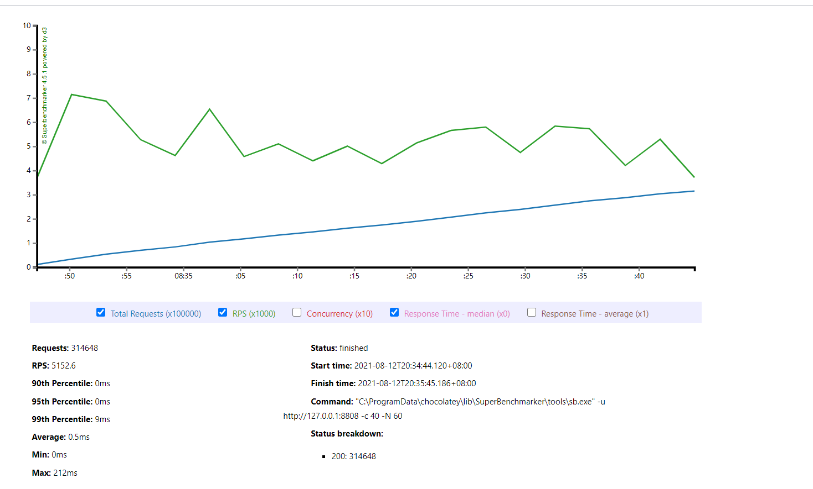

# 1.ServerSocket实现httpServer
## 1.1 阻塞式
代码：
[HttpServer01.java](../../../src/main/java/com/dhb/gts/javacourse/week2/HttpServer01.java)
压测结果：
```
PS D:\> sb -u http://127.0.0.1:8801 -c 40 -N 60
Starting at 2021/8/11 19:31:25
[Press C to stop the test]
123375  (RPS: 1934.5)
---------------Finished!----------------
Finished at 2021/8/11 19:32:28 (took 00:01:03.8117403)
123408  (RPS: 1935)                     Status 303:    123411

RPS: 2022.1 (requests/second)
Max: 170ms
Min: 0ms
Avg: 18.3ms

  50%   below 16ms
  60%   below 18ms
  70%   below 21ms
  80%   below 26ms
  90%   below 32ms
  95%   below 38ms
  98%   below 48ms
  99%   below 57ms
99.9%   below 97ms
```


## 1.2  多线程

[HttpServer02.java](../../../src/main/java/com/dhb/gts/javacourse/week2/HttpServer02.java)
压测结果
```
PS D:\> sb -u http://127.0.0.1:8802 -c 40 -N 60
Starting at 2021/8/11 19:27:02
[Press C to stop the test]
106020  (RPS: 1663.2)
---------------Finished!----------------
Finished at 2021/8/11 19:28:06 (took 00:01:03.8205636)
Status 303:    106020

RPS: 1735.7 (requests/second)
Max: 214ms
Min: 0ms
Avg: 21.3ms

  50%   below 18ms
  60%   below 21ms
  70%   below 25ms
  80%   below 30ms
  90%   below 37ms
  95%   below 45ms
  98%   below 57ms
  99%   below 68ms
99.9%   below 109ms
```


## 1.3 线程池版本
代码：
[HttpServer03.java](../../../src/main/java/com/dhb/gts/javacourse/week2/HttpServer03.java)
压测结果：
```
PS D:\> sb -u http://127.0.0.1:8803 -c 40 -N 60
Starting at 2021/8/11 19:21:14
[Press C to stop the test]
125965  (RPS: 1977.2)
---------------Finished!----------------
Finished at 2021/8/11 19:22:18 (took 00:01:03.8917608)
Status 303:    125965

RPS: 2058.5 (requests/second)
Max: 161ms
Min: 0ms
Avg: 18ms

  50%   below 15ms
  60%   below 18ms
  70%   below 21ms
  80%   below 25ms
  90%   below 31ms
  95%   below 37ms
  98%   below 48ms
  99%   below 59ms
99.9%   below 93ms
```


由于在第一组测试的时候，没有增加sleep,得到的测测试结果存在偏差。现在增加1ms的sleep时间。

# 2.ServerSocket实现httpServer增加sleep
第二组测试：
加上1ms的sleep时间。

## 2.1 阻塞
-Xms512M -Xmx512M
[HttpServer01.java](../../../src/main/java/com/dhb/gts/javacourse/week2/HttpServer01.java)
测试结果：
```
PS D:\> sb -u http://127.0.0.1:8801 -c 40 -N 60
Starting at 2021/8/11 19:41:09
[Press C to stop the test]
48855   (RPS: 767.1)
---------------Finished!----------------
Finished at 2021/8/11 19:42:13 (took 00:01:03.8082941)
Status 303:    48855

RPS: 798.8 (requests/second)
Max: 130ms
Min: 5ms
Avg: 48.4ms

  50%   below 48ms
  60%   below 50ms
  70%   below 51ms
  80%   below 53ms
  90%   below 56ms
  95%   below 58ms
  98%   below 61ms
  99%   below 63ms
99.9%   below 76ms
PS D:\>
```


## 2.2 增加多线程
-Xms512M -Xmx512M
[HttpServer02.java](../../../src/main/java/com/dhb/gts/javacourse/week2/HttpServer02.java)
测试结果：
```
PS D:\> sb -u http://127.0.0.1:8802 -c 40 -N 60
Starting at 2021/8/11 19:44:13
[Press C to stop the test]
105184  (RPS: 1645.5)
---------------Finished!----------------
Finished at 2021/8/11 19:45:16 (took 00:01:03.9565176)
Status 303:    105185

RPS: 1723.6 (requests/second)
Max: 182ms
Min: 1ms
Avg: 21.2ms

  50%   below 18ms
  60%   below 21ms
  70%   below 24ms
  80%   below 29ms
  90%   below 37ms
  95%   below 45ms
  98%   below 57ms
  99%   below 68ms
99.9%   below 108ms
PS D:\>
```


## 2.3 增加线程池
-Xms512M -Xmx512M
[HttpServer03.java](../../../src/main/java/com/dhb/gts/javacourse/week2/HttpServer03.java)
测试结果：
```
PS D:\> sb -u http://127.0.0.1:8803 -c 40 -N 60
Starting at 2021/8/11 19:46:46
[Press C to stop the test]
124993  (RPS: 1959.1)
---------------Finished!----------------
Finished at 2021/8/11 19:47:50 (took 00:01:04.0109473)
Status 303:    124993

RPS: 2041.7 (requests/second)
Max: 174ms
Min: 0ms
Avg: 18ms

  50%   below 15ms
  60%   below 18ms
  70%   below 21ms
  80%   below 25ms
  90%   below 31ms
  95%   below 37ms
  98%   below 46ms
  99%   below 55ms
99.9%   below 97ms
PS D:\>
```


# 3.NettyHttpServer
[NettyHttpServer.java](../../../src/main/java/com/dhb/gts/javacourse/week2/NettyHttpServer.java)
## 3.1 不增加sleep
```
PS D:\> sb -u http://127.0.0.1:8808 -c 40 -N 60
Starting at 2021/8/12 20:34:39
[Press C to stop the test]
314648  (RPS: 4901.5)
---------------Finished!----------------
Finished at 2021/8/12 20:35:44 (took 00:01:04.2492745)
Status 200:    314648

RPS: 5152.6 (requests/second)
Max: 212ms
Min: 0ms
Avg: 0.5ms

  50%   below 0ms
  60%   below 0ms
  70%   below 0ms
  80%   below 0ms
  90%   below 0ms
  95%   below 0ms
  98%   below 5ms
  99%   below 9ms
99.9%   below 85ms
```
测试结果


## 3.2 增加sleep
增加1ms sleep
```
PS D:\> sb -u http://127.0.0.1:8808 -c 40 -N 60
Starting at 2021/8/12 20:37:33
[Press C to stop the test]
266075  (RPS: 4134.5)
---------------Finished!----------------
Finished at 2021/8/12 20:38:38 (took 00:01:04.3843402)
Status 200:    266076

RPS: 4359.3 (requests/second)
Max: 244ms
Min: 0ms
Avg: 2.4ms

  50%   below 1ms
  60%   below 1ms
  70%   below 1ms
  80%   below 1ms
  90%   below 2ms
  95%   below 8ms
  98%   below 30ms
  99%   below 50ms
99.9%   below 113ms
PS D:\>
```
测试结果


# 4.总结
测试结果汇总如下：

| 测试类型    | HttpServer01 | HttpServer02 | HttpServer03 | NettyHttpServer |
|:-----------|:-------------|:-------------|:-------------|:----------------|
| 不增加sleep | 2022.1       | 1735.7       | 2058.5       | 5152.6          |
| sleep(1ms) | 798.8        | 1645.5       | 2041.7       | 4359.3          |

可以发现，当不增加sleep的时候，不采用多线程的效率高于多线程。这种情况非常理想。不符合现实场景。但是也说明多线程的线程切换占用了系统的开销。
增加了sleep之后，这符合我们的期望结果，阻塞式的响应非常低，只有700多rps。这能区分增加线程池的优势。
采用netty之后，效果明显提升了很多，netty采用了异步非阻塞IO。
