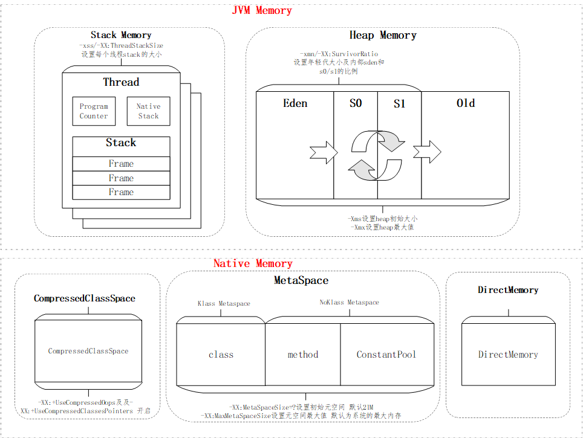
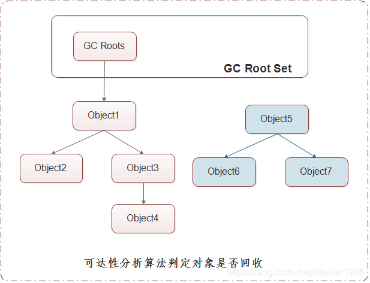
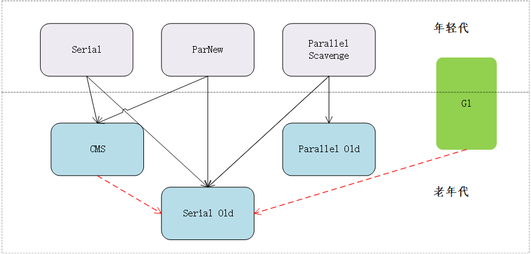
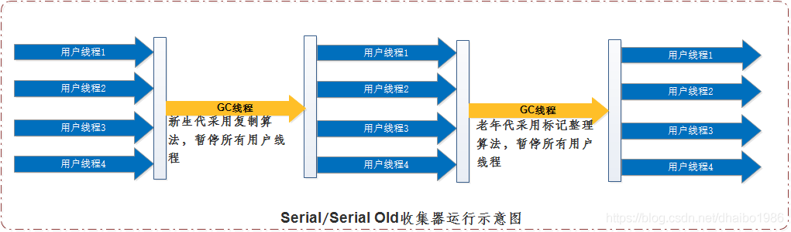
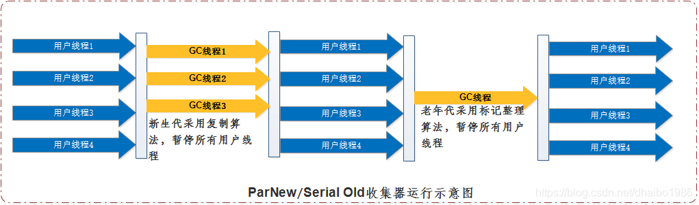
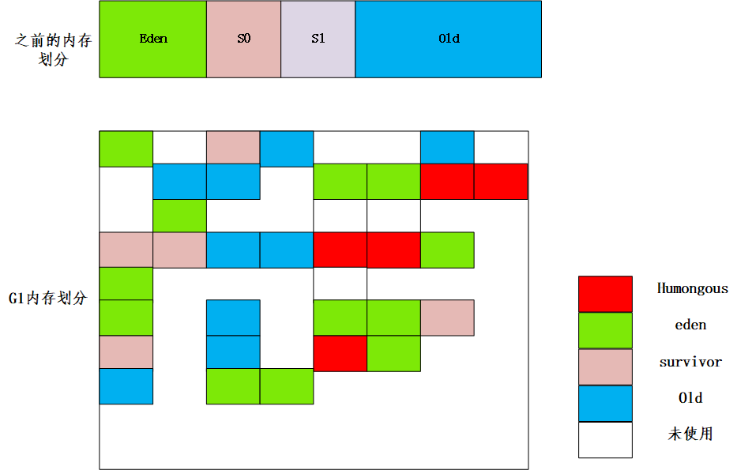

# 1. jvm1.8的内存布局
java的内存布局大致如下图所示：

# 2. 垃圾确认的方法
- 引用计数法：
给对象添加一个引用计数器，当有一个地方引用时，计数器就加1，当引用失效时，计数器就减1。任何时刻只要计数器为0则回收。但是这种算法无法解决对象之间互相循环引用的问题。如A引用B,而B又引用A，计数器永远不为0，这两个对象再也无任何引用。这样GC不能回收这两个对象。
- 可达性分析法：
通过GCRoots的对象作为起点，从这些节点向下搜索，搜索走过的路径称之为引用链（Reference Chain），当一个对象到达GCRoots没有任何链相连，则证明此对象不可用，可以被GC回收。

# 3.jvm中垃圾回收的算法

## 3.1 标记-清除算法
标记-清除算法分为标记和清除两个阶段：首先标记出需要回收的对象，在标记完成后统一回收所有被标记的对象。  
存在的问题： 一是效率低，标记和清除两个过程效率都不高。二是空间问题，标记清除后会产生大量的不连续的内存碎片。空间碎片太多会导致程序在运行过程中需要分配较大对象时无法找到连续内存而不得不提前触发GC。

## 3.2 复制算法
为了解决效率问题，复制算法应运而生。它将可用内存分为大小相等的两块，每次只使用其中一块，当其中一块内存耗尽，触发GC时就将还存在的对象复制到另外一块内存上面，然后再把已使用过的内存空间一次性清除。这样实现了对整个半区的GC，内存分配时完全不用考虑碎片的情况。缺点在于这种算法将内存的可用大小缩小了一半。

## 3.3 标记-整理算法
复制算法当对象存活率较高的情况时，照样会出现效率低下的问题，另外内存要浪费50%。为了避免上述问题，出现了 标记-整理算法。（mark-compact） 其标记过程与标记-清除算法一样，但后续步骤不直接清除，而是让所有存活的对象都向一端移动，然后直接清理掉边界以外的内存。

## 3.4 分代收集法
根据对象的存活周期将内存分为几块，如当前hotsport就分为新生代和老年代，然后在各个年代采用不同的收集算法。新生代采用复制算法，老年代采用标记清除或者标记整理算法。

# 4.垃圾收集器
jvm1.8中支持的垃圾收集器见下图：

上图表示不同的GC收集器的组合，根据业务场景的不同，结合各垃圾收集器的特点，在年轻代和老年代我们可以使用不同的垃圾收集器。

## 4.1 Serial收集器
Serial收集器是一个单线程收集器，只会使用一条线程去收集，同时需要暂停其他所有工作线程，直至收集结束。

优点：
简单高效，在单CPU环境中没有线程开销，可以获得最大的效率。
适用于运行在Client模式下的虚拟机。

## 4.2 ParNew收集器
ParNew收集器是Serial收集器的多线程版本，除了多线程收集之外，其余包括控制参数、收集算法、对象分配规则、回收策略等都与Serial收集器一样。

ParNew收集器是jvmServer模式下的首选新生代收集器，除Serial收集器外，只有ParNew收集器能与CMS收集器配合工作。默认开启的收集线程数与CPU的数量相同。可以通过 -XX:parallelGCThreads参数来限制垃圾收集的线程数。
## 4.3 Parallel Scavenge收集器
Parallel Scavenge收集器是一个新生代收集器，也采用复制算法，并行多线程收集。特点在于达到一个可控目标吞吐量（Throughput）。
吞吐量 = 运行用户代码的时间/(运行用户代码的时间+GC耗时)。
-XX:MaxGCPauseMillis 设置停顿时间。
-XX:GCTimeratio 设置吞吐量。
Parallel Scavenge收集器 能够根据上述两个参数进行自适应调节。
需要注意的是，该收集器只能用于年轻代，只能与Serial Old或者Parallel Old搭配使用。

## 4.4 Serial Old收集器
Serial Old收集器是Serial收集器的老年代版本，同样式一个单线程收集器，使用标记整理算法。收集器的主要意义也是提供给Client模式下使用，在Server模式下，其主要作用有：
- 搭配Parallel Scavenge收集器使用。
- 做为CMS收集器的后备方案，当CMS出现Concurrent Mode Failure时使用。
- 做为G1的fullGC收集器。这也是我们在使用G1的时候需要注意的，G1应该尽量杜绝FullGC。否则就会退化为串行GC。

## 4.5 Parallel Old收集器
Parallel Old收集器是Parallel Scavenge收集器的老年代版本，使用多线程的标记整理算法。
在注重吞吐量以及CPU资源敏感的场合，优先考虑Parallel Scavenge和Parallel Old的组合进行收集。

## 4.6 CMS收集器
CMS（Concurrent Mark Sweep）收集器是一种以获得最短回收停顿时间为目标的收集器。主要应用在互联网或BS系统的服务器上，这类应用尤其重视服务器的响应速度，希望停顿时间最短，以给用户最好的体验。
CMS时基于标记清除算法实现的，主要分为4个步骤：
初始标记（CMS initial mark）：标记GC Roots能直接关联到的对象，速度很快。
并发标记（CMS concurrent mark）：进行roots tracing过程。
重新标记（CMS remark）：修正并发标记阶段因用户程序继续运作而导致标记产生变动的哪一部分对象的标记记录，这个极端停顿时间比初始标记长。但远比并发标记短。
并发清除（CMS concurrent sweep）:回收资源。
上述步骤中，初始标记、重新标记这两个步骤需要停止所有线程。

CMS收集器缺点：
- CMS收集器对CPU资源非常敏感，在CPU资源很匮乏时，效率会非常滴，造成停顿时间过长。
- CMS收集器无法处理浮动垃圾，即在CMS收集器收集过程中新产生的垃圾，如果浮动垃圾较大，会导致CMS失败。当CMS失败后，会启动后背预案，临时启用SerialOld收集器来进行老年代收集。这样停顿时间就会比较长。
- CMS收集器基于标记清除算法，会产生大量的内存碎片，需要额外开启内存整理。通过参数 -XX:CMSFullGCsBeforeCompation，设置执行多少次不压缩的GC后进行一次压缩。

## 4.7 G1收集器
G1 收集器是在CMS收集器基础之上的一个升级。其主要的思路是，在G1之前的任何垃圾收集器中，分代的思想，都是讲内存分为地址连续的几部分来进行分代管理和GC。  
但是随着jvm heap内存的不断增加，我们知道，在不少应用中可能会用到诸如32G这样大的heap内存。这就对原有的分代收集带来了新的挑战，无论采取什么垃圾回收算法，到会导致由于heap内存的增大导致的一次GC耗时特别长。
heap内存的回收耗时无法预计。为了解决这个问题，G1增加了region的概念。将heap内存分为一个个大小相等的Region,Region的范围为 1M- 32M。可以根据需要自行配置。（-XX:G1HeapRegionSize=?）

通过上图可以发现，在G1中，首先将内存划分为大小相等的Region,之后再在这些Region之上来进行分代划分。这样每个代都将是不连续的Region组成。
为什么要这么做呢，其最终目的都是为了实现可控的StopTheWorld的时间。

### 4.7.1 G1的重要概念
此外，关于G1，还需要知道的几个概念：
- CSet（收集集合）：GC过程记录的可被回收的Region的集合。在CSet中存活的数据会在GC过程中被移动到另一个可用分区，CSet中的分区可以来自eden空间、survivor空间、或者老年代。
- RSet(Remembered Set 记忆集合)：记录了其他Region中的对象引用本Region中对象的关系，属于points-into结构 (谁引用了我的对象)。作用是不需要扫描整个堆找到谁引用了当前分区中的对象，只需要扫描RSet即可。
- Humongous regions：用来存放大于标准的Region内存50%的大对象区域，如果有些对象大于整个Region就会去找连续的Region保存，如果没有就会触发GC。

### 4.7.2 G1收集过程
G1收集器将java堆从一个整体收集变成了一个个Region进行收集，收集的过程中，采用垃圾优先，也就是会计算每个Region的垃圾回收情况，回收最有利的Region。
回收的模式分为：Young GC,Mixed GC和FullGC。
#### 4.7.2.1 Young GC
回收的CSet就是所有年轻代里面的Region。
过程为：
- 阶段1：根扫描，静态和本地对象被扫描；
- 阶段2：更新RS，处理dirty card队列更新RS；
- 阶段3：处理RS，检测从年轻代指向老年代的对象；
- 阶段4：对象拷贝，拷贝存活的对象到survivorl/old区域；
- 阶段5：处理引用队列，软引用，弱引用，虚引用处理；

#### 4.7.2.2 Mixed GC
Mixed GC: CSet是所有年轻代里的Region加上在全局并发标记阶段标记出来的收益高的老年代Region；
1、全局并发标记（global concurrent marking）
全局并发标记包括5个步骤：
- 步骤一：初始标记（initial mark，STW）：标记了从GCRoot开始直接可达的对象。
- 步骤二：根区域扫描（root region scan）：G1 GC 在初始标记的存活区扫描对老年代的引用，并标记被引用的对象。该阶段与应用程序（非 STW）同时运行，并且只有完成该阶段后，才能开始下一次 STW 年轻代垃圾回收。
- 步骤三：并发标记（Concurrent Marking）：G1 GC 在整个堆中查找可访问的（存活的）对象。该阶段与应用程序同时运行，可以被 STW 年轻代垃圾回收中断。
- 步骤四：重新标记（Remark，STW）：该阶段是 STW 回收，帮助完成标记周期。G1 GC 清空 SATB 缓冲区，跟踪未被访问的存活对象，并执行引用处理。
- 步骤五：清除垃圾（Cleanup）：在这个最后阶段，G1 GC 执行统计和 RSet 净化的 STW 操作。在统计期间，G1 GC 会识别完全空闲的区域和可供进行混合垃圾回收的区域。清理阶段在将空白区域重置并返回到空闲列表时为部分并发。

2、拷贝存活对象（evacuation）

#### 4.7.2.3 FullGC
需要非常注意的是，G1的FullGC将是采用Seri 
# 1. jvm1.8的内存布局
java的内存布局大值如下图所示：

# 2. 垃圾确认的方法
- 引用计数法：
给对象添加一个引用计数器，当有一个地方引用时，计数器就加1，当引用失效时，计数器就减1。任何时刻只要计数器为0则回收。但是这种算法无法解决对象之间互相循环引用的问题。如A引用B,而B又引用A，计数器永远不为0，这两个对象再也无任何引用。这样GC不能回收这两个对象。
- 可达性分析法：
通过GCRoots的对象作为起点，从这些节点向下搜索，搜索走过的路径称之为引用链（Reference Chain），当一个对象到达GCRoots没有任何链相连，则证明此对象不可用，可以被GC回收。

# 3.jvm中垃圾回收的算法

## 3.1 标记-清除算法
标记-清除算法分为标记和清除两个阶段：首先标记出需要回收的对象，在标记完成后统一回收所有被标记的对象。  
存在的问题： 一是效率低，标记和清除两个过程效率都不高。二是空间问题，标记清除后会产生大量的不连续的内存碎片。空间碎片太多会导致程序在运行过程中需要分配较大对象时无法找到连续内存而不得不提前触发GC。

## 3.2 复制算法
为了解决效率问题，复制算法应运而生。它将可用内存分为大小相等的两块，每次只使用其中一块，当其中一块内存耗尽，触发GC时就将还存在的对象复制到另外一块内存上面，然后再把已使用过的内存空间一次性清除。这样实现了对整个半区的GC，内存分配时完全不用考虑碎片的情况。缺点在于这种算法将内存的可用大小缩小了一半。

## 3.3 标记-整理算法
复制算法当对象存活率较高的情况时，照样会出现效率低下的问题，另外内存要浪费50%。为了避免上述问题，出现了 标记-整理算法。（mark-compact） 其标记过程与标记-清除算法一样，但后续步骤不直接清除，而是让所有存活的对象都向一端移动，然后直接清理掉边界以外的内存。

## 3.4 分代收集法
根据对象的存活周期将内存分为几块，如当前hotsport就分为新生代和老年代，然后在各个年代采用不同的收集算法。新生代采用复制算法，老年代采用标记清除或者标记整理算法。

# 4.垃圾收集器
jvm1.8中支持的垃圾收集器见下图：

上图表示不同的GC收集器的组合，根据业务场景的不同，结合各垃圾收集器的特点，在年轻代和老年代我们可以使用不同的垃圾收集器。

## 4.1 Serial收集器
Serial收集器是一个单线程收集器，只会使用一条线程去收集，同时需要暂停其他所有工作线程，直至收集结束。

优点：
简单高效，在单CPU环境中没有线程开销，可以获得最大的效率。
适用于运行在Client模式下的虚拟机。

## 4.2 ParNew收集器
ParNew收集器是Serial收集器的多线程版本，除了多线程收集之外，其余包括控制参数、收集算法、对象分配规则、回收策略等都与Serial收集器一样。

ParNew收集器是jvmServer模式下的首选新生代收集器，除Serial收集器外，只有ParNew收集器能与CMS收集器配合工作。默认开启的收集线程数与CPU的数量相同。可以通过 -XX:parallelGCThreads参数来限制垃圾收集的线程数。
## 4.3 Parallel Scavenge收集器
Parallel Scavenge收集器是一个新生代收集器，也采用复制算法，并行多线程收集。特点在于达到一个可控目标吞吐量（Throughput）。
吞吐量 = 运行用户代码的时间/(运行用户代码的时间+GC耗时)。
-XX:MaxGCPauseMillis 设置停顿时间。
-XX:GCTimeratio 设置吞吐量。
Parallel Scavenge收集器 能够根据上述两个参数进行自适应调节。
需要注意的是，该收集器只能用于年轻代，只能与Serial Old或者Parallel Old搭配使用。

## 4.4 Serial Old收集器
Serial Old收集器是Serial收集器的老年代版本，同样式一个单线程收集器，使用标记整理算法。收集器的主要意义也是提供给Client模式下使用，在Server模式下，其主要作用有：
- 搭配Parallel Scavenge收集器使用。
- 做为CMS收集器的后备方案，当CMS出现Concurrent Mode Failure时使用。
- 做为G1的fullGC收集器。这也是我们在使用G1的时候需要注意的，G1应该尽量杜绝FullGC。否则就会退化为串行GC。

## 4.5 Parallel Old收集器
Parallel Old收集器是Parallel Scavenge收集器的老年代版本，使用多线程的标记整理算法。
在注重吞吐量以及CPU资源敏感的场合，优先考虑Parallel Scavenge和Parallel Old的组合进行收集。

## 4.6 CMS收集器
CMS（Concurrent Mark Sweep）收集器是一种以获得最短回收停顿时间为目标的收集器。主要应用在互联网或BS系统的服务器上，这类应用尤其重视服务器的响应速度，希望停顿时间最短，以给用户最好的体验。
CMS时基于标记清除算法实现的，主要分为4个步骤：
初始标记（CMS initial mark）：标记GC Roots能直接关联到的对象，速度很快。
并发标记（CMS concurrent mark）：进行roots tracing过程。
重新标记（CMS remark）：修正并发标记阶段因用户程序继续运作而导致标记产生变动的哪一部分对象的标记记录，这个极端停顿时间比初始标记长。但远比并发标记短。
并发清除（CMS concurrent sweep）:回收资源。
上述步骤中，初始标记、重新标记这两个步骤需要停止所有线程。

CMS收集器缺点：
- CMS收集器对CPU资源非常敏感，在CPU资源很匮乏时，效率会非常滴，造成停顿时间过长。
- CMS收集器无法处理浮动垃圾，即在CMS收集器收集过程中新产生的垃圾，如果浮动垃圾较大，会导致CMS失败。当CMS失败后，会启动后背预案，临时启用SerialOld收集器来进行老年代收集。这样停顿时间就会比较长。
- CMS收集器基于标记清除算法，会产生大量的内存碎片，需要额外开启内存整理。通过参数 -XX:CMSFullGCsBeforeCompation，设置执行多少次不压缩的GC后进行一次压缩。

## 4.7 G1收集器
G1 收集器是在CMS收集器基础之上的一个升级。其主要的思路是，在G1之前的任何垃圾收集器中，分代的思想，都是讲内存分为地址连续的几部分来进行分代管理和GC。  
但是随着jvm heap内存的不断增加，我们知道，在不少应用中可能会用到诸如32G这样大的heap内存。这就对原有的分代收集带来了新的挑战，无论采取什么垃圾回收算法，到会导致由于heap内存的增大导致的一次GC耗时特别长。
heap内存的回收耗时无法预计。为了解决这个问题，G1增加了region的概念。将heap内存分为一个个大小相等的Region,Region的范围为 1M- 32M。可以根据需要自行配置。（-XX:G1HeapRegionSize=?）

通过上图可以发现，在G1中，首先将内存划分为大小相等的Region,之后再在这些Region之上来进行分代划分。这样每个代都将是不连续的Region组成。
为什么要这么做呢，其最终目的都是为了实现可控的StopTheWorld的时间。

### 4.7.1 G1的重要概念
此外，关于G1，还需要知道的几个概念：
- CSet（收集集合）：GC过程记录的可被回收的Region的集合。在CSet中存活的数据会在GC过程中被移动到另一个可用分区，CSet中的分区可以来自eden空间、survivor空间、或者老年代。
- RSet(Remembered Set 记忆集合)：记录了其他Region中的对象引用本Region中对象的关系，属于points-into结构 (谁引用了我的对象)。作用是不需要扫描整个堆找到谁引用了当前分区中的对象，只需要扫描RSet即可。
- Humongous regions：用来存放大于标准的Region内存50%的大对象区域，如果有些对象大于整个Region就会去找连续的Region保存，如果没有就会触发GC。

### 4.7.2 G1收集过程
G1收集器将java堆从一个整体收集变成了一个个Region进行收集，收集的过程中，采用垃圾优先，也就是会计算每个Region的垃圾回收情况，回收最有利的Region。
回收的模式分为：Young GC,Mixed GC和FullGC。
#### 4.7.2.1 Young GC
回收的CSet就是所有年轻代里面的Region。
过程为：
- 阶段1：根扫描，静态和本地对象被扫描；
- 阶段2：更新RS，处理dirty card队列更新RS；
- 阶段3：处理RS，检测从年轻代指向老年代的对象；
- 阶段4：对象拷贝，拷贝存活的对象到survivorl/old区域；
- 阶段5：处理引用队列，软引用，弱引用，虚引用处理；

#### 4.7.2.2 Mixed GC
Mixed GC: CSet是所有年轻代里的Region加上在全局并发标记阶段标记出来的收益高的老年代Region；
1、全局并发标记（global concurrent marking）
全局并发标记包括5个步骤：
- 步骤一：初始标记（initial mark，STW）：标记了从GCRoot开始直接可达的对象。
- 步骤二：根区域扫描（root region scan）：G1 GC 在初始标记的存活区扫描对老年代的引用，并标记被引用的对象。该阶段与应用程序（非 STW）同时运行，并且只有完成该阶段后，才能开始下一次 STW 年轻代垃圾回收。
- 步骤三：并发标记（Concurrent Marking）：G1 GC 在整个堆中查找可访问的（存活的）对象。该阶段与应用程序同时运行，可以被 STW 年轻代垃圾回收中断。
- 步骤四：重新标记（Remark，STW）：该阶段是 STW 回收，帮助完成标记周期。G1 GC 清空 SATB 缓冲区，跟踪未被访问的存活对象，并执行引用处理。
- 步骤五：清除垃圾（Cleanup）：在这个最后阶段，G1 GC 执行统计和 RSet 净化的 STW 操作。在统计期间，G1 GC 会识别完全空闲的区域和可供进行混合垃圾回收的区域。清理阶段在将空白区域重置并返回到空闲列表时为部分并发。

2、拷贝存活对象（evacuation）

#### 4.7.2.3 FullGC
需要非常注意的是，G1的FullGC将是采用Serial收集器进行。
这将会导致STW发生，这个时间直到收集完成为止。
G1的GC过程会在Young GC和Mixed GC之间不断地切换运行，同时定期地做全局并发标记，在实在赶不上对象创建速度的情况下使用Full GC。
因此，这也是我们调优的时候需要重点关注的，G1的退化情况。调优的目的是尽量保证退化的情况不出现。

# 5.总结
本文对JVM中的各种GC回收器进行了总结，在配置GC回收策略的时候，我们需要结合我们的业务场景来进行：
- 并行GC是jdk1.8默认的GC回收策略，默认采用 ParNew收集器 + Parallel Old收集器来进行。这是一个注重高吞吐量的收集策略。缺点在于FullGC的时间可能会不可控。需要注意STW对业务的影响。
- 串行GC仅仅适用于-client,其吞吐量和GC卡顿时间都比较差。大多数情况下不建议使用。
- CMS GC可以有效的解决GC的STW时间不可控的问题，但是带来了吞吐量的降低。且在特定情况下也会退化为串行GC。此外STW时间也不一定是可控的。
- G1 GC 是CMS基础之上的升级，结合了CMS的优点，同时对CMS吞吐量的情况做了改善，尤其适合大堆内存的情况。比如heap大于6G,还同时要求延迟也可控，那么G1是一个不错的选择。不过需要特别关注的是G1退化的情况，如何避免FullGC的出现。

al收集器进行。
这将会导致STW发生，这个时间直到收集完成为止。
G1的GC过程会在Young GC和Mixed GC之间不断地切换运行，同时定期地做全局并发标记，在实在赶不上对象创建速度的情况下使用Full GC。
因此，这也是我们调优的时候需要重点关注的，G1的退化情况。调优的目的是尽量保证退化的情况不出现。

# 5.总结
本文对JVM中的各种GC回收器进行了总结，在配置GC回收策略的时候，我们需要结合我们的业务场景来进行：
- 并行GC是jdk1.8默认的GC回收策略，默认采用 ParNew收集器 + Parallel Old收集器来进行。这是一个注重高吞吐量的收集策略。缺点在于FullGC的时间可能会不可控。需要注意STW对业务的影响。
- 串行GC仅仅适用于-client,其吞吐量和GC卡顿时间都比较差。大多数情况下不建议使用。
- CMS GC可以有效的解决GC的STW时间不可控的问题，但是带来了吞吐量的降低。且在特定情况下也会退化为串行GC。此外STW时间也不一定是可控的。
- G1 GC 是CMS基础之上的升级，结合了CMS的优点，同时对CMS吞吐量的情况做了改善，尤其适合大堆内存的情况。比如heap大于6G,还同时要求延迟也可控，那么G1是一个不错的选择。不过需要特别关注的是G1退化的情况，如何避免FullGC的出现。

