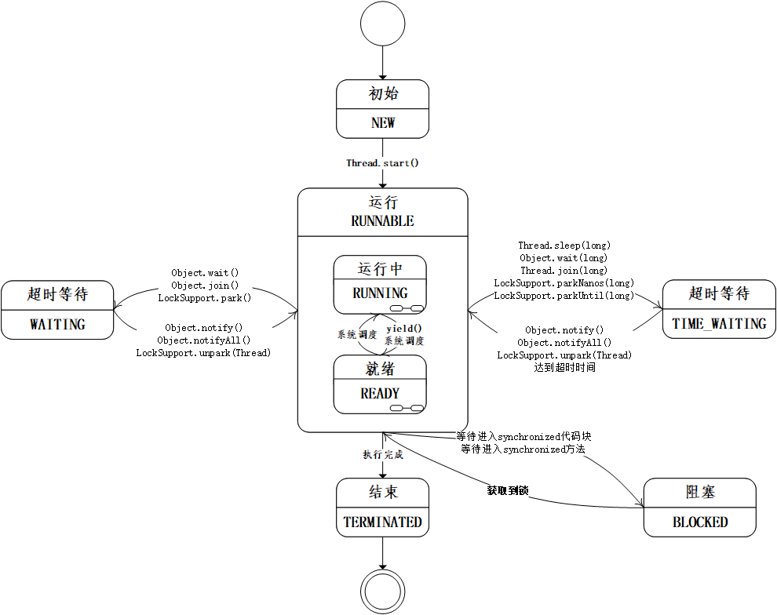

基础代码可以 fork：  https://github.com/kimmking/JavaCourseCodes
02nio/nio02 文件夹下
实现以后，代码提交到 GitHub。

1.（必做）整合你上次作业的 httpclient/okhttp；

[HttpClientAsyncHandler.java](../../../src/main/java/com/dhb/gts/javacourse/week3/outbound/HttpClientAsyncHandler.java)
[OkHttpAsyncHandler.java](../../../src/main/java/com/dhb/gts/javacourse/week3/outbound/OkHttpAsyncHandler.java)
通过在类 HttpinboundHandler的23行，更改handler进行切换。
```
this.handler = new HttpClientAsyncHandler(proxyServer);
```
或者：
```
this.handler = new OkHttpAsyncHandler(proxyServer);
```


2.（选做）使用 netty 实现后端 http 访问（代替上一步骤）
[NettyAsyncHandler.java](../../../src/main/java/com/dhb/gts/javacourse/week3/outbound/NettyAsyncHandler.java)
修改类 HttpinboundHandler的23行，更改handler进行切换。
```
this.handler = new NettyAsyncHandler(proxyServer);
```

3.（必做）实现过滤器。
采用责任链模式来实现过滤器 
request:
[HttpRequestFilter.java](../../../src/main/java/com/dhb/gts/javacourse/week3/filter/HttpRequestFilter.java)
[RequestFilterChain.java](../../../src/main/java/com/dhb/gts/javacourse/week3/filter/RequestFilterChain.java)
[HeaderHttpRequestFilter.java](../../../src/main/java/com/dhb/gts/javacourse/week3/filter/HeaderHttpRequestFilter.java)
response:
[HttpResponseFilter.java](../../../src/main/java/com/dhb/gts/javacourse/week3/filter/HttpResponseFilter.java)
[ResponseFilterChain.java](../../../src/main/java/com/dhb/gts/javacourse/week3/filter/ResponseFilterChain.java)
[HeaderHttpResponseFilter.java](../../../src/main/java/com/dhb/gts/javacourse/week3/filter/HeaderHttpResponseFilter.java)'

4.（选做）实现路由。
参考random路由规则：
[RandomHttpEndpointRouter.java](../../../src/main/java/com/dhb/gts/javacourse/week3/router/RandomHttpEndpointRouter.java)
实现了轮询路由和加权轮询路由
[RoundRibbonHttpEndpointRouter.java](../../../src/main/java/com/dhb/gts/javacourse/week3/router/RoundRibbonHttpEndpointRouter.java)
[WeightRoundHttpEndpointRouter.java](../../../src/main/java/com/dhb/gts/javacourse/week3/router/WeightRoundHttpEndpointRouter.java)

5.（选做）跑一跑课上的各个例子，加深对多线程的理解
自己画图：

实现例子：
[DaemonThread.java](../../../src/main/java/com/dhb/gts/javacourse/week3/thread/DaemonThread.java)
[Counter.java](../../../src/main/java/com/dhb/gts/javacourse/week3/thread/Counter.java)
[ExceptionDemo.java](../../../src/main/java/com/dhb/gts/javacourse/week3/thread/ExceptionDemo.java)
[ExecutorServiceDemo.java](../../../src/main/java/com/dhb/gts/javacourse/week3/thread/ExecutorServiceDemo.java)
[Join.java](../../../src/main/java/com/dhb/gts/javacourse/week3/thread/Join.java)
[NewCachedThreadPoolDemo.java](../../../src/main/java/com/dhb/gts/javacourse/week3/thread/NewCachedThreadPoolDemo.java)
[NewFixedThreadPoolDemo.java](../../../src/main/java/com/dhb/gts/javacourse/week3/thread/NewFixedThreadPoolDemo.java)
[NewScheduledThreadExecutorDemo.java](../../../src/main/java/com/dhb/gts/javacourse/week3/thread/NewScheduledThreadExecutorDemo.java)
[NewSingleThreadExecutorDemo.java](../../../src/main/java/com/dhb/gts/javacourse/week3/thread/NewSingleThreadExecutorDemo.java)

6.（选做）完善网关的例子，试着调整其中的线程池参数