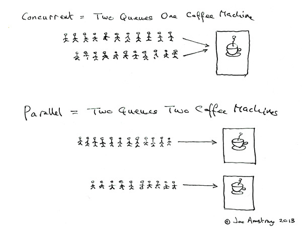

# 1.什么是并发
说到并发，期英文单词为Conurrent,如果要彻底理解并发，那么还需知道一个词就是并行，英文单词Parallel。
那么二者有什么关系呢？Erlang 之父 Joe Armstrong用如下图来解释了并发与并行的区别：

并发是两个队列交替使用一台咖啡机，而并行则是两个队列同时使用两台咖啡机。再用一个例子来解释：
- 你吃饭吃到一半，电话来了，你一直到吃完了以后才去接，这就说明你不支持并发也不支持并行。
- 你吃饭吃到一半，电话来了，你停了下来接了电话，接完后继续吃饭，这说明你支持并发。
- 你吃饭吃到一半，电话来了，你一边打电话一边吃饭，这说明你支持并行。

从上面的例子可以看出来，并发的关键就是需要能同时处理多个任务的能力，这个不一定是同时进行的。并行则关键是要能同时处理多个任务。二者的关键区别在于是否具备同时性。
这也很好的能在计算机上进行理解，在早期只有单核CPU的计算机上，随着系统CPU的时间片调度，系统可以支持并发和串行。而在目前多处理器的多核系统中，系统除支持并发与串行之外，还支持并行。

# 2.什么是高并发
高并发（Hight Concurrnet）,从字面上来理解就是让单位时间同时处理任务的能力尽可能的高。对应到我们研发系统中，也就是说：
我们所开发的系统，要在短时间能能支持大量访问请求的情况。这种情况比如双十一活动，或者12306的抢票、以及秒杀等活动。
这要求我们的业务系统，在短时间内，尽可能多的接收来自客户端的请求，并做出准确的响应。

实际上，从另外一个角度考虑，我们所说的高并发，并行已经是其一个子集。毕竟，单个CPU或者单个系统节点的处理能力有限，而且成本昂贵，  
我们需要通过多个节点，采用可扩展的方式，来实现支撑尽可能高的并发能力。而水平扩展的能力，实际上从另外一个角度来说，并行是提升系统并发能力的重要手段。

那么，既然是高并发，那么多高才算高呢？为了更好的对系统的高并发性进行评价，需要对如下指标进行了解：
- 响应时间：系统对请求做出响应的时间，既然是高并发系统，这个响应时间就不可能太长，需要尽可能的短。
- 吞吐量：系统单位时间内支持的最大请求数，当然越多越好。QPS是吞吐量最常用的量化指标之一。
- 并发用户数：系统同时承载的正常使用功能的用户数量。如通信系统的同时在线人数。反应了系统的负载能力。这个指标当然越大越好。

重要参数如下：
- QPS(TPS):每秒的Request/事务的数量
- 并发数：系统同时处理的request/事务数量
- 响应时间：平均的响应时间

QPS(TPS) = 并发数/平均响应时间

此外还有些相关的指标也需要了解：
- PV(Page View): 页面访问量，即页面浏览量或点击量。
- UV(Unique Visitor): 独立访客，统计1天内访问某站点的用户数。即按人按天去重。
- DAU(Daily Active User):日活跃用户数量。通常统计一日（统计日）之内，登录或使用了某个产品的用户数,与UV概念相似。
- MAU(Month Active User):月活跃用户数量，指网站、app等去重后的月活跃用户数量。

上述指标内容，主要是反映了高并发系统在高性能上的要求。做为高并发系统，需要实现的目标为：
- 高性能：这体现了系统的并行处理能力，在有限资源的情况下，提升性能能节省成本。同时也给用户带来了更好的用户体验。
- 高可用性：系统可以正常服务的时间，尽量避免系统的事故和宕机从而影响正常的业务。
- 高扩展性：表示系统的扩展能力，系统具备更好的弹性，在流量高峰期能否短时间完成扩容，更平稳的承接流量峰值。

# 3.实现高并发需要考虑的因素

## 3.1 高性能
系统的性能，与系统资源的关系息息相关。如果要提升系统的性能，首先我们就得对系统的资源进行规划和确认，主要考虑如下几个方面：
### 3.1.1  网络
  通常情况下，网络因素是导致用户体验变差的首要因素。我们需要考虑如下性能指标：
- 带宽：链路的最大传输速率，单位是 b/s（比特 / 秒）。在你为服务器选购网卡时，或者考虑机房专线，以及云端服务器的资源规划时，带宽就是最核心的参考指标。常用的带宽有 1000M、10G、40G、100G 等。
- 吞吐量，表示没有丢包时的最大数据传输速率，单位通常为 b/s （比特 / 秒）或者 B/s（字节 / 秒）。吞吐量受带宽的限制，吞吐量 / 带宽也就是该网络链路的使用率。
- 延时，表示从网络请求发出后，一直到收到远端响应，所需要的时间延迟。这个指标在不同场景中可能会有不同的含义。它可以表示建立连接需要的时间（比如 TCP 握手延时），或者一个数据包往返所需时间（比如 RTT）。
- PPS，是 Packet Per Second（包 / 秒）的缩写，表示以网络包为单位的传输速率。PPS 通常用来评估网络的转发能力，而基于 Linux 服务器的转发，很容易受到网络包大小的影响（交换机通常不会受到太大影响，即交换机可以线性转发）。

通常情况下，带宽与物理设备相关，这也决定了基础网络设施的投入资金。这需要对系统的带宽进行预测，结合资金的投入来综合考虑。

此外，DNS也是一个重要的因素，DNS 是互联网中最基础的一项服务，提供了域名和 IP 地址间映射关系的查询服务。很多应用程序在最初开发时，并没考虑 DNS 解析的问题，后续出现问题后，排查好几天才能发现，其实是 DNS 解析慢导致的。
我们需要考虑对DNS进行优化。比如缓存等。
CDN CDN主要是对于web网页系统资源优化的重要手段，我们可以考虑将静态的图片或者视频之类，存放到CDN系统。

TCP优化，结合业务的场景，设置合适的TCP参数，TIME_WAIT，考虑SYN FLOOD并优化与 SYN 状态相关的内核选项。是否根据长连接需要KeepAlive开启。以及TCP缓冲区的大小设置等。

应用程序中，我们需要考虑的是优化 I/O 模型、工作模型以及应用层的网络协议；
Socket中需要考虑socket的缓冲区大小。

### 3.1.2 CPU
CPU是决定单节点系统并发能力的核心，除了结合资金尽可能的选择匹配业务的高性能CPU之外，我们还要关注如下CPU相关的指标：
- CPU使用率 PU 使用率描述了非空闲时间占总 CPU 时间的百分比，根据 CPU 上运行任务的不同，又被分为用户 CPU、系统 CPU、等待 I/O CPU、软中断和硬中断等。
- 平均负载（Load Average）：系统的平均活跃进程数。它反应了系统的整体负载情况，主要包括三个数值，分别指过去 1 分钟、过去 5 分钟和过去 15 分钟的平均负载。理想情况下，平均负载等于逻辑 CPU 个数，这表示每个 CPU 都恰好被充分利用。
- 进程上下文切换：上下文切换，本身是保证 Linux 正常运行的一项核心功能。但过多的上下文切换，会将原本运行进程的 CPU 时间，消耗在寄存器、内核栈以及虚拟内存等数据的保存和恢复上，缩短进程真正运行的时间，成为性能瓶颈。我们需要关注无法获取资源而导致的自愿上下文切换；，以及被系统强制调度导致的非自愿上下文切换。。
- CPU 缓存的命中率：CPU 缓存的速度介于 CPU 和内存之间，缓存的是热点的内存数据。根据不断增长的热点数据，这些缓存按照大小不同分为 L1、L2、L3 等三级缓存，其中 L1 和 L2 常用在单核中， L3 则用在多核中。从 L1 到 L3，三级缓存的大小依次增大，相应的，性能依次降低（当然比内存还是好得多）。而它们的命中率，衡量的是 CPU 缓存的复用情况，命中率越高，则表示性能越好。

### 3.1.3 内存
内存的性能指标主要关注的是，已用内存、剩余内存、共享内存、可用内存、缓存和缓冲区的用量等。
- 已用内存和剩余内存就是已经使用和还未使用的内存。
- 共享内存是通过 tmpfs 实现的，所以它的大小也就是 tmpfs 使用的内存大小。
- 可用内存是新进程可以使用的最大内存，它包括剩余内存和可回收缓存。
- 缓存包括两部分，一部分是磁盘读取文件的页缓存，用来缓存从磁盘读取的数据，可以加快以后再次访问的速度。另一部分，则是 Slab 分配器中的可回收内存。
- 缓冲区是对原始磁盘块的临时存储，用来缓存将要写入磁盘的数据。

其次是进程内存使用情况，比如进程的虚拟内存、常驻内存、共享内存以及 Swap 内存等。
内存需要特别关注的是系统的缺页异常：
- 可以直接从物理内存中分配时，被称为次缺页异常。
- 需要磁盘 I/O 介入（比如 Swap）时，被称为主缺页异常。
主缺页异常升高，就意味着需要磁盘 I/O，那么内存访问也会慢很多。

对于SWAP,重点要关注SWAP空间的使用情况，由于SWAP空间实际上是磁盘空间，最好是避免使用SWAP。

### 3.1.3.4 IO
文件系统的IO指标：
首先要关注的是存储空间的使用情况，包括容量、使用量以及剩余空间等。
- 使用率，是指磁盘忙处理 I/O 请求的百分比。过高的使用率（比如超过 60%）通常意味着磁盘 I/O 存在性能瓶颈。
- IOPS（Input/Output Per Second），是指每秒的 I/O 请求数。
- 吞吐量，是指每秒的 I/O 请求大小。
- 响应时间，是指从发出 I/O 请求到收到响应的间隔时间。

其次要关注的是，索引节点的使用情况，它也包括容量、使用量以及剩余量等三个指标。如果文件系统中存储过多的小文件，就可能碰到索引节点容量已满的问题。

对于IO方面，对于应用程序的优化，主要有：
- 第一，可以用追加写代替随机写，减少寻址开销，加快 I/O 写的速度。
- 第二，可以借助缓存 I/O ，充分利用系统缓存，降低实际 I/O 的次数。
- 第三，可以在应用程序内部构建自己的缓存，或者用 Redis 这类外部缓存系统。
- 第四，在需要频繁读写同一块磁盘空间时，可以用 mmap 代替 read/write，减少内存的拷贝次数。
- 第五，在需要同步写的场景中，尽量将写请求合并，而不是让每个请求都同步写入磁盘，即可以用 fsync() 取代 O_SYNC。
- 第六，在多个应用程序共享相同磁盘时，为了保证 I/O 不被某个应用完全占用，用 cgroups 的 I/O 子系统，来限制进程 / 进程组的 IOPS 以及吞吐量。
- 最后，在使用 CFQ 调度器时，可以用 ionice 来调整进程的 I/O 调度优先级，特别是提高核心应用的 I/O 优先级。

对于文件系统：
- 首先要选择符合业务场景的文件系统，ext4或者xfs等。
- 第二，进一步优化文件系统的配置选项，包括文件系统的特性（如 ext_attr、dir_index）、日志模式（如 journal、ordered、writeback）、挂载选项（如 noatime）等等。
- 第三，可以优化文件系统的缓存。

对于物理磁盘的优化：
- 换用性能更好的磁盘，比如用 SSD 替代 HDD。
- 使用合适的RAID。
- 选择最适合的 I/O 调度算法。
- 对应用程序的数据，进行磁盘级别的隔离。
- 在顺序读比较多的场景中，我们可以增大磁盘的预读数据，调整内核选项 /sys/block/sdb/queue/read_ahead_kb或者使用 blockdev 工具设置。
- 优化内核块设备 I/O 的选项。调整磁盘队列的长度 /sys/block/sdb/queue/nr_requests，适当增大队列长度，可以提升磁盘的吞吐量（当然也会导致 I/O 延迟增大。
- 关注磁盘的硬件错误，磁盘本身出现硬件错误，也会导致 I/O 性能急剧下降。

## 3.2 高可用性
系统可用性是衡量一个系统正确地对外提供服务（可工作）的能力。我们通常采用 SLA（Service Level Agreement）来衡量系统可用性，也就是我们经常听到的的几个 9。
影响系统可用性的因素有：
- 人员误操作 这通常都是管理问题。
- 雪崩效应 在分布式系统架构下，服务之间需要配合来完成复杂的业务流程，某个服务提供者的不稳定在请求量变大的情况下，会逐步演化成整个系统的雪崩效应。
- 未经完整测试的版本发布
- 基础设施故障及定期升级维护

影响系统可用性的因素很多，通常有很多因素是我们不可控的，如硬件故障或者基础设施等。
我们主要可以通过提高工程化能力和优化工作流程解决。

在系统上线之前：
- 完善的代码质量管理体系和自动化测试体系
- 完善的权限管理体系
- 其他自动化的开发、运维工具体系

在系统上线后的日常运营中：
- 完善的监控体系，能够尽早识别系统的潜在问题，系统运营人员可以快速甄别已经发生的故障
- 完善的持续集成/持续部署体系，能够保证尽量快的反馈，尽量短的发布时长，在功能开发和故障修复后快速地部署代码到生产环境

为了进一步降低故障的产生，我们还需要有针对的做一些预案管理：
- 完善的发布验证、回滚、限流、熔断、降级策略，能够尽量缩小故障的影响范围，保证即便有部分服务不稳定，也不至于导致整个系统不可用
- 完善的灾备恢复体系和演练，能够保证系统在发生重大紧急事故时可以快速恢复，尽量缩短不可用时长

最重要的是，需要提升团队的综合素质。重视日常的管理工作。而不仅仅是代码。制定规则并遵守。

## 3.3 高扩展性
为了保障系统的可扩展性，这就要求我们对系统的设计是可扩展的。一开始就需要考虑可扩展的架构。
要做到系统的高可扩展性，架构设计的核心就是 冗余。有了冗余之后，还不够，每次出现故障需要人工介入恢复势必会增加系统的不可服务实践。所以，又往往是通过“自动故障转移”来实现。这也就是我们常说的load blance 和fail over.

常用的可扩展架构：
- 1.DNS 负载均衡  能将流量负载到多个机房
- 2.F5 或者nginx的负载均衡 在机房的入口对流量进行再次的分流
- 3.服务无状态设计 springcloud微服务 服务发现、服务治理、熔断等等
- 4.docker+k8s 将应用容器化
- 5.分布式高可用的中间件消息队列，kafka或者pulsa等以及各类MQ
- 6.高可用的非关系数据库集群 Redis 或者 Elasticsearch、Hbase等
- 7.分布式高可用的持久化数据库层，TiDB 或者通过ShardingSphere、MyCat等实现的高可用分库分表
- 8.数仓 hadoop 或者其他技术栈  以及Flink等处理流式数据 或者spark批处理数据

通过常用的高可用冗余设计来实现系统的高扩展性。从而应对系统的高并发。让系统具备弹性。可以根据业务需要来扩容或者缩容。

## 3.4 安全性
最后需要考虑的是系统的安全性问题，如https协议。系统关键数据的加密算法，关键功能的双因素认证等。

