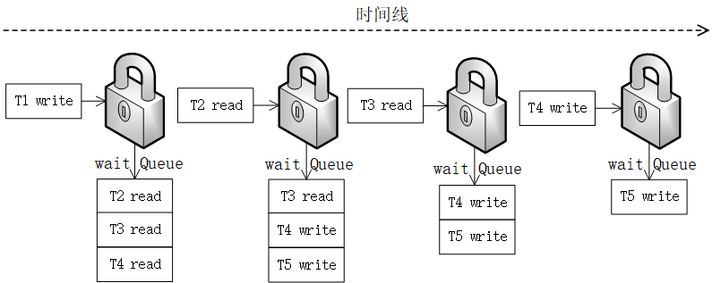
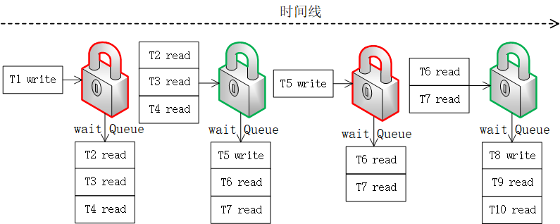

# 1. ReentrantLock
Java并发包中通过Lock和Condition两个接口来实现管程，Lock用于解决互斥问题，Condition用于解决同步问题。
对于互斥问题，在java中，已经有synchronized了，通过synchronized，配合Object的wait、notify/notifyAll方法，同样也能很好的实现互斥和同步。
在jdk1.7之前的版本中，由于synchronized存在严重的性能问题，但是到了jdk1.8，synchronized进行了优化，性能上与Lock的实现并不存在太大的差异。
那么Lock还有什么值得继续存在的理由呢？
这是因为，synchronized存在如下问题：
- 不可中断
- 不支持超时，被阻塞之后只能一直等待 
- 不支持非阻塞的方式来获得锁，获得synchronized必须阻塞
- 不支持公平锁，synchronized本身是非公平锁
- 不可重入

有鉴于上述问题，jdk在并发包中，基于AQS重新对管程进行了实现，这就是ReentrantLock。
二者对比见下表：

| 对比类型   | synchronized                        | ReentrantLock                                                           |
|:----------|:------------------------------------|:------------------------------------------------------------------------|
| 中断      | 不支持                               | 支持，可以调用lock的lockInterruptibly方法打断。之后抛出InterruptedException |
| 超时      | 不支持                               | 支持， 通过tryLock(long time, TimeUnit unit)方法，在调用的时候设置超时时间。 |
| 非阻塞调用 | 不支持                               | 支持，通过tryLock()调用。                                                 |
| 公平锁    | 不支持，本身为非公平锁                  | 支持，通过ReentrantLock(boolean fair)，true为公平锁，默认为非公平锁。       |
| 可重入性   | 不支持                               | 支持同一线程多次获得同一个Lock                                             |
| 同步条件   | 可以结合wait/notify方法实现一组同步条件 | 可以通过newConditation实现多组条件同步，Conditation的await/signal方法。     |
| 释放锁    | 无需手动释放                          | 开发人员手动显示调用unlock释放                                             |

Lock的使用时机：

- 1.永远只在更新对象的成员变量时加锁
- 2.永远只在访问可变的成员变量时加锁
- 3.永远不在调用其他对象的方法时加锁

局限性：
ReentrantLock也会有局限性：
- 方法需要置于try-finally块。
- 不能适用于读多写少的场景，这样会导致性能严重低下，吞吐量降低，因此才会改进演变出ReentrentReadWriteLock。

# 2.ReentrantReadWriteLock
相对于ReentrantLock没有对不同场景加以区分，读锁和写锁都是同等地位的，读和写都是独占锁。这样每次只有一个线程能获取到锁。
如下图（公平锁情况下）：

ReentrantLock每次都只有一个线程能获取到锁，读、写没有区别，这样会造成ReentrantLock的性能比较低。将所有的操作都串行化处理。
但是我们知道，在读、写场景下，多个读是可以共享锁的，而写操作才需要串行化，因此，jdk增加了ReentrantReadWriteLock，对读、写的情况进行分离。
读写锁内部分为ReadLock和WriteLock,这就是分场景优化了性能，同时还提升易用性。
读写锁的基本规则：
- 1.允许多个线程同时读共享变量；
- 2.只允许一个线程写共享变量；
- 3.如果一个写线程正在执行写操作，此时禁止读线程读共享变量。

ReentrantLock支持的所有特性，ReentrantReadWriteLock中都支持，但是需要注意的是，只有写锁支持条件变量，读锁是不支持条件变量的，读锁调用 newCondition() 会抛出 UnsupportedOperationException 异常。
此外，读写锁还不支持锁升级，如果获取了读锁，没有执行完毕的时候，再次获取写锁，获取写锁的线程会被阻塞。

ReentrantReadWriteLock还有一个严重的问题就是，如果读非常多，写非常少，则会造成写饥饿问题。

上图是读写锁在公平锁模式下执行的过程，由于读写锁不支持锁升级，那么在读非常多，且读的耗时较长，写非常少的情况下，可能会导致写的线程长时间获得不到锁。造成写饥饿。
这也是StampedLock产生的原因。

# 3.StampedLock
主要为了解决此前java7中Lock实现上的一些问题，如ReentrantReadWriteLock的锁饥饿问题。StampedLock是一个全新的Lock，其内部通过ReadWriteLockView、ReadLockView、writeLockView这三个内部类分别实现了Lock和ReadWriteLock接口。而WNode节点，则是一个链表的数据结构，其目的在于实现StanpedLock的CLH锁。
StampedLock 支持三种模式，分别是：  
写锁、悲观读锁和乐观读。  
其中，写锁、悲观读锁的语义和 ReadWriteLock 的写锁、读锁的语义非常类似，允许多个线程同时获取悲观读锁，但是只允许一个线程获取写锁，写锁和悲观读锁是互斥的。不同的是：StampedLock 里的写锁和悲观读锁加锁成功之后，都会返回一个 stamp；然后解锁的时候，需要传入这个 stamp。
StampedLock 的性能之所以比 ReadWriteLock 还要好，其关键是 StampedLock 支持乐观读的方式。ReadWriteLock 支持多个线程同时读，但是当多个线程同时读的时候，所有的写操作会被阻塞；而 StampedLock 提供的乐观读，是允许一个线程获取写锁的，也就是说不是所有的写操作都被阻塞。
对于读多写少的场景 StampedLock 性能很好，简单的应用场景基本上可以替代 ReadWriteLock。  
但是需要注意：  
- 1.StampedLock 不支持可重入。
- 2.StampedLock 的悲观读锁、写锁都不支持条件变量
- 3.StampedLock 一定不要调用中断操作，如果需要支持中断功能，一定使用可中断的悲观读锁 readLockInterruptibly() 和写锁 writeLockInterruptibly()。

StampedLock实际上没有采用AQS来实现，而是采用了与AQS类似的一种比较简单的CLH队列来实现。这与ReadWriteLock相比起结构会简单许多。StampedLock仅仅是ReentrantReandWriteLock的子集，并不能完全替代。

# 4.CountDownLatch
CountDownLatch是我们常用的并发工具，主要用于倒数计数等场景，如在zookeeper连接管理中用于初始化连接数。CountDownlatch是AbstractQueueSynchronizer的共享模式实现。实际上，我们可以理解AQS为什么没有将所有方法定义为abstract方法，这是因为子类可以根据共享还是独占模式来自由选择需要实现的方法。

CountDownLatch是在AQS基础之上实现的一个倒计时器，这个类先初始化count，之后在state不为0的时候将调用await的线程阻塞，之后当其他线程调用countDown的时候，回逐渐将state减少，直到state为0的时候，将之前被阻塞的线程唤醒。
这是AQS基于共享模式的一种实现，所谓共享模式就是对于AQS的操作，不关心state为非0的时候，获得资源的线程究竟是谁，只用关心state的状态。如果是独占模式，则除了关心state的状态之外，还需要关心获得阻塞的线程是谁。
也就是说，ReentrantLock,如果一旦被线程持有，那么其他任何线程在想要获得锁的时候，就会返回失败，只有这个线程自己可以再次重入继续获得锁，从而将链表增加。而共享模式则只用关心state的状态。

CountDownLatch的局限性在于，只能进行一次CountDown，之后这个CountDownLatch就会失效。

# 5.CyclicBarrier
CyclicBarrier是java并发包中的常用工具之一，通常被用来与CountDownlatch对比。CyclicBarrier能够实现CountDownLatch的效果，此外还能重复使用，而CountDownLatch则只能做一次计数。  
但是对于实现的源码而言，CyclicBarrier对于CountDowLatch有着本质的不同。CountDownLatch基于AQS的等待队列实现。而CyclicBarrier则依赖于ReentrantLock的Condition。在AQS的源码中，Condition与AQS本身的等待队列是采用的不同的队列。

CyclicBarrier是一种同步工具，它允许一组线程全部互相等待以到达一个公共的障碍点。CyclicBarrier在固定线程数量的程序中很有用。该线程有时会必须互相等待，该屏障称为cyclic，因为其可以在释放等待线程之后重新使用。
CyclicBarrier支持可选的Runnable命令，该命令在屏障的最后一个线程到达之后，在释放任何线程之前，每个屏障点操作一次，屏障操作对于在任何一方继续之前更新共享状态很有用。

CyclicBarrier的每次计数，都产生一个Generate。之后根据参与者个数，计算阻塞的数量，当阻塞的线程达到参与者数量之后，就唤醒全部等待线程，然后产生一个新的Generate。而Generate内部只有一个boolean的变量，可以通过修改这个boolean的状态将Generate break。

对比CountDownLatch，我们可以得到二者的使用场景：
- CountDownLatch 主要用来解决一个线程等待多个线程的场景。
- CyclicBarrier 是一组线程之间互相等待的场景。

此外，功能上相对于CountDownLatch:
- CyclicBarrier 的计数器是可以循环利用的，而且具备自动重置的功能，一旦计数器减到 0 会自动重置到你设置的初始值。
- CyclicBarrier 还可以设置回调函数.

# 6.Semaphore
Semaphore是基于AQS实现的信号量，这个类主要用于控制线程的访问数，或者对并发的数量进行控制。以将资源的被获取方的速度限制在特定的值内。
信号量模型，其实现主要包括：
- 一个计数器
- 一个等待队列
- 三个方法（init、up、down）

三个方法如下：
- init()：设置计数器的初始值。
- down()：计数器的值减 1；如果此时计数器的值小于 0，则当前线程将被阻塞，否则当前线程可以继续执行。
- up()：计数器的值加 1；如果此时计数器的值小于或者等于 0，则唤醒等待队列中的一个线程，并将其从等待队列中移除。

在Semaphore中，这down方法对应acquire(),up方法对应release()。

Semaphore最好的适用场景是可以非常方便的实现一个限流器。Semphore类似于交通控制的信号灯，通过许可证的方式，对竞争的资源的并发程度进行了控制。

# 7.LockSupport
java线程间通信的几种方式，分别是synchronized结合wait/notify。以及ReentrantLock结合Condation的await和signal方法。那么实际上还有一种方法也能实现线程通信，那就是LockSupport。
LockSupport是一个创建锁和其他同步类的线程阻塞原语。
在这个类在使用其的每个线程上关联一个许可类（ java.util.concurrent.Semaphore）。如果许可证可用，对park调用将立即返回，并在进程中使用它，否则就会阻塞。当许可证不可用的情况下调用unpark方法则可以使许可证可用。与信号量Semaphore不同的是，许可证不会累计，最多只有一个。
法park和unpark提供了有效的阻塞和解除阻塞线程的功能。
被LockSupport park方法阻塞的线程，支持中断。调用线程的inturrupt即可中断。
LocalSupport也是实现线程间通信的一种有效的方式。而且非常灵活。unpark和park之间不需要有严格的顺序。可以先执行unpark，之后再执行park。这样再编码的过程中就比使用wait/notify方法要简单很多。
此外，LocalSUpport全部是采用UnSafe类来实现的。这个类通过使用park/unpark以及相关cas操作，就实现了java中JUC的各种复杂的数据结构和容器。而且效率非常高。

# 8.Phaser
ava7中引入了一种新的可重复使用的同步屏障,称为移相器Phaser.Phaser拥有与CyclicBarrier和CountDownLatch类似的功劳.但是这个类提供了更加灵活的应用.CountDownLatch和CyclicBarrier都是只适用于固定数量的参与者.移相器适用于可变数目的屏障,在这个意义上,可以在任何时间注册新的参与者.并且在抵达屏障是可以注销已经注册的参与者.因此,注册到同步移相器的参与者的数目可能会随着时间的推移而变化.
Phaser的主要方法有：
- register：给Phaser增加parties，并且可以通过deRegister减少总parties（CyclicBarrier、CountDownLatch、Semaphore等工具不具备这种灵活性）。
- arrive：parties已到达。
- awaitAdvance：在所有parties都到达之前当前线程处于挂起等待状态，当所有parties都已到达之后线程被唤醒并且Phaser年龄增加，未到达parties数还原，Phaser复用。
Phaser可以完全替代CountDownLatch 和CyclicBarrier的使用场景。

# 9.Exchange
Exchange主要是用于线程之间数据交换的工具类，经常用于管道设计和遗传算法中。Exchange提供了一个同步点，在这个同步点上，线程完成配对并进行数据的交换。
第一个线程调用exchange()方法时传入对象，它会一直等待，直到第二个对象调用exchange()方法时，每个线程的exchange()方法将返回并且接收到匹配线程传入到exchange()方法中的对象，完成数据的交换。
可以将Exchange等价为一个双向数据传输的SynchronousQueue。
需要特别注意的是：
Exchanger的数据交换内部实现策略支持两个线程情况下的单槽位交换，以及多线程情况下的多槽位交换，在多槽位交换过程中，每个线程最终会和哪一个线程交换是不能确定的，它只能保证能够两两成功交换。单槽位交换很简单，当线程来交换数据的时候，如果发现槽位为空，则以spin + yield + block的方式进行等待，否则就和占据槽位的线程进行交换，然后唤醒等待的线程拿着数据返回。

