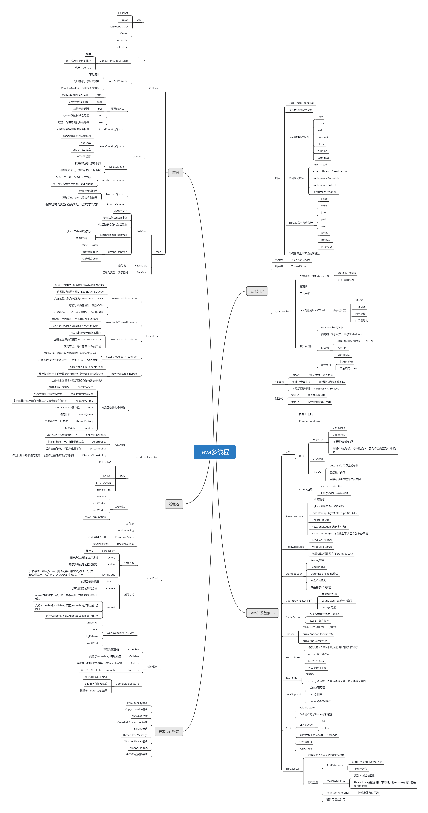

1.（选做）把示例代码，运行一遍，思考课上相关的问题。也可以做一些比较。

[LockCounter.java](../../../src/main/java/com/dhb/gts/javacourse/week4/LockCounter.java)

[ReadWriteLockCounter.java](../../../src/main/java/com/dhb/gts/javacourse/week4/ReadWriteLockCounter.java)

[CountDownLatchDemo.java](../../../src/main/java/com/dhb/gts/javacourse/week4/CountDownLatchDemo.java)

[CountDownLatchDemo2.java](../../../src/main/java/com/dhb/gts/javacourse/week4/CountDownLatchDemo2.java)

[CyclicBarrierDemo.java](../../../src/main/java/com/dhb/gts/javacourse/week4/CyclicBarrierDemo.java)

[CyclicBarrierDemo2.java](../../../src/main/java/com/dhb/gts/javacourse/week4/CyclicBarrierDemo2.java)

[SemaphoreDemo.java](../../../src/main/java/com/dhb/gts/javacourse/week4/SemaphoreDemo.java)

[SemaphoreCounter.java](../../../src/main/java/com/dhb/gts/javacourse/week4/SemaphoreCounter.java)

[SemaphoreDemo2.java](../../../src/main/java/com/dhb/gts/javacourse/week4/SemaphoreDemo2.java)

[SemaphoreDemo3.java](../../../src/main/java/com/dhb/gts/javacourse/week4/SemaphoreDemo3.java)

2.（必做）思考有多少种方式，在 main 函数启动一个新线程，运行一个方法，拿到这
个方法的返回值后，退出主线程? 写出你的方法，越多越好，提交到 GitHub。
一个简单的代码参考:  https://github.com/kimmking/JavaCourseCodes/tree/main/03concurrency/0301 /src/main/java/java0/conc0303/Homework03.java

[一个多线程异步执行的多种解决方法](一个多线程异步执行的多种解决方法.md)
一共列举了19种解决方法。

3.（选做）列举常用的并发操作 API 和工具类，简单分析其使用场景和优缺点。

[对常用的并发操作 API 和工具类的总结](对常用的并发操作%20API%20和工具类的总结.md)

4.（选做）请思考: 什么是并发? 什么是高并发? 实现高并发高可用系统需要考虑哪些 因素，对于这些你是怎么理解的?

5.（选做）请思考: 还有哪些跟并发类似 / 有关的场景和问题，有哪些可以借鉴的解决 办法。

6.（必做）把多线程和并发相关知识梳理一遍，画一个脑图，截图上传到 GitHub 上。 可选工具:xmind，百度脑图，wps，MindManage，或其他。

