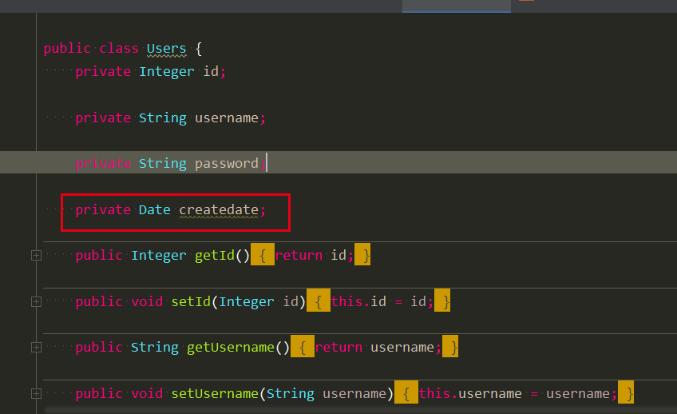
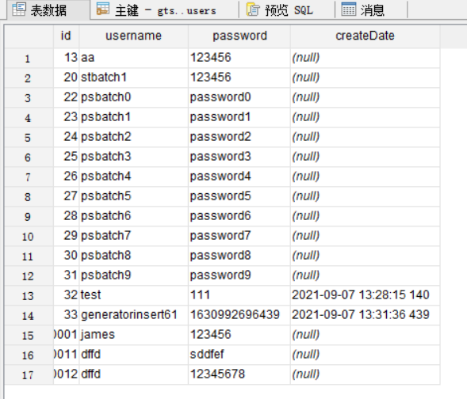
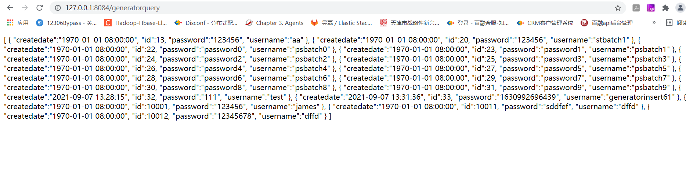

在进行mybatis开发的过程中，我们经常会遇到此类问题：如mysql的表中的日期为字符串，但是我们在java中希望按照Date类型进行操作。因此，我们需要用到mybatis中的typeHandler。
本文就是一个将数据库中 String类型存储的字段 createDate
,其格式为“yyyy-MM-ddHH:mm:ss”,通过TypeHandler转换为Date操作的实例。

# 1.TypeHandler
自定义的TypeHandler需要继承BaseTypeHandler。代码如下：
```
import com.google.common.base.Strings;
import org.apache.ibatis.type.BaseTypeHandler;
import org.apache.ibatis.type.JdbcType;
import org.apache.ibatis.type.MappedJdbcTypes;
import org.apache.ibatis.type.MappedTypes;

import java.sql.CallableStatement;
import java.sql.PreparedStatement;
import java.sql.ResultSet;
import java.sql.SQLException;
import java.text.SimpleDateFormat;
import java.util.Date;

@MappedJdbcTypes(JdbcType.VARCHAR)
@MappedTypes(Date.class)
public class MyDateTypeHandler extends BaseTypeHandler<Date> {

	private SimpleDateFormat dateFormat = new SimpleDateFormat("yyyy-MM-dd HH:mm:ss SSS");

	private Date convert(String source) {
		Date result = new Date(0);
		try {
			if (!Strings.isNullOrEmpty(source)) {
				result = dateFormat.parse(source);
			}
		} catch (Exception e) {
			e.printStackTrace();
		} 
		return result;
	}
	

	@Override
	public void setNonNullParameter(PreparedStatement ps, int i, Date parameter, JdbcType jdbcType) throws SQLException {
		String result = dateFormat.format(parameter);
		ps.setString(i, result);
	}

	@Override
	public Date getNullableResult(ResultSet rs, String columnName) throws SQLException {
		String source = rs.getString(columnName);
		return convert(source);
	}

	@Override
	public Date getNullableResult(ResultSet rs, int columnIndex) throws SQLException {
		String source = rs.getString(columnIndex);
		return convert(source);
	}

	@Override
	public Date getNullableResult(CallableStatement cs, int columnIndex) throws SQLException {
		String source = cs.getString(columnIndex);
		return convert(source);
	}
}
```
在这个类中，首先需要通过注解，@MappedJdbcTypes(JdbcType.VARCHAR)定义在数据库中的数据类型。@MappedTypes(Date.class)定义java对象中的数据类型。  
MyDateTypeHandler 继承BaseTypeHandler
，需要实现四个方法，其中一个是将Date转换为String的setNonNullParameter方法，其他三个都是将数据库操作结果的ResultSet中的String转换为String的方法。
在这个示例中，如果字符串为空，则将创建一个默认为Date(0)的对象。

# 2.generatorConfig.xml
由于将采用generators逆向生成ORM代码，因此，需要在table的定义中增加columnOverride标签对Handler进行配置，这样逆向工程的时候就会创建所需要的代码。
```
<table tableName="users" domainObjectName="Users">
	<columnOverride column="createDate" jdbcType="VARCHAR" javaType="java.util.Date" typeHandler="com.dhb.gts.javacourse.week5.typehandler.MyDateTypeHandler"/>
</table>
```
# 3.代码生成
通过 grale->other->MybatisGenerate 就能生成所需要的代码.


可以看到此时生成的代码entity中，users的createDate的类型为Date了。


主要的操作是在UsersMapper中进行了修改，@insert和select方法的@Results中都添加了MyDateTypeHandler的处理。
```
package com.dhb.gts.javacourse.week5.mapper;

import com.dhb.gts.javacourse.week5.entity.Users;
import com.dhb.gts.javacourse.week5.entity.UsersExample;
import com.dhb.gts.javacourse.week5.typehandler.MyDateTypeHandler;
import java.util.List;
import org.apache.ibatis.annotations.DeleteProvider;
import org.apache.ibatis.annotations.Insert;
import org.apache.ibatis.annotations.InsertProvider;
import org.apache.ibatis.annotations.Param;
import org.apache.ibatis.annotations.Result;
import org.apache.ibatis.annotations.Results;
import org.apache.ibatis.annotations.SelectProvider;
import org.apache.ibatis.annotations.UpdateProvider;
import org.apache.ibatis.type.JdbcType;

public interface UsersMapper {
    @SelectProvider(type=UsersSqlProvider.class, method="countByExample")
    long countByExample(UsersExample example);

    @DeleteProvider(type=UsersSqlProvider.class, method="deleteByExample")
    int deleteByExample(UsersExample example);

    @Insert({
        "insert into users (id, username, ",
        "`password`, createDate)",
        "values (#{id,jdbcType=INTEGER}, #{username,jdbcType=VARCHAR}, ",
        "#{password,jdbcType=VARCHAR}, #{createdate,jdbcType=VARCHAR,typeHandler=com.dhb.gts.javacourse.week5.typehandler.MyDateTypeHandler})"
    })
    int insert(Users record);

    @InsertProvider(type=UsersSqlProvider.class, method="insertSelective")
    int insertSelective(Users record);

    @SelectProvider(type=UsersSqlProvider.class, method="selectByExample")
    @Results({
        @Result(column="id", property="id", jdbcType=JdbcType.INTEGER),
        @Result(column="username", property="username", jdbcType=JdbcType.VARCHAR),
        @Result(column="password", property="password", jdbcType=JdbcType.VARCHAR),
        @Result(column="createDate", property="createdate", typeHandler=MyDateTypeHandler.class, jdbcType=JdbcType.VARCHAR)
    })
    List<Users> selectByExample(UsersExample example);

    @UpdateProvider(type=UsersSqlProvider.class, method="updateByExampleSelective")
    int updateByExampleSelective(@Param("record") Users record, @Param("example") UsersExample example);

    @UpdateProvider(type=UsersSqlProvider.class, method="updateByExample")
    int updateByExample(@Param("record") Users record, @Param("example") UsersExample example);
}
```

# 4.Starter
在springboot中，通过Startler启动，分别插入数据和select进行测试。
启动器：
```
package com.dhb.gts.javacourse.week5.generator;


import org.mybatis.spring.annotation.MapperScan;
import org.springframework.boot.SpringApplication;
import org.springframework.boot.autoconfigure.SpringBootApplication;

@SpringBootApplication
@MapperScan(basePackages = {"com.dhb.gts.javacourse.week5.mapper,com.dhb.gts.javacourse.week5.entity"})
public class GeneratorStarter {

	public static void main(String[] args) {
		SpringApplication.run(GeneratorStarter.class, args);
	}

}

```
rest的controller:
```
package com.dhb.gts.javacourse.week5.generator;

import com.alibaba.fastjson.JSON;
import com.alibaba.fastjson.serializer.SerializerFeature;
import com.dhb.gts.javacourse.week5.entity.Users;
import com.dhb.gts.javacourse.week5.entity.UsersExample;
import com.dhb.gts.javacourse.week5.mapper.UsersMapper;
import org.springframework.beans.factory.annotation.Autowired;
import org.springframework.web.bind.annotation.RequestMapping;
import org.springframework.web.bind.annotation.ResponseBody;
import org.springframework.web.bind.annotation.RestController;

import javax.servlet.http.HttpServletRequest;
import javax.servlet.http.HttpServletResponse;
import java.util.Date;
import java.util.List;
import java.util.Random;

@RestController
public class GeneratorController {

	@Autowired
	private UsersMapper usersMapper;
	
	private Random random = new Random();

	@RequestMapping("/generatorquery")
	@ResponseBody
	public String generatorQuery(HttpServletRequest request, HttpServletResponse response) {
		UsersExample example = new UsersExample();
		example.createCriteria();

		List<Users> list = usersMapper.selectByExample(example);
		return JSON.toJSONString(list, SerializerFeature.PrettyFormat, SerializerFeature.WriteMapNullValue,
				SerializerFeature.WriteDateUseDateFormat);
	}

	@RequestMapping("/generatorinsert")
	@ResponseBody
	public String generatorInsert(HttpServletRequest request, HttpServletResponse response) {
		Users users = new Users();
		users.setPassword(String.valueOf(System.currentTimeMillis()));
		users.setUsername("generatorinsert"+random.nextInt(100));
		users.setCreatedate(new Date());
		usersMapper.insert(users);
		return "success";
	}
}
```

此外还需注意的是，在springboot的yml文件中要增加如下内容：
```
# mybatis typehandler
mybatis.type-handlers-package: com.dhb.gts.javacouse.week5.typehandler
```

# 5.运行测试
建表语句如下：
```
CREATE TABLE users  ( 
	id        	int(11) AUTO_INCREMENT NOT NULL,
	username  	varchar(50) NULL,
	password  	varchar(50) NULL,
	createDate	varchar(50) NULL,
	PRIMARY KEY(id)
)
ENGINE = InnoDB
```
通过insert接口http://127.0.0.1:8084/generatorinsert插入数据之后，可以看到数据库中的值：

通过query接口查询如下：

可以看到我们的MyDateTypeHandler对数据进行了转换，在insert和select方法中都起到了作用。
```
