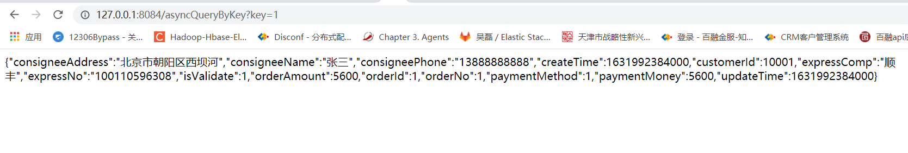

前面配置了mysql数据库的主从复制模式，在数据库上实现了master-slave配置，通过这种方式可以实现一主一从，或者一主多从，从而提升系统的高可用。
这是数据库层面的实现。在数据库实现了主从模式之后，我们需要考率的问题就是，在我们的应用代码中，如何将不同的数据库操作按需要分配到不同的数据库去执行。

# 1.需要的依赖
```
    implementation 'org.springframework.boot:spring-boot-starter'
    implementation 'org.springframework.boot:spring-boot-starter-web'
    implementation 'org.springframework.boot:spring-boot-starter-aop'
    implementation 'mysql:mysql-connector-java:8.0.25'
    implementation 'com.zaxxer:HikariCP:4.0.3'
    
```

# 2.yml配置
在application.yml文件中，数据源相关配置如下：
```
# 自定义的动态数据源配置
custom:
  datasource:
    - key: master
      type: com.zaxxer.hikari.HikariDataSource
      driver-class-name: com.mysql.cj.jdbc.Driver
      url: jdbc:mysql://192.168.161.114:3306/gts?useSSL=false&autoReconnect=true&characterEncoding=UTF-8&serverTimezone=UTC
      username: gts
      password: mysql
      default: true
    - key: slave1
      type: com.zaxxer.hikari.HikariDataSource
      driver-class-name: com.mysql.cj.jdbc.Driver
      url: jdbc:mysql://192.168.161.115:3306/gts?useSSL=false&autoReconnect=true&characterEncoding=UTF-8&serverTimezone=UTC
      username: gts
      password: mysql
    - key: slave2
      type: com.zaxxer.hikari.HikariDataSource
      driver-class-name: com.mysql.cj.jdbc.Driver
      url: jdbc:mysql://192.168.161.114:3306/gts?useSSL=false&autoReconnect=true&characterEncoding=UTF-8&serverTimezone=UTC
      username: gts
      password: mysql 
```
在custom.datasource,定义了一组数据源配置。master配置到主库，slave1喝slave2分贝表示多组从库。本文用主库来表示从库。

# 3.动态数据源配置

数据源定义：
[DynamicDataSource.java](../../../src/main/java/com/dhb/gts/javacourse/week7/v1/dynamic/DynamicDataSource.java)

动态数据源切面配置：
[DynamicDataSourceAspect.java](../../../src/main/java/com/dhb/gts/javacourse/week7/v1/dynamic/DynamicDataSourceAspect.java)

数据源切换处理
[DynamicDataSourceContextHolder.java](../../../src/main/java/com/dhb/gts/javacourse/week7/v1/dynamic/DynamicDataSourceContextHolder.java)

数据源注册类
[DynamicDataSourceRegister.java](../../../src/main/java/com/dhb/gts/javacourse/week7/v1/dynamic/DynamicDataSourceRegister.java)

定义一个注解，在使用数据源的时候通过注解进行配置：
[TargetDataSource.java](../../../src/main/java/com/dhb/gts/javacourse/week7/v1/dynamic/TargetDataSource.java)

# 4.使用说明

## 4.1 启动类配置
需要import定义的DynamicDataSourceRegister。
@Import({DynamicDataSourceRegister.class})
另外需要开启切面。
@EnableAspectJAutoProxy(proxyTargetClass=true)
```
package com.dhb.gts.javacourse.week7;

import com.dhb.gts.javacourse.week7.dynamic.DynamicDataSourceRegister;
import org.mybatis.spring.annotation.MapperScan;
import org.springframework.boot.SpringApplication;
import org.springframework.boot.autoconfigure.SpringBootApplication;
import org.springframework.context.annotation.EnableAspectJAutoProxy;
import org.springframework.context.annotation.Import;

@SpringBootApplication(scanBasePackages  = {"com.dhb.gts.javacourse.fluent.dao","com.dhb.gts.javacourse.week7"} )
@MapperScan(basePackages = {"com.dhb.gts.javacourse.fluent.mapper"})
@Import({DynamicDataSourceRegister.class})
@EnableAspectJAutoProxy(proxyTargetClass=true)
public class Starter {

	public static void main(String[] args) {
		SpringApplication.run(Starter.class, args);
	}
}

```

## 4.2 Service层注解的使用
现在将自定义的注解，配置到Service层即可使用：
```
	@Async
	@TargetDataSource(name = "master")
	public ListenableFuture<OrderSummaryEntity> asyncQueryOrderById(int order_id){
		OrderSummaryEntity entity = orderSummaryDao.selectById(order_id);
		return new AsyncResult<>(entity);
	}

	@TargetDataSource(name = "slave1")
	public OrderSummaryEntity queryOrderById(int order_id){
		return orderSummaryDao.selectById(order_id);
	}

```

通过Controller进行调用：
```
	@RequestMapping("/asyncQueryByKey")
	public String asyncQueryByKey(String key) {
		Stopwatch stopwatch = Stopwatch.createStarted();
		Integer orde_id = Integer.parseInt(key);
		OrderSummaryEntity entity = null;
		try {
			entity = orderService.asyncQueryOrderById(orde_id).get();
		}catch (Exception e) {
			e.printStackTrace();
		}
		stopwatch.stop();
		log.info("通过key查询，走索引耗时：" + stopwatch);
		return JSON.toJSONString(entity);
	}
	
		@RequestMapping("/queryByKey")
	public String queryByKey(String key) {
		Stopwatch stopwatch = Stopwatch.createStarted();
		Integer orde_id = Integer.parseInt(key);
		OrderSummaryEntity entity = orderService.queryOrderById(orde_id);
		stopwatch.stop();
		log.info("通过key查询，走索引耗时：" + stopwatch);
		return JSON.toJSONString(entity);
	}
```




查询日志：
```
2021-09-18 19:13:03.406  INFO 18368 --- [async-service-1] com.zaxxer.hikari.HikariDataSource       : HikariPool-1 - Starting...
2021-09-18 19:13:03.504  INFO 18368 --- [async-service-1] com.zaxxer.hikari.HikariDataSource       : HikariPool-1 - Start completed.
2021-09-18 19:13:03.560  INFO 18368 --- [async-service-1] c.d.g.j.week7.service.OrderService       : 通过线程池插入完成，共耗时:196.5 ms
2021-09-18 19:13:39.022  INFO 18368 --- [async-service-2] c.d.g.j.w.d.DynamicDataSourceAspect      : Use DataSource : master > ListenableFuture com.dhb.gts.javacourse.week7.service.OrderService.asyncQueryOrderById(int)
2021-09-18 19:13:39.022  INFO 18368 --- [async-service-2] d.g.j.w.d.DynamicDataSourceContextHolder : dataSourceType set is master
2021-09-18 19:13:39.031  INFO 18368 --- [nio-8084-exec-4] c.d.g.j.w.controller.OrderController     : 通过key查询，走索引耗时：14.56 ms
2021-09-18 19:15:17.534  INFO 18368 --- [nio-8084-exec-5] c.d.g.j.w.d.DynamicDataSourceAspect      : Use DataSource : slave1 > OrderSummaryEntity com.dhb.gts.javacourse.week7.service.OrderService.queryOrderById(int)
2021-09-18 19:15:17.535  INFO 18368 --- [nio-8084-exec-5] d.g.j.w.d.DynamicDataSourceContextHolder : dataSourceType set is slave1
2021-09-18 19:15:17.535  INFO 18368 --- [nio-8084-exec-5] com.zaxxer.hikari.HikariDataSource       : HikariPool-2 - Starting...
2021-09-18 19:15:17.553  INFO 18368 --- [nio-8084-exec-5] com.zaxxer.hikari.HikariDataSource       : HikariPool-2 - Start completed.
2021-09-18 19:15:17.556  INFO 18368 --- [nio-8084-exec-5] c.d.g.j.w.controller.OrderController     : 通过key查询，走索引耗时：21.28 ms
```