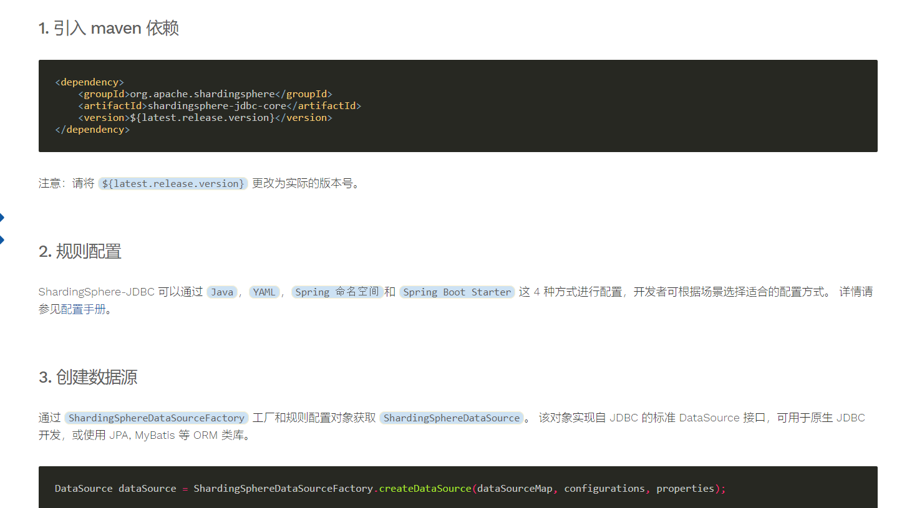
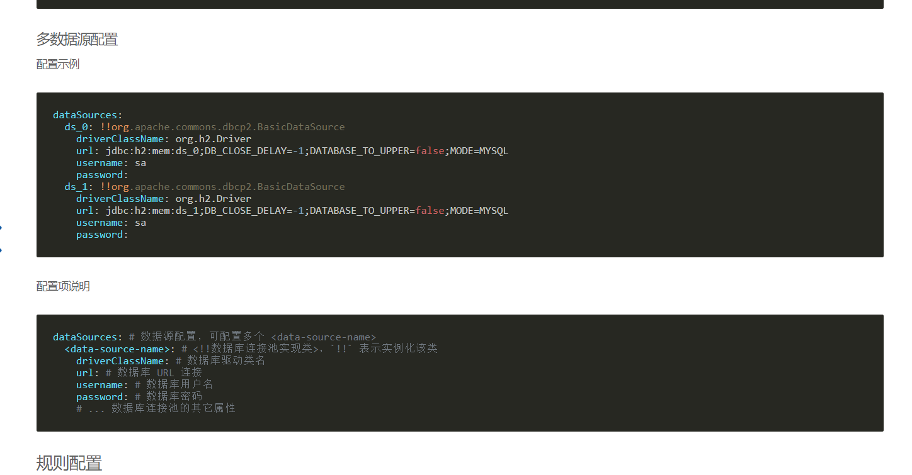

在springboot 2.5.3中配置使用ShardingSphere 5.0-alpha遇到了不少的坑，现在总结如下：

# 1.没有使用shardingsphere-jdbc-core-spring-boot-starter
在使用ShardingSphere的过程中，首先参考了下快速入门：
https://shardingsphere.apache.org/document/5.0.0-alpha/cn/quick-start/shardingsphere-jdbc-quick-start/

这个地方有一个坑是自己造成的，这个maven依赖实际上是ShardingSphere的使用方法：
第一步：
```
<dependency>
    <groupId>org.apache.shardingsphere</groupId>
    <artifactId>shardingsphere-jdbc-core</artifactId>
    <version>${latest.release.version}</version>
</dependency>
```
之后通过如下方式创建数据源：
```
DataSource dataSource = ShardingSphereDataSourceFactory.createDataSource(dataSourceMap, configurations, properties);
```

这种方式相对比较复杂，但是官方在springboot环境中已经提供了一个启动器，只需要配置上即可使用，不需要再使用上述方法进行配置。
在gradle环境中，配置如下：
```
implementation 'org.apache.shardingsphere:shardingsphere-jdbc-core-spring-boot-starter:5.0.0-alpha'
```
只需要引入上述启动器，相关的包都会导入，也不需要再手动配置dataSource。

# 2.数据源中的common配置必须存在
参考官方配置文档，上门是这么描述的：
https://shardingsphere.apache.org/document/5.0.0-alpha/cn/user-manual/shardingsphere-jdbc/configuration/spring-boot-starter/
数据源配置：
```
spring.shardingsphere.datasource.names= # 数据源名称，多数据源以逗号分隔

spring.shardingsphere.datasource.common.type=  # 数据库连接池类名称
spring.shardingsphere.datasource.common.driver-class-name= # 数据库驱动类名
spring.shardingsphere.datasource.common.username= # 数据库用户名
spring.shardingsphere.datasource.common.password= # 数据库密码
spring.shardingsphere.datasource.common.xxx=  # 数据库连接池的其它属性

spring.shardingsphere.datasource.<datasource-name>.url= # 数据库 URL 连接
```
然后可以通过如下配置覆盖：
```
spring.shardingsphere.datasource.<datasource-name>.url= # 数据库 URL 连接
spring.shardingsphere.datasource.<datasource-name>.type= # 数据库连接池类名称，覆盖 common 中的 type 配置
spring.shardingsphere.datasource.<datasource-name>.driver-class-name= # 数据库驱动类名，覆盖 common 中的 driver-class-name 配置
spring.shardingsphere.datasource.<datasource-name>.username= # 数据库用户名 ，覆盖 common 中的 username 配置
spring.shardingsphere.datasource.<datasource-name>.password= # 数据库密码 ，覆盖 common 中的 password 配置
spring.shardingsphere.datasource.<data-source-name>.xxx= # 数据库连接池的其它属性 ，覆盖 common 中其他属性配置
```
再配置这个数据配置的时候，误认为后续带数据源的配置可以覆盖comm的公共配置，那么公共配置不配置也可以。
公共配置中的属性，在某种情况下是存在不一致的，比如两个数据库的连接池类型喝驱动不同。为此，我在application.yml中配置成如下：
```
#shardingSphereJDBC配置
spring.shardingsphere.datasource.names: ds_0,ds_1
spring.shardingsphere.datasource.ds_0.type: com.zaxxer.hikari.HikariDataSource
spring.shardingsphere.datasource.ds_0.driver-class-name: com.mysql.cj.jdbc.Driver
spring.shardingsphere.datasource.ds_0.jdbc-url: jdbc:mysql://192.168.161.114:3306/gts?useSSL=false&autoReconnect=true&characterEncoding=UTF-8&serverTimezone=UTC
spring.shardingsphere.datasource.ds_0.username: gts
spring.shardingsphere.datasource.ds_0.password: mysql
spring.shardingsphere.datasource.ds_1.type: com.zaxxer.hikari.HikariDataSource
spring.shardingsphere.datasource.ds_1.driver-class-name: com.mysql.cj.jdbc.Driver
spring.shardingsphere.datasource.ds_1.jdbc-url: jdbc:mysql://192.168.161.115:3306/gts?useSSL=false&autoReconnect=true&characterEncoding=UTF-8&serverTimezone=UTC
spring.shardingsphere.datasource.ds_1.username: gts
spring.shardingsphere.datasource.ds_1.password: mysql

# 主数据源名称
spring.shardingsphere.rules.replica-query.data-sources.rw.primary-data-source-name: ds_0
# 从数据源名称，多个从数据源用逗号分隔
spring.shardingsphere.rules.replica-query.data-sources.rw.replica-data-source-names: ds_1
# 负载均衡算法名称
spring.shardingsphere.rules.replica-query.data-sources.rw.load-balancer-name: ROUND_ROBIN
spring.shardingsphere.rules.replica-query.load-balancers.round-robin.type: ROUND_ROBIN
spring.shardingsphere.rules.replica-query.load-balancers.round-robin.props.workId: 1
#是否启用查询一致性路由
spring.shardingsphere.rules.replica-query.data-sources.rw.query-consistent: true

# 打开sql输出日志
spring.shardingsphere.props.sql.show: true
logging.level.org.springframework: debug
```
启动报错：
```
Caused by: java.lang.reflect.InvocationTargetException: null
	at sun.reflect.NativeMethodAccessorImpl.invoke0(Native Method) ~[na:1.8.0_231]
	at sun.reflect.NativeMethodAccessorImpl.invoke(NativeMethodAccessorImpl.java:62) ~[na:1.8.0_231]
	at sun.reflect.DelegatingMethodAccessorImpl.invoke(DelegatingMethodAccessorImpl.java:43) ~[na:1.8.0_231]
	at java.lang.reflect.Method.invoke(Method.java:498) ~[na:1.8.0_231]
	at org.apache.shardingsphere.spring.boot.util.PropertyUtil.v2(PropertyUtil.java:111) ~[shardingsphere-jdbc-spring-boot-starter-infra-5.0.0-alpha.jar:5.0.0-alpha]
	at org.apache.shardingsphere.spring.boot.util.PropertyUtil.handle(PropertyUtil.java:75) ~[shardingsphere-jdbc-spring-boot-starter-infra-5.0.0-alpha.jar:5.0.0-alpha]
	at org.apache.shardingsphere.spring.boot.datasource.DataSourceMapSetter.getDataSourceMap(DataSourceMapSetter.java:66) ~[shardingsphere-jdbc-spring-boot-starter-infra-5.0.0-alpha.jar:5.0.0-alpha]
	at org.apache.shardingsphere.spring.boot.SpringBootConfiguration.setEnvironment(SpringBootConfiguration.java:88) ~[shardingsphere-jdbc-core-spring-boot-starter-5.0.0-alpha.jar:5.0.0-alpha]
	at org.springframework.context.support.ApplicationContextAwareProcessor.invokeAwareInterfaces(ApplicationContextAwareProcessor.java:110) ~[spring-context-5.3.9.jar:5.3.9]
	at org.springframework.context.support.ApplicationContextAwareProcessor.postProcessBeforeInitialization(ApplicationContextAwareProcessor.java:102) ~[spring-context-5.3.9.jar:5.3.9]
	at org.springframework.beans.factory.support.AbstractAutowireCapableBeanFactory.applyBeanPostProcessorsBeforeInitialization(AbstractAutowireCapableBeanFactory.java:422) ~[spring-beans-5.3.9.jar:5.3.9]
	at org.springframework.beans.factory.support.AbstractAutowireCapableBeanFactory.initializeBean(AbstractAutowireCapableBeanFactory.java:1778) ~[spring-beans-5.3.9.jar:5.3.9]
	at org.springframework.beans.factory.support.AbstractAutowireCapableBeanFactory.doCreateBean(AbstractAutowireCapableBeanFactory.java:602) ~[spring-beans-5.3.9.jar:5.3.9]
	... 29 common frames omitted
Caused by: java.util.NoSuchElementException: No value bound
	at org.springframework.boot.context.properties.bind.BindResult.get(BindResult.java:55) ~[spring-boot-2.5.3.jar:2.5.3]
	... 42 common frames omitted
```
这个错误非常不友好，这个地方并没有打印出是什么配置项错误导致的配置失败。我查看源码才知道：
```
public static Map<String, DataSource> getDataSourceMap(final Environment environment) {
        Map<String, DataSource> result = new LinkedHashMap<>();
        Map<String, Object> dataSourceCommonProps = PropertyUtil.handle(environment, COMMON_PREFIX, Map.class);
        for (String each : getDataSourceNames(environment, PREFIX)) {
            try {
                result.put(each, getDataSource(environment, PREFIX, each, dataSourceCommonProps));
            } catch (final ReflectiveOperationException ex) {
                throw new ShardingSphereException("Can't find data source type.", ex);
            } catch (final NamingException ex) {
                throw new ShardingSphereException("Can't find JNDI data source.", ex);
            }
        }
        return result;
    }
```
此时的COMMON_PREFIX为：
```
 private static final String COMMON_PREFIX = "spring.shardingsphere.datasource.common.";
```
那就说明，以spring.shardingsphere.datasource.common的配置必须存在配置文件中，否则会报错。
最终改为如下格式这个问题才算解决：
```
#shardingSphereJDBC配置
spring.shardingsphere.datasource.names: ds_0,ds_1
spring.shardingsphere.datasource.common.type: com.zaxxer.hikari.HikariDataSource
spring.shardingsphere.datasource.common.driver-class-name: com.mysql.cj.jdbc.Driver
spring.shardingsphere.datasource.ds_0.jdbc-url: jdbc:mysql://192.168.161.114:3306/gts?useSSL=false&autoReconnect=true&characterEncoding=UTF-8&serverTimezone=UTC
spring.shardingsphere.datasource.ds_0.username: gts
spring.shardingsphere.datasource.ds_0.password: mysql
spring.shardingsphere.datasource.ds_1.jdbc-url: jdbc:mysql://192.168.161.115:3306/gts?useSSL=false&autoReconnect=true&characterEncoding=UTF-8&serverTimezone=UTC
spring.shardingsphere.datasource.ds_1.username: gts
spring.shardingsphere.datasource.ds_1.password: mysql
```

# 3.数据源命名不能有小下划线
按上述的数据源配置启动：
```
2021-09-21 01:01:07.878 DEBUG 3336 --- [  restartedMain] o.s.b.d.LoggingFailureAnalysisReporter   : Application failed to start due to an exception

org.springframework.boot.context.properties.source.InvalidConfigurationPropertyNameException: Configuration property name 'spring.shardingsphere.datasource.ds_0' is not valid
	at org.springframework.boot.context.properties.source.ConfigurationPropertyName.elementsOf(ConfigurationPropertyName.java:612) ~[spring-boot-2.5.3.jar:2.5.3]
	at org.springframework.boot.context.properties.source.ConfigurationPropertyName.elementsOf(ConfigurationPropertyName.java:589) ~[spring-boot-2.5.3.jar:2.5.3]
	at org.springframework.boot.context.properties.source.ConfigurationPropertyName.of(ConfigurationPropertyName.java:580) ~[spring-boot-2.5.3.jar:2.5.3]
	at org.springframework.boot.context.properties.source.ConfigurationPropertyName.of(ConfigurationPropertyName.java:557) ~[spring-boot-2.5.3.jar:2.5.3]
	at org.springframework.boot.context.properties.bind.Binder.bind(Binder.java:220) ~[spring-boot-2.5.3.jar:2.5.3]
	at org.springframework.boot.context.properties.bind.Binder.bind(Binder.java:207) ~[spring-boot-2.5.3.jar:2.5.3]
	at sun.reflect.NativeMethodAccessorImpl.invoke0(Native Method) ~[na:1.8.0_231]
	at sun.reflect.NativeMethodAccessorImpl.invoke(NativeMethodAccessorImpl.java:62) ~[na:1.8.0_231]
	at sun.reflect.DelegatingMethodAccessorImpl.invoke(DelegatingMethodAccessorImpl.java:43) ~[na:1.8.0_231]
	at java.lang.reflect.Method.invoke(Method.java:498) ~[na:1.8.0_231]
	at org.apache.shardingsphere.spring.boot.util.PropertyUtil.v2(PropertyUtil.java:109) ~[shardingsphere-jdbc-spring-boot-starter-infra-5.0.0-alpha.jar:5.0.0-alpha]
	at org.apache.shardingsphere.spring.boot.util.PropertyUtil.handle(PropertyUtil.java:75) ~[shardingsphere-jdbc-spring-boot-starter-infra-5.0.0-alpha.jar:5.0.0-alpha]
	at org.apache.shardingsphere.spring.boot.datasource.DataSourceMapSetter.getDataSource(DataSourceMapSetter.java:92) ~[shardingsphere-jdbc-spring-boot-starter-infra-5.0.0-alpha.jar:5.0.0-alpha]
	at org.apache.shardingsphere.spring.boot.datasource.DataSourceMapSetter.getDataSourceMap(DataSourceMapSetter.java:69) ~[shardingsphere-jdbc-spring-boot-starter-infra-5.0.0-alpha.jar:5.0.0-alpha]
	at org.apache.shardingsphere.spring.boot.SpringBootConfiguration.setEnvironment(SpringBootConfiguration.java:88) ~[shardingsphere-jdbc-core-spring-boot-starter-5.0.0-alpha.jar:5.0.0-alpha]
	at org.springframework.context.support.ApplicationContextAwareProcessor.invokeAwareInterfaces(ApplicationContextAwareProcessor.java:110) ~[spring-context-5.3.9.jar:5.3.9]
	at org.springframework.context.support.ApplicationContextAwareProcessor.postProcessBeforeInitialization(ApplicationContextAwareProcessor.java:102) ~[spring-context-5.3.9.jar:5.3.9]
	at org.springframework.beans.factory.support.AbstractAutowireCapableBeanFactory.applyBeanPostProcessorsBeforeInitialization(AbstractAutowireCapableBeanFactory.java:422) ~[spring-beans-5.3.9.jar:5.3.9]
	at org.springframework.beans.factory.support.AbstractAutowireCapableBeanFactory.initializeBean(AbstractAutowireCapableBeanFactory.java:1778) ~[spring-beans-5.3.9.jar:5.3.9]
	at org.springframework.beans.factory.support.AbstractAutowireCapableBeanFactory.doCreateBean(AbstractAutowireCapableBeanFactory.java:602) ~[spring-beans-5.3.9.jar:5.3.9]
	at org.springframework.beans.factory.support.AbstractAutowireCapableBeanFactory.createBean(AbstractAutowireCapableBeanFactory.java:524) ~[spring-beans-5.3.9.jar:5.3.9]
	at org.springframework.beans.factory.support.AbstractBeanFactory.lambda$doGetBean$0(AbstractBeanFactory.java:335) ~[spring-beans-5.3.9.jar:5.3.9]
	at org.springframework.beans.factory.support.DefaultSingletonBeanRegistry.getSingleton(DefaultSingletonBeanRegistry.java:234) ~[spring-beans-5.3.9.jar:5.3.9]
	at org.springframework.beans.factory.support.AbstractBeanFactory.doGetBean(AbstractBeanFactory.java:333) ~[spring-beans-5.3.9.jar:5.3.9]
	at org.springframework.beans.factory.support.AbstractBeanFactory.getBean(AbstractBeanFactory.java:208) ~[spring-beans-5.3.9.jar:5.3.9]
	at org.springframework.beans.factory.support.ConstructorResolver.instantiateUsingFactoryMethod(ConstructorResolver.java:410) ~[spring-beans-5.3.9.jar:5.3.9]
	at org.springframework.beans.factory.support.AbstractAutowireCapableBeanFactory.instantiateUsingFactoryMethod(AbstractAutowireCapableBeanFactory.java:1334) ~[spring-beans-5.3.9.jar:5.3.9]
	at org.springframework.beans.factory.support.AbstractAutowireCapableBeanFactory.createBeanInstance(AbstractAutowireCapableBeanFactory.java:1177) ~[spring-beans-5.3.9.jar:5.3.9]
	at org.springframework.beans.factory.support.AbstractAutowireCapableBeanFactory.doCreateBean(AbstractAutowireCapableBeanFactory.java:564) ~[spring-beans-5.3.9.jar:5.3.9]
	at org.springframework.beans.factory.support.AbstractAutowireCapableBeanFactory.createBean(AbstractAutowireCapableBeanFactory.java:524) ~[spring-beans-5.3.9.jar:5.3.9]
	at org.springframework.beans.factory.support.AbstractBeanFactory.lambda$doGetBean$0(AbstractBeanFactory.java:335) ~[spring-beans-5.3.9.jar:5.3.9]
	at org.springframework.beans.factory.support.DefaultSingletonBeanRegistry.getSingleton(DefaultSingletonBeanRegistry.java:234) ~[spring-beans-5.3.9.jar:5.3.9]
	at org.springframework.beans.factory.support.AbstractBeanFactory.doGetBean(AbstractBeanFactory.java:333) ~[spring-beans-5.3.9.jar:5.3.9]
	at org.springframework.beans.factory.support.AbstractBeanFactory.getBean(AbstractBeanFactory.java:213) ~[spring-beans-5.3.9.jar:5.3.9]
	at org.springframework.context.support.PostProcessorRegistrationDelegate.registerBeanPostProcessors(PostProcessorRegistrationDelegate.java:258) ~[spring-context-5.3.9.jar:5.3.9]
	at org.springframework.context.support.AbstractApplicationContext.registerBeanPostProcessors(AbstractApplicationContext.java:762) ~[spring-context-5.3.9.jar:5.3.9]
	at org.springframework.context.support.AbstractApplicationContext.refresh(AbstractApplicationContext.java:567) ~[spring-context-5.3.9.jar:5.3.9]
	at org.springframework.boot.web.servlet.context.ServletWebServerApplicationContext.refresh(ServletWebServerApplicationContext.java:145) ~[spring-boot-2.5.3.jar:2.5.3]
	at org.springframework.boot.SpringApplication.refresh(SpringApplication.java:754) [spring-boot-2.5.3.jar:2.5.3]
	at org.springframework.boot.SpringApplication.refreshContext(SpringApplication.java:434) [spring-boot-2.5.3.jar:2.5.3]
	at org.springframework.boot.SpringApplication.run(SpringApplication.java:338) [spring-boot-2.5.3.jar:2.5.3]
	at org.springframework.boot.SpringApplication.run(SpringApplication.java:1343) [spring-boot-2.5.3.jar:2.5.3]
	at org.springframework.boot.SpringApplication.run(SpringApplication.java:1332) [spring-boot-2.5.3.jar:2.5.3]
	at com.dhb.gts.javacourse.week7.v2.Starter.main(Starter.java:12) [main/:na]
	at sun.reflect.NativeMethodAccessorImpl.invoke0(Native Method) ~[na:1.8.0_231]
	at sun.reflect.NativeMethodAccessorImpl.invoke(NativeMethodAccessorImpl.java:62) ~[na:1.8.0_231]
	at sun.reflect.DelegatingMethodAccessorImpl.invoke(DelegatingMethodAccessorImpl.java:43) ~[na:1.8.0_231]
	at java.lang.reflect.Method.invoke(Method.java:498) ~[na:1.8.0_231]
	at org.springframework.boot.devtools.restart.RestartLauncher.run(RestartLauncher.java:49) [spring-boot-devtools-2.5.3.jar:2.5.3]

2021-09-21 01:01:07.879 ERROR 3336 --- [  restartedMain] o.s.b.d.LoggingFailureAnalysisReporter   : 

***************************
APPLICATION FAILED TO START
***************************

Description:

Configuration property name 'spring.shardingsphere.datasource.ds_0' is not valid:

    Invalid characters: '_'
    Bean: org.apache.shardingsphere.spring.boot.SpringBootConfiguration
    Reason: Canonical names should be kebab-case ('-' separated), lowercase alpha-numeric characters and must start with a letter

Action:

Modify 'spring.shardingsphere.datasource.ds_0' so that it conforms to the canonical names requirements.


Process finished with exit code 0
```
不幸，仍然存在错误。
提示我数据源的命名不能有下划线。
我这个数据源命名可是参考了yaml的多数据源配置实例:
https://shardingsphere.apache.org/document/5.0.0-alpha/cn/user-manual/shardingsphere-jdbc/configuration/yaml/

没办法，我将数据源配置改为 master slave1 解决了该问题。
```
#shardingSphereJDBC配置
spring.shardingsphere.datasource.names: master,slave1
spring.shardingsphere.datasource.common.type: com.zaxxer.hikari.HikariDataSource
spring.shardingsphere.datasource.common.driver-class-name: com.mysql.cj.jdbc.Driver
spring.shardingsphere.datasource.master.jdbc-url: jdbc:mysql://192.168.161.114:3306/gts?useSSL=false&autoReconnect=true&characterEncoding=UTF-8&serverTimezone=UTC
spring.shardingsphere.datasource.master.username: gts
spring.shardingsphere.datasource.master.password: mysql
spring.shardingsphere.datasource.slave1.jdbc-url: jdbc:mysql://192.168.161.115:3306/gts?useSSL=false&autoReconnect=true&characterEncoding=UTF-8&serverTimezone=UTC
spring.shardingsphere.datasource.slave1.username: gts
spring.shardingsphere.datasource.slave1.password: mysql
```

# 4. load-balancers 相关配置必须存在否则报错
在一开始，参考读写分离配置：
https://shardingsphere.apache.org/document/5.0.0-alpha/cn/user-manual/shardingsphere-jdbc/configuration/spring-boot-starter/replica-query/
```
spring.shardingsphere.datasource.names= # 省略数据源配置

spring.shardingsphere.rules.replica-query.data-sources.<replica-query-data-source-name>.primary-data-source-name= # 主数据源名称
spring.shardingsphere.rules.replica-query.data-sources.<replica-query-data-source-name>.replica-data-source-names= # 从数据源名称，多个从数据源用逗号分隔
spring.shardingsphere.rules.replica-query.data-sources.<replica-query-data-source-name>.load-balancer-name= # 负载均衡算法名称

# 负载均衡算法配置
spring.shardingsphere.rules.replica-query.load-balancers.<load-balance-algorithm-name>.type= # 负载均衡算法类型
spring.shardingsphere.rules.replica-query.load-balancers.<load-balance-algorithm-name>.props.xxx= # 负载均衡算法属性配置
```
这个负载均衡算法我误认为是自定义的负载均衡算法才需要配置。我只配置了前面的负载均衡的算法名称。后面两个配置没有配置：
```
spring.shardingsphere.rules.replica-query.load-balancers.<load-balance-algorithm-name>.type= # 负载均衡算法类型
spring.shardingsphere.rules.replica-query.load-balancers.<load-balance-algorithm-name>.props.xxx= # 负载均衡算法属性配置
```
启动之后报错：
```
2021-09-21 01:06:10.754 DEBUG 12264 --- [  restartedMain] ConfigServletWebServerApplicationContext : Closing org.springframework.boot.web.servlet.context.AnnotationConfigServletWebServerApplicationContext@5a8d238d, started on Tue Sep 21 01:06:09 CST 2021
Exception in thread "restartedMain" java.lang.reflect.InvocationTargetException
	at sun.reflect.NativeMethodAccessorImpl.invoke0(Native Method)
	at sun.reflect.NativeMethodAccessorImpl.invoke(NativeMethodAccessorImpl.java:62)
	at sun.reflect.DelegatingMethodAccessorImpl.invoke(DelegatingMethodAccessorImpl.java:43)
	at java.lang.reflect.Method.invoke(Method.java:498)
	at org.springframework.boot.devtools.restart.RestartLauncher.run(RestartLauncher.java:49)
Caused by: java.lang.reflect.UndeclaredThrowableException
	at org.springframework.util.ReflectionUtils.rethrowRuntimeException(ReflectionUtils.java:147)
	at org.springframework.boot.SpringApplication.handleRunFailure(SpringApplication.java:817)
	at org.springframework.boot.SpringApplication.run(SpringApplication.java:348)
	at org.springframework.boot.SpringApplication.run(SpringApplication.java:1343)
	at org.springframework.boot.SpringApplication.run(SpringApplication.java:1332)
	at com.dhb.gts.javacourse.week7.v2.Starter.main(Starter.java:12)
	... 5 more
Caused by: java.lang.reflect.InvocationTargetException
	at sun.reflect.NativeMethodAccessorImpl.invoke0(Native Method)
	at sun.reflect.NativeMethodAccessorImpl.invoke(NativeMethodAccessorImpl.java:62)
	at sun.reflect.DelegatingMethodAccessorImpl.invoke(DelegatingMethodAccessorImpl.java:43)
	at java.lang.reflect.Method.invoke(Method.java:498)
	at org.apache.shardingsphere.spring.boot.util.PropertyUtil.v2(PropertyUtil.java:111)
	at org.apache.shardingsphere.spring.boot.util.PropertyUtil.handle(PropertyUtil.java:75)
	at org.apache.shardingsphere.spring.boot.registry.AbstractAlgorithmProvidedBeanRegistry.lambda$registerBean$1(AbstractAlgorithmProvidedBeanRegistry.java:57)
	at java.lang.Iterable.forEach(Iterable.java:75)
	at org.apache.shardingsphere.spring.boot.registry.AbstractAlgorithmProvidedBeanRegistry.registerBean(AbstractAlgorithmProvidedBeanRegistry.java:55)
	at org.apache.shardingsphere.replicaquery.spring.boot.algorithm.ReplicaQueryAlgorithmProvidedBeanRegistry.postProcessBeanDefinitionRegistry(ReplicaQueryAlgorithmProvidedBeanRegistry.java:43)
	at org.springframework.context.support.PostProcessorRegistrationDelegate.invokeBeanDefinitionRegistryPostProcessors(PostProcessorRegistrationDelegate.java:311)
	at org.springframework.context.support.PostProcessorRegistrationDelegate.invokeBeanFactoryPostProcessors(PostProcessorRegistrationDelegate.java:142)
	at org.springframework.context.support.AbstractApplicationContext.invokeBeanFactoryPostProcessors(AbstractApplicationContext.java:746)
	at org.springframework.context.support.AbstractApplicationContext.refresh(AbstractApplicationContext.java:564)
	at org.springframework.boot.web.servlet.context.ServletWebServerApplicationContext.refresh(ServletWebServerApplicationContext.java:145)
	at org.springframework.boot.SpringApplication.refresh(SpringApplication.java:754)
	at org.springframework.boot.SpringApplication.refreshContext(SpringApplication.java:434)
	at org.springframework.boot.SpringApplication.run(SpringApplication.java:338)
	... 8 more
Caused by: java.util.NoSuchElementException: No value bound
	at org.springframework.boot.context.properties.bind.BindResult.get(BindResult.java:55)
	... 26 more

Process finished with exit code 0
```
最终加上该配置才解决。


# 5.完整配置
附上一份启动成功的完整配置：
```
#shardingSphereJDBC配置
spring.shardingsphere.datasource.names: master,slave1
spring.shardingsphere.datasource.common.type: com.zaxxer.hikari.HikariDataSource
spring.shardingsphere.datasource.common.driver-class-name: com.mysql.cj.jdbc.Driver
spring.shardingsphere.datasource.master.jdbc-url: jdbc:mysql://192.168.161.114:3306/gts?useSSL=false&autoReconnect=true&characterEncoding=UTF-8&serverTimezone=UTC
spring.shardingsphere.datasource.master.username: gts
spring.shardingsphere.datasource.master.password: mysql
spring.shardingsphere.datasource.slave1.jdbc-url: jdbc:mysql://192.168.161.115:3306/gts?useSSL=false&autoReconnect=true&characterEncoding=UTF-8&serverTimezone=UTC
spring.shardingsphere.datasource.slave1.username: gts
spring.shardingsphere.datasource.slave1.password: mysql

# 主数据源名称
spring.shardingsphere.rules.replica-query.data-sources.rw.primary-data-source-name: master
# 从数据源名称，多个从数据源用逗号分隔
spring.shardingsphere.rules.replica-query.data-sources.rw.replica-data-source-names: slave1
# 负载均衡算法名称
spring.shardingsphere.rules.replica-query.data-sources.rw.load-balancer-name: ROUND_ROBIN
spring.shardingsphere.rules.replica-query.load-balancers.round-robin.type: ROUND_ROBIN
spring.shardingsphere.rules.replica-query.load-balancers.round-robin.props.workId: 1
#是否启用查询一致性路由
spring.shardingsphere.rules.replica-query.data-sources.rw.query-consistent: true

# 打开sql输出日志
spring.shardingsphere.props.sql.show: true
```