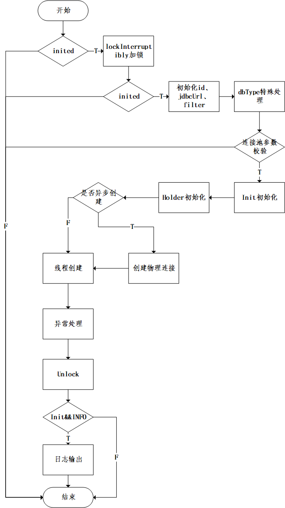

DruidDataSource的使用都是创建DruidDataSource对象，set配置参数之后，调用init方法。
通过mock测试实例化DruidDataSource：
```
DruidDataSource ds = new DruidDataSource();
ds.setUrl("jdbc:fake:dragoon_v25masterdb");
ds.setUsername("tddl5");
ds.setPassword("tddl5");
ds.setFilters("stat");
ds.init();
```
init方法是使用 DruidDataSource的入口。

# 1.init过程

该方法大约200行。主要过程为：

## 1.1 double check 
判断inited状态，这样确保init方法在同一个DataSource对象中只会被执行一次。（后面有加锁）。
之后内部开启要给ReentrantLock。这个lock调用lockInterruptibly。 如果获取不到lock,则会将当前的线程休眠。
再次检测inited状态。如果为true,则返回。这里做了一个DoubleCheck。
定义initStackTrace ，为后续需要getInitStackTrace方法使用。

生成DruidDataSource的id。这是一个AtomicInteger，从1开始递增，每个DataSource都会加1。

## 1.2 初始化
初始化jdbcUrl。trim处理。
初始化的Filter处理，默认会增加要给StatFilter。
根据dbType,进行cacheServerConfiguration的特殊处理。部分数据库需要将这个参数设置为false。

对maxActive、minIdle、timeBetweenLogStatsMillis、maxEvictableIdleTimeMillis、keepAlive、keepAliveBetweenTimeMillis等参数进行校验。

```
//初始化SPI
initFromSPIServiceLoader();
//解决驱动相关的配置
resolveDriver();
//初始化校验
initCheck();
//初始化异常存储
initExceptionSorter();
//初始化validConnectionChecker 不同的数据库的对象不同
initValidConnectionChecker();
//校验连接查询的sql
validationQueryCheck();
```

之后，dataSourceStat是否采用了Global。对dataSourceStat进行set。
初始化holder的数组：
```
connections = new DruidConnectionHolder[maxActive];
evictConnections = new DruidConnectionHolder[maxActive];
keepAliveConnections = new DruidConnectionHolder[maxActive];
```
## 1.3 创建连接
判断是否进行异步初始化： if (createScheduler != null && asyncInit) 。
如果异步初始化，调用通过submitCreateTask进行。
如果poolingCount < initialSize，则创建物理连接。
如果initialSize不配置为0，在初始化过程中，这个条件不会被触发，这样只有真正需要Connection的时候，才会去创建物理的连接。
如果指定了initialSize，则在初始化的过程中，初始化线程就创建了initialSize的连接的holder并放置到connections中。
```
//判断当前在pool中的holder数量是否小于初始化参数指定的initialSize
 while (poolingCount < initialSize) {
    try {
        PhysicalConnectionInfo pyConnectInfo = createPhysicalConnection();
        DruidConnectionHolder holder = new DruidConnectionHolder(this, pyConnectInfo);
        connections[poolingCount++] = holder;
        
        ... ...
```
在同步初始化的条件下，初始化操作将通过init线程进行。而后续由于连接池使用过程中动态的收缩和扩展，则是由其他单独的线程来完成。
反之，如果需要进行异步初始化，则会调用submitCreateTask方法来异步进行。

## 1.4 创建线程
创建如下线程：
```
//创建日志线程  但是这个线程的条件timeBetweenLogStatsMillis大于0，如果这个参数没有配置，日志线程不会创建。
createAndLogThread();

//  创建一个CreateConnectionThread对象，并启动。初始化变量createConnectionThread。
createAndStartCreatorThread();
// 创建 DestroyTask对象。同时创建DestroyConnectionThread线程，并start,初始化destroyConnectionThread。
createAndStartDestroyThread();
```

之后，在initedLatch处等待。
initedLatch会在createAndStartCreatorThread与createAndStartDestroyThread都执行完之后，countdown结束。
这个地方是用来确保上述两个方法都执行完毕，再进行后续的操作。

之后 init 状态为true,并初始化initedTime时间为当前的Date时间。注册registerMbean。
如果keepAlive为true,还需调用submitCreateTask方法，将连接填充到minIdle。确保空闲的连接可用。

## 1.5 finally处理
finally处理逻辑：
修改inited为true,并解锁。
判断init和日志的INFO状态，打印一条init完成的日志。
格式如下：
```
2021-11-09 15:22:16,683 [INFO ] DruidDataSource:998 - {dataSource-1} inited
```
从这可以看出，局部变量init只是为了控制再finally中是否打印日志。


# 2.总结
init过程，对DruidDataSource进行了初始化操作，为了防止多线程并发场景下进行init操作，采用了Double Check的方式，配合ReentrentLock两次判断来实现。
详细流程如下图：


