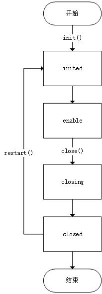

DruidPooledConnection中的状态：

|字段|类型|所在类|默认值|说明|
|:----|:----|:----|:----|:----|
|closed|volatile   boolean|DruidPooledConnection|false|关闭状态，recycle到连接池中的连接会修改为true。但是这个状态通常只在checkStateInternal中单独使用。判断连接是否关闭需要结合(closed  or disable)|
|disable|volatile   boolean|DruidPooledConnection|false|不可用状态，当连接出现异常调用handleFatalError之后，将此状态设置为true.之后连接处于不可用状态。|
|traceEnable|volatile   boolean|DruidPooledConnection|false|traceEnable跟踪开关，默认为false,这个开关配合abandoned使用，当DruidDataSource开启removeAbandoned之后，这个状态设置为true,当连接从activeConnections中取出的时候，设置为false.|
|abandoned|volatile   boolean|DruidPooledConnection|false|连接泄露检测状态，默认为false,当removeAbandoned开始执行之后，对符合条件的连接，将其设置为true的时候开启连接泄露检测。|
|running|volatile   boolean|DruidPooledConnection|false|运行状态，执行Statement之前的beforeExecute设置为true,执行完成之后afterExecute方法设置为false.|
|active|volatile   boolean|DruidConnectionHolder|false|活动状态,默认值为false,getConnectionInternal之后设置为true,discardConnection设置为false,recycle如果物理连接被关闭或者测试连接不通，以及回收成功，都修改为false。这是连接被用户线程调用的持有状态。标识连接被用户线程持有。|
|discard|volatile   boolean|DruidConnectionHolder|false|关闭状态，默认为false,调用discardConnection方法 或者recycle出现异常的时候改为true,之后关闭连接，|

DruidDataSource中的状态：

|字段|类型|所在类|默认值|说明|
|:----|:----|:----|:----|:----|
|closing|volatile   boolean|DruidDataSource|false|关闭中状态，调用close方法设置为true，如果关闭完成，则这个状态设置为false.|
|closed|volatile   boolean|DruidDataSource|false|关闭完成状态,close方法调用完成为true.这样连接池将不可使用。|
|enable|volatile   boolean|DruidDataSource|true|可用状态，默认为true,当调用close完成之后，设置为false。这样连接池将不可用。|
|keepAlive|volatile   boolean|DruidDataSource|false|keepAlive开关，由用户自行设置，如果开启了keepAlive，则在shrink方法中将符合条件的连接回收到keepAliveConnections中，并进行复用。|
|inited|volatile   boolean|DruidDataSource|false|初始化状态，默认为false,调用init之后设置为true标识初始化完成，之后调用restart设置为false。|

各状态关系：
