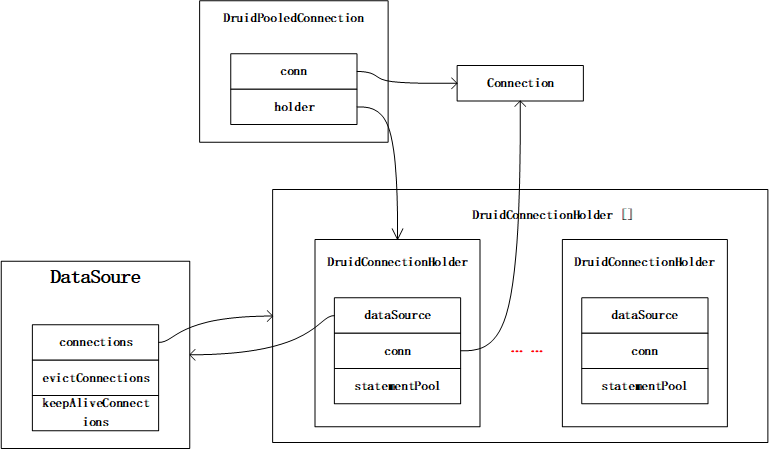
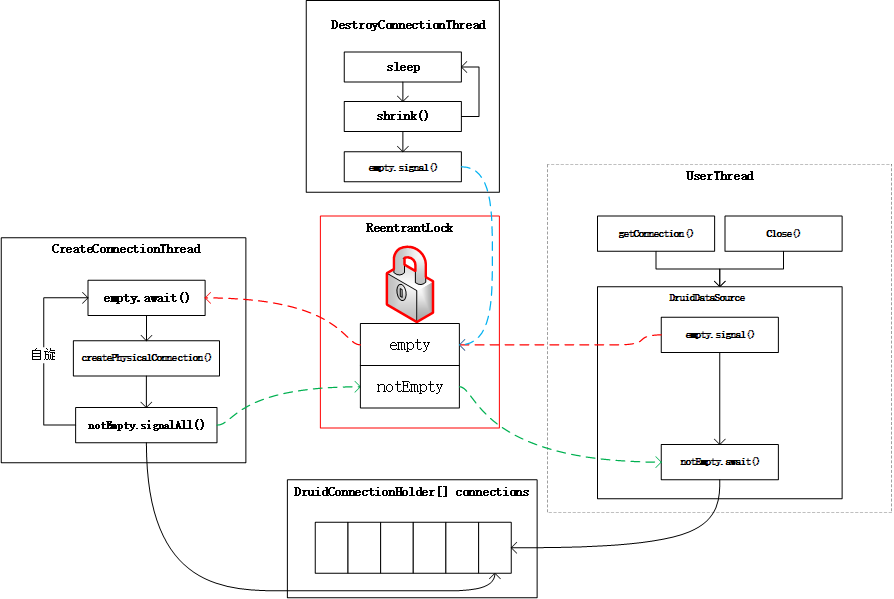
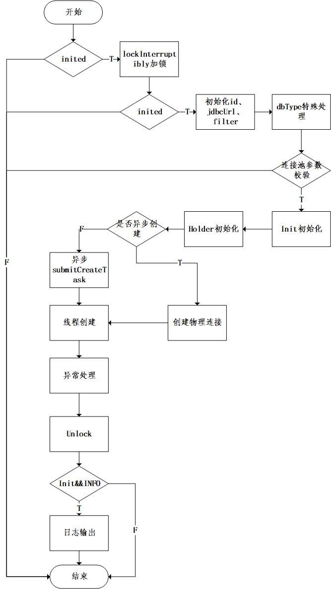
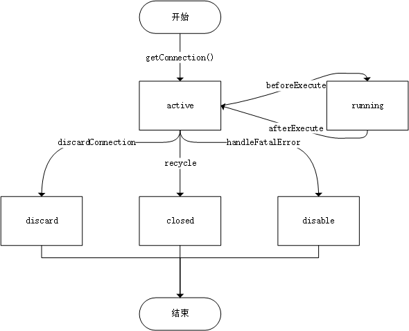
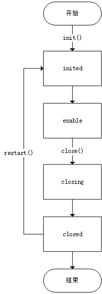
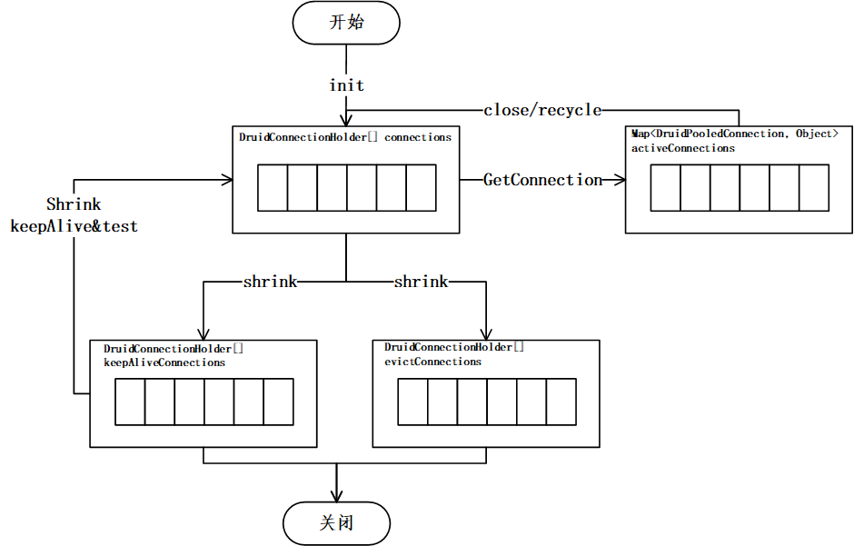

# 1.数据结构
DruidDataSource是DruidCP最关键的类之一，承载了连接池的启动、关闭、以及连接的获取和管理等功能。
其内部关键的的数据结构如下表:

|name|type|说明|
|:----|:----|:----|
|connections|volatile DruidConnectionHolder[]|pool的关键数组，存放连接，实际上是DruidConnectionHolder的数组。Connection由DruidConnectionHolder持有|
|evictConnections|DruidConnectionHolder[]|被驱逐的Connection的pool,调用收缩方法shrink之后，被收缩的连接都会进入这个数组。|
|keepAliveConnections|DruidConnectionHolder[]|收缩方法shrink中，满足keepalive状态的连接都进入这个数组。|
|autoFilters|static List<Filter>|这个list存全部的filter|
|enable| volatile boolean|默认值为true,标识连接池是否可用，调用close方法设置该值为false,当为false的时候，连接的error次数增加1,get连接或者其他操作会失败。|
|inited|volatile boolean|默认值为false,初始化完成的标识。|
|closing|volatile boolean|关闭过程中的状态。正在close|
|closed|volatile boolean|关闭完成的状态。|


连接池最关键的数据结构是内部持有DruidConnectionHolder的数组，connections。
DruidConnectionHolder的数据结构为：

|name|type|说明|
|:----|:----|:----|
|dataSource|final DruidAbstractDataSource|指向DataSource的指针。|
|conn|final Connection|指向真正的数据库连接，由数据库驱动实现。|
|connectionId|final long|连接编号。|
|connectionEventListeners|final List<ConnectionEventListener>|连接事件监听器。|
|statementEventListeners|final List<StatementEventListener>|statement事件监听器。|
|statementPool|PreparedStatementPool|其内部是一个LRUCache，对Statement做缓存。|
|statementTrace|final List<Statement>|一个对Statement进行追踪的list,这个statementTrace的作用后面需要详细看看。|

DruidConnectionHolder是连接池中物理连接的载体，在DruidDataSource中，获取连接的getConnection方法，拿到的是DruidPooledConnection。
```

    public DruidPooledConnection getConnection(long maxWaitMillis) throws SQLException {
        //执行初始化
        init();
        //如果filter存在 则执行filter,通过filter的代理类来得到连接。
        if (filters.size() > 0) {
            //filter的chain
            FilterChainImpl filterChain = new FilterChainImpl(this);
            return filterChain.dataSource_connect(this, maxWaitMillis);
        } else {
        //如果filter不存在，则直接获取连接。
            return getConnectionDirect(maxWaitMillis);
        }
    }
```
最终得到connection的方法：
```
poolableConnection = getConnectionInternal(maxWaitMillis);
```
这个方法中，也是根据DruidConnectionHolder产生：
```
 DruidPooledConnection poolalbeConnection = new DruidPooledConnection(holder);
 return poolalbeConnection;
```
查看这个构造函数：
```
   public DruidPooledConnection(DruidConnectionHolder holder){
        super(holder.getConnection());

        this.conn = holder.getConnection();
        this.holder = holder;
        this.lock = holder.lock;
        dupCloseLogEnable = holder.getDataSource().isDupCloseLogEnable();
        ownerThread = Thread.currentThread();
        connectedTimeMillis = System.currentTimeMillis();
    }

```
实际上DruidPooledConnection内部持有了一个DruidConnectionHolder。
DruidPooledConnection的数据结构如下表：

|name|type|说明|
|:----|:----|:----|
|conn|Connection|指向真实的数据库连接。|
|holder|volatile   DruidConnectionHolder|指向DruidConnectionHolder。|
|transactionInfo|TransactionInfo|事务相关的信息|

上述几个关键的类，其相互关系如下图：



结论：
DruidConnectionHolder与DruidPooledConnection，实际上是对连接进行了分层。将频繁变更的内容抽象到了DruidConnectionHolder类。
而DruidPooledConnection则存放了Statement的的缓存pool。

# 2.基本原理

DruidDataSource数据库连接池的的本质，实际上是一个利用ReentrentLock和两个Condition组成的生产者和消费者模型。

## 2.1 DruidDataSource中的锁
在DruidAbstractDataSource类中，定义了一个非常重要的锁，几乎所有的线程都使用到了这个锁。
```
//可重入锁 lock
protected ReentrantLock                            lock;
//非空条件变量
protected Condition                                notEmpty;
//空条件变量
protected Condition                                empty;
```
这三个变量通过构造函数初始化，可以指定采用公平锁或者非公平锁。
```
public DruidAbstractDataSource(boolean lockFair){
    lock = new ReentrantLock(lockFair);
    notEmpty = lock.newCondition();
    empty = lock.newCondition();
}
```
看到这个数据结构，很自然就能想到，在前面学习线程同步的时候，通过Condition实现生产者和消费者模型。
生产者和消费者的任何操作都需要获得lock，之后生产者根据empty条件变量await。当连接池中连接被消耗，触发empty的通知的时候。
阻塞在empty上的生产者开始创建连接。创建完成之后，发送notEmpty的sigal信号，触发在notEmpty上的消费者来获取连接进行消费。这是Druid连接池的基本原理。
而连接的缓冲区位于DruidDataSource中的DruidConnectionHolder[]数组中。

## 2.2 DruidDataSource中的线程
在DruidDataSource的源码中，定义了如下线程：
### 2.2.1 CreateConnectionThread
该线程通过init方法中通过createAndStartCreatorThread();启动。
```
protected void createAndStartCreatorThread() {
    if (createScheduler == null) {
        String threadName = "Druid-ConnectionPool-Create-" + System.identityHashCode(this);
        //启动线程
        createConnectionThread = new CreateConnectionThread(threadName);
        createConnectionThread.start();
        return;
    }
    initedLatch.countDown();
}
```
而CreateConnectionThread线程启动之后，在run方法中 ，执行过程伪代码：
```
//死循环：
 for (;;) {
    // addLast
    //获得锁
    lock.lockInterruptibly();            
    //根据emptyWait 判断是否能够创建连接
     if (emptyWait) {
        empty.await();
     }
     //同时需要控制防止创建超过maxActive数量的连接
    if (activeCount + poolingCount >= maxActive) {
        empty.await();
        continue;
    }
    //创建真实连接
    connection = createPhysicalConnection();
    
    //非空信号，通知消费线程来获取
    notEmpty.signal();
    
    //解锁 这一步在finally中
    lock.unlock();   
 }
```
当然，创建线程的代码逻辑远比上述逻辑要复杂。因为要处理创建过程中的各种异常。中间还需要涉及若干个方法。
从中不难看出，每个线程池DruidDataSource都由一个唯一的CreateConnectionThread线程，这个线程负责创建连接，起到生产者的作用。
这个线程在DriudDataSource启动的时候通过init方法启动。

### 2.2.2 DestroyConnectionThread
DestroyConnectionThread是线程池中的销毁线程，当线程池中出现空闲连接超过配置的空闲连接数，或者出现一些不健康的连接，那么线程池将会通过DestroyConnectionThread线程将连接回收。
DestroyConnectionThread线程同样也是通过init方法调用createAndStartDestroyThread()启动。
```
protected void createAndStartDestroyThread() {
    destroyTask = new DestroyTask();
    //如果连接非常多，单个销毁线程的效率会比较低，如果回收过程出现阻塞等情况，那么此时可以自定义一个destroyScheduler线程持，通过这个线程池配置定始调用回收。
    //这个地方如果需要使用需要自行配置destroyScheduler并配置参数，这与启动过程的createScheduler类似
    if (destroyScheduler != null) {
        long period = timeBetweenEvictionRunsMillis;
        if (period <= 0) {
            period = 1000;
        }
        destroySchedulerFuture = destroyScheduler.scheduleAtFixedRate(destroyTask, period, period,
                                                                      TimeUnit.MILLISECONDS);
        initedLatch.countDown();
        return;
    }

    String threadName = "Druid-ConnectionPool-Destroy-" + System.identityHashCode(this);
    //启动销毁线程
    destroyConnectionThread = new DestroyConnectionThread(threadName);
    destroyConnectionThread.start();
}
```
实际上DestroyConnectionThread线程的run方法中，仍然是执行的是DestroyTask的run方法：
这个run方法只是增加了sleep时间。然后自旋调用 destroyTask.run();
```
public void run() {
    initedLatch.countDown();
  //死循环，自旋调用
    for (;;) {
        // 从前面开始删除
        try {
            if (closed || closing) {
                break;
            }
            //sleep时间
            if (timeBetweenEvictionRunsMillis > 0) {
                Thread.sleep(timeBetweenEvictionRunsMillis);
            } else {
                Thread.sleep(1000); //
            }

            if (Thread.interrupted()) {
                break;
            }
            //调用 destroyTask.run()
            destroyTask.run();
        } catch (InterruptedException e) {
            break;
        }
    }
}
```
destroyTask.run()方法的本质,最终调用的是shrink方法。
```
  @Override
        public void run() {
            shrink(true, keepAlive);

            if (isRemoveAbandoned()) {
                removeAbandoned();
            }
        }
```
shrink方法的过程比较复杂，后面会详细分析，其伪代码如下：
```
    //获得锁
    lock.lockInterruptibly();
    //计算removeCount evictCount keepAliveCount等
    //如果evictCount大于0 关闭连接
    DruidConnectionHolder item = evictConnections[i];
    Connection connection = item.getConnection();
    JdbcUtils.close(connection);
    
    //如果回收之后小于最小空闲连接
     if (activeCount + poolingCount <= minIdle) {
    //通知可以创建新连接了
         empty.signal();
    }

    //解锁
    lock.unlock();
```
当然，shrink的过程远比上述代码复杂，再shrink的过程中，由于回收线程是定始运行，因此不需要await,这个方法中只需要消费连接之后，发送empty.signal();即可。

### 2.2.3  LogStatsThread
LogStatsThread是DruidDataSource的日志打印线程。
这个线程同样是再init方法启动的时候，通过调用createAndLogThread方法启动。
```
private void createAndLogThread() {
    if (this.timeBetweenLogStatsMillis <= 0) {
        return;
    }
    //启动LogStatsThread线程
    String threadName = "Druid-ConnectionPool-Log-" + System.identityHashCode(this);
    logStatsThread = new LogStatsThread(threadName);
    logStatsThread.start();
    this.resetStatEnable = false;
}
```
其run方法为定始为timeBetweenLogStatsMillis的自旋调用，定期输出logStats统计的DruidDataSource统计信息。
```
public void run() {
    try {
        for (;;) {
            try {
                logStats();
            } catch (Exception e) {
                LOG.error("logStats error", e);
            }

            Thread.sleep(timeBetweenLogStatsMillis);
        }
    } catch (InterruptedException e) {
        // skip
    }
}
```

### 2.2.4 CreateConnectionTask
CreateConnectionTask虽然不是一个线程，但是这与创建连接的线程有关，CreateConnectionTask是用于系统启动初始化的时候使用的。
如果一个系统需要非常多的数据源，在最开始的逻辑init方法中，是每个数据源逐个创建连接。这样会造成系统启动非常慢。如果连接池一多，可能还会导致OOM.
因此，就不得不采用异步的方式来初始化线程池。这个问题可以参考[issues-4270](https://github.com/alibaba/druid/issues/4270)。
作者专门定义了一个createScheduler线程池，可以在多个连接池中共享，这样就能支持配置数万个连接的场景。
CreateConnectionTask的逻辑与init中的同步初始化方法类似。在此不做详细的代码分析。

### 2.2.5 DestroyTask
DestroyTask与CreateConnectionTask的方法类似，也是用于线程池共享回收的产物。如果定义了destroyScheduler线程池，那么将会通过destroyScheduler线程池定时调用回收方法。
最终调用的逻辑DestroyTask 在2.2部分有详细描述。

### 2.2.6 用户线程
用户线程在使用DruidDataSource的时候，通过getConnection方法获取连接，通过close方法将连接回归到连接池。
用户线程是连接池最大的消费者，getConnection的详细过程将在后面分析。
用户线程获取连接的过程，如果连接存在，则直接使用。如果连接数量下降到最低连接数量，则会触发empty.signal(),通知生产者创建连接。同时调用notEmpty.await()被notEmpty阻塞。

## 2.3.DruidDataSource的基本原理
DruidDataSource启动之后，会启动三个线程，分别是：

|线程|说明|
|:----|:----|
|CreateConnectionThread|创建连接，做为生产者，满足消费者对连接的需求。|
|DestroyConnectionThread|销毁连接，将空闲、不健康的连接回收。将连接池维持在最小连接数。|
|LogStatsThread|打印日志，定期打印连接池的状态。|

出日志线程之外，创建连接的线程和销毁连接的线程，与用户线程一起，组成了一个生产者消费者模型。
生产者和消费者模型通过ReentrentLock的两个Condition：empty和notEmpty。来实现生产者和消费者的阻塞和通知。
这个消费者模型中，生产者只有一个线程CreateConnectionThread，而消费者包括用户线程和定始调用的销毁线程DestroyConnectionThread。
这个过程可以用如下图表示：



# 3.重要方法分析
## 3.1 init过程
该方法大约200行。主要过程为：

### 3.1.1 double check
判断inited状态，这样确保init方法在同一个DataSource对象中只会被执行一次。（后面有加锁）。
之后内部开启要给ReentrantLock。这个lock调用lockInterruptibly。 如果获取不到lock,则会将当前的线程休眠。
再次检测inited状态。如果为true,则返回。这里做了一个DoubleCheck。
定义initStackTrace ，为后续需要getInitStackTrace方法使用。

生成DruidDataSource的id。这是一个AtomicInteger，从1开始递增，每个DataSource都会加1。

### 3.1.2 初始化
初始化jdbcUrl。trim处理。
初始化的Filter处理，默认会增加要给StatFilter。
根据dbType,进行cacheServerConfiguration的特殊处理。部分数据库需要将这个参数设置为false。

对maxActive、minIdle、timeBetweenLogStatsMillis、maxEvictableIdleTimeMillis、keepAlive、keepAliveBetweenTimeMillis等参数进行校验。

```
//初始化SPI
initFromSPIServiceLoader();
//解决驱动相关的配置
resolveDriver();
//初始化校验
initCheck();
//初始化异常存储
initExceptionSorter();
//初始化validConnectionChecker 不同的数据库的对象不同
initValidConnectionChecker();
//校验连接查询的sql
validationQueryCheck();
```

之后，dataSourceStat是否采用了Global。对dataSourceStat进行set。
初始化holder的数组：
```
connections = new DruidConnectionHolder[maxActive];
evictConnections = new DruidConnectionHolder[maxActive];
keepAliveConnections = new DruidConnectionHolder[maxActive];
```
### 3.1.3 创建连接
判断是否进行异步初始化： if (createScheduler != null && asyncInit) 。
如果异步初始化，调用通过submitCreateTask进行。
如果poolingCount < initialSize，则创建物理连接。
如果initialSize不配置为0，在初始化过程中，这个条件不会被触发，这样只有真正需要Connection的时候，才会去创建物理的连接。
如果指定了initialSize，则在初始化的过程中，初始化线程就创建了initialSize的连接的holder并放置到connections中。
```
//判断当前在pool中的holder数量是否小于初始化参数指定的initialSize
 while (poolingCount < initialSize) {
    try {
        PhysicalConnectionInfo pyConnectInfo = createPhysicalConnection();
        DruidConnectionHolder holder = new DruidConnectionHolder(this, pyConnectInfo);
        connections[poolingCount++] = holder;
        
        ... ...
```
在同步初始化的条件下，初始化操作将通过init线程进行。而后续由于连接池使用过程中动态的收缩和扩展，则是由其他单独的线程来完成。
反之，如果需要进行异步初始化，则会调用submitCreateTask方法来异步进行。

### 3.1.4 创建线程
创建如下线程：
```
//创建日志线程  但是这个线程的条件timeBetweenLogStatsMillis大于0，如果这个参数没有配置，日志线程不会创建。
createAndLogThread();

//  创建一个CreateConnectionThread对象，并启动。初始化变量createConnectionThread。
createAndStartCreatorThread();
// 创建 DestroyTask对象。同时创建DestroyConnectionThread线程，并start,初始化destroyConnectionThread。
createAndStartDestroyThread();
```

之后，在initedLatch处等待。
initedLatch会在createAndStartCreatorThread与createAndStartDestroyThread都执行完之后，countdown结束。
这个地方是用来确保上述两个方法都执行完毕，再进行后续的操作。

之后 init 状态为true,并初始化initedTime时间为当前的Date时间。注册registerMbean。
如果keepAlive为true,还需调用submitCreateTask方法，将连接填充到minIdle。确保空闲的连接可用。

### 3.1.5 finally处理
finally处理逻辑：
修改inited为true,并解锁。
判断init和日志的INFO状态，打印一条init完成的日志。
格式如下：
```
2021-11-09 15:22:16,683 [INFO ] DruidDataSource:998 - {dataSource-1} inited
```
从这可以看出，局部变量init只是为了控制再finally中是否打印日志。


### 3.1.6 总结
init过程，对DruidDataSource进行了初始化操作，为了防止多线程并发场景下进行init操作，采用了Double Check的方式，配合ReentrentLock两次判断来实现。
对于真实连接的创建，如果需要同步创建，则init线程会逐个创建连接的holder,反之，如果需要异步创建，则提交到异步执行的线程池submitCreateTask。
详细流程如下图：


## 3.2 getConnection
DruidDataSource连接池实现了javaX.sql包中，DataSource接口的全部方法。getConnection也来自于javaX.sql.DataSource接口。
而DruidPooledConnection也实现了接口java.sql.Connection。
这样就能在各种场景中通过这个接口来获取数据库连接。
### 3.2.1 fileter处理--责任链模式
在执行getConnection方法的过程中，首先确认DataSource是否完成了初始化。由于 init方法采用了Double Check机制，如果初始化完成则不会再次执行，因此这里不会造成系统多次初始化。
```
public DruidPooledConnection getConnection(long maxWaitMillis) throws SQLException {
    //调用初始化，以避免在获取连接的时候DruidDataSource的初始化工作还没完成。
    init();
	
	//这里有两个分支，判断filters是否存在过滤器，如果存在则先执行过滤器中的内容，这采用责任链模式实现。
    if (filters.size() > 0) {
        //责任链执行过程
        FilterChainImpl filterChain = new FilterChainImpl(this);
        return filterChain.dataSource_connect(this, maxWaitMillis);
    } else {
        //直接创建连接
        return getConnectionDirect(maxWaitMillis);
    }
}
```
这个filter的处理过程是一个经典的责任链模式。
new了一个FilterChainImpl对象，而这个对象的构造函数 this 。
查看了一下，DruidDataSource的父类DruidAbstractDataSource正好实现了DataSourceProxy接口，也就是说，DruidDataSource本身就是一个DataSourceProxy。
这样做的好处是，FilterChainImpl本身不用维护任何存放filters的数组，这个数组可以直接复用DruidDataSource中的数据结构。
在FilterChainImpl中：
```

public FilterChainImpl(DataSourceProxy dataSource){
    this.dataSource = dataSource;
    this.filterSize = getFilters().size();
}

public FilterChainImpl(DataSourceProxy dataSource, int pos){
    this.dataSource = dataSource;
    this.pos = pos;
    this.filterSize = getFilters().size();
}

public List<Filter> getFilters() {
    return dataSource.getProxyFilters();
}

private Filter nextFilter() {
    return getFilters()
            .get(pos++);
}
```
在DruidAbstractDataSource中，这个filters的数据结构：
```
protected List<Filter>  filters = new CopyOnWriteArrayList<Filter>();
```
这样所有的filters都将存放到责怪list中。
再查看 FilterChainImpl的dataSource_connect方法：
```
@Override
public DruidPooledConnection dataSource_connect(DruidDataSource dataSource, long maxWaitMillis) throws SQLException {
    //判断当前filter的指针是否小于filterSize的大小，如果小于，则执行filter的dataSource_getConnection
    if (this.pos < filterSize) {
        DruidPooledConnection conn = nextFilter().dataSource_getConnection(this, dataSource, maxWaitMillis);
        return conn;
    }
    //反之 调用getConnectionDirect 创建数据库连接。
    return dataSource.getConnectionDirect(maxWaitMillis);
}
```
这样看上去将调用filter的dataSource_getConnection方法。
但是这个地方实际上涉及比较巧妙，采用了一个父类FilterAdapter，所有的Filter都集成这个父类FilterAdapter,而父类本身又实现了Filter接口，本身是一个Filter.
StartFilter等Filter的实现类，没有实现dataSource_getConnection方法。
因此这个方法实际上执行的逻辑就是FilterAdapter类的dataSource_getConnection方法。
```
@Override
public DruidPooledConnection dataSource_getConnection(FilterChain chain, DruidDataSource dataSource,
                                                      long maxWaitMillis) throws SQLException {
    return chain.dataSource_connect(dataSource, maxWaitMillis);
}
```
此时调用dataSource_connect之后，又回到了FilterChainImpl的dataSource_connect方法中。
不过此时pos会增加，if判断中的逻辑不会执行。那么就会执行 dataSource.getConnectionDirect(maxWaitMillis);直接创建一个连接之后返回。
这就是getConnection过程中处理filter的责任链模式，这也是我们在编码的过程中值得借鉴的地方。
在getConnection中，无论是否存在filter,那么最终将通过getConnectionDirect来创建连接。getConnectionDirect才是连接被创建的最终方法。

### 3.2.2 getConnectionDirect
getConnectionDirect方法也不是最终创建数据库连接的方法。
这个方法会通过一个for循环自旋，确保连接的创建。
在GetConnectionTimeoutException异常处理中，这个地方有一个重试次数notFullTimeoutRetryCount，每次重试的时间为maxWaitMillis。
```
int notFullTimeoutRetryCnt = 0;
//自旋
for (;;) {
    // handle notFullTimeoutRetry
    DruidPooledConnection poolableConnection;
    try {
    //调用getConnectionInternal 获取连接
        poolableConnection = getConnectionInternal(maxWaitMillis);
    } catch (GetConnectionTimeoutException ex) {
    //超时异常处理，判断是否达到最大重试次数 且连接池是否已满
        if (notFullTimeoutRetryCnt <= this.notFullTimeoutRetryCount && !isFull()) {
            notFullTimeoutRetryCnt++;
            //日志打印
            if (LOG.isWarnEnabled()) {
                LOG.warn("get connection timeout retry : " + notFullTimeoutRetryCnt);
            }
            continue;
        }
        throw ex;
    }
    //后续代码略
    ... ...
}
```
通过自旋的方式确保获取到连接。之后对获取到的连接进行检测，主要的检测参数有：

|参数|说明|
|:----|:----|
|testOnBorrow|默认值通常为false,用在获取连接的时候执行validationQuery检测连接是否有效。这个配置会降低性能。|
|testOnReturn|默认值通常为false,用在归还连接的时候执行validationQuery检测连接是否有效，这个配置会降低性能。|
|testWhileIdle|这个值通常建议为true,连接空闲时间大于timeBetweenEvictionRunsMillis指定的毫秒，就会执行参数validationQuery指定的SQL来检测连接是否有效。这个参数会定期执行。|
|validationQuery|用来检测连接是否有效的sql，如果validationQuery为空，那么testOnBorrow、testOnReturn、testWhileIdle这三个参数都不会起作用，配置参考：validationQuery=SELECT 1|

在getConnection中，将会发生的检测过程伪代码：
```
if (testOnBorrow){
  //获取连接时检测
}else {
    if (poolableConnection.conn.isClosed()) {
      //检测连接是否关闭
    }
    
     if (testWhileIdle) {
       //空闲检测 
     }

}

```
上述检测过程都会调用testConnectionInternal(poolableConnection.holder, poolableConnection.conn);进行检测。

此外还有一个很重要的参数removeAbandoned。这个参数相关的配置参数有:

|参数|说明|
|:----|:----|
|removeAbandoned|如果连接泄露，是否需要回收泄露的连接，默认false；|
|logAbandoned|如果回收了泄露的连接，是否要打印一条log，默认false；|
|removeAbandonedTimeoutMillis|连接回收的超时时间，默认5分钟；|

参数removeAbandoned的作用在于，如果有线程从Druid中获取到了连接并没有及时归还，那么Druid就会定期检测该连接是否会处于运行状态，如果不处于运行状态，则被获取时间超过removeAbandonedTimeoutMillis就会强制回收该连接。
这个检测的过程是在回收线程中完成的，在getConnection的过程中，只是判断该参数是否被设置，然后加上对应的标识。
```
if (removeAbandoned) {
    StackTraceElement[] stackTrace = Thread.currentThread().getStackTrace();
    //设置 stackTrace
    poolableConnection.connectStackTrace = stackTrace;
    //设置setConnectedTimeNano
    poolableConnection.setConnectedTimeNano();
    //打开traceEnable
    poolableConnection.traceEnable = true;

    activeConnectionLock.lock();
    try {
        activeConnections.put(poolableConnection, PRESENT);
    } finally {
        activeConnectionLock.unlock();
    }
}
```
最后还需要对defaultAutoCommit参数进行处理：
```
if (!this.defaultAutoCommit) {
    poolableConnection.setAutoCommit(false);
}
```
至此，一个getConnetion方法创建完毕。

### 3.2.3 getConnectionInternal
getConnectionInternal方法中创建连接：
首先判断连接池状态 closed 和enable状态是否正确，如果不正确则抛出异常退出。

之后的逻辑:
```
 for (boolean createDirect = false;;){
    if(createDirect){
        //直接创建连接的逻辑
    }
    
    if (maxWaitThreadCount > 0
        && notEmptyWaitThreadCount >= maxWaitThreadCount) {
        // 判断最大等待线程数如果大于0且notEmpty上的等待线程超过了这个值 那么抛出异常
        
        }

    //其他相关参数检测 抛出异常
    
    //判断如果createScheduler存在，且executor.getQueue().size()大于0 那么将启用createDirect逻辑，退出本持循环
    if (createScheduler != null
        && poolingCount == 0
        && activeCount < maxActive
        && creatingCountUpdater.get(this) == 0
        && createScheduler instanceof ScheduledThreadPoolExecutor) {
    ScheduledThreadPoolExecutor executor = (ScheduledThreadPoolExecutor) createScheduler;
    if (executor.getQueue().size() > 0) {
        createDirect = true;
        continue;
    }
    }
	
    //如果maxWait大于0，调用 pollLast(nanos)，反之则调用takeLast()
    //获取连接的核心逻辑
    if (maxWait > 0) {
        holder = pollLast(nanos);
    } else {
        holder = takeLast();
    }

}
```
getConnectionInternal 方法内部存在一大堆参数检测功能，根据一系列参数判断，是否需要直接创建一个连接。
反之，则调用pollLast 或 takeLast 方法。这两个方法如果获取不到连接，将会wait,之后通知生产者线程创建连接。
这个地方有一个风险就是，如果仅仅采用单线程的方式创建连接，一旦生产者线程由于其他原因阻塞，那么getConnection将会产被长时间阻塞。

之后获得holder之后，通过holder产生连接。
```
holder.incrementUseCount();
DruidPooledConnection poolalbeConnection = new DruidPooledConnection(holder);
```

### 3.2.4 pollLast 与 takeLast
polllast的方法核心逻辑是自旋，判断是否有可用连接，然后发送empty消息，通知生产者线程可以创建连接。之后阻塞wait。只不过这个方法需要设置超时时间。
```
for (;;) {
        //如果没有可用的连接
        if (poolingCount == 0) {
         emptySignal(); // send signal to CreateThread create connection

           estimate = notEmpty.awaitNanos(estimate); // signal by
           
         }
         //之后获取最后一个连接
           DruidConnectionHolder last = connections[poolingCount];
}       
```
而takeLast方法与pollLast方法类似，只是等待的过程中，不增加超时时间，一直等到生产者的通知为止。
```
 while (poolingCount == 0) {
 
    emptySignal(); // send signal to CreateThread create connection
     
    try {
        notEmpty.await(); // signal by recycle or creator
    } finally {
        notEmptyWaitThreadCount--;
    }
    
 }
decrementPoolingCount();
//最后获取数组中的最后一个连接。
DruidConnectionHolder last = connections[poolingCount];
connections[poolingCount] = null;
```

至此，getConnection的过程大致分析完毕。

## 3.3 shrink
shrink方法是DestroyTask线程中回收连接的具体执行方法。
首先获得锁：
```
try {
    lock.lockInterruptibly();
} catch (InterruptedException e) {
    return;
}
```
之后，要判断初始化状态是否完成，如果采用异步初始化，可能DestoryTask线程已经启动，但是连接池还没有初始化完成。
```
if (!inited) {
    return;
}
```
之后对连接池中的连接进行遍历，connections中，可连接的连接数记在poolingCount变量。
此时要记录一个checkCount，这个变量为  checkCount = poolingCount - minIdle;也就是checkCount为连接池中连接的数量减去最小空闲连接数设置minIdle。

此后进入checkTime逻辑，checkTime是调用shrink传入的参数，通常DestroyTask的调用这个参数都为true。
此后check的参数有：
- 判断物理连接是否超时：phyConnectTimeMillis > phyTimeoutMillis。如果超时，则将当前连接标记到evictConnections数组并退出当前循环。
- 判断空闲时间是否超时：
  如果空闲时间小于最小于配置的minEvictableIdleTimeMillis时间且同时小于配置的keepAliveBetweenTimeMillis(idleMillis < minEvictableIdleTimeMillis && idleMillis < keepAliveBetweenTimeMillis) 则结束循环。
  反之，当idleMillis大于minEvictableIdleTimeMillis或者大于maxEvictableIdleTimeMillis都被标记到evictConnections数组。
- 判断keepAlive是否超时：如果idleMillis >= keepAliveBetweenTimeMillis，则标记到keepAliveConnections数组。

如果checkTime为false,则将小于checkCount的全部连接都标记到evictConnections数组。
```
if (i < checkCount) {
    evictConnections[evictCount++] = connection;
} else {
    break;
}
```

这之后进行removeCount的处理，removeCount = evictCount + keepAliveCount;
处理逻辑如下:
```
if (removeCount > 0) {
    //将connections从removeCount到poolingCount的连接向前移动poolingCount - removeCount。
    System.arraycopy(connections, removeCount, connections, 0, poolingCount - removeCount);
    //将poolingCount - removeCount后续部分都置为空。
    Arrays.fill(connections, poolingCount - removeCount, poolingCount, null);
    poolingCount -= removeCount;
}
```
这个逻辑实质上是将connections中计算出来的前N项都移除。
之前一直不理解这个逻辑，实际上需要详细看一下for循环中的逻辑。for循环中，如果checkTime为false,则直接将前面checkCount个连接都移除。
反之，由于connections中，通过recycle方法，将放回的连接都放在connections数组的最后面。get的连接也是从connections的尾部获取，那么可以确保connections的连接，index小的连接最少被使用。
那么在这里确定了需要移除的连接数之后，直接就可以将connetions的前面checkCount个连接都移除。

移除之后，可以解锁。之后对移除的连接进行处理。
```
} finally {
    lock.unlock();
}
```
对于evict的连接：
```
if (evictCount > 0) {
    for (int i = 0; i < evictCount; ++i) {
        DruidConnectionHolder item = evictConnections[i];
        Connection connection = item.getConnection();
        //关闭连接
        JdbcUtils.close(connection);
        //更新计数器
        destroyCountUpdater.incrementAndGet(this);
    }
    //将evictConnections清空
    Arrays.fill(evictConnections, null);
}
```
关闭连接并清空evictConnections。

对于keepAliveCount连接，则需要分几种情况进行讨论：
```
if (keepAliveCount > 0) {
    // keep order
    for (int i = keepAliveCount - 1; i >= 0; --i) {
        DruidConnectionHolder holer = keepAliveConnections[i];
        Connection connection = holer.getConnection();
        holer.incrementKeepAliveCheckCount();

        boolean validate = false;
        //校验连接是否还可用
        try {
            this.validateConnection(connection);
            validate = true;
        } catch (Throwable error) {
            if (LOG.isDebugEnabled()) {
                LOG.debug("keepAliveErr", error);
            }
            // skip
        }

        boolean discard = !validate;
        //如果可用，则直接put到connections中，放置到尾部。
        if (validate) {
            holer.lastKeepTimeMillis = System.currentTimeMillis();
            boolean putOk = put(holer, 0L, true);
            if (!putOk) {
                discard = true;
            }
        }
		
		//如果不可用，则关闭连接
        if (discard) {
            try {
                connection.close();
            } catch (Exception e) {
                // skip
            }

            lock.lock();
            //加锁更新计数器
            try {
                discardCount++;

                if (activeCount + poolingCount <= minIdle) {
                    emptySignal();
                }
            } finally {
                lock.unlock();
            }
        }
    }
    this.getDataSourceStat().addKeepAliveCheckCount(keepAliveCount);
    Arrays.fill(keepAliveConnections, null);
}
```
对于keepalive状态的连接，为了更好的复用该连接，则首先判断该连接是否可用，如果可用，则调用put方法，将该连接的状态更新之后，放置到连接池的尾部。
可见，shrink中，并非所有的连接都会关闭，对于keepalive状态的连接，需要判断是否可用。可用的连接还可再次复用。

此时还有一种情况需要考虑，就是此时可用的连接仍然不够minIdle，那么连接池不满，需要继续创建连接。这个状态为needFill:
```
//keepAlive状态，且连接池中的连接加上被使用的连接仍然小于minIdle
if (keepAlive && poolingCount + activeCount < minIdle) {
    needFill = true;
}
```
处理逻辑：
```
if (needFill) {
//加锁
    lock.lock();
    try {
        //如果minIdle 减去activeCount + poolingCount + createTaskCount 仍然不满，则通知创建线程创建连接
        int fillCount = minIdle - (activeCount + poolingCount + createTaskCount);
        for (int i = 0; i < fillCount; ++i) {
            emptySignal();
        }
        //解锁
    } finally {
        lock.unlock();
    }
} else if (onFatalError || fatalErrorIncrement > 0) {
    lock.lock();
    try {
        emptySignal();
    } finally {
        lock.unlock();
    }
}
```
needFill和onFatalError 都需要通知生产者继续创建连接。

至此，shrink方法分析完毕。

## 3.4 recycle
Druid中的Connection在使用之后，要进行回收，而回收连接的方法就是recycle方法。
回收的主要目的是将连接的状态清空/重置之后，放置到连接池的connections数组的尾部，然后发送连接池lock的notEmpty条件变量通知消息，让等待的消费者线程来获取连接。

### 3.4.1 回收过程
回收方法首先要做的是，判断回收线程是否为同一个线程。如果不是，则打印日志输出。
```
if (logDifferentThread //
    && (!isAsyncCloseConnectionEnable()) //
    && pooledConnection.ownerThread != Thread.currentThread()//
) {
    LOG.warn("get/close not same thread");
}

```
这个日志级别是warn,这是我们在使用连接池的过程中特别要注意的地方，一般来说，只有连接池发生了连接泄露，使用连接的线程长期持有连接而不执行具体操作，连接泄漏监测的线程才会来关闭连接。这种情况需要特别注意。
此外，连接泄露监测机制的removeAbandoned机制也会调用recycle方法来进行回收。

pooledConnection.traceEnable与activeConnections都是与removeAbandoned机制相关的参数，这将在后续关于removeAbandoned机制的时候详细分析。
```
if (pooledConnection.traceEnable) {
    Object oldInfo = null;
    activeConnectionLock.lock();
    try {
        if (pooledConnection.traceEnable) {
            //将连接从activeConnections中移除 考虑到多线程场景，要加锁
            oldInfo = activeConnections.remove(pooledConnection);
            pooledConnection.traceEnable = false;
        }
    } finally {
        activeConnectionLock.unlock();
    }
    if (oldInfo == null) {
        if (LOG.isWarnEnabled()) {
            LOG.warn("remove abandonded failed. activeConnections.size " + activeConnections.size());
        }
    }
}
```

rollback处理：如果不是自动commit切不是只读的连接，在回收的时候，先进行回滚操作。
```
// check need to rollback?
if ((!isAutoCommit) && (!isReadOnly)) {
    pooledConnection.rollback();
}
```

reset处理：此处需要判断是否为多线程场景，如果不是同一个线程，因为连接本身的线程有可能调用完毕之后释放的时候也会调用recycle,因此这个地方需要考虑到多线程。
```
// reset holder, restore default settings, clear warnings
boolean isSameThread = pooledConnection.ownerThread == Thread.currentThread();
if (!isSameThread) {
    final ReentrantLock lock = pooledConnection.lock;
    lock.lock();
    try {
        holder.reset();
    } finally {
        lock.unlock();
    }
} else {
    holder.reset();
}
```
最关键的部分是reset方法：
```
//清空Listeners
connectionEventListeners.clear();
statementEventListeners.clear();

lock.lock();
try {
    for (Object item : statementTrace.toArray()) {
        Statement stmt = (Statement) item;
        //关闭statement
        JdbcUtils.close(stmt);
    }
    //清空statementTrace
    statementTrace.clear();
} finally {
    lock.unlock();
}
//清空warning信息
conn.clearWarnings();
```
reset方法将connection中的statement都关闭，并将相关的报警灯内容清空。

关闭连接处理：
```
//如果状态为discard 则直接退出
if (holder.discard) {
    return;
}
//如果超过连接最大的使用次数，那么也将关闭连接
if (phyMaxUseCount > 0 && holder.useCount >= phyMaxUseCount) {
    discardConnection(holder);
    return;
}
```
这个地方如果状态为udiscard,则直接退出recycle方法。会在后续的方法中被discard。
如果达到最大调用次数，也会关闭连接。

关闭清理:
如果连接已经关闭，则加锁，减去计数器即可。
```
if (physicalConnection.isClosed()) {
        lock.lock();
        try {
            if (holder.active) {
                activeCount--;
                holder.active = false;
            }
            closeCount++;
        } finally {
            lock.unlock();
        }
        return;
    }
```

testOnReturn处理：
如果开启了testOnReturn,则发送测试数据，如果测试失败，则关闭连接。
```
if (testOnReturn) {
    boolean validate = testConnectionInternal(holder, physicalConnection);
    if (!validate) {
        JdbcUtils.close(physicalConnection);

        destroyCountUpdater.incrementAndGet(this);

        lock.lock();
        try {
            if (holder.active) {
                activeCount--;
                holder.active = false;
            }
            closeCount++;
        } finally {
            lock.unlock();
        }
        return;
    }
}
```
如果配置了druid.phyTimeoutMillis，那么回收的时候需要对连接进行超时检测：
```
if (phyTimeoutMillis > 0) {
    long phyConnectTimeMillis = currentTimeMillis - holder.connectTimeMillis;
    if (phyConnectTimeMillis > phyTimeoutMillis) {
        discardConnection(holder);
        return;
    }
}
```

最关键的代码：
```
lock.lock();
try {
    //修改active状态和activeCount计数器
    if (holder.active) {
        activeCount--;
        holder.active = false;
    }
    //增加closeCount计数器
    closeCount++;
    //将连接放置到数组的末尾
    result = putLast(holder, currentTimeMillis);
    recycleCount++;
} finally {
    lock.unlock();
}
```
这是连接回收的核心代码，就是将连接放置到数组的末尾。
在putLast方法中会调用 notEmpty.signal();这样消费者线程就会产生调用。

### 3.4.2 recycle的调用时机
recycle方法将在连接的close方法中被调用。在需要关闭连接的时候，调用recycle,将符合规则的连接添加到连接池的末尾。
调用recycle的方法：
```
  public void close() throws SQLException ;
  
  public void syncClose() throws SQLException ;
```
close和syncClose方法都会调用recycle。
在关闭连接之前，跟获取连接一样，都要进行责任链模式的filter处理。
```
if (filters.size() > 0) {
    FilterChainImpl filterChain = new FilterChainImpl(dataSource);
    filterChain.dataSource_recycle(this);
} else {
    recycle();
}
```
这个过程与getConnection方法执行filter的过程类似。

## 3.5 removeAbandoned机制
有关于Druid的removeAbandoned机制，在getConnection源码中介绍过。removeAbandoned实际上就是Druid的泄露检测机制。主要的参数有：

|参数|说明|
|:----|:----|
|removeAbandoned|如果连接泄露，是否需要回收泄露的连接，默认false；|
|logAbandoned|如果回收了泄露的连接，是否要打印一条log，默认false；|
|removeAbandonedTimeoutMillis|连接回收的超时时间，默认5分钟；|

removeAbandoned作为开启连接泄露检测机制的开关，默认为false,当为true的时候，在随着DestroyTask的调用频率定期检测。
在DestroyTask的run方法中：
```
@Override
public void run() {
    shrink(true, keepAlive);
    if (isRemoveAbandoned()) {
        removeAbandoned();
    }
}
```
当开启连接泄露检测机制之后，会定期检测连接是否触发超时时间，如果触发则关闭连接。凡是get之后被使用的连接都放置在activeConnections中。
之后遍历activeConnections，对连接进行判断，如果触发超时时间，则close。
removeAbandoned源码如下：
```
//定义一个abandonedList来存放符合超时时间的连接。
List<DruidPooledConnection> abandonedList = new ArrayList<DruidPooledConnection>();
//加锁
activeConnectionLock.lock();
try {
     //通过迭代器遍历activeConnections
    Iterator<DruidPooledConnection> iter = activeConnections.keySet().iterator();
	
    for (; iter.hasNext();) {
        //获取到连接
        DruidPooledConnection pooledConnection = iter.next();
		//如果连级为Running状态，说明sql语句正在执行，则跳过当前连接
        if (pooledConnection.isRunning()) {
            continue;
        }
        //计算超时时间 默认值为5分钟
        long timeMillis = (currrentNanos - pooledConnection.getConnectedTimeNano()) / (1000 * 1000);
        //如果触发超时：
        if (timeMillis >= removeAbandonedTimeoutMillis) {
			//从iter删除该连接
            iter.remove();
			//关闭setTraceEnable
            pooledConnection.setTraceEnable(false);
            //添加到abandonedList
            abandonedList.add(pooledConnection);
        }
    }
} finally {
//解锁
    activeConnectionLock.unlock();
}
```
将满足超时条件的连接放置到abandonedList中。
如果abandonedList不为空，则要对abandonedList进行遍历，然后关闭这些连接：
```
//定义锁
final ReentrantLock lock = pooledConnection.lock;
lock.lock();
try {
    //如果连接为disiable状态 说明已经不可用 直接跳过
    if (pooledConnection.isDisable()) {
        continue;
    }
} finally {
    //解锁
    lock.unlock();
}
//关闭连接
JdbcUtils.close(pooledConnection);
//设置abandond状态
pooledConnection.abandond();
//增加计数器
removeAbandonedCount++;
removeCount++;
```
之后进行日志处理。
打印出warn的日志之后，方法执行完毕。

## 3.6 PreparedStatementPool
在阅读DruidDataSource源码的过程中，发现DruidConnectionHolder有个特别的属性PreparedStatementPool statementPool。
根据经验可知，这是DruidPreparedStatement进行缓存的cache。我们在使用PreparedStatement的过程中，由于PreparedStatement对sql语句的解析和参数的注入是分开的，
因此，加入cache之后，可以在同一个连接上，对相同sql,不同参数的请求进行复用。


### 3.6.1 开启参数
如果要使用psCache，那么需要配置druid.maxPoolPreparedStatementPerConnectionSize大于0。
在DruidDataSource源码的configFromPropety方法中：
```
String property = properties.getProperty("druid.maxPoolPreparedStatementPerConnectionSize");
if (property != null && property.length() > 0) {
    try {
        int value = Integer.parseInt(property);
        //set 配置的参数
        this.setMaxPoolPreparedStatementPerConnectionSize(value);
    } catch (NumberFormatException e) {
        LOG.error("illegal property 'druid.maxPoolPreparedStatementPerConnectionSize'", e);
    }
}
```
通过setMaxPoolPreparedStatementPerConnectionSize方法，当配置的参数大于0的时候，修改poolPreparedStatements为true。
```
public void setMaxPoolPreparedStatementPerConnectionSize(int maxPoolPreparedStatementPerConnectionSize) {
//maxPoolPreparedStatementPerConnectionSize 大于0，则设置poolPreparedStatements为true
    if (maxPoolPreparedStatementPerConnectionSize > 0) {
        this.poolPreparedStatements = true;
    } else {
        this.poolPreparedStatements = false;
    }

    this.maxPoolPreparedStatementPerConnectionSize = maxPoolPreparedStatementPerConnectionSize;
}
```
之后通过判断这个变量的状态来确定是否创建缓存。
```
   public boolean isPoolPreparedStatements() {
        return poolPreparedStatements;
    }
```

###  3.6.2 cache创建
在开启参数打开之后，使用prepareStatement的过程中，创建cache。
在DruidPooledConnection的prepareStatement方法中有如下代码：
```
boolean poolPreparedStatements = holder.isPoolPreparedStatements();
//如果开启了psCache
if (poolPreparedStatements) {
    stmtHolder = holder.getStatementPool().get(key);
}
```
而getStatementPool方法如下：
```
public PreparedStatementPool getStatementPool() {
    if (statementPool == null) {
        statementPool = new PreparedStatementPool(this);
    }
    return statementPool;
}
```
调用getStatementPool方法的时候，如果开启了statementPool，此时就会对这个cache进行初始化。
初始化方法如下：
```
public PreparedStatementPool(DruidConnectionHolder holder){
    this.dataSource = holder.getDataSource();
    int initCapacity = holder.getDataSource().getMaxPoolPreparedStatementPerConnectionSize();
    if (initCapacity <= 0) {
        initCapacity = 16;
    }
    map = new LRUCache(initCapacity);
}
```
此时可以发现，maxPoolPreparedStatementPerConnectionSize的配置就是LRUCache初始的initCapacity。
如果该参数不配置，默认的值为10:
```
protected volatile int  maxPoolPreparedStatementPerConnectionSize = 10;
```
也就是说，如果不配置druid.maxPoolPreparedStatementPerConnectionSize，那么系统将默认开启psCache。默认的长度为10。

### 3.6.3 psCache结构
psCache的构成非常简单，其内部就一个LRUCache的map。
```
public class PreparedStatementPool {
	private final static Log LOG = LogFactory.getLog(PreparedStatementPool.class);
	//cache结构
	private final LRUCache map;
	//指向dataSource的指针
	private final DruidAbstractDataSource dataSource;
}
```
LRUCache的结构：
LRUCache本质上是一个LinkedHashMap，学习过LinkedHashMap源码就会知道，实际上这是一个非常适合LRU缓存的数据结构。可以参考[LinkedHashMap源码分析](https://blog.csdn.net/dhaibo1986/article/details/108186179).
```
public class LRUCache extends LinkedHashMap<PreparedStatementKey, PreparedStatementHolder> {

    private static final long serialVersionUID = 1L;

    public LRUCache(int maxSize){
        super(maxSize, 0.75f, true);
    }
    //重写了removeEldestEntry方法
    protected boolean removeEldestEntry(Entry<PreparedStatementKey, PreparedStatementHolder> eldest) {
        //确认remove状态
        boolean remove = (size() > dataSource.getMaxPoolPreparedStatementPerConnectionSize());
        //关闭statement
        if (remove) {
            closeRemovedStatement(eldest.getValue());
        }

        return remove;
    }
}
```
重写removeEldestEntry方法的目的是在LinkedHashMap中调用remove移除Entry的时候，对缓存的statement进行关闭。这样就能完成对statement的回收。
需要注意的是，在使用LRUCache的时候，并没有加锁，也就意味着LRUCache是非线程安全的。实际上由于cache对连接生效，一个connection就会创建一个LRUCache。
而连接又是单线程操作，因此不会存在线程安全问题。
当然，对于CRUCache中PreparedStatement的回收还存在于多个场景中。

### 3.6.4 Entry中的PreparedStatementKey
在Entry中，key的类型PreparedStatementKey,value的类型为PreparedStatementHolder。
```
public static class PreparedStatementKey {
   //sql语句
    protected final String     sql;
    //catlog name
    protected final String     catalog;
    //method  参见MethodType枚举类
    protected final MethodType methodType;
    //返回值类型
    public final int           resultSetType;
    public final int           resultSetConcurrency;
    public final int           resultSetHoldability;
    public final int           autoGeneratedKeys;
    private final int[]        columnIndexes;
    private final String[]     columnNames;
    ... ...
    }
```
需要注意的是，PreparedStatementKey主要是来标识两个要执行的sql语句是否为同一个PreparedStatement。
这个生成hashcode的方法也非常特别：
```
public int hashCode() {
    final int prime = 31;
    int result = 1;

    result = prime * result + ((sql == null) ? 0 : sql.hashCode());
    result = prime * result + ((catalog == null) ? 0 : catalog.hashCode());
    result = prime * result + ((methodType == null) ? 0 : methodType.hashCode());

    result = prime * result + resultSetConcurrency;
    result = prime * result + resultSetHoldability;
    result = prime * result + resultSetType;

    result = prime * result + autoGeneratedKeys;

    result = prime * result + Arrays.hashCode(columnIndexes);
    result = prime * result + Arrays.hashCode(columnNames);

    return result;
}
```
如果要确认两个语句是否可以为同一个statement,那么需要PreparedStatementKey中的全部字段都相同。


### 3.6.5 Entry中的PreparedStatementHolder
PreparedStatementHolder是一个对PreparedStatement的扩展类。
其属性如下：
```
public final PreparedStatementKey key;
public final PreparedStatement    statement;
private int                       hitCount                 = 0;

//fetch峰值
private int                       fetchRowPeak             = -1;

private int                       defaultRowPrefetch       = -1;
private int                       rowPrefetch              = -1;

private boolean                   enterOracleImplicitCache = false;

private int                       inUseCount               = 0;
private boolean                   pooling                  = false;
```
这个类主要扩展了部分统计参数。当调用PreparedStatement的时候，会调用这些参数对应的统计方法。
通过源码可以发现，作者特别喜欢通过Holder来对java sql包提供的对象进行扩展。当然这也与druid连接池的定位是分不开的，druid最大的有点就是其监控功能非常完善。这些监控中统计的数据就是通过这些Holder来实现的。
如果我们在业务系统的开发过程中需要增加一些监控的参数，也可以参考Druid的实现。

### 3.6.6 总结
关于PreparedStatementCache的使用，在Druid中实际上cache是Connection级的。每个连接一个Cache。
一般在mysql中不建议使用这个Cache。mysql不支持游标。
在分库分表的场景下，会导致大量的内存占用，也不建议使用。

# 4.连接池与连接的状态及计数器
## 4.1 连接池与连接的状态
### 4.1.1 DruidPooledConnection中的状态
DruidPooledConnection中的状态：

|字段|类型|所在类|默认值|说明|
|:----|:----|:----|:----|:----|
|closed|volatile   boolean|DruidPooledConnection|false|关闭状态，recycle到连接池中的连接会修改为true。但是这个状态通常只在checkStateInternal中单独使用。判断连接是否关闭需要结合(closed  or disable)|
|disable|volatile   boolean|DruidPooledConnection|false|不可用状态，当连接出现异常调用handleFatalError之后，将此状态设置为true.之后连接处于不可用状态。|
|traceEnable|volatile   boolean|DruidPooledConnection|false|traceEnable跟踪开关，默认为false,这个开关配合abandoned使用，当DruidDataSource开启removeAbandoned之后，这个状态设置为true,当连接从activeConnections中取出的时候，设置为false.|
|abandoned|volatile   boolean|DruidPooledConnection|false|连接泄露检测状态，默认为false,当removeAbandoned开始执行之后，对符合条件的连接，将其设置为true的时候开启连接泄露检测。|
|running|volatile   boolean|DruidPooledConnection|false|运行状态，执行Statement之前的beforeExecute设置为true,执行完成之后afterExecute方法设置为false.|
|active|volatile   boolean|DruidConnectionHolder|false|活动状态,默认值为false,getConnectionInternal之后设置为true,discardConnection设置为false,recycle如果物理连接被关闭或者测试连接不通，以及回收成功，都修改为false。这是连接被用户线程调用的持有状态。标识连接被用户线程持有。|
|discard|volatile   boolean|DruidConnectionHolder|false|关闭状态，默认为false,调用discardConnection方法 或者recycle出现异常的时候改为true,之后关闭连接，|



### 4.1.2 DruidDataSource中的状态
DruidDataSource中的状态：

|字段|类型|所在类|默认值|说明|
|:----|:----|:----|:----|:----|
|closing|volatile   boolean|DruidDataSource|false|关闭中状态，调用close方法设置为true，如果关闭完成，则这个状态设置为false.|
|closed|volatile   boolean|DruidDataSource|false|关闭完成状态,close方法调用完成为true.这样连接池将不可使用。|
|enable|volatile   boolean|DruidDataSource|true|可用状态，默认为true,当调用close完成之后，设置为false。这样连接池将不可用。|
|keepAlive|volatile   boolean|DruidDataSource|false|keepAlive开关，由用户自行设置，如果开启了keepAlive，则在shrink方法中将符合条件的连接回收到keepAliveConnections中，并进行复用。|
|inited|volatile   boolean|DruidDataSource|false|初始化状态，默认为false,调用init之后设置为true标识初始化完成，之后调用restart设置为false。|

各状态关系：


## 4.2 计数器

### 4.2.1 统计类的计数器

|变量名|类型|说明|
|:----|:----|:----|
|connectCount|long |getConnectionInternal被调用之后就会增加，意味着连接被get的次数。|
|closeCount|long|连接调用recycle中，包括回收、关闭等情况，成功之后会增加，标识连接关闭的次数。|
|recycleCount|long|连接调用recycle成功之后才会增加，不包括在回收过程中关闭的情况。标识连接真正回收的次数。|
|removeAbandonedCount|long|连接调用removeAbandoned成功之后才会增加，标识连接跟踪泄露机制的执行次数。|
|notEmptyWaitCount|long|连接调用pollLast或者tackLast之后就会增加，实际上是触发notEmpty.await的的次数.|
|notEmptySignalCount|long|连接触发notEmpty的signal的次数。|
|discardCount|volatile long|调用discard成功之后的次数。|

上述long类型的计数器，全部只会增加，不会减少，在Druid工作的过程中进行统计和监控作用。

### 4.2.2 状态相关的计数器

|变量名|类型|说明|
|:----|:----|:----|
|poolingCount|int|DruidConnectionHolder[] connections数组中连接的数量。|
|activeCount|int|Map<DruidPooledConnection, Object> activeConnections 中的连接数量。|
|notEmptyWaitThreadCount|int|连接被取出之后，触发notEmpty进行wait线程的数量。|
|activePeak|int|activeCount出现的峰值。|
|poolingPeak|int|poolingCount出现的峰值。|
|createTaskCount|int|创建连接线程数的计数器。|

### 4.2.3 相关的判断逻辑

poolingCount < initialSize 时，创建连接以达到初始化连接数。
poolingCount >= maxActive 时，回收的连接会被拒绝放入connections中。

activeCount + poolingCount >= maxActive时， empty.await()，创建连接的线程会被取消。
activeCount + poolingCount <= minIdle 时，通知emptySignal(),通知继续创建连接。
keepAlive && poolingCount + activeCount < minIdle 时，再shrink方法中needFill为true,会触发通知emptySignal(),继续创建连接。
activeCount + poolingCount + createTaskCount >= maxActive 时，开启了createScheduler，则会取消createScheduler的创建任务。
activeCount <= minIdle 时，触发emptySignal()，创建连接。

### 4.2.4 存储Connection的容器

|变量名|类型|说明|
|:----|:----|:----|
|connections|DruidConnectionHolder[] |连接存放的数组。|
|keepAliveConnections|DruidConnectionHolder[] |keepAlive连接存放的数组。只会在shrink中开启了keepalive才会使用。|
|evictConnections|DruidConnectionHolder[] |需要关闭的连接存放的数组。shrink中该数组中的连接都会被关闭掉。|
|activeConnections|Map<DruidPooledConnection, Object>|getConnection之后，存放的容器。|



