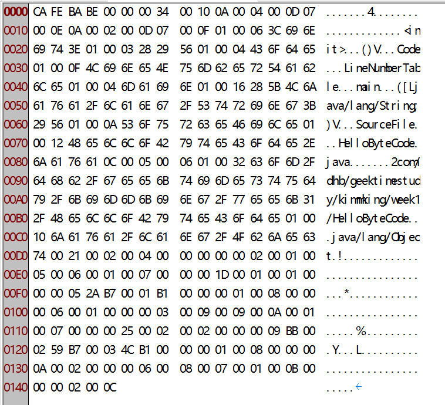

# 1.java语言
编程语言的分类：

| 分类方式 | 说明 |
|---|---|
|核心思想| 面向过程、面向对象、面向函数 |
| 类型 | 静态类型、动态类型 |
|执行方式 | 编译执行、解释执行 |
|虚拟机 | 有虚拟机、无虚拟机 |
| GC | 有GC、无GC |

java语言：面向对象、静态类型、编译执行、有VM/GC和运行时、跨平台的高级语言。

# 2.java字节码
java bytecode 是由单字节（byte）的指令组成，理论上最多支持256个操作码（opcode）。实际上java只使用了200左右的操作码，还有一些操作码保留给调试使用。
java字节码的分类：
- 1.栈操作指令，包括与局部变量交互的指令。
- 2.程序流程控制指令。
- 3.对象操作指令，包括方法调用指令。
- 4.算术运算以及类型转换指令。


##  2.1  如何生成字节码如何生成字节码?
有如下类:
```
package com.dhb.geektimestudy.kimmking.week1;

public class HelloByteCode {

	public static void main(String[] args) {
		HelloByteCode obj = new HelloByteCode();
	}
}
```
编译：
现在位于main/java目录，执行javac：
```
javac com/dhb/geektimestudy/kimmking/week1/HelloByteCode.java
```
生成了文件 HelloByteCode.class
现在通过javap查看字节码:
```
javap -c  com.dhb.geektimestudy.kimmking.week1.HelloByteCode
```
执行结果如下:
```
Compiled from "HelloByteCode.java"
public class com.dhb.geektimestudy.kimmking.week1.HelloByteCode {
  public com.dhb.geektimestudy.kimmking.week1.HelloByteCode();
    Code:
       0: aload_0
       1: invokespecial #1                  // Method java/lang/Object."<init>":()V
       4: return

  public static void main(java.lang.String[]);
    Code:
       0: new           #2                  // class com/dhb/geektimestudy/kimmking/week1/HelloByteCode
       3: dup
       4: invokespecial #3                  // Method "<init>":()V
       7: astore_1
       8: return
}
```
或者通过idea的插件，在view中通过show bytecode进行查看。

更加有用的插件是通过jclasslib进行查看，这个插件会更加形象。


如果我们要查看最详细的字节码，那么需要在javap命令之后增加-verbose参数，下面我们来分析完全字节码的含义。

字节码分析：
javap -c -verbose com.dhb.geektimestudy.kimmking.week1.HelloByte
Code
```
Classfile /....../src/main/java/com/dhb/geektimestudy/kimmking/week1/HelloByteCode.class
  Last modified 2021-8-3; size 325 bytes
  MD5 checksum 57cfd837406242d55d4f6050ea9d2d78
  Compiled from "HelloByteCode.java"
public class com.dhb.geektimestudy.kimmking.week1.HelloByteCode
  minor version: 0
  major version: 52
  flags: ACC_PUBLIC, ACC_SUPER
Constant pool:
   #1 = Methodref          #4.#13         // java/lang/Object."<init>":()V
   #2 = Class              #14            // com/dhb/geektimestudy/kimmking/week1/HelloByteCode
   #3 = Methodref          #2.#13         // com/dhb/geektimestudy/kimmking/week1/HelloByteCode."<init>":()V
   #4 = Class              #15            // java/lang/Object
   #5 = Utf8               <init>
   #6 = Utf8               ()V
   #7 = Utf8               Code
   #8 = Utf8               LineNumberTable
   #9 = Utf8               main
  #10 = Utf8               ([Ljava/lang/String;)V
  #11 = Utf8               SourceFile
  #12 = Utf8               HelloByteCode.java
  #13 = NameAndType        #5:#6          // "<init>":()V
  #14 = Utf8               com/dhb/geektimestudy/kimmking/week1/HelloByteCode
  #15 = Utf8               java/lang/Object
{
  public com.dhb.geektimestudy.kimmking.week1.HelloByteCode();
    descriptor: ()V
    flags: ACC_PUBLIC
    Code:
      stack=1, locals=1, args_size=1
         0: aload_0
         1: invokespecial #1                  // Method java/lang/Object."<init>":()V
         4: return
      LineNumberTable:
        line 3: 0

  public static void main(java.lang.String[]);
    descriptor: ([Ljava/lang/String;)V
    flags: ACC_PUBLIC, ACC_STATIC
    Code:
      stack=2, locals=2, args_size=1
         0: new           #2                  // class com/dhb/geektimestudy/kimmking/week1/HelloByteCode
         3: dup
         4: invokespecial #3                  // Method "<init>":()V
         7: astore_1
         8: return
      LineNumberTable:
        line 6: 0
        line 7: 8
}
SourceFile: "HelloByteCode.java"
```

## 2.2 字节码的构成
上述class的字节码主要由 魔数及版本信息、常量池、访问标识符、索引（类索引、父类索引、接口索引）、字段表、方法表、属性表。
我们可以查看上述字节码的二进制文件用16进制查看：


### 2.2.1 魔数及版本信息
- 魔数(Magic Number)：.class 文件的第 1 - 4 个字节，它唯一的作用就是确定这个文件是否是一个能被虚拟机接受的 class 文件，其固定值是：0xCAFEBABE（咖啡宝贝）。如果一个 class 文件的魔术不是 0xCAFEBABE，那么虚拟机将拒绝运行这个文件
- 次版本号(minor version):.class 文件的第 5 - 6 个字节，即编译生成该 .class 文件的 JDK 次版本号。
- 主版本号(major version)：.class 文件的第 7 - 8个字节，即编译生成该 .class 文件的 JDK 主版本号。

需要注意的是，在java中，高版本的JDK能够向下兼容低版本的jdk。
字节码的二进制文件对应表示为：
```
CA FE BA BE 00 00 00 34
```
那么前面的cafebabe就是魔数，而0000 和0034则分别是主版本号和次版本号。转为十进制0x0034即是52,这与我们javap的输出正好对应。
```
  minor version: 0
  major version: 52
```
jdk各版本的版本号如下表:

| JDK版本 | 主版本号 | 次版本号 | 十进制 |
|:-------|:--------|:--------|:-------|
| JDK1.2 | 0000    | 002E    | 46     |
| JDK1.3 | 0000    | 002F    | 47     |
| JDK1.4 | 0000    | 0030    | 48     |
| JDK1.5 | 0000    | 0031    | 49     |
| JDk1.6 | 0000    | 0032    | 50     |
| JDK1.7 | 0000    | 0033    | 51     |
| JDK1.8 | 0000    | 0034    | 52     |

### 2.2.2 常量池
常量池由两部分构成，分别是常量池的constatn_pool_count和常量池集合。constatn_pool_count是一个二字节的无符号数字，这个计数器从1开始。对应到二进制我们可以看到constatn_pool_count部分：
```
00 10
```
0x0010,正好是16，那么久说明常量池的大小是16。此处需要注意的是，只有常量池部分的计数是从1开始，其他集合都从0开始。因为常量池的0有特殊意义。因此常量池的总数应该是16-1为15项。
之后就是常量池每一项的内容，每一项内容由各自部分组成，其组成如下表：

| 常量                             | 简介                   | 项     | 类型   | 描述                                                |
|:---------------------------------|:----------------------|:-------|:------|:---------------------------------------------------|
| CONSTANT_Utf8_info               | utf-8缩略编码字符串     | tag    | u1    | 取值为1，即0x01                                     |
|                                  |                       | length | u2    | utf-8字符串的长度                                    |
|                                  |                       | bytes  | u1    | 字符串内容，由多个字节构成                             |
| CONSTANT_Integer_info            | 整型字面量             | tag    | u1    | 值为3，即是0x03                                      |
|                                  |                       |        | bytes | u4    按照高位在前储存的int值,占4个字节                |
| CONSTANT_Float_info              | 浮点型字面量           | tag    | u1    | 值为4，即0x04                                        |
|                                  |                       | bytes  | u4    | 按照高位在前储存的float值                             |
| CONSTANT_Long_info               | 长整型字面量           | tag    | u1    | 值为5,即0x05                                         |
|                                  |                       | bytes  | u8    | 按照高位在前储存的long值,占8个字节                     |
| CONSTANT_Double_info             | 双精度浮点型字面量      | tag    | u1    | 值为6，即0x06                                        |
|                                  |                       | bytes  | u8    | 按照高位在前储存的double值                            |
| CONSTANT_Class_info              | 类或接口的符号引用      | tag    | u1    | 值为7,即是0x07                                       |
|                                  |                       | index  | u2    | 指向全限定名常量项的索引                              |
| CONSTANT_String_info             | 字符串类型字面量        | tag    | u1    | 值为8                                               |
|                                  |                       | index  | u2    | 指向字符串字面量的索引                                |
| CONSTANT_Fieldref_info           | 字段的符号引用          | tag    | u1    | 值为9                                               |
|                                  |                       | index  | u2    | 指向声明字段的类或接口描述符CONSTANT_Class_info的索引项 |
|                                  |                       | index  | u2    | 指向字段描述符CONSTANT_NameAndType_info的索引项       |
| CONSTANT_Methodref_info          | 类中方法的符号引用      | tag    | u1    | 值为10,0x0A                                         |
|                                  |                       | index  | u2    | 指向声明方法的类描述符CONSTANT_Class_info的索引项      |
|                                  |                       | index  | u2    | 指向名称及类型描述符CONSTANT_NameAndType_info的索引项  |
| CONSTANT_InterfaceMethodref_info | 接口中方法的符号引用    | tag    | u1    | 值为11 ,0x0B                                        |
|                                  |                       | index  | u2    | 指向声明方法的接口描述符CONSTANT_Class_info的索引项    |
|                                  |                       | index  | u2    | 指向名称及类型描述符CONSTANT_NameAndType_info的索引项  |
| CONSTANT_NameAndType_info        | 字段或方法的部分符号引用 | tag    | u1    | 值为12,0x0C                                         |
|                                  |                       | index  | u2    | 指向该字段或方法名称常量项的索引                       |
|                                  |                       | index  | u2    | 指向该字段或方法描述符常量项的索引                      |

那么对应到上述二进制中，各常量如下：

| 序号 | 内容                                                                                                                                                             | 类型                                             | 说明                                                               |
|:----|:-----------------------------------------------------------------------------------------------------------------------------------------------------------------|:------------------------------------------------|:-------------------------------------------------------------------|
| 1   | 0A 00 04 00 0D                                                                                                                                                   | CONSTANT_Methodref_info，类中方法的符号引用        | 指向的index分别为0x0004和0x000D,正好是指向#4,#13                      |
| 2   | 07 00 0E                                                                                                                                                         | CONSTANT_Class_info ，类或接口的符号引用           | index部分为0x000E,指向#15                                           |
| 3   | 0A 00 02 00 0D                                                                                                                                                   | CONSTANT_Methodref_info，类中方法的符号引用        | index分别为0x0002和0x000D，正好为 #2，#13                            |
| 4   | 07 00 0F                                                                                                                                                         | CONSTANT_Class_info 类和接口的符号引用             | index为0x000F,即是#15                                              |
| 5   | 01 00 06 3C 69 6E 69 74 3E                                                                                                                                       | CONSTANT_Utf8_info utf-8字符串                   | 长度为6的字符串，<init>                                              |
| 6   | 01 00 03 28 29  56                                                                                                                                               | CONSTANT_Utf8_info utf-8字符串                   | 长度为3的字符串 ()V                                                  |
| 7   | 01 00 04 43 6F 64 65                                                                                                                                             | CONSTANT_Utf8_info utf-8字符串                   | 长度为4的字符串 Code                                                 |
| 8   | 01 00 0F 4C 69 6E 65 4E  75 6D 62 65 72 54 61 62 6C 65                                                                                                           | CONSTANT_Utf8_info utf-8字符串                   | 长度为15的字符串：LineNumberTable                                    |
| 9   | 01 00 04 6D 61 69  6E                                                                                                                                            | CONSTANT_Utf8_info utf-8字符串                   | 长度为4的字符串 main                                                 |
| 10  | 01 00 16 28 5B 4C 6A 61 76 61 2F 6C 61 6E 67 2F 53 74 72 69 6E 67 3B 29 56                                                                                       | CONSTANT_Utf8_info utf-8字符串                   | 长度为22的字符串：([Ljava/lang/String;)V                             |
| 11  | 01 00 0A 53 6F 75  72 63 65 46 69 6C 65                                                                                                                          | CONSTANT_Utf8_info utf-8字符串                   | 长度为15的字符串：SourceFile                                         |
| 12  | 01 00 12 48 65 6C 6C 6F 42  79 74 65 43 6F 64 65 2E 6A 61 76 61                                                                                                  | CONSTANT_Utf8_info utf-8字符串                   | 长度为18的字符串：HelloByteCode.java                                 |
| 13  | 0C 00 05 00 06                                                                                                                                                   | CONSTANT_NameAndType_info 字段或方法的部分符号引用 | 指针指向：#5 #6                                                      |
| 14  | 01 00 32 63 6F 6D 2F 64 68 62 2F 67 65 65 6B 74 69 6D 65 73 74 75 64 79 2F 6B 69 6D 6D 6B 69  6E 67 2F 77 65 65 6B 31 2F 48 65 6C 6C 6F 42 79  74 65 43 6F 64 65 | CONSTANT_Utf8_info utf-8字符串                   | 长度为50的字符串：com/dhb/geektimestudy/kimmking/week1/HelloByteCode |
| 15  | 01 00 10 6A 61 76 61 2F 6C 61  6E 67 2F 4F 62 6A 65 63 74                                                                                                        | CONSTANT_Utf8_info utf-8字符串                   | 长度为16的字符串：java/lang/Object                                   |

可以看出，在常量池中，为了尽可能少的占用内存，许多常量都是指针。
常量池也是这个类中字节的大部分内容。

### 2.2.3 访问标识
在常量池之后，紧接着的两个字节表示访问标识，用以识别类或者接口的层次访问信息。见下表：

| 标识           | 标识值  | 说明                                                              |
|:---------------|:-------|:-----------------------------------------------------------------|
| ACC_PUBLIC     | 0x0001 | 字段为public                                                      |
| ACC_FINAL      | 0x0010 | 字段是否为final                                                    |
| ACC_SUPER      | 0x0020 | 是否允许使用invokespecial字节码指令，JDK1.2以后编译出来的类这个标志为真 |
| ACC_INTERFACE  | 0x0200 | 标识这是一个接口                                                   |
| ACC_ABSTRACT   | 0x0400 | 字段是否为abstract                                                 |
| ACC_SYNTHETIC  | 0x1000 | 表示由synthetic修饰，不在源代码中出现                                |
| ACC_ANNOTATION | 0x2000 | 表示是annotation类型                                               |
| ACC_ENUM       | 0x4000 | 表示是枚举类型                                                     |

需要注意的是，这个访问标识只占两字节，实际上是上述这些标识取|。
我们例子中的值为："00 21"  即0x0021 = 0x0001 | 0x0020 =  =ACC_PUBLIC | ACC_SUPER
因此我们可以看到javap输出中的flag:
```
 flags: ACC_PUBLIC, ACC_SUPER
```
### 2.2.4 类索引、父类索引和接口索引集合
在class文件中，将用这三项来标识类的继承关系。


| 索引项            | 长度   | 说明                                                                                                                                                               |
|:-----------------|:-------|:------------------------------------------------------------------------------------------------------------------------------------------------------------------|
| this_class       | 2个字节 | 类索引，用于确定这个类的全限定名                                                                                                                                      |
| super_class      | 2个字节 | 父类索引，用于确定这个类父类的全限定名（Java语言不允许多重继承，故父类索引只有一个。除了java.lang.Object类之外所有类都有父类，故除了java.lang.Object类之外，所有类该字段值都不为0） |
| interfaces_count | 2个字节 | 接口索引计数器，如果该类没有实现任何接口，则该计数器值为0，并且后面的接口的索引集合将不占用任何字节                                                                           |
| interfaces       | 2个字节 | 接口索引集合，一组u2类型数据的集合。用来描述这个类实现了哪些接口，这些被实现的接口将按implements语句（如果该类本身为接口，则为extends语句）后的接口顺序从左至右排列在接口的索引集合中 |

this_class、super_class与interfaces中保存的索引值均指向常量池中一个CONSTANT_Class_info类型的常量，通过这个常量中保存的索引值可以找到定义在CONSTANT_Utf8_info类型的常量中的全限定名字符串。
在案例中,上述三个参数为：
```
00 02 
00 04 
00 00
```
可以知道，this_class的名称在常量pool中的index为0x0002,super_class的名称在常量池的index为 0x0004。interfaces_counts的值为0x0000,表示本类没有实现任何接口。


### 2.2.5 字段表集合
字段表用于描述接口或者类中声明的变量，包括类级变量和实例级变量(是否是static)，但不包括在方法内部声明的局部变量。
此区域用以描述成员变量。

| 字段名        | 长度   | 说明                                      |
|:-------------|:-------|:-----------------------------------------|
| fields_count | 2个字节 | 字段表计数器，即字段表集合中的字段表数据个数。也就是成员变量个数。 |
| fields       | 2个字节 | 字段表集合，成员变量列表，一组字段表类型数据的集合。        |

在本案例中，由于没有成员变量，因此此处为:
```
00 00
```
如果存在，那么将会用如下数据结构构成fileds中的每一个filed：

| 类型           | 名称              | 数量             |
|:---------------|:-----------------|:-----------------|
| u2             | access_flags     | 1                |
| u2             | name_index       | 1                |
| u2             | descriptor_index | 1                |
| u2             | attributes_count | 1                |
| attribute_info | attributes       | attributes_count |

access_flags用两个字节来标识成员变量的访问修饰，这与类的访问标识类似，只是标识会比类要多：

| 标识项            | 标识值 | 说明                   |
|:-----------------|:-------|:----------------------|
| ACC_PUBLIC       | 0x0001 | 字段是否为public       |
| ACC_PRIVATE      | 0x0002 | 字段是否为private      |
| ACC_PROTECTED    | 0x0004 | 字段是否为protected    |
| ACC_STATIC       | 0x0008 | 字段是否为static       |
| ACC_FINAL        | 0x0010 | 字段是否为final        |
| ACC_VOLATILE     | 0x0040 | 字段是否为volatile     |
| ACC_TRANSIENT    | 0x0080 | 字段是否为transient    |
| ACC_SYNTHETIC    | 0x1000 | 字段是否为编译器自动产生 |
| ACC_ENUM         | 0x4000 | 字段是否为enum         |

### 2.2.6 方法表集合
方法表集合用以表示类中存在多少个方法，以及方法的访问标识和内容。

| 方法名        | 长度   | 说明                                      |
|:-------------|:-------|:-----------------------------------------|
| methods_count | 2个字节 | 方法表计数器，即方法表集合中的方法表数据个数。 |
| methods       | 数组 | 方法表集合，一组方法表类型数据的集合。        |

方法表结构和字段表结构一样：

| 类型           | 名称              | 数量             |
|:---------------|:-----------------|:-----------------|
| u2             | access_flags     | 1                |
| u2             | name_index       | 1                |
| u2             | descriptor_index | 1                |
| u2             | attributes_count | 1                |
| attribute_info | attributes       | attributes_count |

数据项的含义非常相似，仅在访问标志位和属性表集合中的可选项上有略微不同，由于ACC_VOLATILE标志和ACC_TRANSIENT标志不能修饰方法，所以access_flags中不包含这两项，同时增加ACC_SYNCHRONIZED标志、ACC_NATIVE标志、ACC_STRICTFP标志和ACC_ABSTRACT标志。

| 标识项            | 标识值 | 说明                          |
|:-----------------|:-------|:-----------------------------|
| ACC_PUBLIC       | 0x0001 | 字段是否为public              |
| ACC_PRIVATE      | 0x0002 | 字段是否为private             |
| ACC_PROTECTED    | 0x0004 | 字段是否为protected           |
| ACC_STATIC       | 0x0008 | 字段是否为static              |
| ACC_FINAL        | 0x0010 | 字段是否为final               |
| ACC_SYNCHRONIZED | 0x0020 | 字段是否为synchronized        |
| ACC_BRIDGE       | 0x0040 | 方法是否是由编译器产生的桥接方法 |
| ACC_VARARGS      | 0x0080 | 方法是否接受不定参数           |
| ACC_NATIVE       | 0x0100 | 字段是否为native              |
| ACC_ABSTRACT     | 0x0400 | 字段是否为abstract            |
| ACC_STRICTFP     | 0x0800 | 字段是否为strictfp            |
| ACC_SYNTHETIC    | 0x1000 | 字段是否为编译器自动产生        |


我们对字节码进行对照:
```
00 02
```
methods的长度为0x0002,即存在2个方法。

#### 2.2.6.1 方法一
方法1如下：
```
00 01 00 05 00 06 00 01 00 07 
```
access_flags为0x0001,name_index为0x0005,descriptor_index为0x0006,attributes为0x0001 说明此方法的属性表中存在一个属性，属性名称指向0x0007,即是Code.
结合常量池，我们可以得到该方法为：
```
public <init> ()V 
```
在上述方法进入code部分之后，就是真正要执行操作的字节码了。
```
00 00 00 1D 
00 01 00 01 00 00 00 05 2A B7 00 01 B1 
00 00 
00 01 00 08 00 00 
00 06 00 01 00 00 00 03
```
接下来4个字节标识code的长度，本案例中是0x0000001D，则说明code要执行的内容为20字节。
在上述执行的代码中：
首先两个字节0x0001表示操作数栈深度为1，接下来的两个字节0x0001表示局部变量所占空间为1。
后续4位为0x000005,表示后续指令将占5个字节，为0x2AB70001B1,这部分内容为虚拟机运行的字节码指令，可以参考虚拟机字节码指令表进行对照。
接下来两个字节 0x0000 说明Code的属性异常表为空。
之后的两个字节，0x0001,说明Code带有1个属性。接下来的0x0008表示这个属性的名称，#8在常量池中为LineNumberTable。
后续4个字节0x00000006表示LineNumberTable属性值的长度为6 rTable属性值的长度为6。。
这6个字节中：0x0001表示行号表中只有一个行信息，start_pc为0x0000,line_number为0x0003,至此，这个方法结束。
javap中该方法如下：
```
  public com.dhb.geektimestudy.kimmking.week1.HelloByteCode();
    descriptor: ()V
    flags: ACC_PUBLIC
    Code:
      stack=1, locals=1, args_size=1
         0: aload_0
         1: invokespecial #1                  // Method java/lang/Object."<init>":()V
         4: return
      LineNumberTable:
        line 3: 0
```

#### 2.2.6.1 方法二
方法2中：
```
00 09 00 09 00 0A 00 01 00 07 
```
开始两个字节 0x0009 = 0x0001 | 0x0008 = pulic | static
也就是说这个类的访问描述符为 public static 
name_index为0x0009 对应到常量池中的main方法
descriptor_index为0x000A即([Ljava/lang/String;)V,attributes为0x0001 说明此方法的属性表中存在一个属性，属性名称指向0x0007,即是Code.

在上述方法进入code部分之后的字节码：
```
00 00 00 25 
00 02 00 02 00 00 00 09 BB 00 02 59 B7 00 03 4C B1 
00 00 
00 01 00 08 
00 00 00 0A 
00 02 00 00 00 06 00 08 00 07
```
用4个字节标识属性的长度 0x00000025 长度是37，也就是说后面37个字节都是表示实执行的字节码。
首先两个字节0x0002表示操作数栈深度为2，接下来的两个字节0x0002表示局部变量所占空间为2。
后续4位为0x000009,表示后续指令将占9个字节，为0xBB000259B700034CB1,这部分内容为虚拟机运行的字节码指令，可以参考虚拟机字节码指令表进行对照。
接下来两个字节 0x0000 说明Code的属性异常表为空。
之后的两个字节，0x0001,说明Code带有1个属性。接下来的0x0008表示这个属性的名称，#8在常量池中为LineNumberTable。
后续4个字节0x0000000A表示LineNumberTable属性值的长度为10 LineNumberTable属性值的长度为10。。
这10个字节中：0x0002表示行号表中有两个行信息，start_pc为0x0000,line_number为0x0006,第二个行信息：start_pc为0x0008,line_number为0x0007。
这就是第二个方法的字节码。

通过javap可以查看：
```
 public static void main(java.lang.String[]);
    descriptor: ([Ljava/lang/String;)V
    flags: ACC_PUBLIC, ACC_STATIC
    Code:
      stack=2, locals=2, args_size=1
         0: new           #2                  // class com/dhb/geektimestudy/kimmking/week1/HelloByteCode
         3: dup
         4: invokespecial #3                  // Method "<init>":()V
         7: astore_1
         8: return
      LineNumberTable:
        line 6: 0
        line 7: 8
```

### 2.2.7 属性集合表说明
在class文件中，字段表、方法表都可以携带自己的属性集合表。用以描述某些场景的专有信息。
属性集合表格式如下：

| 类型 | 名称                 | 数量              |
|:----|:---------------------|:-----------------|
| u2  | attribute_name_index | 1                |
| u4  | attribute_length     | 1                |
| u1  | info                 | attribute_length |

该格式可以解释为，一个2字节构成的index，一个4字节构成的属性长度。另外一个属性的字节数组。

现在案例中的类还剩下的字节部分：
```
00 01 00 0B 00 00 00 02 00 0C 
```
0x0001 表示属性集合表的长度，说明有一个类的属性。
0x000B 指向两个字节标识的属性name的index，为#11 即 SourceFile
0x00000002 表示这个属性的长度，长度为2，剩余2字节即为这个属性的内容：
0x000C 即是SourceFile的内容，#12 即常量池中的HelloByteCode.java
这个类属性值表示的内容为：
```
SourceFile: "HelloByteCode.java"
```

至此，我们完整解析了class类的字节码。

# 3.总结
本文详细分析了字节码的构成，现在总结为如下图：


在图中，u4表示4个字节，u1表示1个字节，u2表示2个字节，而un则表示未知。
