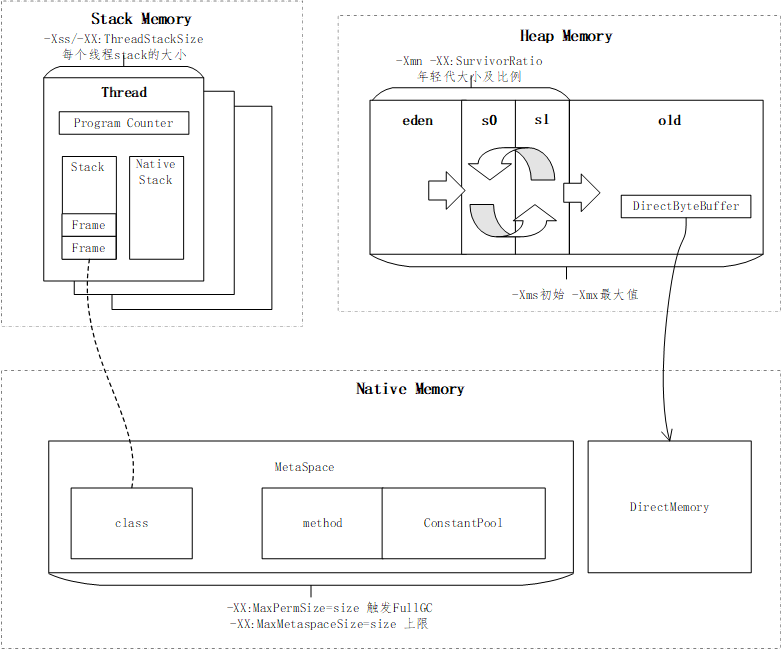

1.（选做）自己写一个简单的 Hello.java，里面需要涉及基本类型，四则运行，if 和 for，然后自己分析一下对应的字节码，有问题群里讨论。

2.（必做）自定义一个 Classloader，加载一个 Hello.xlass 文件，执行 hello 方法，此文件内容是一个 Hello.class 文件所有字节（x=255-x）处理后的文件。文件群里提供。
代码 [HelloFileClassLoader.java](../../../src/main/java/com/dhb/geektimestudy/kimmking/week1/HelloFileClassLoader.java)

3.（必做）画一张图，展示 Xmx、Xms、Xmn、Meta、DirectMemory、Xss 这些内存参数的关系。
