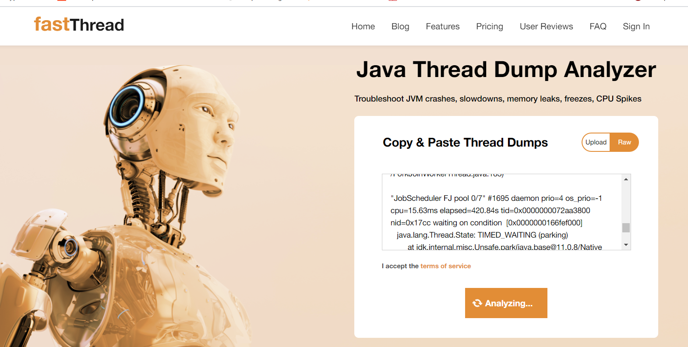
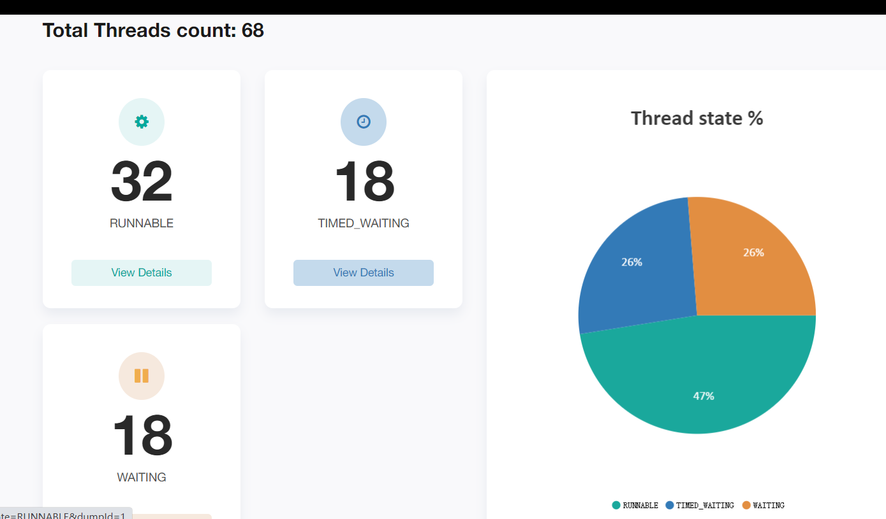
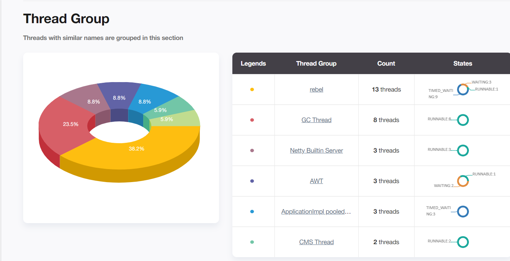
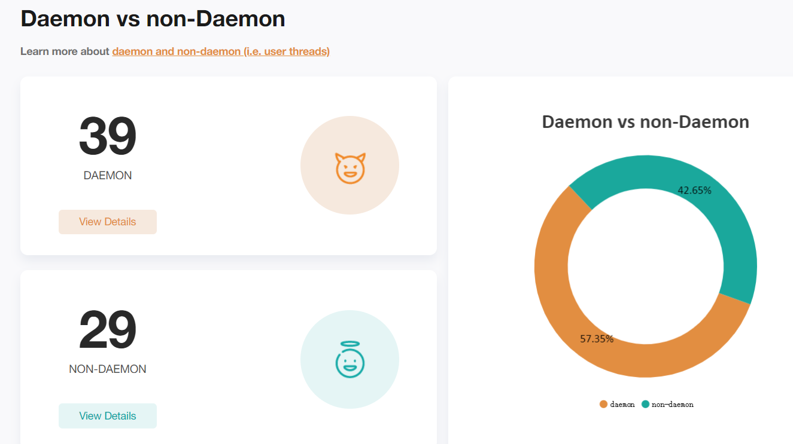

idea的线程stack信息：
```
D:\workspace-mashibing\geektime-study>jstack 6036
2021-08-10 11:41:02
Full thread dump OpenJDK 64-Bit Server VM (11.0.8+10-b944.31 mixed mode):

Threads class SMR info:
_java_thread_list=0x00000000704861e0, length=55, elements={
0x00000000041b6800, 0x000000001c0f0000, 0x000000001c0fa000, 0x000000001c15b800,
0x000000001c15c800, 0x000000001c15d800, 0x000000001c162000, 0x000000001c163800,
0x000000001c2ab000, 0x000000001de98000, 0x000000001e432800, 0x000000001e590800,
0x000000001e3f5000, 0x0000000020110000, 0x000000002010e800, 0x000000002010c000,
0x0000000027b53800, 0x000000002b8f5800, 0x000000002b8f9800, 0x000000002b8f6000,
0x000000002d591800, 0x000000002d593000, 0x000000002d594800, 0x0000000032f63000,
0x0000000032f64800, 0x0000000032f65800, 0x000000003e415000, 0x000000003e3db000,
0x000000003e3dd800, 0x000000003e3e7800, 0x000000003e3e5800, 0x000000002b765800,
0x000000002b78c800, 0x000000003eaac000, 0x000000004c080800, 0x000000004c07c800,
0x000000004c080000, 0x000000004c07d800, 0x000000004c04f800, 0x000000004c04b800,
0x0000000065248800, 0x0000000072aa3000, 0x000000004c059800, 0x0000000072aa9800,
0x0000000072ad9800, 0x0000000072ade800, 0x0000000072aa3800, 0x0000000072ab1000,
0x0000000072abc000, 0x0000000072abe800, 0x0000000072aac800, 0x0000000072aa7000,
0x0000000072ada800, 0x0000000072ad6800, 0x0000000072ad4800
}

"main" #1 prio=5 os_prio=0 cpu=734.38ms elapsed=88199.02s tid=0x00000000041b6800 nid=0x33bc waiting on condition  [0x0000000000000000]
   java.lang.Thread.State: RUNNABLE

"Reference Handler" #2 daemon prio=10 os_prio=2 cpu=296.88ms elapsed=88198.84s tid=0x000000001c0f0000 nid=0x220c waiting on condition  [0x000000001ccaf000]
   java.lang.Thread.State: RUNNABLE
        at java.lang.ref.Reference.waitForReferencePendingList(java.base@11.0.8/Native Method)
        at java.lang.ref.Reference.processPendingReferences(java.base@11.0.8/Reference.java:241)
        at java.lang.ref.Reference$ReferenceHandler.run(java.base@11.0.8/Reference.java:213)

"Finalizer" #3 daemon prio=8 os_prio=1 cpu=93.75ms elapsed=88198.84s tid=0x000000001c0fa000 nid=0x24dc in Object.wait()  [0x000000001cdaf000]
   java.lang.Thread.State: WAITING (on object monitor)
        at java.lang.Object.wait(java.base@11.0.8/Native Method)
        - waiting on <no object reference available>
        at java.lang.ref.ReferenceQueue.remove(java.base@11.0.8/ReferenceQueue.java:155)
        - waiting to re-lock in wait() <0x00000000ab117a98> (a java.lang.ref.ReferenceQueue$Lock)
        at java.lang.ref.ReferenceQueue.remove(java.base@11.0.8/ReferenceQueue.java:176)
        at java.lang.ref.Finalizer$FinalizerThread.run(java.base@11.0.8/Finalizer.java:170)

"Signal Dispatcher" #4 daemon prio=9 os_prio=2 cpu=15.63ms elapsed=88198.80s tid=0x000000001c15b800 nid=0x18e8 runnable  [0x0000000000000000]
   java.lang.Thread.State: RUNNABLE

"Attach Listener" #5 daemon prio=5 os_prio=2 cpu=31.25ms elapsed=88198.80s tid=0x000000001c15c800 nid=0x3128 waiting on condition  [0x0000000000000000]
   java.lang.Thread.State: RUNNABLE

"C2 CompilerThread0" #6 daemon prio=9 os_prio=2 cpu=515640.63ms elapsed=88198.80s tid=0x000000001c15d800 nid=0x1f3c waiting on condition  [0x0000000000000000]
   java.lang.Thread.State: RUNNABLE
   No compile task

"C1 CompilerThread0" #7 daemon prio=9 os_prio=2 cpu=67390.63ms elapsed=88198.80s tid=0x000000001c162000 nid=0xbd0 waiting on condition  [0x0000000000000000]
   java.lang.Thread.State: RUNNABLE
   No compile task

"Sweeper thread" #8 daemon prio=9 os_prio=2 cpu=11187.50ms elapsed=88198.80s tid=0x000000001c163800 nid=0x12d0 runnable  [0x0000000000000000]
   java.lang.Thread.State: RUNNABLE

"Common-Cleaner" #9 daemon prio=8 os_prio=1 cpu=187.50ms elapsed=88198.74s tid=0x000000001c2ab000 nid=0x3354 in Object.wait()  [0x000000001dc0f000]
   java.lang.Thread.State: TIMED_WAITING (on object monitor)
        at java.lang.Object.wait(java.base@11.0.8/Native Method)
        - waiting on <no object reference available>
        at java.lang.ref.ReferenceQueue.remove(java.base@11.0.8/ReferenceQueue.java:155)
        - waiting to re-lock in wait() <0x00000000ab3079c8> (a java.lang.ref.ReferenceQueue$Lock)
        at jdk.internal.ref.CleanerImpl.run(java.base@11.0.8/CleanerImpl.java:148)
        at java.lang.Thread.run(java.base@11.0.8/Thread.java:834)
        at jdk.internal.misc.InnocuousThread.run(java.base@11.0.8/InnocuousThread.java:134)

"Service Thread" #10 daemon prio=9 os_prio=0 cpu=93.75ms elapsed=88198.16s tid=0x000000001de98000 nid=0x196c runnable  [0x0000000000000000]
   java.lang.Thread.State: RUNNABLE

"Periodic tasks thread" #12 daemon prio=5 os_prio=0 cpu=4218.75ms elapsed=88197.92s tid=0x000000001e432800 nid=0xd4c waiting on condition  [0x000000001fa9f000]
   java.lang.Thread.State: TIMED_WAITING (parking)
        at jdk.internal.misc.Unsafe.park(java.base@11.0.8/Native Method)
        - parking to wait for  <0x00000000ac169048> (a java.util.concurrent.locks.AbstractQueuedSynchronizer$ConditionObject)
        at java.util.concurrent.locks.LockSupport.parkNanos(java.base@11.0.8/LockSupport.java:234)
        at java.util.concurrent.locks.AbstractQueuedSynchronizer$ConditionObject.awaitNanos(java.base@11.0.8/AbstractQueuedSynchronizer.java:2123)
        at java.util.concurrent.DelayQueue.take(java.base@11.0.8/DelayQueue.java:229)
        at com.intellij.util.concurrency.AppDelayQueue.lambda$new$0(AppDelayQueue.java:26)
        at com.intellij.util.concurrency.AppDelayQueue$$Lambda$67/0x0000000100167440.run(Unknown Source)
        at java.lang.Thread.run(java.base@11.0.8/Thread.java:834)

"Java2D Disposer" #20 daemon prio=10 os_prio=2 cpu=312.50ms elapsed=88197.79s tid=0x000000001e590800 nid=0x2f88 in Object.wait()  [0x0000000021ecf000]
   java.lang.Thread.State: WAITING (on object monitor)
        at java.lang.Object.wait(java.base@11.0.8/Native Method)
        - waiting on <no object reference available>
        at java.lang.ref.ReferenceQueue.remove(java.base@11.0.8/ReferenceQueue.java:155)
        - waiting to re-lock in wait() <0x00000000ac9e1ab0> (a java.lang.ref.ReferenceQueue$Lock)
        at java.lang.ref.ReferenceQueue.remove(java.base@11.0.8/ReferenceQueue.java:176)
        at sun.java2d.Disposer.run(java.desktop@11.0.8/Disposer.java:144)
        at java.lang.Thread.run(java.base@11.0.8/Thread.java:834)

"AWT-Shutdown" #21 prio=4 os_prio=-1 cpu=46.88ms elapsed=88197.78s tid=0x000000001e3f5000 nid=0x21f0 in Object.wait()  [0x0000000021fcf000]
   java.lang.Thread.State: WAITING (on object monitor)
        at java.lang.Object.wait(java.base@11.0.8/Native Method)
        - waiting on <no object reference available>
        at java.lang.Object.wait(java.base@11.0.8/Object.java:328)
        at sun.awt.AWTAutoShutdown.run(java.desktop@11.0.8/AWTAutoShutdown.java:291)
        - waiting to re-lock in wait() <0x00000000abb49d78> (a java.lang.Object)
        at java.lang.Thread.run(java.base@11.0.8/Thread.java:834)

"AWT-Windows" #22 daemon prio=6 os_prio=0 cpu=295281.25ms elapsed=88197.78s tid=0x0000000020110000 nid=0x32f0 runnable  [0x00000000220cf000]
   java.lang.Thread.State: RUNNABLE
        at sun.awt.windows.WToolkit.eventLoop(java.desktop@11.0.8/Native Method)
        at sun.awt.windows.WToolkit.run(java.desktop@11.0.8/WToolkit.java:305)
        at java.lang.Thread.run(java.base@11.0.8/Thread.java:834)

"AWT-EventQueue-0" #24 prio=6 os_prio=0 cpu=1048062.50ms elapsed=88197.76s tid=0x000000002010e800 nid=0x2cc4 waiting on condition  [0x000000002249f000]
   java.lang.Thread.State: WAITING (parking)
        at jdk.internal.misc.Unsafe.park(java.base@11.0.8/Native Method)
        - parking to wait for  <0x00000000abb4a6d8> (a java.util.concurrent.locks.AbstractQueuedSynchronizer$ConditionObject)
        at java.util.concurrent.locks.LockSupport.park(java.base@11.0.8/LockSupport.java:194)
        at java.util.concurrent.locks.AbstractQueuedSynchronizer$ConditionObject.await(java.base@11.0.8/AbstractQueuedSynchronizer.java:2081)
        at java.awt.EventQueue.getNextEvent(java.desktop@11.0.8/EventQueue.java:572)
        at com.intellij.ide.IdeEventQueue.lambda$getNextEvent$16(IdeEventQueue.java:672)
        at com.intellij.ide.IdeEventQueue$$Lambda$674/0x00000001009e8040.compute(Unknown Source)
        at com.intellij.openapi.application.impl.ApplicationImpl.runUnlockingIntendedWrite(ApplicationImpl.java:828)
        at com.intellij.ide.IdeEventQueue.getNextEvent(IdeEventQueue.java:672)
        at java.awt.EventDispatchThread.pumpOneEventForFilters(java.desktop@11.0.8/EventDispatchThread.java:190)
        at java.awt.EventDispatchThread.pumpEventsForFilter(java.desktop@11.0.8/EventDispatchThread.java:124)
        at java.awt.EventDispatchThread.pumpEventsForHierarchy(java.desktop@11.0.8/EventDispatchThread.java:113)
        at java.awt.EventDispatchThread.pumpEvents(java.desktop@11.0.8/EventDispatchThread.java:109)
        at java.awt.EventDispatchThread.pumpEvents(java.desktop@11.0.8/EventDispatchThread.java:101)
        at java.awt.EventDispatchThread.run(java.desktop@11.0.8/EventDispatchThread.java:90)

"Netty Builtin Server 1" #27 prio=4 os_prio=-1 cpu=15.63ms elapsed=88197.25s tid=0x000000002010c000 nid=0x3340 runnable  [0x0000000023c9e000]
   java.lang.Thread.State: RUNNABLE
        at sun.nio.ch.WindowsSelectorImpl$SubSelector.poll0(java.base@11.0.8/Native Method)
        at sun.nio.ch.WindowsSelectorImpl$SubSelector.poll(java.base@11.0.8/WindowsSelectorImpl.java:357)
        at sun.nio.ch.WindowsSelectorImpl.doSelect(java.base@11.0.8/WindowsSelectorImpl.java:182)
        at sun.nio.ch.SelectorImpl.lockAndDoSelect(java.base@11.0.8/SelectorImpl.java:124)
        - locked <0x00000000aadbf690> (a io.netty.channel.nio.SelectedSelectionKeySet)
        - locked <0x00000000ab90f078> (a sun.nio.ch.WindowsSelectorImpl)
        at sun.nio.ch.SelectorImpl.select(java.base@11.0.8/SelectorImpl.java:136)
        at io.netty.channel.nio.SelectedSelectionKeySetSelector.select(SelectedSelectionKeySetSelector.java:62)
        at io.netty.channel.nio.NioEventLoop.select(NioEventLoop.java:807)
        at io.netty.channel.nio.NioEventLoop.run(NioEventLoop.java:457)
        at io.netty.util.concurrent.SingleThreadEventExecutor$4.run(SingleThreadEventExecutor.java:989)
        at io.netty.util.internal.ThreadExecutorMap$2.run(ThreadExecutorMap.java:74)
        at io.netty.util.concurrent.FastThreadLocalRunnable.run(FastThreadLocalRunnable.java:30)
        at java.lang.Thread.run(java.base@11.0.8/Thread.java:834)

"Netty Builtin Server 2" #36 prio=4 os_prio=-1 cpu=62.50ms elapsed=88193.04s tid=0x0000000027b53800 nid=0x2ee8 runnable  [0x000000002a5af000]
   java.lang.Thread.State: RUNNABLE
        at sun.nio.ch.WindowsSelectorImpl$SubSelector.poll0(java.base@11.0.8/Native Method)
        at sun.nio.ch.WindowsSelectorImpl$SubSelector.poll(java.base@11.0.8/WindowsSelectorImpl.java:357)
        at sun.nio.ch.WindowsSelectorImpl.doSelect(java.base@11.0.8/WindowsSelectorImpl.java:182)
        at sun.nio.ch.SelectorImpl.lockAndDoSelect(java.base@11.0.8/SelectorImpl.java:124)
        - locked <0x00000000aadbb4f8> (a io.netty.channel.nio.SelectedSelectionKeySet)
        - locked <0x00000000ab90ef68> (a sun.nio.ch.WindowsSelectorImpl)
        at sun.nio.ch.SelectorImpl.select(java.base@11.0.8/SelectorImpl.java:136)
        at io.netty.channel.nio.SelectedSelectionKeySetSelector.select(SelectedSelectionKeySetSelector.java:62)
        at io.netty.channel.nio.NioEventLoop.select(NioEventLoop.java:807)
        at io.netty.channel.nio.NioEventLoop.run(NioEventLoop.java:457)
        at io.netty.util.concurrent.SingleThreadEventExecutor$4.run(SingleThreadEventExecutor.java:989)
        at io.netty.util.internal.ThreadExecutorMap$2.run(ThreadExecutorMap.java:74)
        at io.netty.util.concurrent.FastThreadLocalRunnable.run(FastThreadLocalRunnable.java:30)
        at java.lang.Thread.run(java.base@11.0.8/Thread.java:834)

"rebel-lwatch" #37 daemon prio=6 os_prio=0 cpu=859.38ms elapsed=88192.29s tid=0x000000002b8f5800 nid=0x129c in Object.wait()  [0x000000002e36f000]
   java.lang.Thread.State: TIMED_WAITING (on object monitor)
        at java.lang.Object.wait(java.base@11.0.8/Native Method)
        - waiting on <no object reference available>
        at org.zeroturnaround.jrebel.client.licensing.Watcher$1.run(Watcher.java:68)
        - waiting to re-lock in wait() <0x00000000af3526d8> (a java.lang.Object)
        at java.lang.Thread.run(java.base@11.0.8/Thread.java:834)

"rebel-HibernateDetector" #38 daemon prio=6 os_prio=0 cpu=31.25ms elapsed=88192.29s tid=0x000000002b8f9800 nid=0x1f0c waiting on condition  [0x000000002e46f000]
   java.lang.Thread.State: TIMED_WAITING (sleeping)
        at java.lang.Thread.sleep(java.base@11.0.8/Native Method)
        at org.zeroturnaround.common.util.HibernateDetector$1.run(HibernateDetector.java:37)
        at java.lang.Thread.run(java.base@11.0.8/Thread.java:834)

"rebel-ide-scheduler-1" #39 daemon prio=5 os_prio=0 cpu=250.00ms elapsed=88192.26s tid=0x000000002b8f6000 nid=0x1638 waiting on condition  [0x000000002e56f000]
   java.lang.Thread.State: TIMED_WAITING (parking)
        at jdk.internal.misc.Unsafe.park(java.base@11.0.8/Native Method)
        - parking to wait for  <0x00000000aafb8830> (a java.util.concurrent.locks.AbstractQueuedSynchronizer$ConditionObject)
        at java.util.concurrent.locks.LockSupport.parkNanos(java.base@11.0.8/LockSupport.java:234)
        at java.util.concurrent.locks.AbstractQueuedSynchronizer$ConditionObject.awaitNanos(java.base@11.0.8/AbstractQueuedSynchronizer.java:2123)
        at java.util.concurrent.ScheduledThreadPoolExecutor$DelayedWorkQueue.take(java.base@11.0.8/ScheduledThreadPoolExecutor.java:1182)
        at java.util.concurrent.ScheduledThreadPoolExecutor$DelayedWorkQueue.take(java.base@11.0.8/ScheduledThreadPoolExecutor.java:899)
        at java.util.concurrent.ThreadPoolExecutor.getTask(java.base@11.0.8/ThreadPoolExecutor.java:1054)
        at java.util.concurrent.ThreadPoolExecutor.runWorker(java.base@11.0.8/ThreadPoolExecutor.java:1114)
        at java.util.concurrent.ThreadPoolExecutor$Worker.run(java.base@11.0.8/ThreadPoolExecutor.java:628)
        at java.lang.Thread.run(java.base@11.0.8/Thread.java:834)

"rebel-ide-stats-sender-1" #40 daemon prio=5 os_prio=0 cpu=406.25ms elapsed=88192.25s tid=0x000000002d591800 nid=0x54 waiting on condition  [0x000000002e66f000]
   java.lang.Thread.State: TIMED_WAITING (parking)
        at jdk.internal.misc.Unsafe.park(java.base@11.0.8/Native Method)
        - parking to wait for  <0x00000000abce5860> (a java.util.concurrent.locks.AbstractQueuedSynchronizer$ConditionObject)
        at java.util.concurrent.locks.LockSupport.parkNanos(java.base@11.0.8/LockSupport.java:234)
        at java.util.concurrent.locks.AbstractQueuedSynchronizer$ConditionObject.awaitNanos(java.base@11.0.8/AbstractQueuedSynchronizer.java:2123)
        at java.util.concurrent.ScheduledThreadPoolExecutor$DelayedWorkQueue.take(java.base@11.0.8/ScheduledThreadPoolExecutor.java:1182)
        at java.util.concurrent.ScheduledThreadPoolExecutor$DelayedWorkQueue.take(java.base@11.0.8/ScheduledThreadPoolExecutor.java:899)
        at java.util.concurrent.ThreadPoolExecutor.getTask(java.base@11.0.8/ThreadPoolExecutor.java:1054)
        at java.util.concurrent.ThreadPoolExecutor.runWorker(java.base@11.0.8/ThreadPoolExecutor.java:1114)
        at java.util.concurrent.ThreadPoolExecutor$Worker.run(java.base@11.0.8/ThreadPoolExecutor.java:628)
        at java.lang.Thread.run(java.base@11.0.8/Thread.java:834)

"TimerQueue" #41 daemon prio=5 os_prio=0 cpu=531.25ms elapsed=88192.19s tid=0x000000002d593000 nid=0x12b4 waiting on condition  [0x000000002e96f000]
   java.lang.Thread.State: TIMED_WAITING (parking)
        at jdk.internal.misc.Unsafe.park(java.base@11.0.8/Native Method)
        - parking to wait for  <0x00000000af5106f0> (a java.util.concurrent.locks.AbstractQueuedSynchronizer$ConditionObject)
        at java.util.concurrent.locks.LockSupport.parkNanos(java.base@11.0.8/LockSupport.java:234)
        at java.util.concurrent.locks.AbstractQueuedSynchronizer$ConditionObject.awaitNanos(java.base@11.0.8/AbstractQueuedSynchronizer.java:2123)
        at java.util.concurrent.DelayQueue.take(java.base@11.0.8/DelayQueue.java:229)
        at javax.swing.TimerQueue.run(java.desktop@11.0.8/TimerQueue.java:171)
        at java.lang.Thread.run(java.base@11.0.8/Thread.java:834)

"rebel-leaseManager-1" #42 daemon prio=6 os_prio=0 cpu=93.75ms elapsed=88192.18s tid=0x000000002d594800 nid=0x2938 waiting on condition  [0x000000002ea6f000]
   java.lang.Thread.State: WAITING (parking)
        at jdk.internal.misc.Unsafe.park(java.base@11.0.8/Native Method)
        - parking to wait for  <0x00000000abc86760> (a java.util.concurrent.locks.AbstractQueuedSynchronizer$ConditionObject)
        at java.util.concurrent.locks.LockSupport.park(java.base@11.0.8/LockSupport.java:194)
        at java.util.concurrent.locks.AbstractQueuedSynchronizer$ConditionObject.await(java.base@11.0.8/AbstractQueuedSynchronizer.java:2081)
        at java.util.concurrent.ScheduledThreadPoolExecutor$DelayedWorkQueue.take(java.base@11.0.8/ScheduledThreadPoolExecutor.java:1170)
        at java.util.concurrent.ScheduledThreadPoolExecutor$DelayedWorkQueue.take(java.base@11.0.8/ScheduledThreadPoolExecutor.java:899)
        at java.util.concurrent.ThreadPoolExecutor.getTask(java.base@11.0.8/ThreadPoolExecutor.java:1054)
        at java.util.concurrent.ThreadPoolExecutor.runWorker(java.base@11.0.8/ThreadPoolExecutor.java:1114)
        at java.util.concurrent.ThreadPoolExecutor$Worker.run(java.base@11.0.8/ThreadPoolExecutor.java:628)
        at java.lang.Thread.run(java.base@11.0.8/Thread.java:834)

"fsnotifier64.exe" #50 prio=4 os_prio=-1 cpu=0.00ms elapsed=88191.00s tid=0x0000000032f63000 nid=0x1db0 runnable  [0x0000000033fdd000]
   java.lang.Thread.State: RUNNABLE
        at java.lang.ProcessImpl.waitForInterruptibly(java.base@11.0.8/Native Method)
        at java.lang.ProcessImpl.waitFor(java.base@11.0.8/ProcessImpl.java:545)
        at com.intellij.execution.process.ProcessWaitFor.lambda$new$0(ProcessWaitFor.java:38)
        at com.intellij.execution.process.ProcessWaitFor$$Lambda$1014/0x0000000100f78040.run(Unknown Source)
        at com.intellij.util.ConcurrencyUtil.runUnderThreadName(ConcurrencyUtil.java:207)
        at com.intellij.execution.process.ProcessWaitFor.lambda$new$1(ProcessWaitFor.java:33)
        at com.intellij.execution.process.ProcessWaitFor$$Lambda$1013/0x0000000100f4d440.run(Unknown Source)
        at java.util.concurrent.Executors$RunnableAdapter.call(java.base@11.0.8/Executors.java:515)
        at java.util.concurrent.FutureTask.run(java.base@11.0.8/FutureTask.java:264)
        at java.util.concurrent.ThreadPoolExecutor.runWorker(java.base@11.0.8/ThreadPoolExecutor.java:1128)
        at java.util.concurrent.ThreadPoolExecutor$Worker.run(java.base@11.0.8/ThreadPoolExecutor.java:628)
        at java.util.concurrent.Executors$PrivilegedThreadFactory$1$1.run(java.base@11.0.8/Executors.java:668)
        at java.util.concurrent.Executors$PrivilegedThreadFactory$1$1.run(java.base@11.0.8/Executors.java:665)
        at java.security.AccessController.doPrivileged(java.base@11.0.8/Native Method)
        at java.util.concurrent.Executors$PrivilegedThreadFactory$1.run(java.base@11.0.8/Executors.java:665)
        at java.lang.Thread.run(java.base@11.0.8/Thread.java:834)

"BaseDataReader: output stream of fsnotifier64.exe" #51 prio=4 os_prio=-1 cpu=9281.25ms elapsed=88191.00s tid=0x0000000032f64800 nid=0x3398 runnable  [0x00000000340dd000]
   java.lang.Thread.State: RUNNABLE
        at java.io.FileInputStream.readBytes(java.base@11.0.8/Native Method)
        at java.io.FileInputStream.read(java.base@11.0.8/FileInputStream.java:279)
        at java.io.BufferedInputStream.read1(java.base@11.0.8/BufferedInputStream.java:290)
        at java.io.BufferedInputStream.read(java.base@11.0.8/BufferedInputStream.java:351)
        - locked <0x00000000ae6d2a20> (a java.io.BufferedInputStream)
        at sun.nio.cs.StreamDecoder.readBytes(java.base@11.0.8/StreamDecoder.java:284)
        at sun.nio.cs.StreamDecoder.implRead(java.base@11.0.8/StreamDecoder.java:326)
        at sun.nio.cs.StreamDecoder.read(java.base@11.0.8/StreamDecoder.java:178)
        - locked <0x00000000abd2a300> (a com.intellij.util.io.BaseInputStreamReader)
        at java.io.InputStreamReader.read(java.base@11.0.8/InputStreamReader.java:185)
        at java.io.Reader.read(java.base@11.0.8/Reader.java:229)
        at com.intellij.util.io.BaseOutputReader.readAvailableBlocking(BaseOutputReader.java:134)
        at com.intellij.util.io.BaseDataReader.readAvailable(BaseDataReader.java:67)
        at com.intellij.util.io.BaseDataReader.doRun(BaseDataReader.java:160)
        at com.intellij.util.io.BaseDataReader$$Lambda$1018/0x0000000100f78440.run(Unknown Source)
        at com.intellij.util.ConcurrencyUtil.runUnderThreadName(ConcurrencyUtil.java:207)
        at com.intellij.util.io.BaseDataReader.lambda$start$0(BaseDataReader.java:50)
        at com.intellij.util.io.BaseDataReader$$Lambda$1015/0x0000000100f4c840.run(Unknown Source)
        at java.util.concurrent.Executors$RunnableAdapter.call(java.base@11.0.8/Executors.java:515)
        at java.util.concurrent.FutureTask.run(java.base@11.0.8/FutureTask.java:264)
        at java.util.concurrent.ThreadPoolExecutor.runWorker(java.base@11.0.8/ThreadPoolExecutor.java:1128)
        at java.util.concurrent.ThreadPoolExecutor$Worker.run(java.base@11.0.8/ThreadPoolExecutor.java:628)
        at java.util.concurrent.Executors$PrivilegedThreadFactory$1$1.run(java.base@11.0.8/Executors.java:668)
        at java.util.concurrent.Executors$PrivilegedThreadFactory$1$1.run(java.base@11.0.8/Executors.java:665)
        at java.security.AccessController.doPrivileged(java.base@11.0.8/Native Method)
        at java.util.concurrent.Executors$PrivilegedThreadFactory$1.run(java.base@11.0.8/Executors.java:665)
        at java.lang.Thread.run(java.base@11.0.8/Thread.java:834)

"BaseDataReader: error stream of fsnotifier64.exe" #52 prio=4 os_prio=-1 cpu=0.00ms elapsed=88191.00s tid=0x0000000032f65800 nid=0x5c0 runnable  [0x00000000341dd000]
   java.lang.Thread.State: RUNNABLE
        at java.io.FileInputStream.readBytes(java.base@11.0.8/Native Method)
        at java.io.FileInputStream.read(java.base@11.0.8/FileInputStream.java:279)
        at sun.nio.cs.StreamDecoder.readBytes(java.base@11.0.8/StreamDecoder.java:284)
        at sun.nio.cs.StreamDecoder.implRead(java.base@11.0.8/StreamDecoder.java:326)
        at sun.nio.cs.StreamDecoder.read(java.base@11.0.8/StreamDecoder.java:178)
        - locked <0x00000000abda08d0> (a com.intellij.util.io.BaseInputStreamReader)
        at java.io.InputStreamReader.read(java.base@11.0.8/InputStreamReader.java:185)
        at java.io.Reader.read(java.base@11.0.8/Reader.java:229)
        at com.intellij.util.io.BaseOutputReader.readAvailableBlocking(BaseOutputReader.java:134)
        at com.intellij.util.io.BaseDataReader.readAvailable(BaseDataReader.java:67)
        at com.intellij.util.io.BaseDataReader.doRun(BaseDataReader.java:160)
        at com.intellij.util.io.BaseDataReader$$Lambda$1018/0x0000000100f78440.run(Unknown Source)
        at com.intellij.util.ConcurrencyUtil.runUnderThreadName(ConcurrencyUtil.java:207)
        at com.intellij.util.io.BaseDataReader.lambda$start$0(BaseDataReader.java:50)
        at com.intellij.util.io.BaseDataReader$$Lambda$1015/0x0000000100f4c840.run(Unknown Source)
        at java.util.concurrent.Executors$RunnableAdapter.call(java.base@11.0.8/Executors.java:515)
        at java.util.concurrent.FutureTask.run(java.base@11.0.8/FutureTask.java:264)
        at java.util.concurrent.ThreadPoolExecutor.runWorker(java.base@11.0.8/ThreadPoolExecutor.java:1128)
        at java.util.concurrent.ThreadPoolExecutor$Worker.run(java.base@11.0.8/ThreadPoolExecutor.java:628)
        at java.util.concurrent.Executors$PrivilegedThreadFactory$1$1.run(java.base@11.0.8/Executors.java:668)
        at java.util.concurrent.Executors$PrivilegedThreadFactory$1$1.run(java.base@11.0.8/Executors.java:665)
        at java.security.AccessController.doPrivileged(java.base@11.0.8/Native Method)
        at java.util.concurrent.Executors$PrivilegedThreadFactory$1.run(java.base@11.0.8/Executors.java:665)
        at java.lang.Thread.run(java.base@11.0.8/Thread.java:834)

"rebel-notificationServer-geektime-study0.5573605846445677-65 Acceptor0 SocketConnector@localhost:17434" #65 daemon prio=5 os_prio=0 cpu=0.00ms elapsed=88188.03s tid=0x000000003e415000
 nid=0x3070 runnable  [0x000000003fe5f000]
   java.lang.Thread.State: RUNNABLE
        at java.net.PlainSocketImpl.accept0(java.base@11.0.8/Native Method)
        at java.net.PlainSocketImpl.socketAccept(java.base@11.0.8/PlainSocketImpl.java:159)
        at java.net.AbstractPlainSocketImpl.accept(java.base@11.0.8/AbstractPlainSocketImpl.java:458)
        at java.net.ServerSocket.implAccept(java.base@11.0.8/ServerSocket.java:565)
        at java.net.ServerSocket.accept(java.base@11.0.8/ServerSocket.java:533)
        at com.zeroturnaround.jrebel.bundled.org.eclipse.jetty.server.bio.SocketConnector.accept(SocketConnector.java:117)
        at com.zeroturnaround.jrebel.bundled.org.eclipse.jetty.server.AbstractConnector$Acceptor.run(AbstractConnector.java:938)
        at com.zeroturnaround.jrebel.bundled.org.eclipse.jetty.util.thread.QueuedThreadPool.runJob(QueuedThreadPool.java:608)
        at com.zeroturnaround.jrebel.bundled.org.eclipse.jetty.util.thread.QueuedThreadPool$3.run(QueuedThreadPool.java:543)
        at java.lang.Thread.run(java.base@11.0.8/Thread.java:834)

"rebel-notificationServer-geektime-study0.5573605846445677-66" #66 daemon prio=5 os_prio=0 cpu=0.00ms elapsed=88188.02s tid=0x000000003e3db000 nid=0x2ab0 waiting on condition  [0x00000
0003ff5f000]
   java.lang.Thread.State: TIMED_WAITING (parking)
        at jdk.internal.misc.Unsafe.park(java.base@11.0.8/Native Method)
        - parking to wait for  <0x00000000b425bf98> (a java.util.concurrent.locks.AbstractQueuedSynchronizer$ConditionObject)
        at java.util.concurrent.locks.LockSupport.parkNanos(java.base@11.0.8/LockSupport.java:234)
        at java.util.concurrent.locks.AbstractQueuedSynchronizer$ConditionObject.awaitNanos(java.base@11.0.8/AbstractQueuedSynchronizer.java:2123)
        at com.zeroturnaround.jrebel.bundled.org.eclipse.jetty.util.BlockingArrayQueue.poll(BlockingArrayQueue.java:342)
        at com.zeroturnaround.jrebel.bundled.org.eclipse.jetty.util.thread.QueuedThreadPool.idleJobPoll(QueuedThreadPool.java:526)
        at com.zeroturnaround.jrebel.bundled.org.eclipse.jetty.util.thread.QueuedThreadPool.access$600(QueuedThreadPool.java:44)
        at com.zeroturnaround.jrebel.bundled.org.eclipse.jetty.util.thread.QueuedThreadPool$3.run(QueuedThreadPool.java:572)
        at java.lang.Thread.run(java.base@11.0.8/Thread.java:834)

"rebel-notificationServer-geektime-study0.5573605846445677-67" #67 daemon prio=5 os_prio=0 cpu=0.00ms elapsed=88188.02s tid=0x000000003e3dd800 nid=0x348 waiting on condition  [0x000000
004005f000]
   java.lang.Thread.State: TIMED_WAITING (parking)
        at jdk.internal.misc.Unsafe.park(java.base@11.0.8/Native Method)
        - parking to wait for  <0x00000000b425bf98> (a java.util.concurrent.locks.AbstractQueuedSynchronizer$ConditionObject)
        at java.util.concurrent.locks.LockSupport.parkNanos(java.base@11.0.8/LockSupport.java:234)
        at java.util.concurrent.locks.AbstractQueuedSynchronizer$ConditionObject.awaitNanos(java.base@11.0.8/AbstractQueuedSynchronizer.java:2123)
        at com.zeroturnaround.jrebel.bundled.org.eclipse.jetty.util.BlockingArrayQueue.poll(BlockingArrayQueue.java:342)
        at com.zeroturnaround.jrebel.bundled.org.eclipse.jetty.util.thread.QueuedThreadPool.idleJobPoll(QueuedThreadPool.java:526)
        at com.zeroturnaround.jrebel.bundled.org.eclipse.jetty.util.thread.QueuedThreadPool.access$600(QueuedThreadPool.java:44)
        at com.zeroturnaround.jrebel.bundled.org.eclipse.jetty.util.thread.QueuedThreadPool$3.run(QueuedThreadPool.java:572)
        at java.lang.Thread.run(java.base@11.0.8/Thread.java:834)

"rebel-notificationServer-geektime-study0.5573605846445677-68" #68 daemon prio=5 os_prio=0 cpu=0.00ms elapsed=88188.02s tid=0x000000003e3e7800 nid=0x28b8 waiting on condition  [0x00000
0004015f000]
   java.lang.Thread.State: TIMED_WAITING (parking)
        at jdk.internal.misc.Unsafe.park(java.base@11.0.8/Native Method)
        - parking to wait for  <0x00000000b425bf98> (a java.util.concurrent.locks.AbstractQueuedSynchronizer$ConditionObject)
        at java.util.concurrent.locks.LockSupport.parkNanos(java.base@11.0.8/LockSupport.java:234)
        at java.util.concurrent.locks.AbstractQueuedSynchronizer$ConditionObject.awaitNanos(java.base@11.0.8/AbstractQueuedSynchronizer.java:2123)
        at com.zeroturnaround.jrebel.bundled.org.eclipse.jetty.util.BlockingArrayQueue.poll(BlockingArrayQueue.java:342)
        at com.zeroturnaround.jrebel.bundled.org.eclipse.jetty.util.thread.QueuedThreadPool.idleJobPoll(QueuedThreadPool.java:526)
        at com.zeroturnaround.jrebel.bundled.org.eclipse.jetty.util.thread.QueuedThreadPool.access$600(QueuedThreadPool.java:44)
        at com.zeroturnaround.jrebel.bundled.org.eclipse.jetty.util.thread.QueuedThreadPool$3.run(QueuedThreadPool.java:572)
        at java.lang.Thread.run(java.base@11.0.8/Thread.java:834)

"rebel-notificationServer-geektime-study0.5573605846445677-69" #69 daemon prio=5 os_prio=0 cpu=31.25ms elapsed=88188.02s tid=0x000000003e3e5800 nid=0xc50 waiting on condition  [0x00000
0004025f000]
   java.lang.Thread.State: TIMED_WAITING (parking)
        at jdk.internal.misc.Unsafe.park(java.base@11.0.8/Native Method)
        - parking to wait for  <0x00000000b425bf98> (a java.util.concurrent.locks.AbstractQueuedSynchronizer$ConditionObject)
        at java.util.concurrent.locks.LockSupport.parkNanos(java.base@11.0.8/LockSupport.java:234)
        at java.util.concurrent.locks.AbstractQueuedSynchronizer$ConditionObject.awaitNanos(java.base@11.0.8/AbstractQueuedSynchronizer.java:2123)
        at com.zeroturnaround.jrebel.bundled.org.eclipse.jetty.util.BlockingArrayQueue.poll(BlockingArrayQueue.java:342)
        at com.zeroturnaround.jrebel.bundled.org.eclipse.jetty.util.thread.QueuedThreadPool.idleJobPoll(QueuedThreadPool.java:526)
        at com.zeroturnaround.jrebel.bundled.org.eclipse.jetty.util.thread.QueuedThreadPool.access$600(QueuedThreadPool.java:44)
        at com.zeroturnaround.jrebel.bundled.org.eclipse.jetty.util.thread.QueuedThreadPool$3.run(QueuedThreadPool.java:572)
        at java.lang.Thread.run(java.base@11.0.8/Thread.java:834)

"pool-7-thread-1" #87 prio=5 os_prio=0 cpu=0.00ms elapsed=88186.17s tid=0x000000002b765800 nid=0x4d8 runnable  [0x0000000044cff000]
   java.lang.Thread.State: RUNNABLE
        at java.net.PlainSocketImpl.accept0(java.base@11.0.8/Native Method)
        at java.net.PlainSocketImpl.socketAccept(java.base@11.0.8/PlainSocketImpl.java:159)
        at java.net.AbstractPlainSocketImpl.accept(java.base@11.0.8/AbstractPlainSocketImpl.java:458)
        at java.net.ServerSocket.implAccept(java.base@11.0.8/ServerSocket.java:565)
        at java.net.ServerSocket.accept(java.base@11.0.8/ServerSocket.java:533)
        at org.jetbrains.plugins.scala.findUsages.compilerReferences.compilation.SbtCompilationSupervisor.$anonfun$init$1(SbtCompilationSupervisor.scala:59)
        at org.jetbrains.plugins.scala.findUsages.compilerReferences.compilation.SbtCompilationSupervisor$$Lambda$2380/0x0000000101f49440.apply$mcV$sp(Unknown Source)
        at scala.runtime.java8.JFunction0$mcV$sp.apply(JFunction0$mcV$sp.java:12)
        at org.jetbrains.plugins.scala.findUsages.compilerReferences.compilation.SbtCompilationSupervisor.$anonfun$executeOnPooledThread$1(SbtCompilationSupervisor.scala:49)
        at org.jetbrains.plugins.scala.findUsages.compilerReferences.compilation.SbtCompilationSupervisor$$Lambda$2381/0x0000000101f49840.call(Unknown Source)
        at java.util.concurrent.FutureTask.run(java.base@11.0.8/FutureTask.java:264)
        at java.util.concurrent.ThreadPoolExecutor.runWorker(java.base@11.0.8/ThreadPoolExecutor.java:1128)
        at java.util.concurrent.ThreadPoolExecutor$Worker.run(java.base@11.0.8/ThreadPoolExecutor.java:628)
        at java.lang.Thread.run(java.base@11.0.8/Thread.java:834)

"RMI TCP Accept-0" #95 daemon prio=4 os_prio=-1 cpu=656.25ms elapsed=88179.31s tid=0x000000002b78c800 nid=0x2b34 runnable  [0x000000004d17f000]
   java.lang.Thread.State: RUNNABLE
        at java.net.PlainSocketImpl.accept0(java.base@11.0.8/Native Method)
        at java.net.PlainSocketImpl.socketAccept(java.base@11.0.8/PlainSocketImpl.java:159)
        at java.net.AbstractPlainSocketImpl.accept(java.base@11.0.8/AbstractPlainSocketImpl.java:458)
        at java.net.ServerSocket.implAccept(java.base@11.0.8/ServerSocket.java:565)
        at java.net.ServerSocket.accept(java.base@11.0.8/ServerSocket.java:533)
        at sun.rmi.transport.tcp.TCPTransport$AcceptLoop.executeAcceptLoop(java.rmi@11.0.8/TCPTransport.java:394)
        at sun.rmi.transport.tcp.TCPTransport$AcceptLoop.run(java.rmi@11.0.8/TCPTransport.java:366)
        at java.lang.Thread.run(java.base@11.0.8/Thread.java:834)

"RMI Reaper" #96 prio=4 os_prio=-1 cpu=15.63ms elapsed=88179.30s tid=0x000000003eaac000 nid=0x17b4 in Object.wait()  [0x000000004d27f000]
   java.lang.Thread.State: WAITING (on object monitor)
        at java.lang.Object.wait(java.base@11.0.8/Native Method)
        - waiting on <0x00000000b67f5f20> (a java.lang.ref.ReferenceQueue$Lock)
        at java.lang.ref.ReferenceQueue.remove(java.base@11.0.8/ReferenceQueue.java:155)
        - waiting to re-lock in wait() <0x00000000b67f5f20> (a java.lang.ref.ReferenceQueue$Lock)
        at java.lang.ref.ReferenceQueue.remove(java.base@11.0.8/ReferenceQueue.java:176)
        at sun.rmi.transport.ObjectTable$Reaper.run(java.rmi@11.0.8/ObjectTable.java:349)
        at java.lang.Thread.run(java.base@11.0.8/Thread.java:834)

"RMI GC Daemon" #97 daemon prio=2 os_prio=-2 cpu=0.00ms elapsed=88179.30s tid=0x000000004c080800 nid=0x2fd0 in Object.wait()  [0x000000004d37f000]
   java.lang.Thread.State: TIMED_WAITING (on object monitor)
        at java.lang.Object.wait(java.base@11.0.8/Native Method)
        - waiting on <no object reference available>
        at sun.rmi.transport.GC$Daemon.run(java.rmi@11.0.8/GC.java:126)
        - waiting to re-lock in wait() <0x00000000b680ef88> (a sun.rmi.transport.GC$LatencyLock)
        at java.lang.Thread.run(java.base@11.0.8/Thread.java:834)
        at jdk.internal.misc.InnocuousThread.run(java.base@11.0.8/InnocuousThread.java:134)

"RMI Scheduler(0)" #98 daemon prio=4 os_prio=-1 cpu=31.25ms elapsed=88179.27s tid=0x000000004c07c800 nid=0x26d4 waiting on condition  [0x000000004d47f000]
   java.lang.Thread.State: WAITING (parking)
        at jdk.internal.misc.Unsafe.park(java.base@11.0.8/Native Method)
        - parking to wait for  <0x00000000b67a3f68> (a java.util.concurrent.locks.AbstractQueuedSynchronizer$ConditionObject)
        at java.util.concurrent.locks.LockSupport.park(java.base@11.0.8/LockSupport.java:194)
        at java.util.concurrent.locks.AbstractQueuedSynchronizer$ConditionObject.await(java.base@11.0.8/AbstractQueuedSynchronizer.java:2081)
        at java.util.concurrent.ScheduledThreadPoolExecutor$DelayedWorkQueue.take(java.base@11.0.8/ScheduledThreadPoolExecutor.java:1170)
        at java.util.concurrent.ScheduledThreadPoolExecutor$DelayedWorkQueue.take(java.base@11.0.8/ScheduledThreadPoolExecutor.java:899)
        at java.util.concurrent.ThreadPoolExecutor.getTask(java.base@11.0.8/ThreadPoolExecutor.java:1054)
        at java.util.concurrent.ThreadPoolExecutor.runWorker(java.base@11.0.8/ThreadPoolExecutor.java:1114)
        at java.util.concurrent.ThreadPoolExecutor$Worker.run(java.base@11.0.8/ThreadPoolExecutor.java:628)
        at java.lang.Thread.run(java.base@11.0.8/Thread.java:834)

"RMI RenewClean-[127.0.0.1:11323]" #99 daemon prio=4 os_prio=-1 cpu=31.25ms elapsed=88179.22s tid=0x000000004c080000 nid=0x2f6c in Object.wait()  [0x000000004d57f000]
   java.lang.Thread.State: TIMED_WAITING (on object monitor)
        at java.lang.Object.wait(java.base@11.0.8/Native Method)
        - waiting on <no object reference available>
        at java.lang.ref.ReferenceQueue.remove(java.base@11.0.8/ReferenceQueue.java:155)
        - waiting to re-lock in wait() <0x00000000b67a60a0> (a java.lang.ref.ReferenceQueue$Lock)
        at sun.rmi.transport.DGCClient$EndpointEntry$RenewCleanThread.run(java.rmi@11.0.8/DGCClient.java:558)
        at java.lang.Thread.run(java.base@11.0.8/Thread.java:834)

"rebel-notifications-queue-1" #101 daemon prio=5 os_prio=0 cpu=78.13ms elapsed=88177.16s tid=0x000000004c07d800 nid=0xab4 waiting on condition  [0x000000004d77f000]
   java.lang.Thread.State: TIMED_WAITING (parking)
        at jdk.internal.misc.Unsafe.park(java.base@11.0.8/Native Method)
        - parking to wait for  <0x00000000abb144e0> (a java.util.concurrent.locks.AbstractQueuedSynchronizer$ConditionObject)
        at java.util.concurrent.locks.LockSupport.parkNanos(java.base@11.0.8/LockSupport.java:234)
        at java.util.concurrent.locks.AbstractQueuedSynchronizer$ConditionObject.awaitNanos(java.base@11.0.8/AbstractQueuedSynchronizer.java:2123)
        at java.util.concurrent.ScheduledThreadPoolExecutor$DelayedWorkQueue.take(java.base@11.0.8/ScheduledThreadPoolExecutor.java:1182)
        at java.util.concurrent.ScheduledThreadPoolExecutor$DelayedWorkQueue.take(java.base@11.0.8/ScheduledThreadPoolExecutor.java:899)
        at java.util.concurrent.ThreadPoolExecutor.getTask(java.base@11.0.8/ThreadPoolExecutor.java:1054)
        at java.util.concurrent.ThreadPoolExecutor.runWorker(java.base@11.0.8/ThreadPoolExecutor.java:1114)
        at java.util.concurrent.ThreadPoolExecutor$Worker.run(java.base@11.0.8/ThreadPoolExecutor.java:628)
        at java.lang.Thread.run(java.base@11.0.8/Thread.java:834)

"rebel-nightly-lookup-1" #106 daemon prio=5 os_prio=0 cpu=15.63ms elapsed=88147.25s tid=0x000000004c04f800 nid=0x3140 waiting on condition  [0x000000004df7f000]
   java.lang.Thread.State: WAITING (parking)
        at jdk.internal.misc.Unsafe.park(java.base@11.0.8/Native Method)
        - parking to wait for  <0x00000000b6a6f940> (a java.util.concurrent.locks.AbstractQueuedSynchronizer$ConditionObject)
        at java.util.concurrent.locks.LockSupport.park(java.base@11.0.8/LockSupport.java:194)
        at java.util.concurrent.locks.AbstractQueuedSynchronizer$ConditionObject.await(java.base@11.0.8/AbstractQueuedSynchronizer.java:2081)
        at java.util.concurrent.ScheduledThreadPoolExecutor$DelayedWorkQueue.take(java.base@11.0.8/ScheduledThreadPoolExecutor.java:1170)
        at java.util.concurrent.ScheduledThreadPoolExecutor$DelayedWorkQueue.take(java.base@11.0.8/ScheduledThreadPoolExecutor.java:899)
        at java.util.concurrent.ThreadPoolExecutor.getTask(java.base@11.0.8/ThreadPoolExecutor.java:1054)
        at java.util.concurrent.ThreadPoolExecutor.runWorker(java.base@11.0.8/ThreadPoolExecutor.java:1114)
        at java.util.concurrent.ThreadPoolExecutor$Worker.run(java.base@11.0.8/ThreadPoolExecutor.java:628)
        at java.lang.Thread.run(java.base@11.0.8/Thread.java:834)

"rebel-messaging-executor-107" #107 daemon prio=5 os_prio=0 cpu=171.88ms elapsed=88132.21s tid=0x000000004c04b800 nid=0x1158 waiting on condition  [0x000000004e07f000]
   java.lang.Thread.State: WAITING (parking)
        at jdk.internal.misc.Unsafe.park(java.base@11.0.8/Native Method)
        - parking to wait for  <0x00000000b6a6a7d0> (a java.util.concurrent.locks.AbstractQueuedSynchronizer$ConditionObject)
        at java.util.concurrent.locks.LockSupport.park(java.base@11.0.8/LockSupport.java:194)
        at java.util.concurrent.locks.AbstractQueuedSynchronizer$ConditionObject.await(java.base@11.0.8/AbstractQueuedSynchronizer.java:2081)
        at java.util.concurrent.DelayQueue.take(java.base@11.0.8/DelayQueue.java:217)
        at org.zeroturnaround.javarebel.reporting.MetricsExecutor.run(MetricsExecutor.java:50)
        at java.lang.Thread.run(java.base@11.0.8/Thread.java:834)

"Keep-Alive-SocketCleaner" #362 daemon prio=8 os_prio=1 cpu=0.00ms elapsed=86387.26s tid=0x0000000065248800 nid=0x2630 in Object.wait()  [0x000000007564f000]
   java.lang.Thread.State: WAITING (on object monitor)
        at java.lang.Object.wait(java.base@11.0.8/Native Method)
        - waiting on <no object reference available>
        at sun.net.www.http.KeepAliveStreamCleaner.run(java.base@11.0.8/KeepAliveStreamCleaner.java:101)
        - waiting to re-lock in wait() <0x00000000b17c63d8> (a sun.net.www.http.KeepAliveStreamCleaner)
        at java.lang.Thread.run(java.base@11.0.8/Thread.java:834)
        at jdk.internal.misc.InnocuousThread.run(java.base@11.0.8/InnocuousThread.java:134)

"Swing-Shell" #914 daemon prio=10 os_prio=2 cpu=109.38ms elapsed=74537.55s tid=0x0000000072aa3000 nid=0x1f60 waiting on condition  [0x0000000078e1f000]
   java.lang.Thread.State: WAITING (parking)
        at jdk.internal.misc.Unsafe.park(java.base@11.0.8/Native Method)
        - parking to wait for  <0x00000000bb533d08> (a java.util.concurrent.locks.AbstractQueuedSynchronizer$ConditionObject)
        at java.util.concurrent.locks.LockSupport.park(java.base@11.0.8/LockSupport.java:194)
        at java.util.concurrent.locks.AbstractQueuedSynchronizer$ConditionObject.await(java.base@11.0.8/AbstractQueuedSynchronizer.java:2081)
        at java.util.concurrent.LinkedBlockingQueue.take(java.base@11.0.8/LinkedBlockingQueue.java:433)
        at java.util.concurrent.ThreadPoolExecutor.getTask(java.base@11.0.8/ThreadPoolExecutor.java:1054)
        at java.util.concurrent.ThreadPoolExecutor.runWorker(java.base@11.0.8/ThreadPoolExecutor.java:1114)
        at java.util.concurrent.ThreadPoolExecutor$Worker.run(java.base@11.0.8/ThreadPoolExecutor.java:628)
        at sun.awt.shell.Win32ShellFolderManager2$ComInvoker$1.run(java.desktop@11.0.8/Win32ShellFolderManager2.java:586)
        at java.lang.Thread.run(java.base@11.0.8/Thread.java:834)

"Netty Builtin Server 3" #1597 prio=4 os_prio=-1 cpu=156.25ms elapsed=7478.55s tid=0x000000004c059800 nid=0x4240 runnable  [0x000000015feef000]
   java.lang.Thread.State: RUNNABLE
        at sun.nio.ch.WindowsSelectorImpl$SubSelector.poll0(java.base@11.0.8/Native Method)
        at sun.nio.ch.WindowsSelectorImpl$SubSelector.poll(java.base@11.0.8/WindowsSelectorImpl.java:357)
        at sun.nio.ch.WindowsSelectorImpl.doSelect(java.base@11.0.8/WindowsSelectorImpl.java:182)
        at sun.nio.ch.SelectorImpl.lockAndDoSelect(java.base@11.0.8/SelectorImpl.java:124)
        - locked <0x00000000aadbdca8> (a io.netty.channel.nio.SelectedSelectionKeySet)
        - locked <0x00000000ab90eff0> (a sun.nio.ch.WindowsSelectorImpl)
        at sun.nio.ch.SelectorImpl.select(java.base@11.0.8/SelectorImpl.java:136)
        at io.netty.channel.nio.SelectedSelectionKeySetSelector.select(SelectedSelectionKeySetSelector.java:62)
        at io.netty.channel.nio.NioEventLoop.select(NioEventLoop.java:807)
        at io.netty.channel.nio.NioEventLoop.run(NioEventLoop.java:457)
        at io.netty.util.concurrent.SingleThreadEventExecutor$4.run(SingleThreadEventExecutor.java:989)
        at io.netty.util.internal.ThreadExecutorMap$2.run(ThreadExecutorMap.java:74)
        at io.netty.util.concurrent.FastThreadLocalRunnable.run(FastThreadLocalRunnable.java:30)
        at java.lang.Thread.run(java.base@11.0.8/Thread.java:834)

"ApplicationImpl pooled thread 357" #1666 prio=4 os_prio=-1 cpu=1562.50ms elapsed=2068.37s tid=0x0000000072aa9800 nid=0x2528 waiting on condition  [0x0000000164fed000]
   java.lang.Thread.State: TIMED_WAITING (parking)
        at jdk.internal.misc.Unsafe.park(java.base@11.0.8/Native Method)
        - parking to wait for  <0x00000000ac05d350> (a java.util.concurrent.SynchronousQueue$TransferStack)
        at java.util.concurrent.locks.LockSupport.parkNanos(java.base@11.0.8/LockSupport.java:234)
        at java.util.concurrent.SynchronousQueue$TransferStack.awaitFulfill(java.base@11.0.8/SynchronousQueue.java:462)
        at java.util.concurrent.SynchronousQueue$TransferStack.transfer(java.base@11.0.8/SynchronousQueue.java:361)
        at java.util.concurrent.SynchronousQueue.poll(java.base@11.0.8/SynchronousQueue.java:937)
        at java.util.concurrent.ThreadPoolExecutor.getTask(java.base@11.0.8/ThreadPoolExecutor.java:1053)
        at java.util.concurrent.ThreadPoolExecutor.runWorker(java.base@11.0.8/ThreadPoolExecutor.java:1114)
        at java.util.concurrent.ThreadPoolExecutor$Worker.run(java.base@11.0.8/ThreadPoolExecutor.java:628)
        at java.util.concurrent.Executors$PrivilegedThreadFactory$1$1.run(java.base@11.0.8/Executors.java:668)
        at java.util.concurrent.Executors$PrivilegedThreadFactory$1$1.run(java.base@11.0.8/Executors.java:665)
        at java.security.AccessController.doPrivileged(java.base@11.0.8/Native Method)
        at java.util.concurrent.Executors$PrivilegedThreadFactory$1.run(java.base@11.0.8/Executors.java:665)
        at java.lang.Thread.run(java.base@11.0.8/Thread.java:834)

"ApplicationImpl pooled thread 359" #1677 prio=4 os_prio=-1 cpu=1000.00ms elapsed=1703.31s tid=0x0000000072ad9800 nid=0x3298 waiting on condition  [0x0000000165bed000]
   java.lang.Thread.State: TIMED_WAITING (parking)
        at jdk.internal.misc.Unsafe.park(java.base@11.0.8/Native Method)
        - parking to wait for  <0x00000000ac05d350> (a java.util.concurrent.SynchronousQueue$TransferStack)
        at java.util.concurrent.locks.LockSupport.parkNanos(java.base@11.0.8/LockSupport.java:234)
        at java.util.concurrent.SynchronousQueue$TransferStack.awaitFulfill(java.base@11.0.8/SynchronousQueue.java:462)
        at java.util.concurrent.SynchronousQueue$TransferStack.transfer(java.base@11.0.8/SynchronousQueue.java:361)
        at java.util.concurrent.SynchronousQueue.poll(java.base@11.0.8/SynchronousQueue.java:937)
        at java.util.concurrent.ThreadPoolExecutor.getTask(java.base@11.0.8/ThreadPoolExecutor.java:1053)
        at java.util.concurrent.ThreadPoolExecutor.runWorker(java.base@11.0.8/ThreadPoolExecutor.java:1114)
        at java.util.concurrent.ThreadPoolExecutor$Worker.run(java.base@11.0.8/ThreadPoolExecutor.java:628)
        at java.util.concurrent.Executors$PrivilegedThreadFactory$1$1.run(java.base@11.0.8/Executors.java:668)
        at java.util.concurrent.Executors$PrivilegedThreadFactory$1$1.run(java.base@11.0.8/Executors.java:665)
        at java.security.AccessController.doPrivileged(java.base@11.0.8/Native Method)
        at java.util.concurrent.Executors$PrivilegedThreadFactory$1.run(java.base@11.0.8/Executors.java:665)
        at java.lang.Thread.run(java.base@11.0.8/Thread.java:834)

"JobScheduler FJ pool 2/7" #1687 daemon prio=4 os_prio=-1 cpu=62.50ms elapsed=891.29s tid=0x0000000072ade800 nid=0x1eb8 waiting on condition  [0x00000001666ef000]
   java.lang.Thread.State: WAITING (parking)
        at jdk.internal.misc.Unsafe.park(java.base@11.0.8/Native Method)
        - parking to wait for  <0x00000000aaf33ec8> (a java.util.concurrent.ForkJoinPool)
        at java.util.concurrent.locks.LockSupport.park(java.base@11.0.8/LockSupport.java:194)
        at java.util.concurrent.ForkJoinPool.runWorker(java.base@11.0.8/ForkJoinPool.java:1628)
        at java.util.concurrent.ForkJoinWorkerThread.run(java.base@11.0.8/ForkJoinWorkerThread.java:183)

"JobScheduler FJ pool 0/7" #1695 daemon prio=4 os_prio=-1 cpu=15.63ms elapsed=420.84s tid=0x0000000072aa3800 nid=0x17cc waiting on condition  [0x0000000166fef000]
   java.lang.Thread.State: TIMED_WAITING (parking)
        at jdk.internal.misc.Unsafe.park(java.base@11.0.8/Native Method)
        - parking to wait for  <0x00000000aaf33ec8> (a java.util.concurrent.ForkJoinPool)
        at java.util.concurrent.locks.LockSupport.parkUntil(java.base@11.0.8/LockSupport.java:275)
        at java.util.concurrent.ForkJoinPool.runWorker(java.base@11.0.8/ForkJoinPool.java:1619)
        at java.util.concurrent.ForkJoinWorkerThread.run(java.base@11.0.8/ForkJoinWorkerThread.java:183)

"JobScheduler FJ pool 4/7" #1698 daemon prio=4 os_prio=-1 cpu=31.25ms elapsed=420.84s tid=0x0000000072ab1000 nid=0xb68 waiting on condition  [0x00000001671ef000]
   java.lang.Thread.State: WAITING (parking)
        at jdk.internal.misc.Unsafe.park(java.base@11.0.8/Native Method)
        - parking to wait for  <0x00000000aaf33ec8> (a java.util.concurrent.ForkJoinPool)
        at java.util.concurrent.locks.LockSupport.park(java.base@11.0.8/LockSupport.java:194)
        at java.util.concurrent.ForkJoinPool.runWorker(java.base@11.0.8/ForkJoinPool.java:1628)
        at java.util.concurrent.ForkJoinWorkerThread.run(java.base@11.0.8/ForkJoinWorkerThread.java:183)

"JobScheduler FJ pool 8/7" #1702 daemon prio=4 os_prio=-1 cpu=15.63ms elapsed=406.26s tid=0x0000000072abc000 nid=0x3f24 waiting on condition  [0x00000001675ef000]
   java.lang.Thread.State: WAITING (parking)
        at jdk.internal.misc.Unsafe.park(java.base@11.0.8/Native Method)
        - parking to wait for  <0x00000000aaf33ec8> (a java.util.concurrent.ForkJoinPool)
        at java.util.concurrent.locks.LockSupport.park(java.base@11.0.8/LockSupport.java:194)
        at java.util.concurrent.ForkJoinPool.runWorker(java.base@11.0.8/ForkJoinPool.java:1628)
        at java.util.concurrent.ForkJoinWorkerThread.run(java.base@11.0.8/ForkJoinWorkerThread.java:183)

"ApplicationImpl pooled thread 362" #1703 prio=4 os_prio=-1 cpu=437.50ms elapsed=405.14s tid=0x0000000072abe800 nid=0x43e8 waiting on condition  [0x00000001676ed000]
   java.lang.Thread.State: TIMED_WAITING (parking)
        at jdk.internal.misc.Unsafe.park(java.base@11.0.8/Native Method)
        - parking to wait for  <0x00000000ac05d350> (a java.util.concurrent.SynchronousQueue$TransferStack)
        at java.util.concurrent.locks.LockSupport.parkNanos(java.base@11.0.8/LockSupport.java:234)
        at java.util.concurrent.SynchronousQueue$TransferStack.awaitFulfill(java.base@11.0.8/SynchronousQueue.java:462)
        at java.util.concurrent.SynchronousQueue$TransferStack.transfer(java.base@11.0.8/SynchronousQueue.java:361)
        at java.util.concurrent.SynchronousQueue.poll(java.base@11.0.8/SynchronousQueue.java:937)
        at java.util.concurrent.ThreadPoolExecutor.getTask(java.base@11.0.8/ThreadPoolExecutor.java:1053)
        at java.util.concurrent.ThreadPoolExecutor.runWorker(java.base@11.0.8/ThreadPoolExecutor.java:1114)
        at java.util.concurrent.ThreadPoolExecutor$Worker.run(java.base@11.0.8/ThreadPoolExecutor.java:628)
        at java.util.concurrent.Executors$PrivilegedThreadFactory$1$1.run(java.base@11.0.8/Executors.java:668)
        at java.util.concurrent.Executors$PrivilegedThreadFactory$1$1.run(java.base@11.0.8/Executors.java:665)
        at java.security.AccessController.doPrivileged(java.base@11.0.8/Native Method)
        at java.util.concurrent.Executors$PrivilegedThreadFactory$1.run(java.base@11.0.8/Executors.java:665)
        at java.lang.Thread.run(java.base@11.0.8/Thread.java:834)

"JobScheduler FJ pool 5/7" #1710 daemon prio=4 os_prio=-1 cpu=0.00ms elapsed=137.61s tid=0x0000000072aac800 nid=0x27c4 waiting on condition  [0x0000000167def000]
   java.lang.Thread.State: WAITING (parking)
        at jdk.internal.misc.Unsafe.park(java.base@11.0.8/Native Method)
        - parking to wait for  <0x00000000aaf33ec8> (a java.util.concurrent.ForkJoinPool)
        at java.util.concurrent.locks.LockSupport.park(java.base@11.0.8/LockSupport.java:194)
        at java.util.concurrent.ForkJoinPool.runWorker(java.base@11.0.8/ForkJoinPool.java:1628)
        at java.util.concurrent.ForkJoinWorkerThread.run(java.base@11.0.8/ForkJoinWorkerThread.java:183)

"JobScheduler FJ pool 1/7" #1711 daemon prio=4 os_prio=-1 cpu=15.63ms elapsed=137.61s tid=0x0000000072aa7000 nid=0x3338 waiting on condition  [0x0000000167eef000]
   java.lang.Thread.State: WAITING (parking)
        at jdk.internal.misc.Unsafe.park(java.base@11.0.8/Native Method)
        - parking to wait for  <0x00000000aaf33ec8> (a java.util.concurrent.ForkJoinPool)
        at java.util.concurrent.locks.LockSupport.park(java.base@11.0.8/LockSupport.java:194)
        at java.util.concurrent.ForkJoinPool.runWorker(java.base@11.0.8/ForkJoinPool.java:1628)
        at java.util.concurrent.ForkJoinWorkerThread.run(java.base@11.0.8/ForkJoinWorkerThread.java:183)

"Thread-97" #1712 daemon prio=4 os_prio=-1 cpu=0.00ms elapsed=103.46s tid=0x0000000072ada800 nid=0x32b0 runnable  [0x00000001687ef000]
   java.lang.Thread.State: RUNNABLE
        at com.sun.jna.Native.invokeInt(Native Method)
        at com.sun.jna.Function.invoke(Function.java:426)
        at com.sun.jna.Function.invoke(Function.java:361)
        at com.sun.jna.Library$Handler.invoke(Library.java:265)
        at com.sun.proxy.$Proxy77.WaitForSingleObject(Unknown Source)
        at com.pty4j.windows.WinPty$WaitForExitThread.run(WinPty.java:369)

"pool-38-thread-1" #1713 prio=5 os_prio=0 cpu=62.50ms elapsed=103.41s tid=0x0000000072ad6800 nid=0x4010 waiting on condition  [0x00000001688ef000]
   java.lang.Thread.State: WAITING (parking)
        at jdk.internal.misc.Unsafe.park(java.base@11.0.8/Native Method)
        - parking to wait for  <0x00000000c0b15608> (a java.util.concurrent.locks.AbstractQueuedSynchronizer$ConditionObject)
        at java.util.concurrent.locks.LockSupport.park(java.base@11.0.8/LockSupport.java:194)
        at java.util.concurrent.locks.AbstractQueuedSynchronizer$ConditionObject.await(java.base@11.0.8/AbstractQueuedSynchronizer.java:2081)
        at java.util.concurrent.LinkedBlockingQueue.take(java.base@11.0.8/LinkedBlockingQueue.java:433)
        at java.util.concurrent.ThreadPoolExecutor.getTask(java.base@11.0.8/ThreadPoolExecutor.java:1054)
        at java.util.concurrent.ThreadPoolExecutor.runWorker(java.base@11.0.8/ThreadPoolExecutor.java:1114)
        at java.util.concurrent.ThreadPoolExecutor$Worker.run(java.base@11.0.8/ThreadPoolExecutor.java:628)
        at java.lang.Thread.run(java.base@11.0.8/Thread.java:834)

"Connector-Local" #1714 prio=6 os_prio=0 cpu=2281.25ms elapsed=103.41s tid=0x0000000072ad4800 nid=0x1ed0 runnable  [0x00000001689ee000]
   java.lang.Thread.State: RUNNABLE
        at com.sun.jna.Native.invokeInt(Native Method)
        at com.sun.jna.Function.invoke(Function.java:418)
        at com.sun.jna.Function.invoke(Function.java:361)
        at com.sun.jna.Library$Handler.invoke(Library.java:265)
        at com.pty4j.windows.$Proxy268.ReadFile(Unknown Source)
        at com.pty4j.windows.NamedPipe.read(NamedPipe.java:92)
        at com.pty4j.windows.WinPTYInputStream.read(WinPTYInputStream.java:39)
        at sun.nio.cs.StreamDecoder.readBytes(java.base@11.0.8/StreamDecoder.java:284)
        at sun.nio.cs.StreamDecoder.implRead(java.base@11.0.8/StreamDecoder.java:326)
        at sun.nio.cs.StreamDecoder.read(java.base@11.0.8/StreamDecoder.java:178)
        - locked <0x00000000c0d02c88> (a java.io.InputStreamReader)
        at java.io.InputStreamReader.read(java.base@11.0.8/InputStreamReader.java:185)
        at com.jediterm.terminal.ProcessTtyConnector.read(ProcessTtyConnector.java:54)
        at com.jediterm.terminal.TtyBasedArrayDataStream.fillBuf(TtyBasedArrayDataStream.java:21)
        at com.jediterm.terminal.TtyBasedArrayDataStream.getChar(TtyBasedArrayDataStream.java:31)
        at com.jediterm.terminal.DataStreamIteratingEmulator.next(DataStreamIteratingEmulator.java:34)
        at com.jediterm.terminal.TerminalStarter.start(TerminalStarter.java:54)
        at com.jediterm.terminal.ui.JediTermWidget$EmulatorTask.run(JediTermWidget.java:361)
        at java.lang.Thread.run(java.base@11.0.8/Thread.java:834)

"VM Thread" os_prio=2 cpu=19640.63ms elapsed=88198.86s tid=0x000000001c0e7800 nid=0x1308 runnable

"GC Thread#0" os_prio=2 cpu=7000.00ms elapsed=88198.98s tid=0x00000000041ca800 nid=0x5e0 runnable

"GC Thread#1" os_prio=2 cpu=6875.00ms elapsed=88198.03s tid=0x000000001e3b1000 nid=0x2b54 runnable

"GC Thread#2" os_prio=2 cpu=7000.00ms elapsed=88197.88s tid=0x000000001eb67000 nid=0x2ca0 runnable

"GC Thread#3" os_prio=2 cpu=6781.25ms elapsed=88197.88s tid=0x0000000020010000 nid=0x18c8 runnable

"GC Thread#4" os_prio=2 cpu=6890.63ms elapsed=88197.88s tid=0x000000001edd9000 nid=0x1c78 runnable

"GC Thread#5" os_prio=2 cpu=6796.88ms elapsed=88197.88s tid=0x000000001edda000 nid=0x32b4 runnable

"GC Thread#6" os_prio=2 cpu=6765.63ms elapsed=88197.88s tid=0x000000001edda800 nid=0x1144 runnable

"GC Thread#7" os_prio=2 cpu=6921.88ms elapsed=88197.88s tid=0x0000000020011000 nid=0x112c runnable

"CMS Main Thread" os_prio=2 cpu=4203.13ms elapsed=88198.98s tid=0x000000000423b800 nid=0x3254 runnable

"CMS Thread#0" os_prio=2 cpu=1781.25ms elapsed=88198.98s tid=0x0000000004239000 nid=0xb90 runnable

"CMS Thread#1" os_prio=2 cpu=1812.50ms elapsed=88197.64s tid=0x000000002072b000 nid=0x618 runnable

"VM Periodic Task Thread" os_prio=2 cpu=1031.25ms elapsed=88198.16s tid=0x000000001d8b7000 nid=0x1efc waiting on condition

JNI global refs: 150, weak refs: 1662
```

同样，也有一些工具可以很方便的对线程的stack信息进行可视化的分析：
[fastthread](https://fastthread.io/)就是一个在线分析线程stack的工具
fastthread使用界面：

TotalThread

可以看到，总共有68个thread,其中处于Runnable的32个线程，18个线程处于TimeWaiting,18个线程处于Waiting状态。

ThreadGroup

线程的分组情况：
13个jrebel的线程。8个GC线程，3个NettyServer线程，3个AWT线程。而应用的线程池3个，还有2个cmsGC线程。
Daemon

守护线程和非守护线程对比，有39个守护线程，29个非守护线程。
等等，生成的在线报告还有很多其他维度的数据。在我们以后进行jvm调优的时候非常有帮助。