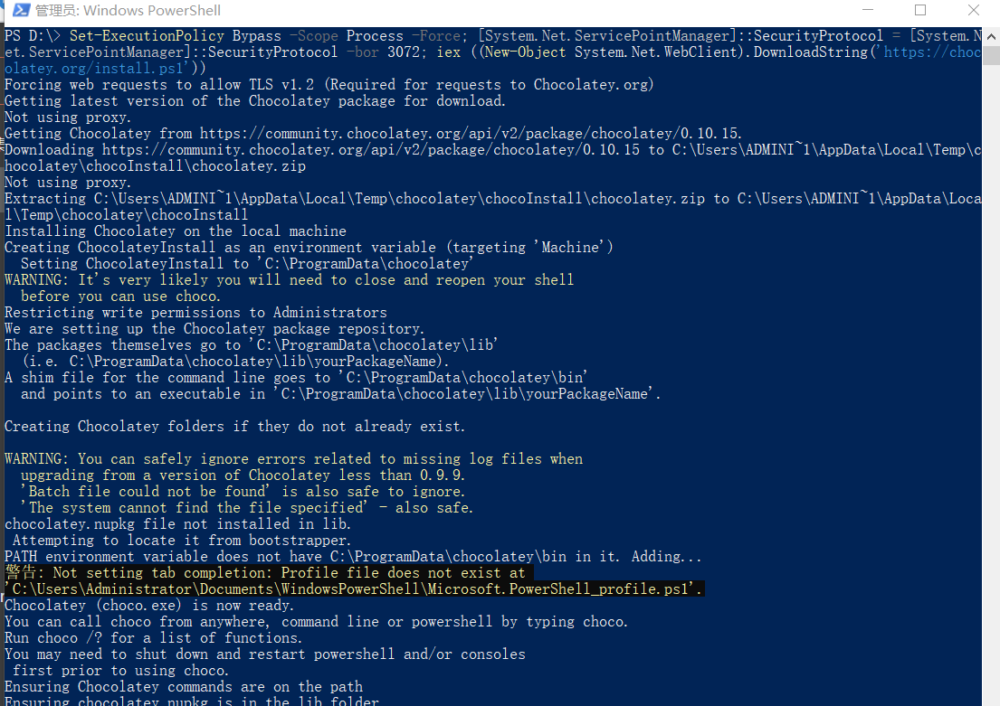
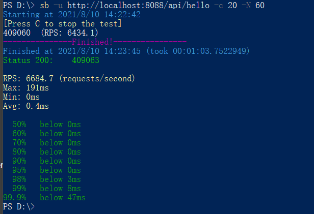
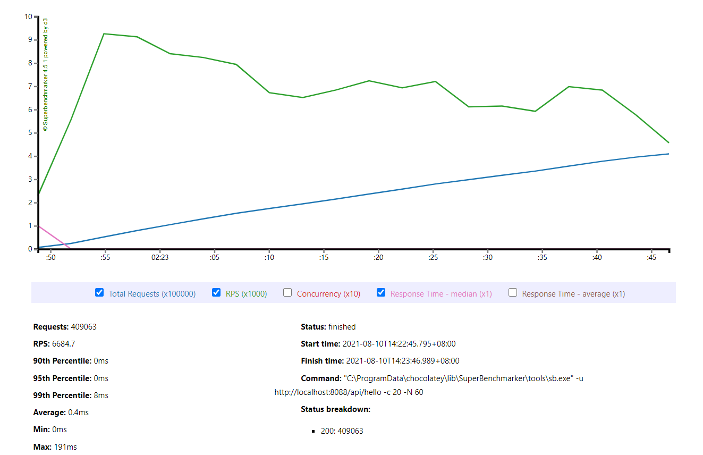
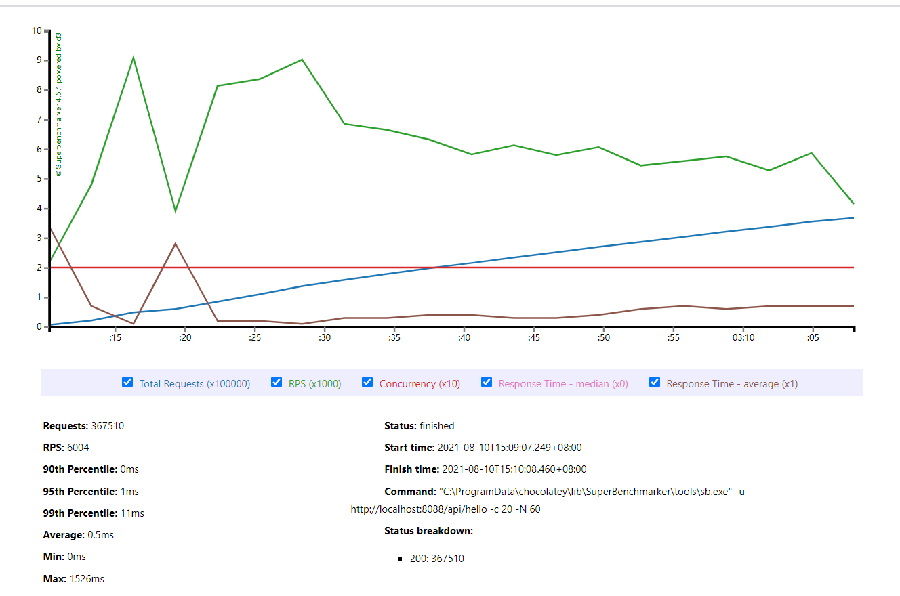

# 1.安装choco
在windows中用管理员身份运行Powershell,之后执行如下代码:
```
Set-ExecutionPolicy Bypass -Scope Process -Force; [System.Net.ServicePointManager]::SecurityProtocol = [System.Net.ServicePointManager]::SecurityProtocol -bor 3072; iex ((New-Object System.Net.WebClient).DownloadString('https://chocolatey.org/install.ps1'))
```
运行过程如下图：

这样choco就安装成功了。


# 2.安装superbenchmarker

# 3.启动gateway 
```
java -jar -Xmx512m -Xms512m gateway-server-0.0.1-SNAPSHOT.jar
```

# 4.执行superbenchmarker
```
sb -u http://localhost:8088/api/hello -c 20 -N 60
```





# 5.在不同GC下进行测试
## 5.1 并行GC
打印GC:
```
java -jar -Xmx512m -Xms512m -XX:+PrintGCDetails -XX:+PrintGCDateStamps -Xloggc:E:/gateway-%t.log gateway-server-0.0.1-SNAPSHOT.jar``
```
压测结果：
```
PS D:\> sb -u http://localhost:8088/api/hello -c 20 -N 60
Starting at 2021/8/10 14:42:33
[Press C to stop the test]
393353  (RPS: 6183.2)
---------------Finished!----------------
Finished at 2021/8/10 14:43:37 (took 00:01:03.8078000)
Status 200:    393359

RPS: 6423.6 (requests/second)
Max: 210ms
Min: 0ms
Avg: 0.4ms

  50%   below 0ms
  60%   below 0ms
  70%   below 0ms
  80%   below 0ms
  90%   below 0ms
  95%   below 0ms
  98%   below 3ms
  99%   below 7ms
99.9%   below 48ms
```
并行GC下，99%的请求响应都低于7ms,只有少数几个请求高于7ms。

可以看到系统响应趋于平稳。
堆内存：

关键指标:

可以看到平均的YGC时间为1.69ms。

## 5.2 串行GC
打印GC:
```
java -jar -Xmx512m -Xms512m -XX:+PrintGCDetails -XX:+PrintGCDateStamps -XX:+UseSerialGC -Xloggc:E:/gateway-%t.log gateway-server-0.0.1-SNAPSHOT.jar  
```
压测结果：
```
PS D:\> sb -u http://localhost:8088/api/hello -c 20 -N 60
Starting at 2021/8/10 15:09:03
[Press C to stop the test]
367483  (RPS: 5781)
---------------Finished!----------------
Finished at 2021/8/10 15:10:07 (took 00:01:03.7768616)
Status 200:    367510

RPS: 6004 (requests/second)
Max: 1526ms
Min: 0ms
Avg: 0.5ms

  50%   below 0ms
  60%   below 0ms
  70%   below 0ms
  80%   below 0ms
  90%   below 0ms
  95%   below 1ms
  98%   below 4ms
  99%   below 11ms
99.9%   below 52ms
PS D:\>
```
可以与并行GC对比，发现吞吐量下降了很多。

而响应时间明显在出现FullGC的时候会特别长，导致系统性能下降。
堆内存：
  
关键指标：

平均GC时间为25ms,且FullGC出现了一次，耗时高达1.53秒。这造成了系统的卡顿，结合压测工具可以明显的发现波动。

## 5.3 CMS GC 
打印GC:
```
java -jar -Xmx512m -Xms512m -XX:+PrintGCDetails -XX:+PrintGCDateStamps -XX:+UseConcMarkSweepGC -Xloggc:E:/gateway-%t.log gateway-server-0.0.1-SNAPSHOT.jar
```
压测结果：
```
PS D:\> sb -u http://localhost:8088/api/hello -c 20 -N 60
Starting at 2021/8/10 15:18:31
[Press C to stop the test]
354686  (RPS: 5580)
---------------Finished!----------------
Finished at 2021/8/10 15:19:34 (took 00:01:03.7265381)
Status 200:    354695

RPS: 5796.6 (requests/second)
Max: 196ms
Min: 0ms
Avg: 0.7ms

  50%   below 0ms
  60%   below 0ms
  70%   below 0ms
  80%   below 0ms
  90%   below 0ms
  95%   below 1ms
  98%   below 7ms
  99%   below 27ms
99.9%   below 56ms
```
可以看到在CMS GC下，系统吞吐量会低于并行GC和串行GC,但是平均响应时间比较接近，最大的响应时间是最低的。


我们再来看看GC信息：
堆内存：

关键指标：


CMS GC的平均暂停时间非常低，0.845ms,FullGC的耗时也才10ms。

## 5.4 G1 GC 
```
java -jar -Xmx512m -Xms512m -XX:+PrintGCDetails -XX:+PrintGCDateStamps -XX:+UseG1GC   -Xloggc:E:/gateway-%t.log gateway-server-0.0.1-SNAPSHOT.jar
```
压测结果：
```
PS D:\> sb -u http://localhost:8088/api/hello -c 20 -N 60
Starting at 2021/8/10 15:27:23
[Press C to stop the test]
374333  (RPS: 5889.6)
---------------Finished!----------------
Finished at 2021/8/10 15:28:26 (took 00:01:03.7698032)
Status 200:    374363

RPS: 6113.4 (requests/second)
Max: 223ms
Min: 0ms
Avg: 0.5ms

  50%   below 0ms
  60%   below 0ms
  70%   below 0ms
  80%   below 0ms
  90%   below 0ms
  95%   below 1ms
  98%   below 4ms
  99%   below 16ms
99.9%   below 51ms
```
G1 GC的吞吐量要略高于CMS GC。

响应时间非常平稳。

我们来看GC日志：
堆内存：

关键指标：

单次GC的时间约4.15ms,最大的GC时间为10ms。

# 6.总结
上述4种场景测试结果如下表：

| GC类型 | RPS(每秒请求) | 最大响应时间 | 平均响应时间 | GC平均耗时 | GC最大耗时 |
|:------|:-------------|:------------|:-----------|:----------|:----------|
| 并行GC | 6423.6       | 210ms      | 0.4ms         | 1.69ms    | 50ms      |
| 串行GC | 6004         | 1526ms     | 0.5ms         | 25ms      | 1.53s     |
| CMS   | 5796.6       | 196ms       | 0.7ms        | 0.845ms   | 10ms      |
| G1    | 6113.4       | 223ms       | 0.5ms        | 4.15ms    | 10ms      |

通过上表可以发现：  
- 在相同的测试条件下，并行GC能做到系统吞吐量最大。如果服务端耗时较短，需要吞吐量优先且最大响应时间对系统影响不算太大的情况下，应该优先考虑并行GC。
- 串行GC是一种最差的情况，请求响应受FullGC的波动影响非常大，高达1.69秒，虽然其吞吐量并不算最低，但是无法保障系统的平稳运行。这在生产环境慎用。
- CMS GC 的GC平均耗时是最低的，可以有效的控制GC的时间，但是牺牲了系统的吞吐量。CMS将GC的最大时间控制得非常低，10ms,这是并行GC的五分之一。
- G1 GC是CMS GC的改进版本，同时兼顾了系统的平均响应时间。G1的平均GC时间会高于CMS,但是最大GC时间并不长，为10ms。其吞吐量比cms要优不少。


